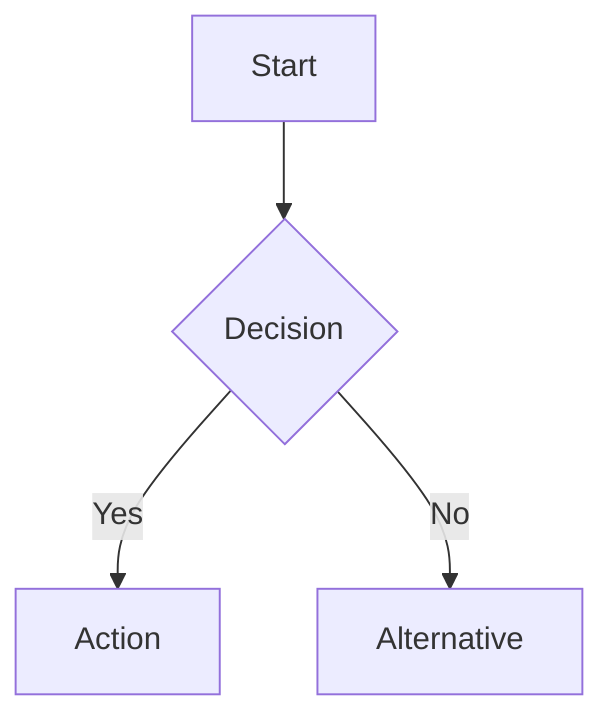
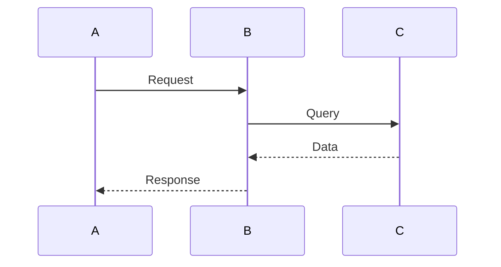
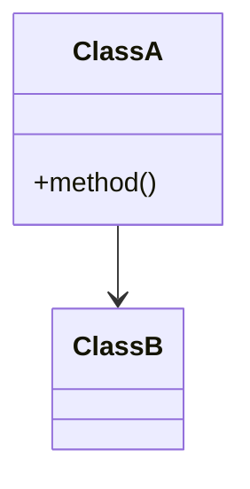
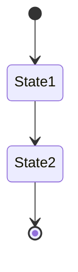

# Sample Explainer

## Purpose

Transform code samples into comprehensive explanations that include how the code works, what it does, agentic specifics (if applicable), and visual diagrams. Generate structured reports that maintain consistency while adapting to each sample's unique characteristics.

## When to Use

Invoke this skill when:

- User asks to explain or analyze code samples
- User requests visual representations (diagrams, flowcharts) of code
- User wants to understand agentic behavior in sample implementations
- User asks "how does this work" or "what does this do" about code
- User requests walkthroughs of implementations

## Core Principles

### Comprehensive Coverage

Address multiple aspects of each sample:

- **Purpose**: Why does this exist? What problem does it solve?
- **Mechanics**: How does it work under the hood?
- **Structure**: How is the code organized?
- **Behavior**: What does it actually do when executed?
- **Patterns**: What techniques or patterns are demonstrated?

### Visual-First Approach

Include mermaid diagrams for:

- Control flow (flowcharts)
- Interactions (sequence diagrams)
- Structure (class diagrams)
- State transitions (state diagrams)

### Structured Flexibility

Follow a consistent report structure while adapting to the sample:

- Use all applicable sections
- Expand or contract based on complexity
- Skip sections that don't apply

### Progressive Disclosure

Start with high-level overview, then dive into details:

1. Brief summary
2. Purpose and goals
3. Component/flow explanation
4. Detailed code walkthrough
5. Diagrams and visual aids

## Report Structure

Always save generated reports as markdown files.

### Standard Template

```markdown
# [Sample Name] Explanation

## Overview

Brief summary (2-3 sentences)

## Purpose & Goals

What problem, what demonstrates, who should use

## How It Works

Mechanics, components, flow, patterns

## Code Walkthrough

Section-by-section with line references

## Agentic Specifics (if applicable)

Autonomy, decision-making, state, tools

## Diagrams

Mermaid visualizations

## Key Takeaways

Main insights and learning points

## Extensions & Variations

How to build on this
```

### Section Guidance

#### Overview

Keep concise - the "elevator pitch". Answer:

- What is this sample?
- What does it demonstrate?
- Why is it interesting/important?

#### Purpose & Goals

Explain:

- Business/technical problem being solved
- Key capabilities demonstrated
- Target audience (beginner/intermediate/advanced)

#### How It Works

Choose the best structure for the sample:

**Component-based** - for modular samples:

- List key components
- Explain each component's role
- Show how they interact

**Flow-based** - for process-oriented samples:

- Number the steps
- Explain each transition
- Highlight decision points

**Pattern-based** - for design pattern samples:

- Name the patterns used
- Explain how they're applied
- Show the benefits

#### Code Walkthrough

Provide line-by-line or section-by-section analysis:

- Reference specific line numbers
- Highlight non-obvious decisions
- Explain "why" not just "what"
- Call out important patterns

#### Agentic Specifics

Include only if the sample demonstrates agentic behavior. Cover:

**Autonomy Level**

- Full autonomy vs. semi-autonomous vs. human-in-the-loop
- What decisions the agent makes independently

**Decision Making**

- What inputs inform decisions
- What goals drive behavior
- What constraints apply

**Tool Usage**

- What tools are available
- How tool selection works
- How results are processed

**State Management**

- What state is maintained
- How state affects behavior
- How state is persisted

#### Diagrams

Include at least one diagram. Use appropriate types:

**Flowcharts** - for control flow and decision trees



**Sequence Diagrams** - for interactions between components



**Class Diagrams** - for structure and relationships



**State Diagrams** - for state machines



**Diagram Best Practices:**

- Keep diagrams focused (one concept per diagram)
- Use consistent naming conventions
- Add captions explaining what's shown
- Don't diagram everything - focus on non-obvious aspects

#### Key Takeaways

Summarize 3-5 main insights:

- The core concept demonstrated
- Important patterns/techniques used
- Best practices shown
- Common pitfalls to avoid (if applicable)

#### Extensions & Variations

Show how to build on the sample:

- Common modifications
- Related patterns/techniques
- Production considerations
- Alternative approaches

## Adapting the Structure

### For Simple Samples

Condense to essential sections:

```markdown
# [Sample Name]

## What It Does (1 paragraph)

## How It Works (1-2 paragraphs)

## Diagram (simple flow)

## Key Point (1 sentence)
```

### For Complex Samples

Expand with additional sections:

- Multiple diagrams for different aspects
- Detailed code walkthrough with subsections
- Comprehensive agentic specifics
- Multiple extension paths

### For Framework/Library Samples

Add:

- Prerequisites and setup
- Framework-specific concepts
- Comparison with alternatives
- Migration considerations

### For Algorithm Samples

Add:

- Time/space complexity analysis
- Edge cases and handling
- Performance characteristics
- Optimization opportunities

## Workflow

### Step 1: Analyze the Sample

- Read the code completely
- Identify the main purpose and goal
- Note key components and their interactions
- Look for patterns and techniques
- Determine if agentic behavior is present

### Step 2: Plan the Report

- Choose which sections to include
- Decide on structure (component/flow/pattern)
- Identify what diagrams would be helpful
- Note important line numbers for walkthrough

### Step 3: Generate Overview

Write a concise summary that:

- Captures the essence in 2-3 sentences
- Uses clear, non-technical language
- Highlights what makes this sample interesting

### Step 4: Explain How It Works

Choose the best structure and:

- Break down into understandable chunks
- Explain component roles and interactions
- Show the flow or process
- Call out important patterns

### Step 5: Walk Through the Code

Provide detailed analysis:

- Reference specific lines or sections
- Explain non-obvious decisions
- Connect code to concepts
- Highlight best practices

### Step 6: Add Agentic Specifics (if applicable)

Analyze and document:

- Level of autonomy
- Decision-making process
- Tool usage patterns
- State management approach

### Step 7: Create Diagrams

Generate appropriate mermaid diagrams:

- Start with high-level flow
- Add detailed diagrams as needed
- Keep each diagram focused
- Add explanatory captions

### Step 8: Summarize Key Takeaways

Extract 3-5 main insights:

- Core concepts
- Important patterns
- Best practices
- Things to remember

### Step 9: Suggest Extensions

Show practical next steps:

- How to modify for different scenarios
- Related techniques to explore
- Production considerations
- Alternative approaches

## Tone & Style

### Third Person, Present Tense

Write objectively:

- "The agent processes the message..."
- "This demonstrates..."
- "The code shows..."

### Focus on Understanding

Explain the "why":

- "Uses async/await for non-blocking I/O"
- Not just: "Uses async/await"

### Progressive Detail

Build from simple to complex:

- High-level overview first
- Then component details
- Finally, line-by-line analysis

### Concrete Examples

Use specific scenarios:

- "When the user types 'help', the agent..."
- Not: "When a help command is received..."

## Common Patterns

### Pattern: Context Management

Samples showing how to maintain conversation state or session data.

**Key aspects to cover:**

- How context is loaded/saved
- Token or size management
- Context trimming strategies
- Persistence mechanism

### Pattern: Tool Integration

Samples showing how agents use external tools.

**Key aspects to cover:**

- Tool selection logic
- Parameter extraction
- Result processing
- Error handling

### Pattern: Streaming Responses

Samples showing real-time response delivery.

**Key aspects to cover:**

- Async enumerable usage
- Chunk handling
- Buffering strategy
- Error recovery

### Pattern: Decision Making

Samples showing autonomous or semi-autonomous decisions.

**Key aspects to cover:**

- Decision inputs
- Decision logic
- Outcome handling
- Fallback behavior

## Additional Resources

### Reference Files

- **`references/report-structure.md`** - Complete template with guidelines for each section

### Examples

- **`examples/conversation-agent-example.md`** - Complete sample explanation demonstrating the structure

## Tips for Excellence

### Clarity Over Completeness

Don't document every line - focus on what's non-obvious or important.

### Diagram Early and Often

Start with a diagram to give readers a mental model, then explain details.

### Connect to Broader Concepts

Help readers see how this sample fits into larger patterns or practices.

### Show, Don't Just Tell

Use code snippets, examples, and scenarios to illustrate points.

### Anticipate Questions

What would a reader wonder about? Address those questions proactively.

## Quality Checklist

Before finalizing a sample explanation:

- [ ] Overview is concise (2-3 sentences)
- [ ] Purpose clearly stated
- [ ] How it works explains mechanics, not just code
- [ ] Code walkthrough references specific lines
- [ ] Agentic specifics included if applicable
- [ ] At least one mermaid diagram present
- [ ] Diagram is focused and clear
- [ ] Key takeaways summarize main points
- [ ] Extensions show practical next steps
- [ ] Consistent tone throughout
- [ ] No assumed knowledge beyond target audience

## Summary

This skill transforms code samples into comprehensive explanations with structured reports and visual diagrams. Follow the standard template, adapt as needed, and always include mermaid diagrams to aid understanding. Focus on explaining "how" and "why", not just "what". Always save generated reports as markdown files.
