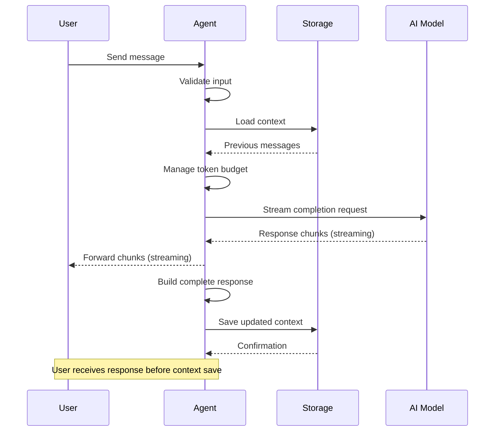
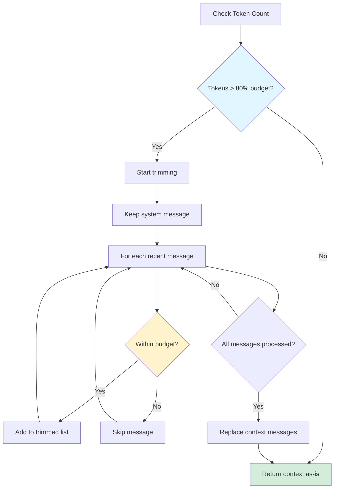
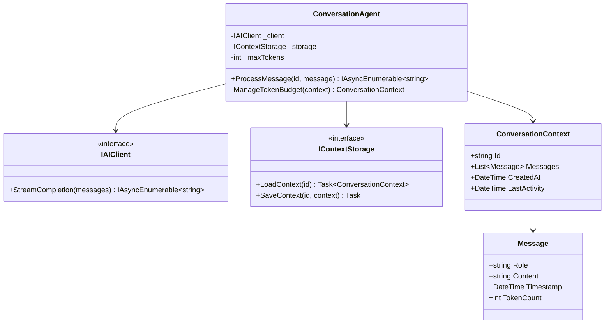

# Example: Conversational Agent Sample Explanation

This demonstrates how to apply the report structure to a real code sample.

---

# Conversation Agent with Context Memory - Explanation

## Overview

This sample demonstrates a conversational AI agent that maintains context across multiple turns using message history. It shows how to implement persistent conversation state, handle streaming responses, and manage token limits efficiently.

## Purpose & Goals

**Business Problem:**
Many AI applications need to maintain conversation context for coherent multi-turn interactions. This sample shows a production-ready pattern for context management.

**What It Demonstrates:**
- Message history management with token counting
- Context window optimization strategies
- Streaming response handling
- Error recovery and retry logic

**Target Audience:**
Intermediate developers familiar with basic AI API usage who want to understand context management patterns.

## How It Works

### Component Architecture

```
┌─────────────────┐
│   User Input    │
└────────┬────────┘
         │
         ▼
┌─────────────────┐      ┌──────────────┐
│ Message Handler │◄────►│  Validator   │
└────────┬────────┘      └──────────────┘
         │
         ▼
┌─────────────────┐
│ Context Manager │◄────►┌──────────────┐
│                 │      │   Storage    │
└────────┬────────┘      └──────────────┘
         │
         ▼
┌─────────────────┐
│   AI Client     │
│ (Streaming)     │
└────────┬────────┘
         │
         ▼
┌─────────────────┐
│ Response Stream │
└─────────────────┘
```

### Execution Flow

1. **Input Reception** - User message received via API or UI
2. **Validation** - Message format, length, and safety checks
3. **Context Loading** - Previous messages retrieved from storage
4. **Token Management** - Context trimmed if approaching token limit
5. **AI Generation** - Streaming response from AI model
6. **Context Update** - New message and response added to history
7. **Persistence** - Updated context saved to storage

### Key Patterns

**Token Budget Pattern**
The agent maintains a token budget (e.g., 4000 tokens) and automatically trims older messages when approaching the limit while preserving:
- System message (always kept)
- Recent messages (higher priority)
- Important messages (flagged for retention)

**Streaming with Buffering**
Responses stream to the user immediately but are also buffered for:
- Error recovery (can retry failed chunks)
- Context persistence (complete message stored)
- Display formatting (markdown rendering)

## Code Walkthrough

### Configuration & Setup (lines 1-30)

```csharp
public class ConversationAgent
{
    private readonly IAIClient _client;
    private readonly IContextStorage _storage;
    private readonly int _maxTokens = 4000;

    public ConversationAgent(IAIClient client, IContextStorage storage)
    {
        _client = client;
        _storage = storage;
    }
}
```

**Key Points:**
- Dependencies injected via constructor (testability)
- Token limit configurable but defaulted
- Storage abstraction allows different backends (file, database, cache)

### Message Processing (lines 32-67)

```csharp
public async IAsyncEnumerable<string> ProcessMessage(
    string conversationId,
    string userMessage)
{
    // 1. Validate input
    if (string.IsNullOrWhiteSpace(userMessage))
        throw new ArgumentException("Message cannot be empty");

    // 2. Load context
    var context = await _storage.LoadContext(conversationId);

    // 3. Add user message
    context.Messages.Add(new Message
    {
        Role = "user",
        Content = userMessage,
        Timestamp = DateTime.UtcNow
    });

    // 4. Manage token budget
    context = ManageTokenBudget(context);

    // 5. Stream response
    var responseBuilder = new StringBuilder();
    await foreach (var chunk in _client.StreamCompletion(context.Messages))
    {
        responseBuilder.Append(chunk);
        yield return chunk;
    }

    // 6. Update context
    context.Messages.Add(new Message
    {
        Role = "assistant",
        Content = responseBuilder.ToString(),
        Timestamp = DateTime.UtcNow
    });

    // 7. Persist
    await _storage.SaveContext(conversationId, context);
}
```

**Line-by-Line:**
- **Line 35-36**: Input validation prevents empty messages from wasting API calls
- **Line 39**: Context loading is async to avoid blocking
- **Line 42-47**: User message timestamped for debugging and analytics
- **Line 50**: Token management called before AI request (cost optimization)
- **Line 53-57**: Streaming response yielded immediately for responsiveness
- **Line 60-65**: Complete response stored for context continuity
- **Line 68**: Persistence is final step (failure here doesn't affect response)

### Token Budget Management (lines 70-95)

```csharp
private ConversationContext ManageTokenBudget(ConversationContext context)
{
    var totalTokens = context.Messages.Sum(m => m.TokenCount);

    if (totalTokens <= _maxTokens * 0.8)
        return context; // Budget OK, no trimming needed

    // Trim strategy: Keep system message + recent messages
    var trimmedMessages = new List<Message>();

    // Always keep system message
    var systemMessage = context.Messages.First(m => m.Role == "system");
    trimmedMessages.Add(systemMessage);

    // Keep recent messages within budget
    var recentMessages = context.Messages
        .Where(m => m.Role != "system")
        .Reverse()
        .TakeWhile(m =>
        {
            var currentTokens = trimmedMessages.Sum(x => x.TokenCount);
            return currentTokens + m.TokenCount < _maxTokens * 0.8;
        })
        .Reverse();

    trimmedMessages.AddRange(recentMessages);

    return context with { Messages = trimmedMessages };
}
```

**Design Decisions:**
- **80% threshold**: Leaves room for response tokens (20% buffer)
- **System message preservation**: Critical for agent behavior
- **Recent-first trimming**: Maintains conversation coherence
- **Immutable update**: `context with { Messages = ... }` (C# record syntax)

## Agentic Specifics

### Autonomy Level
**Semi-autonomous** - The agent handles conversation flow independently but:
- Cannot initiate conversations
- Cannot access external tools without explicit user request
- Follows predetermined behavior patterns

### Decision Making

The agent makes decisions about:

**Context Management:**
- **Input**: Current message count, token usage, message timestamps
- **Decision**: Which messages to trim when approaching budget
- **Strategy**: Recent-first with system message preservation

**Response Generation:**
- **Input**: Conversation history, user message, system prompt
- **Output**: Streaming response tokens
- **Constraint**: Must maintain conversation coherence

### State Management

**Conversation State:**
```csharp
record ConversationContext
{
    public string Id { get; init; }
    public List<Message> Messages { get; init; }
    public DateTime CreatedAt { get; init; }
    public DateTime LastActivity { get; init; }
    public Dictionary<string, string> Metadata { get; init; }
}
```

**State Lifecycle:**
1. Created on first message
2. Updated on each interaction
3. Persisted after each response
4. Can be loaded/resumed later

**State Affects Behavior:**
- Longer context → more coherent responses
- Metadata can store user preferences
- LastActivity enables cleanup of stale conversations

### Tool Usage
This sample agent has **no external tools** - it only uses the AI model for response generation.

**Extension Point:**
Tools could be added by:
```csharp
public interface ITool
{
    string Name { get; }
    Task<string> Execute(string parameters);
}

// Agent would then decide when to use tools based on user intent
```

## Diagrams

### Message Flow



### Token Budget Management



### Component Structure



## Key Takeaways

1. **Context Management is Critical** - Multi-turn conversations require persistent context with intelligent trimming strategies.

2. **Streaming Improves UX** - Users see responses immediately rather than waiting for complete generation.

3. **Token Budget Pattern** - Proactive token management prevents API errors and optimizes costs.

4. **Separation of Concerns** - Storage, AI client, and agent logic are separate, enabling testing and flexibility.

5. **Async Patterns** - Proper async/await usage throughout ensures non-blocking operation.

## Extensions & Variations

### Add Tool Integration

```csharp
public class TooledConversationAgent : ConversationAgent
{
    private readonly Dictionary<string, ITool> _tools;

    protected override async IAsyncEnumerable<string> ProcessWithTools(
        string conversationId,
        string userMessage)
    {
        // Detect tool intent
        var toolRequest = DetectToolIntent(userMessage);

        if (toolRequest != null)
        {
            // Execute tool
            var result = await _tools[toolRequest.ToolName]
                .Execute(toolRequest.Parameters);

            // Add tool result to context
            // ...
        }

        // Continue with normal response
        await foreach (var chunk in base.ProcessMessage(conversationId, userMessage))
        {
            yield return chunk;
        }
    }
}
```

### Add Conversation Summarization

For long conversations, add periodic summarization:

```csharp
private async Task<ConversationContext> SummarizeIfNeeded(
    ConversationContext context)
{
    if (context.Messages.Count > 20)
    {
        var summary = await GenerateSummary(
            context.Messages.Take(15));

        var summarizedContext = new ConversationContext
        {
            Messages = new List<Message>
            {
                context.Messages.First(), // System message
                new Message { Role = "system", Content = summary },
                // Keep recent messages
                ..context.Messages.Skip(15)
            }
        };

        return summarizedContext;
    }

    return context;
}
```

### Production Considerations

**Error Handling:**
- Add retry logic for transient failures
- Implement circuit breaker for AI API
- Store partial responses on failure

**Monitoring:**
- Track token usage per conversation
- Monitor response latency
- Alert on error rates

**Scaling:**
- Use distributed cache for context storage
- Implement conversation partitioning
- Add rate limiting per user

---

## Summary

This sample demonstrates production-ready patterns for conversational AI agents with context management. The key innovations are:

- Token budget management with intelligent trimming
- Streaming responses for better UX
- Clean separation of concerns
- Extensible architecture for adding tools

Use this pattern as a foundation for building more sophisticated agents with tool integration, summarization, and multi-modal capabilities.
