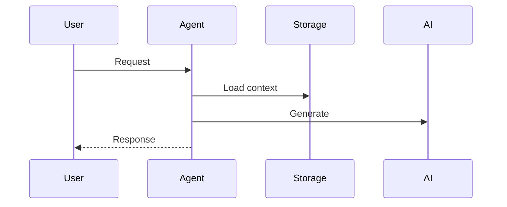
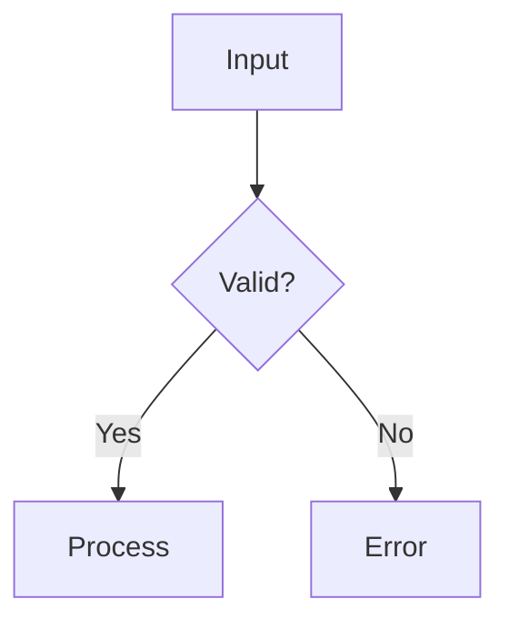
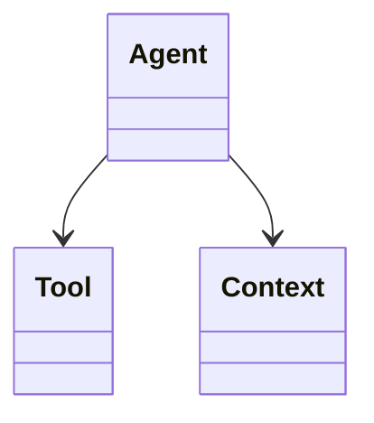

# Sample Explainer Skill - Quick Reference

## Trigger Phrases
- "Explain this code"
- "How does this work"
- "Walk me through this sample"
- "Analyze this code"
- "What does this do"
- "Show me how this works"

## Report Structure (Adaptable)

```
1. Overview (2-3 sentences)
2. Purpose & Goals
3. How It Works
4. Code Walkthrough
5. Agentic Specifics (if applicable)
6. Diagrams (mermaid)
7. Key Takeaways
8. Extensions & Variations
```

## Diagram Types

| Type | Use For | Mermaid Keyword |
|------|---------|-----------------|
| Flowchart | Control flow, decisions | `flowchart TD` |
| Sequence | Interactions | `sequenceDiagram` |
| Class | Structure | `classDiagram` |
| State | State machines | `stateDiagram-v2` |

## Agentic Aspects to Cover

1. **Autonomy Level** - Full/Semi/Human-in-loop
2. **Decision Making** - Inputs, goals, constraints
3. **Tool Usage** - Available tools, selection logic
4. **State Management** - What state, how used, persistence

## Section Adaptations

**Simple samples:** Overview → How It Works → Diagram → Key Point
**Complex samples:** Full template with multiple diagrams and subsections
**Framework samples:** Add Prerequisites, Framework Concepts, Comparison
**Algorithm samples:** Add Complexity, Edge Cases, Performance

## Writing Style

- Third person, present tense
- Explain "why" not just "what"
- Progressive detail (simple → complex)
- Concrete examples and scenarios

## Key Diagram Patterns

### Message Flow


### Control Flow


### Component Structure


## Quality Checklist

- [ ] Concise overview
- [ ] Clear purpose
- [ ] Mechanics explained
- [ ] Code references
- [ ] Agentic specifics (if applicable)
- [ ] At least one diagram
- [ ] Key takeaways
- [ ] Extensions
- [ ] Consistent tone

## File Locations

- **Main skill:** `.claude/skills/sample-explainer/SKILL.md`
- **Report structure:** `references/report-structure.md`
- **Examples:** `examples/conversation-agent-example.md`
