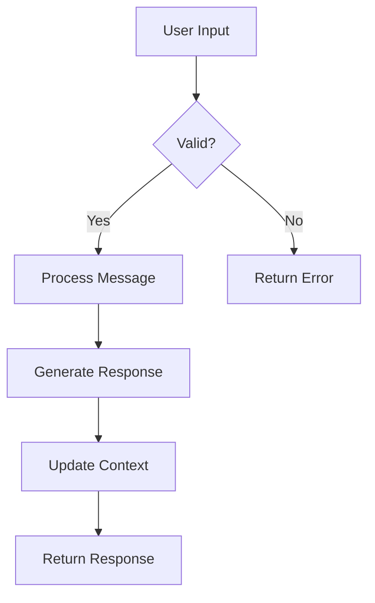
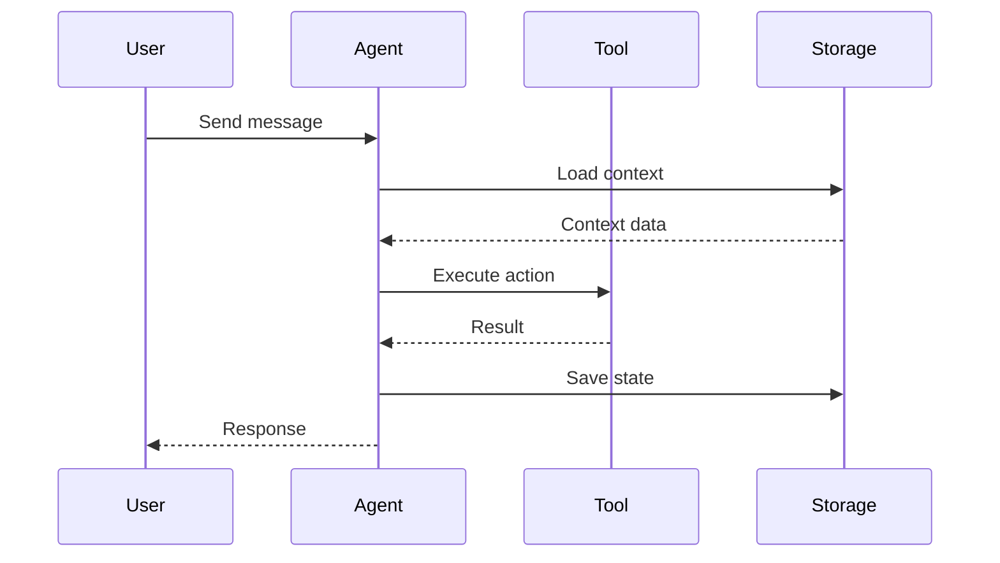
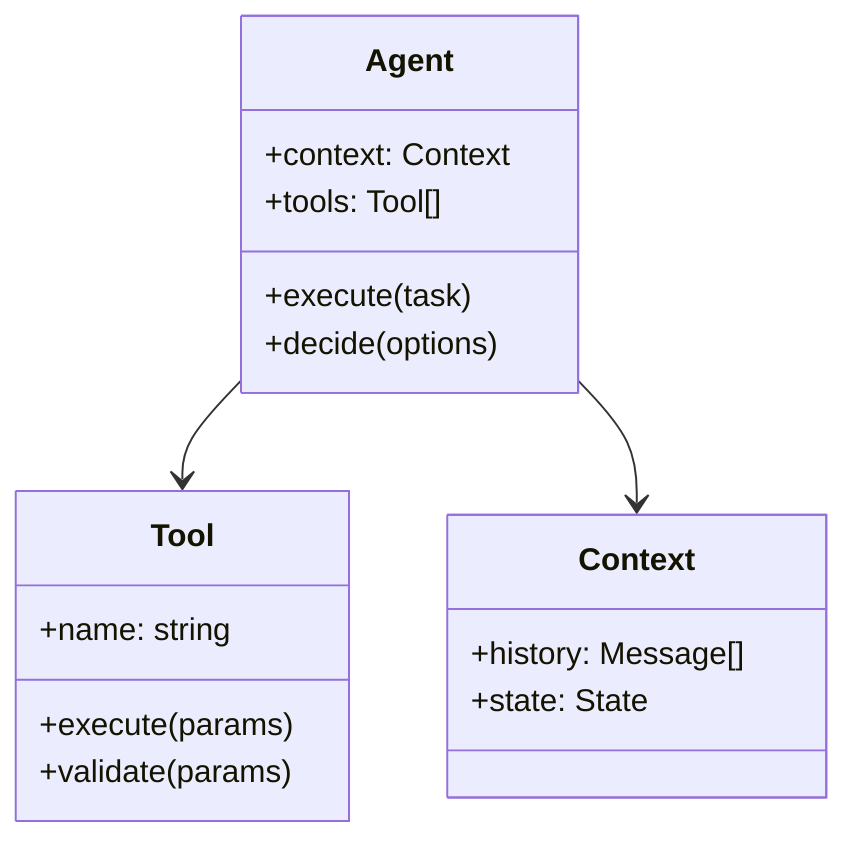
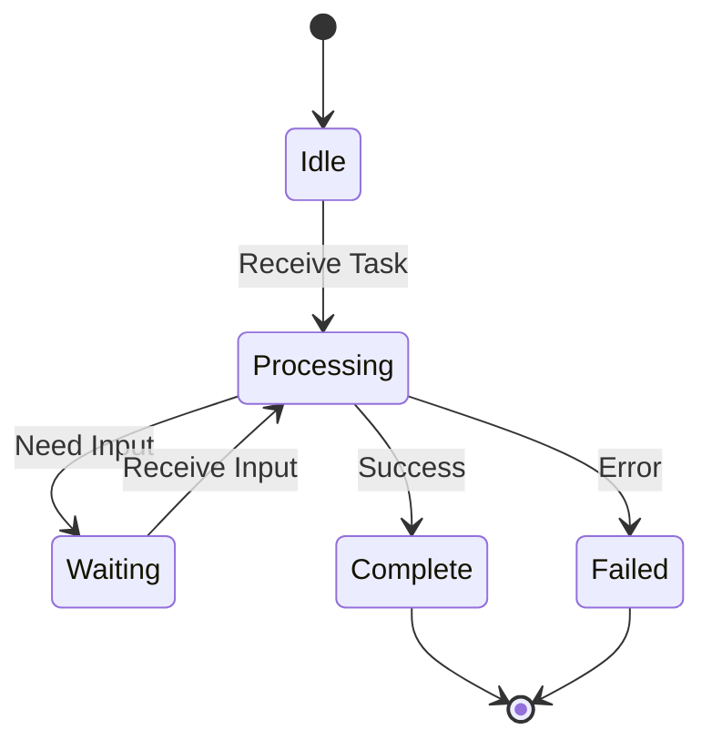

# Sample Explanation Report Structure

This document defines a flexible structure for code sample explanations. Reports should follow this general pattern while adapting to the specific sample being analyzed.

## Report Template

```markdown
# [Sample Name] Explanation

## Overview
Brief summary of what the sample demonstrates (2-3 sentences).

## Purpose & Goals
What problem does this solve? What does it demonstrate?

## How It Works
Step-by-step explanation of the mechanics:
- Key components and their roles
- Data/control flow
- Important patterns or techniques

## Code Walkthrough
Section-by-section analysis with line references.

## Agentic Specifics (if applicable)
- Autonomous behaviors
- Decision-making logic
- State management
- Tool usage patterns

## Diagrams
Visual representations using mermaid:
- Flow diagrams for process/control flow
- Sequence diagrams for interactions
- Class diagrams for structure
- State diagrams for state machines

## Key Takeaways
Main insights and learning points.

## Extensions & Variations
How this could be modified or extended.
```

---

## Section Guidelines

### Overview
Keep this concise - the "elevator pitch" for the sample.

**Good example:**
```markdown
This sample demonstrates a conversational AI agent that maintains context
across multiple turns. It shows how to implement message history, handle
user intent, and generate contextual responses.
```

### Purpose & Goals
Answer:
- Why does this sample exist?
- What scenario does it address?
- What should someone learn from it?

**Include:**
- Business/technical problem being solved
- Key capabilities demonstrated
- Target audience (beginners, intermediate, advanced)

### How It Works
The "under the hood" explanation.

**Structure options:**

**Option A - Component-based:**
```markdown
### Components

**Message Handler**
- Receives user input
- Validates format
- Routes to appropriate processor

**Context Manager**
- Maintains conversation history
- Tracks conversation state
- Handles session lifecycle

**Response Generator**
- Analyzes context
- Selects response strategy
- Formats output
```

**Option B - Flow-based:**
```markdown
### Execution Flow

1. **Input Reception** - User message arrives via API
2. **Context Loading** - Previous messages retrieved from storage
3. **Intent Analysis** - Message classified by purpose
4. **Response Generation** - AI model generates reply
5. **Context Update** - Conversation history updated
6. **Response Delivery** - Reply sent to user
```

**Option C - Pattern-based:**
```markdown
### Patterns Used

**Chain of Responsibility**
Messages pass through validation → enrichment → processing → formatting

**State Pattern**
Conversation behavior changes based on state (greeting, active, closing)

**Strategy Pattern**
Different response generation strategies based on message type
```

Choose the structure that best fits the sample.

### Code Walkthrough
Line-by-line or section-by-section analysis.

**Format:**
```markdown
### Initialization (lines 1-20)
Sets up the client, configures authentication, and initializes storage.

### Message Processing (lines 22-45)
The core loop that handles incoming messages:
- Line 28: Validates message format
- Line 32: Retrieves conversation context
- Line 38: Generates response using the AI model
```

**Tips:**
- Reference specific line numbers
- Highlight non-obvious decisions
- Explain "why" not just "what"

### Agentic Specifics
Only include this section if the sample demonstrates agentic behavior.

**Cover these aspects:**

**Autonomy Level**
- Full autonomy: Agent makes all decisions
- Semi-autonomy: Agent decides within constraints
- Human-in-the-loop: Agent suggests, human confirms

**Decision Making**
- What decisions does the agent make?
- What information does it use?
- What are its goals/objectives?

**Tool Usage**
- What tools can the agent use?
- How does it decide which tool to use?
- How does it handle tool results?

**State Management**
- What state does the agent maintain?
- How does state affect behavior?
- How is state persisted?

**Example:**
```markdown
### Autonomy Level
Semi-autonomous - the agent can execute tasks independently but requires
human approval for destructive operations (delete, publish, deploy).

### Decision Making
The agent evaluates task complexity using:
- Estimated time (simple: <5min, medium: 5-30min, complex: >30min)
- Risk level (safe, moderate, risky)
- Reversibility (reversible, irreversible)

Based on this evaluation, it chooses:
- Direct execution (simple, safe, reversible)
- Batched execution with confirmation (complex or moderate risk)
- Detailed plan review (risky or irreversible)

### Tool Usage
Available tools:
- `read_file` - Safe, always allowed
- `write_file` - Reversible via git, auto-allowed in dev
- `execute_command` - Risk varies by command, needs evaluation
- `web_search` - Safe, always allowed

Tool selection logic:
1. Parse user intent
2. Match intent to tool capabilities
3. Evaluate risk/reversibility
4. Execute or request confirmation
```

### Diagrams
Use mermaid for visual representations.

**Flow Diagram - for process/control flow:**


**Sequence Diagram - for interactions:**


**Class Diagram - for structure:**


**State Diagram - for state machines:**


**Tips:**
- Keep diagrams simple and focused
- Use consistent naming
- Add brief captions explaining what each diagram shows
- Don't diagram everything - focus on non-obvious flows

### Key Takeaways
Summarize the main insights.

**Format:**
```markdown
1. **Main Insight** - The core concept demonstrated
2. **Pattern/Technique** - Important pattern used
3. **Best Practice** - Recommended approach shown
4. **Common Pitfall** - What to avoid (if applicable)
```

### Extensions & Variations
Show how to build on this sample.

**Include:**
- Common modifications
- Related patterns/techniques
- Production considerations
- Alternative approaches

---

## Adaptability Guidelines

### For Simple Samples
Condense the structure:
```markdown
# [Sample Name]

## What It Does
[1 paragraph]

## How It Works
[1-2 paragraphs with code references]

## Diagram
[Simple flow diagram]

## Key Point
[1 sentence]
```

### For Complex Samples
Expand relevant sections:
- Multiple diagrams for different aspects
- Detailed code walkthrough with multiple sections
- Comprehensive agentic specifics
- Multiple extension paths

### For Framework/Library Samples
Add sections:
- Prerequisites and setup
- Framework-specific concepts
- Comparison with alternatives
- Migration considerations

### For Algorithm Samples
Add sections:
- Time/space complexity analysis
- Edge cases and handling
- Performance characteristics
- Optimization opportunities

---

## Tone & Style

### Objective & Clear
Write in third person, present tense:
- "The agent processes the message..." not "You process the message..."
- "This demonstrates..." not "I will show you..."

### Focus on Understanding
Explain the "why" behind decisions:
- "Uses async/await for non-blocking I/O"
- "Not just: Uses async/await"

### Progressive Detail
Start simple, add complexity:
- High-level overview first
- Then dive into details
- Reference line numbers for specifics

### Practical Examples
Use concrete scenarios:
- "When the user types 'help', the agent..."
- Not: "When a help command is received..."

---

## Checklist Before Publishing

- [ ] Overview is concise (2-3 sentences)
- [ ] Purpose clearly stated
- [ ] How it works explains mechanics, not just code
- [ ] Code walkthrough references specific lines
- [ ] Agentic specifics included if applicable
- [ ] At least one mermaid diagram present
- [ ] Diagram is focused and clear
- [ ] Key takeaways summarize main points
- [ ] Extensions show practical next steps
- [ ] Consistent tone throughout
- [ ] No assumed knowledge beyond target audience
