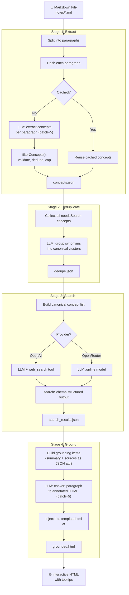
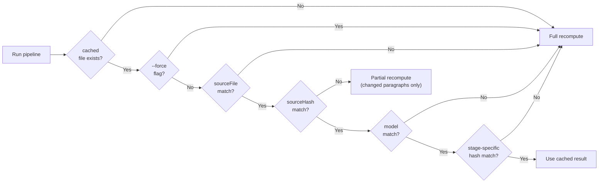
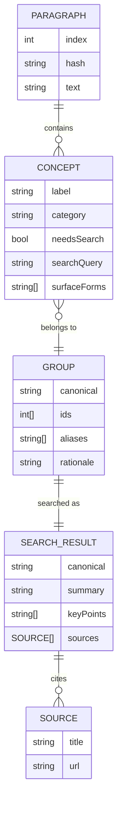
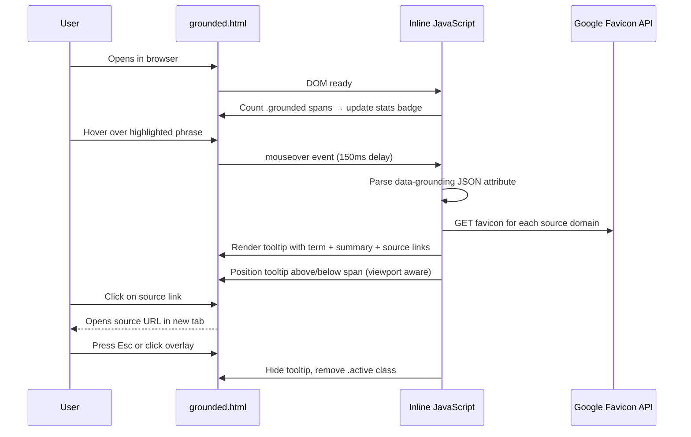

# 01_01_grounding Explanation

## Overview

This sample transforms plain markdown notes into interactive, fact-checked HTML documents. It runs markdown through a four-stage LLM pipeline — extract, deduplicate, web search, and ground — producing an HTML page where key terms and claims are highlighted and annotated with web-sourced summaries and links to authoritative sources. The result is a self-contained document readers can explore like a Wikipedia-style reference.

---

## Purpose & Goals

**Problem it solves:** Raw notes contain unverified claims, jargon, and named entities that readers may not recognize or trust. Manually fact-checking and adding citations is tedious. This tool automates that process.

**What it demonstrates:**
- Structured output from LLMs using JSON Schema enforcement
- Chaining multiple LLM calls into a coherent pipeline
- Integrating web search as a grounding tool (both via OpenAI's native web_search tool and OpenRouter's `:online` model suffix)
- Incremental, cache-aware batch processing with partial resumption
- Transforming unstructured text (markdown) into richly annotated semantic HTML

**Who should use it:** AI/ML engineers, technical educators, or researchers who want to explore LLM pipelines for document enrichment, knowledge grounding, or RAG-adjacent workflows.

---

## How It Works

The pipeline has four sequential stages. Each stage caches its output as a JSON file in `output/`. If the source file or upstream data has not changed (checked via SHA-256 hashing), the stage reuses cached results instead of calling the API again. This makes re-runs cheap.

### Stage 1 — Extract
Every paragraph is sent to an LLM with a prompt instructing it to extract concepts: named entities, verifiable claims, domain terms, methods, metrics, etc. Each concept includes:
- A canonical `label`
- A `category` from a fixed taxonomy (`claim`, `term`, `entity`, `method`, etc.)
- A `needsSearch` boolean indicating if web verification adds value
- A `searchQuery` for optimized retrieval
- `surfaceForms`: the exact short phrases in the text that represent the concept

### Stage 2 — Deduplicate
All concepts from all paragraphs are batched into a single LLM call. The LLM groups concepts that refer to the same underlying idea (same category, same meaning), choosing a canonical label per group. This prevents redundant web searches (e.g., "GPT-4" and "GPT-4 model" searched separately).

### Stage 3 — Search
For each canonical concept group, a web search is performed. On OpenAI, this uses the `web_search` tool. On OpenRouter, the model slug is suffixed with `:online`. The LLM returns a structured summary, 2-4 key points, and cited source URLs.

### Stage 4 — Ground
Each paragraph is sent again to an LLM, this time with its relevant concept grounding data. The LLM converts the paragraph to semantic HTML and wraps the exact surface-form phrases in `` tags, embedding the search summary and sources as a JSON attribute.

The final HTML is injected into a `template.html` at the `<!--CONTENT-->` marker, producing the complete interactive page.

---

## Code Walkthrough

### `app.js` (entry point, lines 1–66)

The entry point orchestrates the pipeline. It:
1. Asks for user confirmation before consuming API tokens (line 13–25)
2. Reads the markdown source file, resolves it from the `notes/` directory if no argument is given (line 29–31)
3. Splits the markdown into paragraphs by blank lines (line 31)
4. Calls each of the four pipeline stages in sequence (lines 37–54)
5. Respects a `--force` flag to skip cache (line 49)
6. Reports output file locations at the end (lines 56–60)

The `--force`, `--batch=N`, and `--no-batch` flags are parsed in `src/config.js`.

---

### `src/config.js` (lines 1–56)

Defines all paths, model names, API settings, and CLI argument parsing. All paths are derived from `__dirname` so the project can live anywhere. Key exports:
- `paths`: all file paths (notes dir, output dir, per-stage JSON, template, final HTML)
- `models`: which LLM model to use for each stage (all default to `gpt-5.4` via `resolveModelForProvider`)
- `api`: timeout (180s), retry count (3), exponential-backoff delay (1s base)
- `cli`: parsed flags and input file from `process.argv`

---

### `src/api.js` (lines 1–196)

A thin wrapper around the OpenAI Responses API (`/v1/responses`). Key functions:

- **`chat()`** (line 79): Sends a request. Builds the body with optional fields (`textFormat`, `tools`, `include`, `reasoning`, `previousResponseId`). Calls `fetchWithRetry`.
- **`fetchWithRetry()`** (line 29): Implements retry logic with exponential backoff. Retries on HTTP 429, 500, 502, 503. Uses `AbortController` for request timeouts.
- **`extractText()`** (line 112): Traverses the API response structure to find the `output_text` content.
- **`extractJson()`** (line 134): Calls `extractText()` then `JSON.parse()`, with a helpful truncated preview on failure.
- **`extractSources()`** (line 148): Walks the full response object recursively collecting both `web_search_call.action.sources` entries and inline `url_citation` annotations. Deduplicates by URL.

---

### `src/pipeline/extract.js` (lines 1–175)

**Responsibility:** Produce `output/concepts.json`.

- Computes a SHA-256 hash of the concatenated paragraphs (line 103). If the source, model, and hash all match the cached file, the stage short-circuits (line 109).
- Processes paragraphs in **batches of 5** concurrently (`CONCURRENCY = 5`). Individual paragraphs whose hash matches a cached entry are skipped (line 130–133).
- `extractSingleParagraph()` (line 64): Determines the paragraph type (`header` vs `body`) and the target concept count. Sends the paragraph plus `EXTRACTION_GUIDELINES` to the LLM. The response is validated with `extractSchema` (strict JSON Schema).
- After LLM response, calls `filterConcepts()` to post-process the results.
- After each batch, writes incrementally to disk via `safeWriteJson` (atomic write via temp-file rename). This means a crashed run can resume where it left off.

---

### `src/pipeline/concept-filter.js` (lines 1–119)

**Responsibility:** Post-process raw LLM concept output before saving.

Applies strict validation and filtering rules:
- `normalizeSurfaceForms()` (line 10): Each surface form must be a string present verbatim in the paragraph, not a full sentence (max 100 chars), and stripped of markdown syntax.
- `normalizeConcept()` (line 50): Validates label, normalizes category against the allowed enum, clears `searchQuery` when `needsSearch` is false.
- `filterConcepts()` (line 95): Deduplicates by label (keeps first), sorts by label length descending (longer = more specific), and caps at `MAX_BODY = 5` for body paragraphs or `MAX_HEADER = 1` for headers.

This layer is critical because LLMs sometimes produce malformed data, over-long phrases, or markdown artifacts even with structured output.

---

### `src/pipeline/dedupe.js` (lines 1–71)

**Responsibility:** Produce `output/dedupe.json`.

Cache invalidation checks four fields: `sourceFile`, `paragraphCount`, `conceptCount`, and the `conceptsHash` (a hash of all concept labels, categories, and surface forms). Only if all four match and `--force` is absent are cached results reused.

Builds a flat list of all `needsSearch = true` concepts, assigns numeric IDs, and sends them all to the LLM in one shot. The LLM groups them into canonical clusters with aliases and a rationale. The `dedupeSchema` enforces that every concept ID appears in exactly one group.

---

### `src/pipeline/search.js` (lines 1–162)

**Responsibility:** Produce `output/search_results.json`.

Three-way cache invalidation: `sourceHash`, `dedupeHash`, and the model slug. If any changes, the cache is cleared. This is important: a model change may yield different quality results.

Handles the provider abstraction (line 14–41):
- **OpenAI**: passes `tools: [{ type: "web_search" }]` and `include: ["web_search_call.action.sources"]`
- **OpenRouter**: appends `:online` to the model name; no special tools needed

Each canonical concept group is searched once in parallel batches. The search query comes from the most informative member entry; aliases are passed to help disambiguation.

Results are written to disk after every batch, so a partial run can continue from where it left off.

---

### `src/pipeline/ground.js` (lines 1–179)

**Responsibility:** Produce `output/grounded.html`.

`buildGroundingItems()` (line 21): For each canonical concept group, collects all surface forms, paragraph indices, and the search result. Embeds the summary and sources as a pre-escaped JSON string in `dataAttr` (truncated to 420 chars for summary).

`groundSingleParagraph()` (line 61): Passes the paragraph plus its relevant grounding items to the LLM. The prompt instructs the model to wrap the longest matching surface form with a `` tag. If no grounding items apply to a paragraph, it falls back to `convertToBasicHtml()` which handles headers, bullet lists, and plain paragraphs with simple regex (no API call needed).

Results are ordered by paragraph index and joined with double newlines, then injected into the template at the `<!--CONTENT-->` marker.

---

### `src/schemas/` (extract, dedupe, search, ground, categories)

All schemas use `type: "json_schema"` with `strict: true` — the OpenAI Responses API's structured output mode. This enforces that the model returns exactly the shape described: no extra fields (`additionalProperties: false`), required fields present, enum values enforced. This eliminates entire classes of parsing errors.

The `CONCEPT_CATEGORIES` enum (`claim`, `result`, `method`, `metric`, `resource`, `definition`, `term`, `entity`, `reference`) serves as the shared vocabulary across schemas and the concept filter.

---

### `src/prompts/` (extract, dedupe, search, ground)

Each prompt is a pure function that takes data and returns a string. Notable design choices:
- **`buildExtractPrompt`**: embeds the full `EXTRACTION_GUIDELINES` with explicit examples of good/bad surface forms, tells the model the paragraph index and total count for context, specifies a target concept count range.
- **`buildDedupePrompt`**: injects all concepts as formatted JSON inside `<concepts>` XML tags. Includes stern instructions not to over-group ("If unsure, do not group").
- **`buildSearchPrompt`**: passes `canonical`, `searchQuery`, and `aliases` together, so the model knows what it is searching for and what synonyms to consider.
- **`buildGroundPrompt`**: passes grounding items as JSON, lists surface forms longest-first (because `concept-filter.js` already sorted them), and includes explicit verbatim-matching rules to prevent hallucination.

---

### `src/utils/`

- **`text.js`**: `splitParagraphs()` splits on one or more blank lines. `chunk()` creates fixed-size batches. `getParagraphType()` detects headers by leading `#`. `getTargetCount()` returns the appropriate prompt hint based on paragraph type.
- **`hash.js`**: `hashText()` is SHA-256 over a string. `hashObject()` uses a stable (key-sorted) stringification before hashing, ensuring identical objects always produce the same hash regardless of key insertion order.
- **`file.js`**: `safeWriteJson()` writes to a `.tmp` file first, then renames it atomically, preventing partial writes from corrupting cached data. `resolveMarkdownPath()` auto-selects the first alphabetical `.md` file in `notes/` if no argument is given.

---

### `template.html`

A self-contained HTML/CSS/JS page. CSS uses CSS custom properties (design tokens) for a dark-themed, responsive layout. The JavaScript:
- On hover, shows a floating tooltip with the concept's canonical name, the LLM-generated summary, and source links with favicons (fetched from Google's favicon API).
- On mobile, renders as a **bottom sheet** using `translateY` transform, with a drag handle for swipe-to-dismiss and backdrop blur overlay.
- On desktop, renders as a **positioned overlay** with an animated arrow indicator.
- Parses the `data-grounding` attribute at display time (not at load time), keeping the HTML compact.
- Uses a grounding stats badge (fixed bottom-right) showing the total count of grounded spans.

---

## Agentic Specifics

This is not a traditional autonomous agent — it does not loop or make high-level decisions. However, it exhibits several agentic patterns:

**Tool use:** The LLM in Stage 3 is given a web search tool (or uses an online-capable model) and decides which queries to issue, how many results to fetch, and how to synthesize them into a structured summary. The model is the decision-maker for search strategy.

**Structured outputs as contracts:** Rather than parsing free-text LLM responses, each stage defines a strict JSON Schema. This is a form of typed API contract between the orchestrating code and the LLM. Violations surface as clear parse errors rather than silent data corruption.

**Reasoning effort:** All three LLM stages pass `reasoning: { effort: "medium" }`. This activates extended thinking for models that support it, improving accuracy on tasks like concept grouping and span selection.

**Incremental state:** Each stage persists its state to disk and can resume from any partial completion. The pipeline does not need to be stateless — it can be interrupted and resumed.

**Provider abstraction:** The search stage detects the active AI provider and adapts the request shape. This is a minimal form of capability routing: "if OpenRouter, use the online model variant; if OpenAI, use explicit tool invocation."

---

## Diagrams

### Overall Pipeline Flow

---

### Cache Invalidation Logic

---

### Data Shape Through the Pipeline

---

### Template Rendering and Tooltip Interaction

---

## Key Takeaways

1. **Structured outputs are mandatory, not optional.** Every LLM call in this pipeline uses strict JSON Schema enforcement (`strict: true`, `additionalProperties: false`). This converts the LLM from an unreliable text generator into a typed function with a guaranteed return shape. Post-processing still validates further (concept-filter.js), but the schema eliminates the hardest parsing failures.

2. **Hash-based incremental caching makes iteration practical.** Running the pipeline on a changed document re-uses all unchanged paragraph extractions and search results. SHA-256 hashes are computed over sorted-key serializations to ensure determinism. This pattern is essential for any multi-step LLM workflow where iterating on prompts or content should not require paying for all upstream calls again.

3. **Surface forms bridge LLM reasoning and UI rendering.** The key design decision is that the LLM identifies the exact text phrase (surface form) during extraction, not during grounding. The grounding stage just needs to wrap it. This separation of concerns keeps the final grounding prompt simple and the output predictable.

4. **Provider-level abstraction should be early and explicit.** The search stage detects `AI_PROVIDER` at runtime and builds different request shapes for OpenAI vs OpenRouter. The rest of the pipeline is unaware of this distinction. This is a clean single-point adapter pattern that avoids spreading provider conditionals throughout the codebase.

5. **The output format is data, not presentation.** The `data-grounding` attribute embeds a JSON object (not pre-rendered HTML) into each span. All rendering — tooltip layout, source list, favicon loading — happens in the browser at interaction time. This keeps the static HTML small and gives the template full freedom to evolve without regenerating documents.

---

## Extensions & Variations

**Support additional note formats:** Replace `splitParagraphs()` with a proper markdown AST parser (e.g., `remark`) to handle code blocks, tables, and nested lists without reducing them to plain text.

**Add a confidence score to concepts:** Extend the `extractSchema` with a `confidence: number` field. Filter or visually differentiate low-confidence concepts to avoid noisy grounding.

**Embed into a RAG pipeline:** After the search stage, write the structured summaries and sources to a vector store instead of (or in addition to) the HTML. The grounded notes become a knowledge base.

**Multi-document cross-referencing:** Run the pipeline across multiple notes files, then merge and deduplicate the concept groups globally. Link the same canonical concept across documents for a personal wiki effect.

**Use vision models for images:** Extend the pipeline to detect images in markdown (``), pass them to a vision model for concept extraction, and ground the alt-text or caption with the same pipeline.

**Stream progress to a UI:** Each stage writes incremental JSON to disk. A lightweight file watcher (e.g., `chokidar`) could expose these as Server-Sent Events for a live progress dashboard during long runs.

**Selectively disable search:** The `needsSearch` flag per concept allows fine-grained control. A custom concept filter could suppress search for a specific category (e.g., skip all `term` concepts for a domain expert audience).
