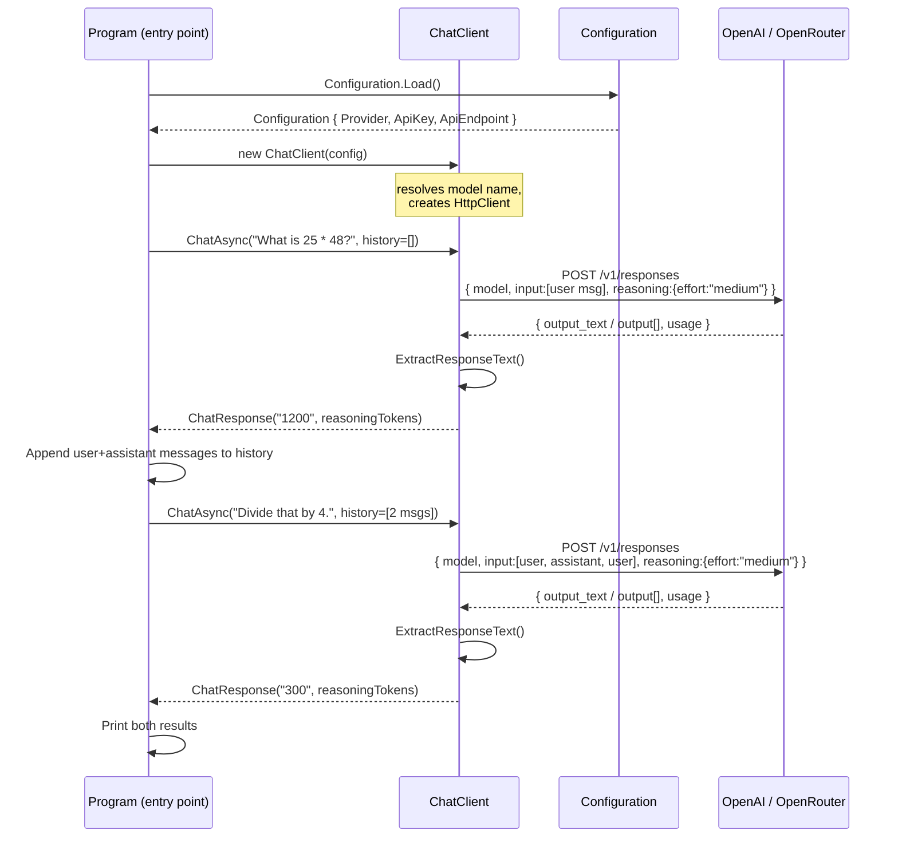
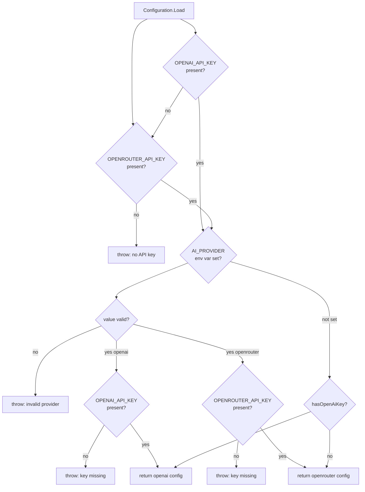
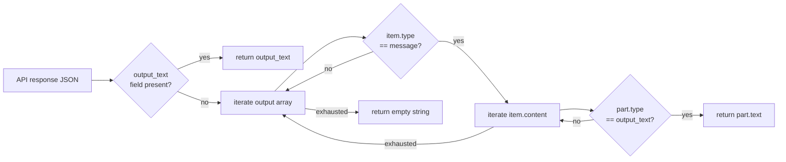
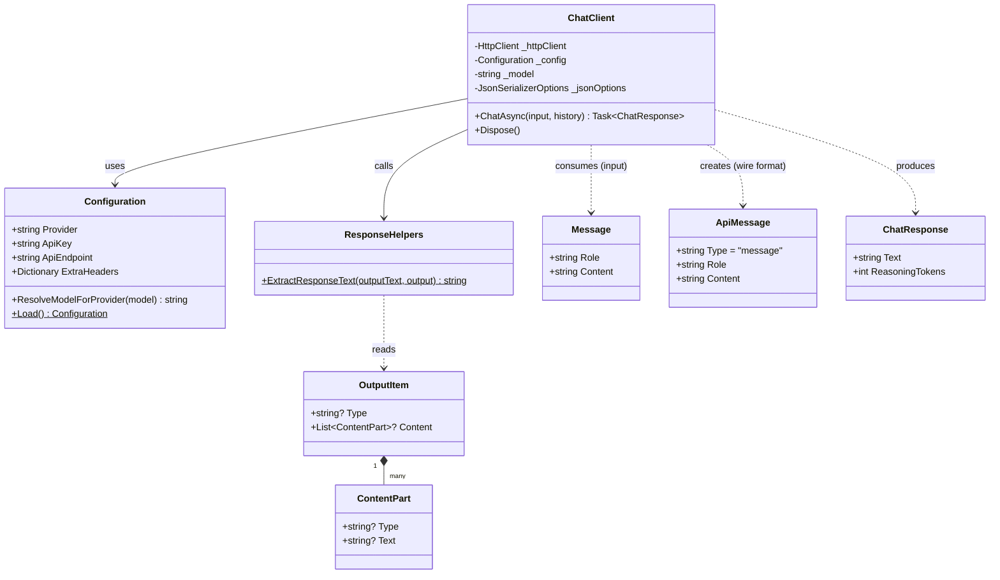

# 01_01_interaction-csharp Explanation

## Overview

This sample demonstrates how to build a **stateless multi-turn conversation** with an AI model using the OpenAI Responses API (or an OpenRouter proxy) from .NET 10 / C#. The application sends two sequential questions where the second question relies on the answer from the first, proving that the caller — not the API — is responsible for maintaining conversation context. It is a C# port of the original JavaScript `01_01_interaction` example.

## Purpose & Goals

### Problem solved
The OpenAI Responses API is stateless: each HTTP call is independent. To have a coherent "conversation," the full exchange history must be included in every request. This sample shows the minimal correct pattern for doing that.

### What it demonstrates
- How to call the OpenAI `/v1/responses` endpoint (not the older `/v1/chat/completions`) from raw `HttpClient`.
- How to pass prior turns as an explicit `input` array so the model can resolve pronouns and references across turns ("Divide *that* by 4").
- How to enable **extended reasoning** (`reasoning.effort = "medium"`) and surface the resulting token count.
- How to support two providers (OpenAI and OpenRouter) with zero application-logic changes through a configuration abstraction.

### Target audience
Developers learning to integrate AI models in .NET who want to understand the underlying HTTP mechanics before reaching for a higher-level SDK.

---

## How It Works

### High-level flow

1. `Configuration.Load()` reads credentials from .NET User Secrets or environment variables and produces a fully configured `Configuration` object, including the correct API endpoint and any extra HTTP headers.
2. A `ChatClient` is constructed with that configuration. It resolves the model name (adding the `openai/` prefix when routing through OpenRouter).
3. The program calls `ChatAsync("What is 25 * 48?")` with no history — this is turn 1.
4. The response text and the original user message are stored as a two-item history list.
5. The program calls `ChatAsync("Divide that by 4.", history)` — this is turn 2. The entire prior exchange is re-sent, enabling the model to understand what "that" refers to.
6. Both responses are printed alongside the number of reasoning tokens consumed.

### Context management pattern

```
Turn 1 request  → [user: "What is 25 * 48?"]
Turn 1 response ← assistant: "1200"

Turn 2 request  → [user: "What is 25 * 48?",
                   assistant: "1200",
                   user: "Divide that by 4."]
Turn 2 response ← assistant: "300"
```

The application builds this growing list itself; the API has no session memory.

### Provider abstraction

`Configuration` acts as a factory that normalises two different API configurations behind a single interface used by `ChatClient`. OpenRouter is an OpenAI-compatible proxy, so the same request body works for both — only the endpoint URL, `Authorization` header value, and a couple of optional routing headers differ.

---

## Code Walkthrough

### `InteractionExample.csproj` (lines 1–15)

- Targets **net10.0**, meaning C# 13 language features and the latest BCL are available.
- `<Nullable>enable</Nullable>` enforces null-safety across the project, which is why every field that could be null is annotated with `?`.
- `<UserSecretsId>4th-devs-csharp-examples</UserSecretsId>` pins the user-secrets store to a shared ID so one `dotnet user-secrets set` command serves all C# examples in the repository.
- Only three lightweight packages are pulled in: `Microsoft.Extensions.Configuration` and its two providers (User Secrets, Environment Variables). No AI SDK — the HTTP call is hand-rolled intentionally.

### `Configuration.cs`

#### `Configuration` record (lines 11–123)

The record is immutable (`init`-only properties), preventing accidental mutation after construction.

**`Load()` (lines 32–78)** is a static factory that follows a priority chain:

```
UserSecrets → EnvironmentVariables
```

It validates that at least one API key exists, checks that an explicit `AI_PROVIDER` value (if supplied) is in the allow-list `["openai", "openrouter"]`, and delegates provider selection to `ResolveProvider`.

**`ResolveProvider()` (lines 80–103)** implements a simple cascade:
- If `AI_PROVIDER` is set explicitly, it is honoured (with a cross-validation that the matching key also exists).
- Otherwise, OpenAI wins if `OPENAI_API_KEY` is present; otherwise OpenRouter is used.

**`ResolveModelForProvider()` (lines 19–30)** handles the one divergence between providers: OpenRouter requires model names to be fully qualified (`openai/gpt-5.2`), while the OpenAI native API expects just `gpt-5.2`. The prefix is only added when necessary (i.e., when routing via OpenRouter and the model name does not already contain a `/`).

**`BuildOpenRouterHeaders()` (lines 105–122)** adds optional `HTTP-Referer` and `X-Title` headers, which OpenRouter uses for usage analytics and rate-limit attribution.

#### Domain records (lines 125–152)

- `Message(Role, Content)` — the application-level conversation unit, independent of API wire format.
- `ApiMessage` — the wire format version; adds a `"type": "message"` discriminator required by the Responses API.
- `ChatResponse(Text, ReasoningTokens)` — the result returned to callers; separates the readable text from the metadata.

### `ChatClient.cs`

#### Constructor (lines 18–29)

Eagerly resolves the model name at construction time and creates a single shared `HttpClient` instance. The `JsonSerializerOptions` are also created once: `SnakeCaseLower` policy handles the `output_tokens_details` / `output_text` naming automatically, and `WhenWritingNull` keeps request payloads clean.

#### `ChatAsync()` (lines 37–84)

1. **History projection (lines 39–41):** Converts the application-level `Message` list to `ApiMessage` records. This is the boundary between the internal model and the wire model.
2. **Request assembly (lines 44–61):** Constructs `ResponsesRequest` with `reasoning.effort = "medium"`, serialises to JSON, attaches the `Authorization: Bearer …` header, and copies any provider-specific extra headers.
3. **HTTP send and error handling (lines 63–71):** Reads the raw response string. On a non-2xx status, it deserialises the `ErrorResponse` and re-throws with the API's human-readable message — surfacing the real error rather than a generic HTTP status.
4. **Text extraction (lines 73–79):** Delegates to `ResponseHelpers.ExtractResponseText`, which handles the two response shapes the Responses API can return (see below).
5. **Return (lines 81–83):** Packages the text and reasoning-token count into a `ChatResponse` record.

#### File-scoped `record` types (lines 90–143)

All request/response DTOs are declared with the `file` access modifier, meaning they are invisible outside `ChatClient.cs`. This prevents API implementation details from leaking into the public surface of the assembly. The `[JsonPropertyName]` attributes override the snake_case policy for fields where the auto-converted name would be incorrect.

### `ResponseHelpers.cs`

#### `ExtractResponseText()` (lines 11–38)

The Responses API can return the assistant's text in two ways:

| Shape | When used |
|---|---|
| Top-level `output_text` string | Simple, non-reasoning responses |
| `output[]` array of typed items | Responses with reasoning steps, tool calls, etc. |

The helper tries the simple path first (lines 14–17), then walks the structured `output` array looking for an item of `type == "message"` containing a `ContentPart` of `type == "output_text"` (lines 20–37). This dual-path strategy means the `ChatClient` is forward-compatible with richer response payloads.

#### `OutputItem` and `ContentPart` records (lines 44–57)

These are public because they are returned from `ResponseHelpers`, which is a public static class. They use default `SnakeCaseLower` serialisation inherited from the caller's `JsonSerializerOptions` — note the absence of `[JsonPropertyName]` attributes.

---

## Agentic Specifics

This sample is **not an agent** — it does not make autonomous decisions, has no tools, and does not loop. It is a building block: a clean, correct implementation of the stateful-conversation-over-stateless-API pattern that more complex agentic systems depend on.

The closest agentic concept present is **context window management**: the caller explicitly constructs and passes the full conversation history on each turn, which is the foundational mechanism by which any agent maintains continuity of reasoning across multiple model invocations.

The `reasoning.effort = "medium"` parameter activates extended (chain-of-thought) reasoning inside the model, and the sample surfaces how many tokens were consumed by that internal reasoning process — a practical metric for balancing quality against cost.

---

## Diagrams

### Overall request/response flow



### Configuration provider selection



### Response text extraction logic



### Class relationships



---

## Key Takeaways

1. **The Responses API is stateless — context is the caller's responsibility.** Each request must include the full conversation history in the `input` array. The sample makes this explicit by building and passing the history list manually.

2. **Separate the domain model from the wire model.** `Message` (application layer) and `ApiMessage` (HTTP layer) look similar but serve different purposes. Keeping them distinct makes it easy to change the API format without touching business logic.

3. **Two response shapes require a dual-path extractor.** The Responses API can return text either as a top-level `output_text` string or nested inside an `output[]` array. `ResponseHelpers.ExtractResponseText` handles both, making the client robust to model-specific or feature-specific variations.

4. **The `file` access modifier is an underused encapsulation tool.** All internal DTOs in `ChatClient.cs` are `file`-scoped records, completely invisible outside that file. This prevents implementation details from polluting the public assembly API.

5. **Reasoning tokens are observable and billable metadata.** Setting `reasoning.effort = "medium"` enables the model to think before answering. The token count returned in `usage.output_tokens_details.reasoning_tokens` lets callers measure the cost of that extra quality, enabling informed trade-offs between effort levels.

---

## Extensions & Variations

### Add a REPL loop
Replace the two hard-coded turns with a `while` loop that reads from `Console.ReadLine()`, appends each exchange to a growing history list, and calls `ChatAsync` on each iteration. This turns the sample into an interactive terminal chatbot.

### Stream the response
The Responses API supports server-sent events (SSE). Swap `HttpClient.SendAsync` for a streaming read of the response body and yield tokens as they arrive, improving perceived latency for long answers.

### Adjust reasoning effort dynamically
Expose `reasoning.effort` as a parameter on `ChatAsync`. Use `"low"` for factual lookups and `"high"` for complex reasoning tasks, letting callers balance speed and cost per turn.

### Add a system prompt
Prepend a `{ role: "system", content: "..." }` entry to the `Input` list in `ChatClient.ChatAsync`. This is how personas, output format constraints, and guardrails are applied consistently across all turns.

### Swap to `Microsoft.Extensions.AI`
Replace the hand-rolled `HttpClient` calls with `IChatClient` from the `Microsoft.Extensions.AI` abstraction. The `Configuration` and `ResponseHelpers` classes can stay; only `ChatClient` needs to change, and the rest of the application remains untouched — demonstrating the value of the current layered design.

### Persist conversation history
Serialise the `List<Message>` history to a JSON file between runs. On startup, deserialise and restore the history, enabling a persistent chatbot that remembers prior sessions.
