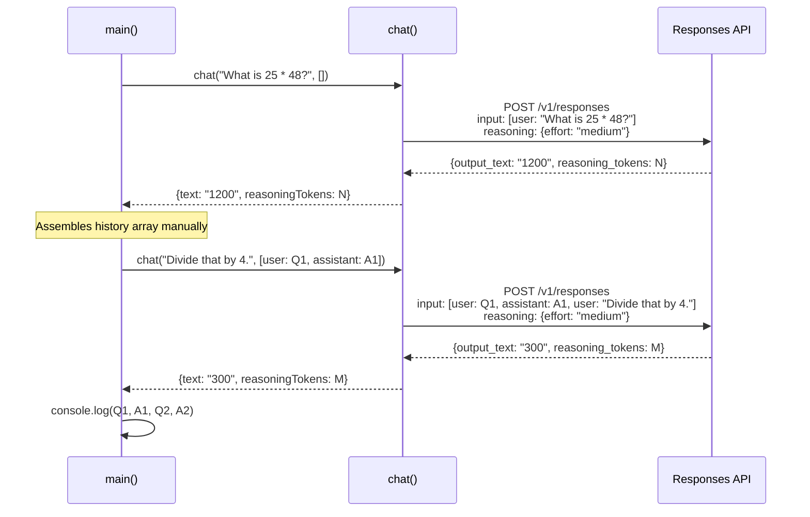
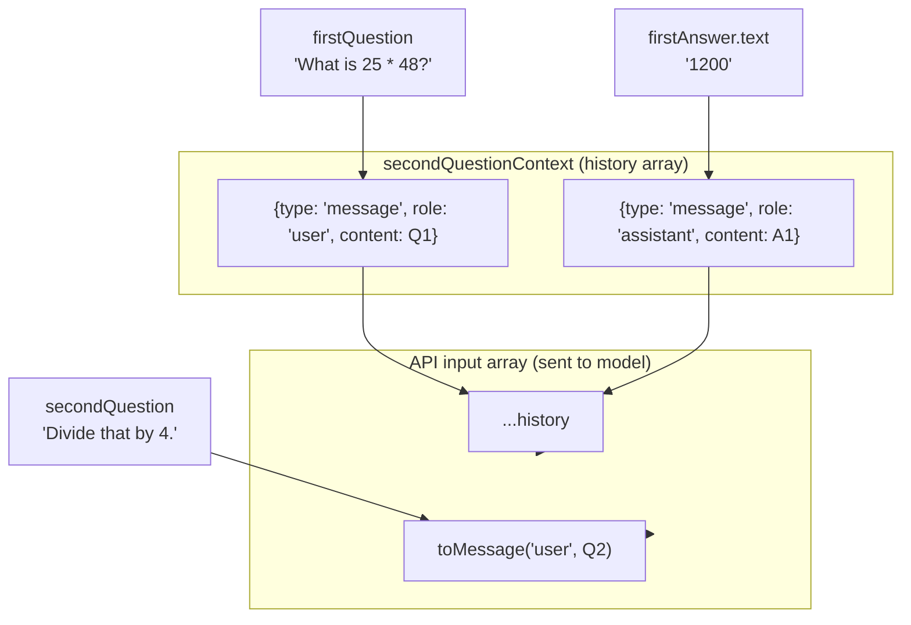
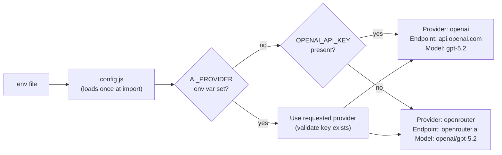
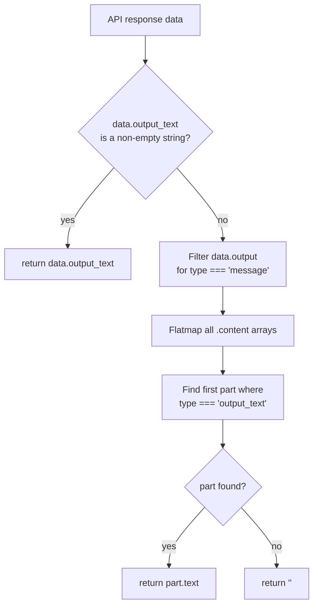

# 01_01_interaction Explanation

## Overview

This sample demonstrates the most fundamental pattern in LLM application development: **multi-turn conversation with explicit context management**. It sends two consecutive questions to an AI model where the second question ("Divide that by 4.") is meaningless without the first exchange as context. The sample shows exactly how conversational memory is constructed and transmitted to the Responses API.

## Purpose & Goals

**Problem it solves:** By default, every API call to a language model is stateless — the model has no memory of previous exchanges. To achieve coherent multi-turn dialogue, the caller must explicitly reconstruct and pass the conversation history with each new request. This sample shows the minimal, correct way to do that.

**What it demonstrates:**
- How to call the OpenAI-compatible Responses API using raw `fetch` (no SDK dependency)
- How to manually build a conversation history array and pass it as the `input` field
- How to surface reasoning token usage, which signals that a reasoning-capable model (`gpt-5.2`) is in use
- How helper utilities can decouple response parsing from business logic

**Who should use it:** Developers who are new to the Responses API, anyone building stateless request/response flows that need conversational continuity, or anyone who wants to understand what an AI SDK does "under the hood" before reaching for one.

## How It Works

The core mechanic is straightforward: the Responses API accepts an `input` array of message objects. Each object has a `type` ("message"), a `role` ("user" or "assistant"), and `content` (a string). By appending the previous user question and AI answer to this array before sending the next question, the model receives the full context of the conversation.

**Key design decisions:**
1. **No SDK** — raw `fetch` is used, making every HTTP detail visible and educational.
2. **No external state store** — history is assembled inline in `main()`, keeping the example self-contained.
3. **Reasoning tokens are surfaced** — the request sends `reasoning: { effort: "medium" }`, and the response parses `usage.output_tokens_details.reasoning_tokens`. This exposes that the model is doing internal chain-of-thought before answering.
4. **Provider abstraction** — the shared `config.js` allows the same code to run against either OpenAI or OpenRouter by resolving the correct endpoint, API key, and model name prefix at startup.

## Code Walkthrough

### `package.json` (lines 1–11)

Declares the project as an ES Module (`"type": "module"`), which enables top-level `import`/`export` syntax throughout. The sole entry point is `app.js`, runnable via `npm start`.

### `helpers.js` (lines 1–17)

Contains two pure utility functions that handle the structural details of the Responses API response format:

- **`toMessage(role, content)`** (line 17): A one-liner factory that creates a valid Responses API message object. Centralising this means if the API schema ever changes, only one place needs updating.

- **`extractResponseText(data)`** (lines 1–15): Handles two possible response shapes. The Responses API may return the final text either as a top-level `output_text` string (the shortcut path, lines 2–4) or nested inside `data.output[].content[].text` for items where `type === "output_text"` (the traversal path, lines 6–14). This dual-path handling makes the helper resilient to minor API variations.

### `app.js` — `chat()` function (lines 11–43)

This is the single reusable communication primitive. It:

1. **Builds the request body** (lines 19–23): Merges the caller-supplied `history` array with a freshly constructed user message. The history comes first, the new question last — this mirrors how the model expects to see a conversation.
2. **Sets `reasoning: { effort: "medium" }`** (line 22): Instructs the model to apply a medium level of internal chain-of-thought reasoning. The cost shows up in `reasoning_tokens`.
3. **Handles HTTP and API errors** (lines 28–31): Checks both the HTTP status code and a potential `data.error` field, since APIs can return HTTP 200 with an error body.
4. **Returns structured output** (lines 39–42): Returns both the text answer and the reasoning token count, making the caller aware of the model's internal work.

### `app.js` — `main()` function (lines 45–68)

Orchestrates the two-turn demo:

- **Turn 1** (lines 46–47): Calls `chat()` with no history. The model answers "What is 25 * 48?" cold.
- **Context assembly** (lines 50–61): Manually builds the history array from the first question string and the first answer text. This is the central lesson — the caller owns and constructs the context; there is no magic.
- **Turn 2** (line 62): Passes the assembled history to `chat()`, giving the model full context to interpret "Divide that by 4." as "divide 1200 by 4".
- **Output** (lines 64–67): Prints both Q/A pairs alongside their reasoning token counts.

### `config.js` — provider resolution (lines 110–176, shared module)

The shared config resolves which provider to use at module load time (not at call time), so the decision is made once and the correct `AI_API_KEY`, `RESPONSES_API_ENDPOINT`, and model name prefix are exported as constants. `resolveModelForProvider()` (line 166) prefixes bare model names like `gpt-5.2` with `openai/` when using OpenRouter, since OpenRouter requires fully-qualified model identifiers.

## Agentic Specifics

This sample is **not agentic** in the autonomous sense — it executes a fixed, pre-scripted two-turn sequence with no branching, tool use, or decision-making. However, it establishes the **foundational pattern** that all agentic systems build upon:

- **Context window as working memory**: The `history` array passed to each `chat()` call is the agent's only memory. Agentic loops extend this by accumulating turns in a growing array.
- **Reasoning effort**: The `reasoning: { effort: "medium" }` parameter is relevant to agentic work because reasoning models can plan multi-step actions internally before producing output. Surfacing `reasoning_tokens` helps developers understand and budget this internal computation.
- **Stateless function, stateful caller**: The `chat()` function is pure and stateless. State (the history) lives in the caller. This is the correct architecture for agents — the communication primitive stays simple, and the agent loop manages what gets remembered.

## Diagrams

### Request/Response Flow

### Context Assembly Detail

### Provider Resolution at Startup

### Response Text Extraction Logic

## Key Takeaways

1. **The model has no memory — you are the memory.** Every API call is stateless. Conversational context only exists because the caller serialises previous turns into the `input` array and re-sends them. Understanding this is the prerequisite to building any multi-turn or agentic system.

2. **History construction is explicit and mechanical.** There is no automatic accumulation. The developer decides what enters the history, in what order, and in what format. This is both a responsibility and a capability — you can inject system context, trim irrelevant turns, or summarise long histories before sending.

3. **Reasoning tokens are a cost and quality signal.** By enabling `reasoning: { effort: "medium" }` and logging `reasoning_tokens`, the sample shows that the model does internal computation before answering. For math and multi-step reasoning tasks, this improves accuracy. For simple lookups, it adds cost. Developers should consciously choose effort levels.

4. **Separating the communication primitive from business logic pays off immediately.** The `chat()` function knows nothing about what questions are being asked. The `helpers.js` functions know nothing about the conversation flow. This separation means each piece can be tested, reused, or replaced independently — a pattern that scales to complex agents.

5. **Provider abstraction at config time, not call time.** By resolving the provider once at module load, all application code remains provider-agnostic. The same `chat()` call works against OpenAI or OpenRouter without any conditional logic in `app.js` itself.

## Extensions & Variations

**Add a proper conversation loop:** Replace the hardcoded two-turn sequence with a `readline`-based REPL that reads user input, appends it to a growing `history` array, calls `chat()`, appends the response, and repeats. This transforms the demo into a working chatbot.

**Add history trimming:** For long conversations, the context window fills up. Extend the `chat()` function to accept a `maxTurns` parameter and slice the history array before sending, keeping only the most recent N turns. Alternatively, implement summarisation: when history exceeds a threshold, send a "summarise the conversation so far" request and replace the full history with the summary.

**Vary reasoning effort by task type:** Use `effort: "low"` for simple factual questions (faster, cheaper) and `effort: "high"` for complex reasoning or code generation tasks. Add a heuristic or a small classification step that picks the effort level based on question characteristics.

**Persist history across process runs:** Serialise the `history` array to a JSON file after each turn and restore it at startup. This gives the chatbot persistent memory across Node.js process restarts.

**Add a system prompt:** Prepend a `{ type: "message", role: "system", content: "..." }` object to the history array to give the model a persona or domain-specific instructions that persist across all turns.

**Stream responses:** Replace the `await response.json()` call with streaming (`response.body` as a `ReadableStream`) and process Server-Sent Events incrementally. This allows printing tokens as they arrive rather than waiting for the full response, which significantly improves perceived latency for long answers.
