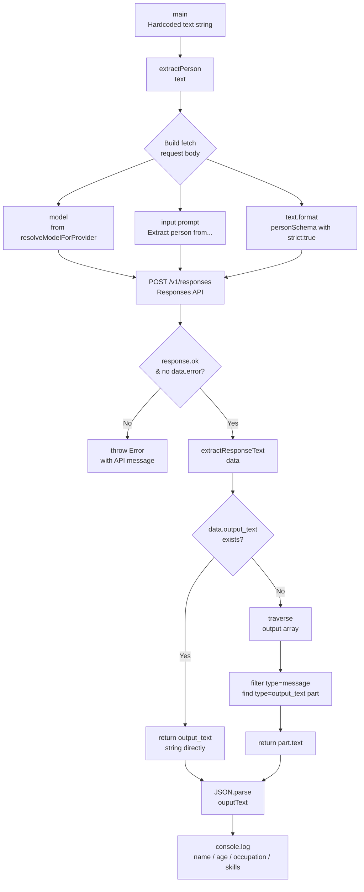
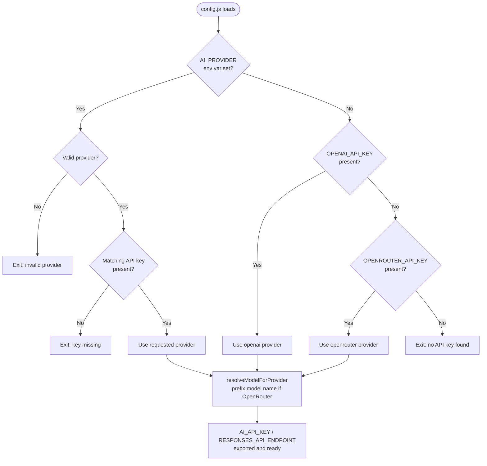
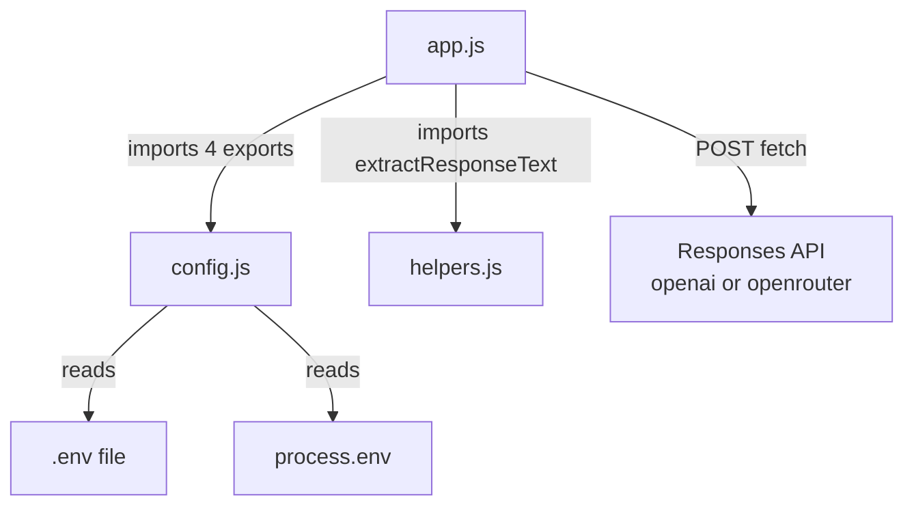

# 01_01_structured Explanation

## Overview

This sample demonstrates **structured outputs** with an LLM API: the model is constrained to return a JSON object that exactly matches a developer-supplied JSON Schema, guaranteeing that the response can be parsed and consumed without defensive guessing. The concrete task is information extraction — pulling typed fields (name, age, occupation, skills) out of a free-form English sentence. It is the canonical "hello world" for reliable, schema-driven AI responses.

---

## Purpose & Goals

**Problem it solves**
LLM responses are naturally unstructured prose. Before structured outputs existed, developers had to prompt-engineer the model into emitting JSON, then defensively parse the result, often handling hallucinated keys, missing fields, or broken syntax. Structured outputs eliminate that fragility by having the API enforce the schema at the token level.

**What it demonstrates**
- How to declare a `json_schema` format object and attach it to a Responses-API request via the `text.format` field.
- How to use `strict: true` to make the constraint absolute (no extra properties, every required field present).
- How to express optional values cleanly using nullable union types (`["string", "null"]`) rather than omitting fields or using sentinel strings.
- How to abstract a shared `extractResponseText` helper that works across two different response shapes (flat `output_text` vs nested `output[].content[].text`).

**Target audience**
Developers who are new to the OpenAI Responses API and want a minimal, runnable example of schema-enforced extraction before adding complexity such as tools, agents, or streaming.

---

## How It Works

### High-level flow

1. A hardcoded input sentence is passed to `extractPerson()`.
2. The function POSTs to the Responses API, attaching `personSchema` as `text.format`.
3. The API returns a response whose content is a JSON string that strictly matches the schema.
4. `extractResponseText()` navigates the response envelope to locate that string.
5. `JSON.parse()` turns it into a JavaScript object, which `main()` prints field-by-field.

### Provider abstraction (config.js)

The shared `config.js` at the monorepo root centralises everything environment-specific:

| Concern | Mechanism |
|---|---|
| API key selection | Reads `OPENAI_API_KEY` / `OPENROUTER_API_KEY` from `.env`; fails fast if neither is present |
| Provider selection | `AI_PROVIDER` env var (optional); defaults to whichever key is available |
| Endpoint routing | `RESPONSES_API_ENDPOINT` resolves to either `api.openai.com/v1/responses` or `openrouter.ai/api/v1/responses` |
| Model name normalisation | `resolveModelForProvider()` — if running on OpenRouter and the model name has no `/`, it is prefixed with `openai/` automatically (e.g. `gpt-5.4` → `openai/gpt-5.4`) |

This means the sample code in `app.js` is provider-agnostic and switches target API purely through environment variables.

### Structured output enforcement

The `text.format` field in the request body is where schema enforcement is declared. Setting `strict: true` tells the API to refuse any response that would violate the schema — no additional properties are allowed, and every `required` field must appear. The model effectively treats the schema as a hard grammar constraint rather than a soft suggestion.

Nullable fields (`["string", "null"]`) are a deliberate design choice: they allow the model to signal "not mentioned" explicitly rather than guessing a value or omitting the key (which would violate `required`). This keeps downstream consumers simple — every field is always present.

---

## Code Walkthrough

### `app.js`

**Lines 1–6 — Imports**
Pulls four named exports from the shared config: the API key, any provider-specific extra headers (only populated for OpenRouter), the resolved endpoint URL, and the model-name normaliser.

**Line 9 — Model constant**
```js
const MODEL = resolveModelForProvider("gpt-5.4");
```
Calling `resolveModelForProvider` at module load time — not inside the function — means the string is computed once and reused. For OpenRouter, this becomes `"openai/gpt-5.4"`.

**Lines 11–40 — `extractPerson(text)`**
The core extraction function. It constructs a POST request using the native `fetch` API (no SDK dependency). Key points:
- The prompt is minimal: `Extract person information from: "${text}"`. The schema does the heavy lifting of specifying what fields to find.
- `text: { format: personSchema }` is where the structured-output contract is attached.
- Error handling checks both `response.ok` (HTTP-level errors) and `data.error` (API-level errors returned in the body with a 200 status — a pattern the Responses API uses).
- `JSON.parse(outputText)` is safe here because the API guarantees the string is valid JSON matching the schema; no try/catch is needed.

**Lines 42–70 — `personSchema`**
The JSON Schema object. Structural decisions worth noting:
- `"additionalProperties": false` combined with `"required"` covering all four properties means the response is fully deterministic in shape.
- `skills` is `type: "array"` with string items and no `minItems`, so the model can return an empty array rather than null — semantically cleaner for a list.
- `name`, `age`, and `occupation` are all nullable, but `skills` is not — an absent list is represented as `[]`, not `null`.

**Lines 72–80 — `main()`**
A self-contained driver. The `?? "unknown"` fallback handles the nullable fields gracefully when printing, even though the contract guarantees each key exists.

**Lines 82–85 — Error boundary**
`main().catch(...)` provides a top-level handler so any unhandled rejection from `extractPerson` produces a clean error message and a non-zero exit code rather than a Node.js crash dump.

---

### `helpers.js`

**Lines 1–15 — `extractResponseText(data)`**
This function abstracts over two response shapes that the Responses API can produce:

1. **Flat shape** (`data.output_text`): The API sometimes returns the generated text directly as a top-level string property. This is the fast path — checked first (lines 2–4).

2. **Nested shape** (`data.output[].content[].text`): The full Responses API envelope can contain an `output` array of message objects, each with a `content` array of typed parts. The function filters to `type === "message"` items, then flat-maps their content arrays to find the first part with `type === "output_text"` (lines 6–13).

The two-path design future-proofs the helper: if the API response format changes or a model returns the flat form, the same helper works without modification.

---

### `config.js` (shared, monorepo root)

- **Lines 25–31** — Node.js version guard. Enforces Node 24+ at startup; `process.loadEnvFile` (used for `.env` loading) was stabilised in Node 22 and the codebase uses ES modules with top-level await patterns that benefit from the newer runtime.
- **Lines 44–86** — `loadEnvFile()`. Polyfills `process.loadEnvFile` for older Node versions by manually parsing the `.env` file line by line, respecting comments, `export` prefixes, and quoted values.
- **Lines 110–126** — `resolveProvider()`. Priority: explicit `AI_PROVIDER` env var > OpenAI key present > OpenRouter key present. Fails loudly if the requested provider has no corresponding key.
- **Lines 166–176** — `resolveModelForProvider()`. Handles the OpenRouter naming convention where OpenAI models must be prefixed with `openai/`.

---

## Agentic Specifics

This sample is **not agentic** — it makes a single, stateless API call and terminates. There is no:
- Tool use or function calling
- Multi-turn conversation
- Memory or state persistence
- Autonomous decision-making loop

It is a foundation example. The structured output pattern it introduces is, however, a critical building block for agentic systems: agents commonly use schema-enforced outputs to make decisions (e.g., "should I call tool A or tool B?"), extract intermediate results, and pass typed data between reasoning steps. Understanding this primitive is prerequisite to understanding how more complex agents route their own execution.

---

## Diagrams

### Request/Response Data Flow



### Schema Enforcement Concept

```mermaid
flowchart LR
    subgraph Without Structured Outputs
        P1[Prompt: return JSON with name and age] --> M1[Model]
        M1 --> R1["Possible outputs:\n'Sure! {\"name\":\"John\"...}'\n'{name: John, age: 30}'\n'{\"Name\":\"John\",\"years\":30}'"]
        R1 --> PR1[Fragile\nparse logic]
    end

    subgraph With Structured Outputs strict:true
        P2[text.format: personSchema] --> M2[Model - grammar constrained]
        M2 --> R2["{\"name\":\"John\",\n\"age\":30,\n\"occupation\":\"...\",\n\"skills\":[...]}"]
        R2 --> PR2[Safe JSON.parse\nno defensive code needed]
    end
```

### Provider Selection Logic



### Module Dependency Graph



---

## Key Takeaways

1. **Schema is the prompt, not just a hint.** With `strict: true` and `additionalProperties: false`, the JSON Schema acts as a hard grammar constraint on the model's token generation. The developer does not need to parse around unexpected keys or handle missing fields — the API enforces the contract at inference time.

2. **Nullable fields are better than absent fields for required data.** Making `name`, `age`, and `occupation` nullable but `required` means downstream code always finds the key and can branch on `null` cleanly. This is more robust than using `required` only for "certain" fields, because it prevents the schema from silently omitting uncertain information.

3. **Provider abstraction at the config layer keeps sample code clean.** By resolving the endpoint URL, API key, extra headers, and model name prefix inside `config.js`, the business logic in `app.js` is identical regardless of whether it runs against OpenAI or OpenRouter. Environment variables are the only switching mechanism.

4. **The `extractResponseText` helper reveals a real API design concern.** The Responses API can return the generated text in two different locations depending on context. Centralising this traversal logic in a shared helper prevents it from being duplicated (and diverging) across samples. This pattern — wrapping response envelope navigation — is essential when building durable client code against APIs that evolve.

5. **Fail-fast configuration validation is a production hygiene pattern.** `config.js` exits the process immediately with a descriptive error if the API key is missing, the provider name is invalid, or the Node.js version is too old. This prevents confusing runtime failures deep inside application logic and makes onboarding frictionless.

---

## Extensions & Variations

**Add a system prompt for richer extraction**
The current prompt is a single user turn. Adding a system message that instructs the model on edge cases (e.g., "if a nickname is given, use it as the name") can improve extraction quality for real-world text without changing the schema.

**Accept dynamic input from stdin or a file**
Replace the hardcoded sentence in `main()` with `process.argv[2]` or a `readline` loop to make the tool interactive. The `extractPerson` function itself requires no changes.

**Extend the schema with nested objects**
JSON Schema supports nested `$defs` and `$ref`. For example, `skills` could become an array of objects with `{ name, proficiency_level }` rather than plain strings. The strict mode works recursively, so all nested objects are equally constrained.

**Batch extraction**
Call `extractPerson` in a `Promise.all` over an array of texts to parallelise extraction. The function is stateless and safe to call concurrently.

**Use as a typed building block in an agent**
In an agentic context, structured outputs are commonly used to force the model to emit a decision object like `{ action: "search" | "answer" | "clarify", query: string | null }`. The pattern from this sample — define a schema, POST with `text.format`, parse the result — transfers directly to that use case.

**Validate the schema itself at startup**
Add an [Ajv](https://ajv.js.org/) or `zod`-based compile step that validates `personSchema` before the first API call. This catches schema authoring errors (e.g., a `$ref` pointing to a non-existent definition) locally rather than as an API error.

**Stream the response**
The Responses API supports streaming. For large schemas or long outputs, adding `stream: true` and accumulating delta events allows the first fields to be available before the full object is complete — useful when downstream consumers can act on partial results.
