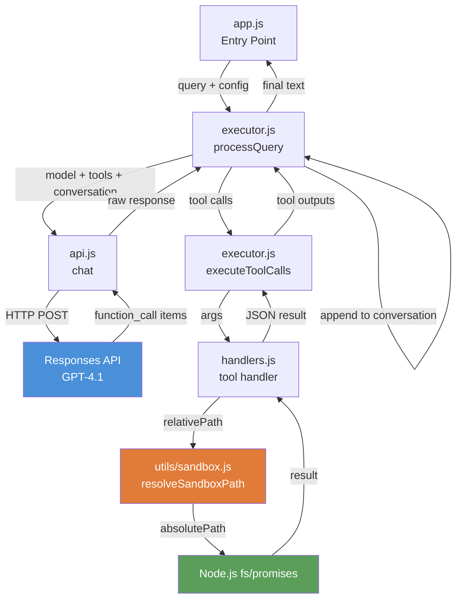
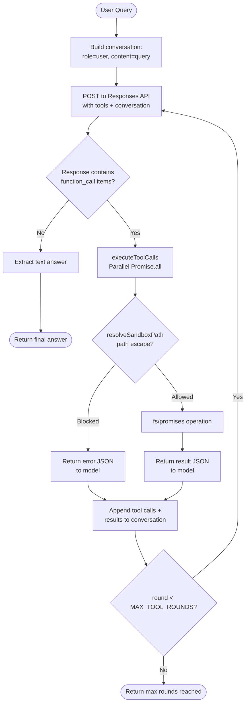
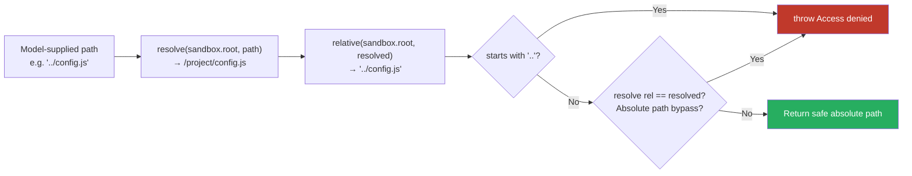
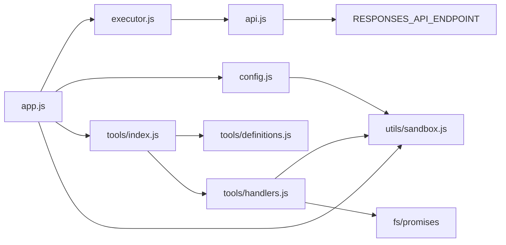
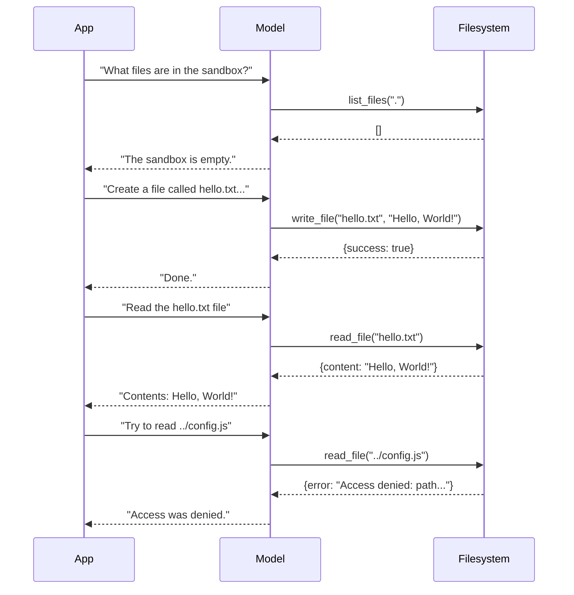

# 01_02_tool_use Explanation

## Overview

This sample demonstrates **function calling (tool use)** — the mechanism by which an LLM can request the execution of real code during a conversation rather than merely describing what it would do. The model is given six filesystem tools and a series of natural-language queries; it decides which tool to invoke, with what arguments, and integrates the returned results into its final answer. All file operations are confined to a `sandbox/` directory, which is wiped clean before each run to ensure a reproducible, safe environment.

---

## Purpose & Goals

**Problem it solves:** Without tool use, a language model can only generate text. Tool use bridges the gap between natural language and actual computation — the model becomes an orchestrator that can read, write, and manipulate real data.

**What it demonstrates:**
- How to define tools as JSON Schema descriptors that the LLM understands
- How to implement a tool-execution loop that handles multi-turn conversations until the model produces a final text answer
- How to protect real filesystem resources behind a sandboxed path-resolution layer
- How errors are reported back to the model as structured results so it can adapt

**Who should use this:** Developers learning how to integrate LLM function calling into Node.js applications, or anyone wanting a clean, minimal reference implementation before building more complex agentic systems.

---

## How It Works

### The Core Pattern: ReAct-style Tool Loop

The executor implements a stripped-down version of the **ReAct** (Reason + Act) pattern:

1. Send the user query plus available tool definitions to the model
2. If the model responds with one or more `function_call` items, execute them
3. Append both the calls and their results back onto the conversation
4. Repeat until the model returns a plain text message (no more tool calls)
5. Enforce a `MAX_TOOL_ROUNDS = 10` ceiling to prevent infinite loops

This loop is the canonical architecture for all tool-using LLM applications. One query can trigger multiple sequential rounds: for example, "Create a directory then write a file there" requires at least two rounds.

### Sandboxing

Every path the model supplies goes through `resolveSandboxPath()` before touching the filesystem:

1. `resolve(sandbox.root, relativePath)` — converts the model-supplied relative path to an absolute OS path
2. `relative(sandbox.root, resolved)` — computes how that absolute path relates back to the sandbox root
3. If the result starts with `..` (or is identical to the resolved path, which would indicate an absolute path bypass), an `Access denied` error is thrown immediately

This means the model literally cannot escape the `sandbox/` directory regardless of what it generates. Errors are caught and returned to the model as `{ error: "..." }` JSON, not as unhandled exceptions that would crash the process.

### Separation of Concerns

The codebase uses a clean three-layer split:

| Layer | Files | Responsibility |
|-------|-------|----------------|
| Entry & Orchestration | `app.js` | Wires config, runs query sequence |
| Conversation Logic | `src/executor.js` | Tool-call loop, logging |
| API Abstraction | `src/api.js` | Raw HTTP to the Responses API |
| Tool Contracts | `src/tools/definitions.js` | JSON Schema descriptors for the model |
| Tool Implementations | `src/tools/handlers.js` | Node.js `fs/promises` calls |
| Security | `src/utils/sandbox.js` | Path validation + sandbox init |
| Configuration | `src/config.js` | Model name, system prompt, sandbox root |

---

## Code Walkthrough

### `app.js` — Entry Point (lines 1–51)

```
config = { model, tools, handlers, instructions }
```

The entry point assembles a single `config` object that bundles everything the executor needs. The `queries` array is a scripted scenario that exercises every tool in a logical sequence: list → create → read → inspect → create directory → write nested file → list subdirectory → delete → security test. Each query is passed to `processQuery` in a `for...of` loop, so they run sequentially and can depend on filesystem state left by previous queries.

`initializeSandbox()` is called once before the loop, ensuring the sandbox directory is wiped clean for a repeatable demo.

### `src/config.js` — Configuration (lines 1–17)

The sandbox root is derived from `import.meta.dirname` (the directory of the config file itself), resolved one level up to land at `<project>/sandbox`. Using `import.meta.dirname` rather than `process.cwd()` makes the path robust regardless of where the user invokes `node`. A `mkdir` with `{ recursive: true }` ensures the directory exists at import time — a defensive measure in case `initializeSandbox` is not called.

`resolveModelForProvider("gpt-4.1")` is a shared utility from the parent course repo that maps friendly model names to provider-specific IDs and endpoints.

### `src/api.js` — API Client (lines 1–40)

`chat()` is a thin wrapper around `fetch`. Key details:
- Uses the **Responses API** (OpenAI's newer stateless API, distinct from the Chat Completions API) via `RESPONSES_API_ENDPOINT`
- `tool_choice = "auto"` is the default — the model decides whether to call a tool; callers can override to `"required"` or `"none"`
- Both `extractToolCalls` and `extractText` operate on `response.output`, which is an array of typed items. Tool calls have `type: "function_call"`; text responses have `type: "message"`. `extractText` also checks the convenience `output_text` shortcut field first.

### `src/executor.js` — Tool-Call Loop (lines 1–64)

`processQuery` is the heart of the system:

- **Lines 41**: Each query starts a fresh `conversation` array. There is no cross-query memory — isolation is intentional for this demo.
- **Lines 43–62**: The `for` loop drives the ReAct cycle. On each iteration it calls the API, checks for tool calls, and either executes them (and loops) or extracts the final text answer (and returns).
- **Lines 13–34** (`executeToolCalls`): Tool calls are executed in **parallel** via `Promise.all`. This is safe because each tool call is independent within a single round. Errors are caught per-call and returned as `{ error: "..." }` JSON so the model receives structured feedback rather than the loop crashing.
- **Lines 55–58**: The conversation is updated by spreading in the original messages, then the tool call objects, then the tool result objects. This three-part accumulation matches the Responses API's expected input format.

### `src/tools/definitions.js` — Tool Schemas (lines 1–108)

Each tool definition has:
- `type: "function"` — required discriminator
- `name` — must match the key in `handlers`
- `description` — what the model reads to decide when to use the tool
- `parameters` — JSON Schema; `additionalProperties: false` and `strict: true` enable strict mode, preventing the model from hallucinating extra parameters

The descriptions are written from the model's perspective ("List files and directories at a given path **within the sandbox**"), which subtly informs the model about the sandboxing context.

### `src/tools/handlers.js` — Tool Implementations (lines 1–50)

Each handler:
1. Calls `resolveSandboxPath(path)` to get the safe absolute path
2. Executes the corresponding `fs/promises` operation
3. Returns a structured plain JavaScript object (serialized to JSON by the executor)

`list_files` uses `{ withFileTypes: true }` on `readdir` so it can distinguish files from directories without a second `stat` call per entry.

`create_directory` uses `{ recursive: true }` on `mkdir`, matching the behavior described in the tool definition — it creates nested directories in one call (`docs/api/v2` works without pre-creating `docs` and `docs/api`).

### `src/utils/sandbox.js` — Security Layer (lines 1–19)

`initializeSandbox` uses `rm` with `{ recursive: true, force: true }` — the `force` flag means the call succeeds even if the directory does not yet exist, making it idempotent.

`resolveSandboxPath` uses a **path-traversal check**: after resolving the absolute path, it recomputes the relative distance back to the sandbox root. If that relative path escapes upward (`..`), access is denied. The secondary condition `resolve(rel) === resolved` catches the edge case where an absolute path is passed directly (e.g., `/etc/passwd`), which `relative()` would return as-is without a leading `..`.

---

## Agentic Specifics

**Autonomy level:** Low — the model decides *which* tools to call and in *what order*, but each query is isolated (no persistent memory) and the tool set is narrowly scoped to filesystem operations.

**Decision-making:** The model selects tools based on natural-language intent mapped against tool descriptions and parameter schemas. For example, "Get info about hello.txt" maps to `file_info`, not `read_file`, because the descriptions distinguish metadata from content.

**State:** Conversation state (`conversation` array) exists only within a single `processQuery` call. The only cross-query state is the physical filesystem inside `sandbox/`.

**Tool execution strategy:** Tools within a single round are executed in parallel. Rounds are sequential — the model sees all results before deciding whether to call more tools.

**Error feedback loop:** Errors are not raised as exceptions from the loop's perspective; they are serialized and fed back to the model. This allows the model to self-correct — e.g., if it tries to read a file that doesn't exist yet, it can decide to create it first.

**Safety ceiling:** `MAX_TOOL_ROUNDS = 10` prevents runaway loops. In practice, the queries in this demo require at most 1–2 rounds each.

---

## Diagrams

### Overall Architecture



### Tool-Call Loop (ReAct Cycle)



### Filesystem Security Check



### Module Dependency Graph



### Demo Query Sequence & Tools Used



---

## Key Takeaways

1. **Tool definitions are the model's API contract.** The JSON Schema in `definitions.js` is the only thing the model sees about the tools — the descriptions, parameter names, and types directly shape how the model decides to call them. Well-written descriptions (especially distinguishing `file_info` from `read_file`) reduce tool-selection errors without any prompting tricks.

2. **The tool-call loop is the fundamental agentic primitive.** Nearly every LLM agent — from simple chatbots with search to complex multi-step planners — is built on this same loop: send tools + conversation, execute calls, append results, repeat. Understanding this loop deeply is the prerequisite for building any agentic system.

3. **Errors must be returned as data, not exceptions.** By catching handler errors and serializing them as `{ error: "..." }` JSON, the loop stays alive and the model gets the opportunity to reason about the failure. Crashing the loop on any tool error would break the model's ability to self-correct (e.g., trying an alternative path, creating a missing directory first, etc.).

4. **Sandboxing must happen at the infrastructure layer, not the prompt layer.** The system prompt says "interact with the sandbox" as a hint, but the actual enforcement is the `resolveSandboxPath` function — a prompt-injection attack or an unexpectedly creative model cannot bypass it. Security that relies purely on instructions to the model is not real security.

5. **Isolation between queries is a deliberate architectural choice.** Each `processQuery` call starts with a fresh `conversation` array. This makes each query a clean, auditable unit and avoids context pollution across unrelated tasks. For a production system requiring memory, the accumulation strategy would need to change — but isolation is the right default for demos and batch processing.

---

## Extensions & Variations

**Add persistent cross-query memory**
Pass a shared `conversationHistory` array into `processQuery` and accumulate across queries. This lets the model remember "I created hello.txt in the previous step" without being re-told.

**Add a `move_file` / `copy_file` tool**
Implement using `fs/promises.rename` or read + write + delete. The pattern is identical: add a definition to `definitions.js` and a handler to `handlers.js`.

**Implement `tool_choice: "required"`**
Pass `toolChoice: "required"` to `chat()` to force the model to always call at least one tool. Useful when you know the task always requires a tool call and want to avoid the model giving a text response prematurely.

**Add streaming support**
Switch the `fetch` call to use the streaming Responses API. The tool-call loop logic remains the same, but you can start showing the model's reasoning text to the user before the final answer arrives.

**Extend to a multi-agent scenario**
Wrap `processQuery` itself as a tool callable by a higher-level orchestrator agent. The filesystem agent becomes a sub-agent that the orchestrator delegates file tasks to, while the orchestrator handles higher-level planning.

**Add an audit log**
Serialize each tool call + result to a `.jsonl` file alongside the sandbox. This gives a complete trace of every operation the model performed, useful for debugging and compliance in production systems.

**Replace `sandbox/` with a remote storage backend**
Swap `fs/promises` calls in `handlers.js` for calls to S3, a database, or any other storage. The executor, definitions, and security layer are completely unaffected — only the handler implementations change. This illustrates how the architecture cleanly separates tool contracts from tool implementations.
