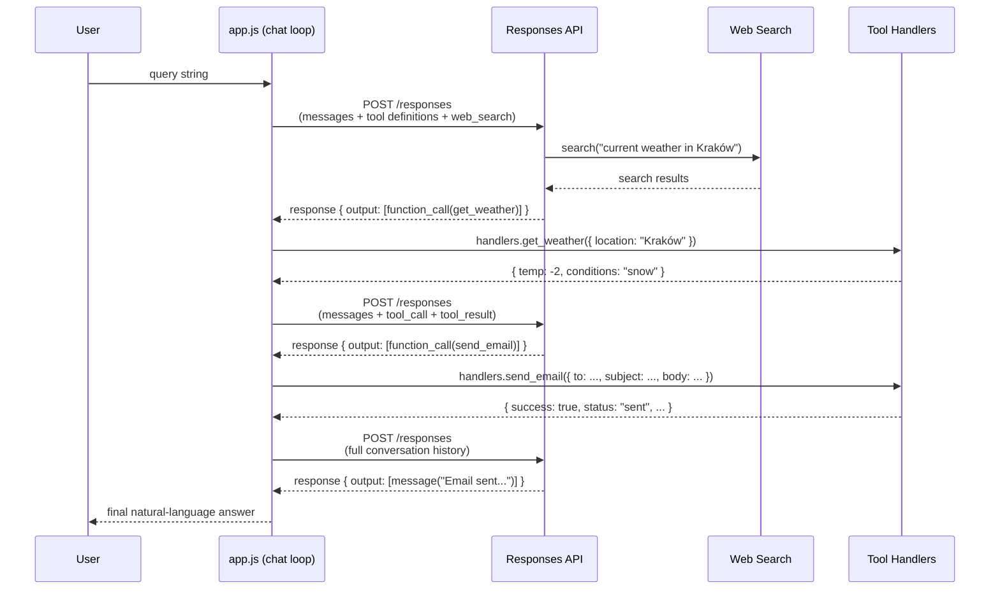
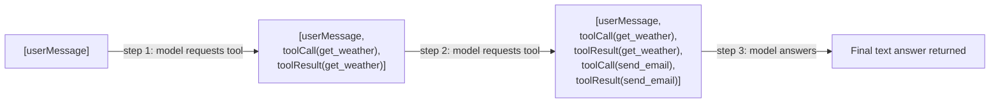
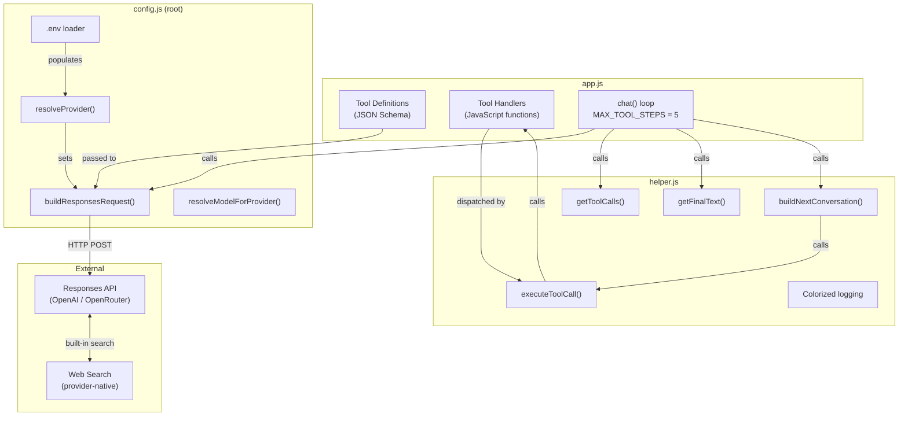
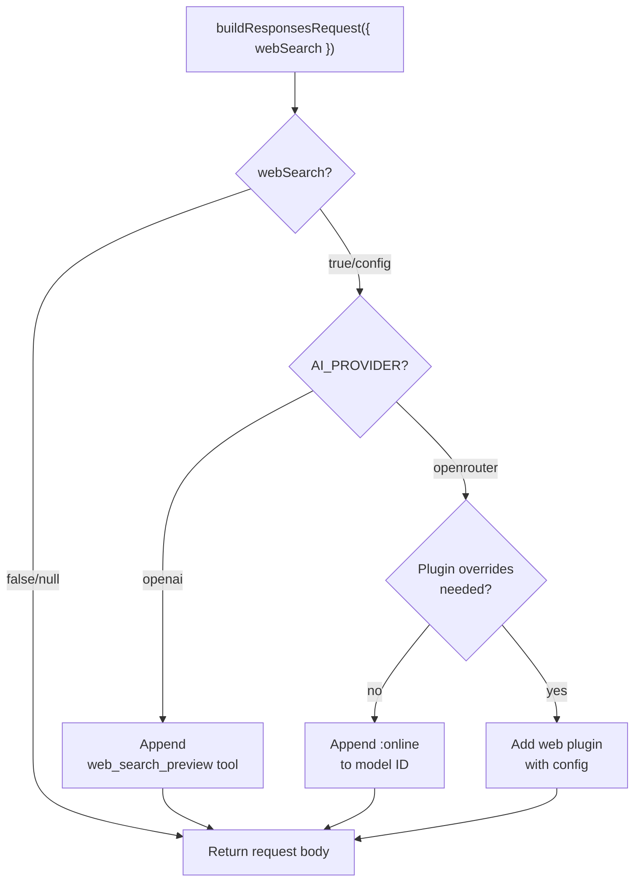

# 01_02_tools Explanation

## Overview

`01_02_tools` is a minimal but complete demonstration of **tool use** with a large language model (LLM) via the OpenAI-compatible Responses API. It shows how to describe capabilities to a model as JSON Schema function definitions, let the model decide when and how to call those functions, execute the actual logic in JavaScript, and return results so the model can compose a final natural-language answer. The example combines a provider-native web search with two custom tools — mock weather lookup and a mock email sender — wired together in a simple agentic loop.

---

## Purpose & Goals

### Problem being solved

Out of the box, LLMs can only generate text. They cannot fetch live data, send messages, or trigger side-effects. Tool use (also called function calling) bridges this gap: the application defines what functions exist and what they do, the model decides *when* to invoke them, and the application executes the real code. This sample makes the entire lifecycle explicit and approachable.

### What it demonstrates

- How to declare tools as JSON Schema objects and pass them to the Responses API.
- How to read tool-call decisions back from the model response.
- How to execute the underlying JavaScript handlers and feed results back into the conversation.
- How to combine provider-native web search (a built-in tool) with custom application-level tools.
- How to guard against infinite loops with a step counter.

### Who should use this

Developers who are new to tool use / function calling and want a clear, commented reference implementation before building something more complex. It is intentionally small — no framework, no abstraction layers — so every step is visible.

---

## How It Works

### The core insight: separation of concerns

The model and the application code are strictly separated:

- **The model** sees the tool definitions (name, description, JSON Schema parameters). It decides whether to call a tool and emits a structured `function_call` object with serialized arguments.
- **The application** owns the actual handler code. The model never executes it directly; it only requests it.

This design is deliberate. It means tool logic can be anything — a database query, an HTTP request, a filesystem operation — without exposing implementation details to the model.

### The tool-calling loop

The workflow is iterative, not a single request-response. Each iteration:

1. Send the current conversation (user messages + any prior tool results) to the API.
2. Inspect the response for `function_call` output items.
3. If none exist, the model has produced a final answer — return it.
4. If tool calls exist, execute all of them (in parallel), append both the calls and their results to the conversation, and repeat.

A step counter (`MAX_TOOL_STEPS = 5`) caps the loop to prevent runaway execution.

### Provider-native web search

Web search is handled differently from custom tools because each provider implements it differently:

- **OpenAI**: a built-in `web_search_preview` tool is injected into the `tools` array.
- **OpenRouter**: the model ID receives an `:online` suffix (or a `web` plugin entry is added for finer-grained control).

The shared `config.js` normalizes this so `app.js` simply sets `webSearch: true` and the correct provider-specific wiring is applied automatically.

---

## Code Walkthrough

### `app.js`

#### Lines 1–14 — Imports

The file imports infrastructure (`AI_API_KEY`, `buildResponsesRequest`, API endpoint constants, `resolveModelForProvider`) from the shared root `config.js`, and helper utilities (`buildNextConversation`, `getFinalText`, `getToolCalls`, `logAnswer`, `logQuestion`) from `helper.js`. This keeps `app.js` focused on business logic.

#### Line 16 — Model selection

```js
const model = resolveModelForProvider("gpt-4.1-mini");
```

`resolveModelForProvider` normalizes the model identifier for the active provider. For OpenRouter, bare OpenAI model names are prefixed with `openai/`. For OpenAI, the name passes through unchanged.

#### Lines 19 — Web search flag

```js
const webSearch = true;
```

A simple boolean that `buildResponsesRequest` translates into the correct provider-specific representation. This is the only configuration needed to enable live web search.

#### Lines 26–57 — Tool definitions

Two tools are declared as JSON Schema objects:

- `get_weather`: requires a single string `location` (city name).
- `send_email`: requires `to`, `subject`, and `body`, all strings.

Both use `strict: true`, which tells the model to produce arguments that strictly conform to the schema (no extra properties). Note that these definitions are pure data — no code, no logic. They are only the *contract* the model must follow.

#### Lines 64–96 — Tool handlers

The `handlers` object maps tool names to functions:

- `get_weather` uses a hardcoded lookup table keyed by city name and falls back to `{ temp: null, conditions: "unknown" }` for unknown cities.
- `send_email` validates and echoes the inputs back as a success response.

Both handlers call `requireText` to validate string arguments before using them, demonstrating defensive input handling even for mocked tools. The model can produce adversarial or malformed arguments, so validation matters.

#### Lines 99–120 — `requestResponse`

Builds the full API request body via `buildResponsesRequest` (which injects web search tooling as appropriate), then calls the Responses API with `fetch`. Throws a descriptive error if the response is not OK.

#### Lines 122, 135–153 — `chat` (the agentic loop)

```js
const MAX_TOOL_STEPS = 5;

const chat = async (conversation) => {
  let currentConversation = conversation;
  let stepsRemaining = MAX_TOOL_STEPS;

  while (stepsRemaining > 0) {
    stepsRemaining -= 1;
    const response = await requestResponse(currentConversation);
    const toolCalls = getToolCalls(response);

    if (toolCalls.length === 0) {
      return getFinalText(response);
    }

    currentConversation = await buildNextConversation(currentConversation, toolCalls, handlers);
  }

  throw new Error(`Tool calling did not finish within ${MAX_TOOL_STEPS} steps.`);
};
```

This is the heart of the sample. The loop:
- Decrements the step counter before each API call (not after), so the counter reliably reflects how many API calls are left.
- Delegates all tool execution and conversation construction to `buildNextConversation` in `helper.js`.
- Exits immediately when the model returns a response with no tool calls.
- Throws if the step limit is exceeded rather than silently returning a partial result.

#### Lines 155–159 — Entry point

```js
const query = "Use web search to check the current weather in Kraków. Then send a short email with the answer to student@example.com.";
logQuestion(query);
const answer = await chat([{ role: "user", content: query }]);
logAnswer(answer);
```

A hardcoded query exercises both the web search capability and the custom tools in one shot. The conversation starts as a simple single-message array and grows as tools are called and results are appended.

---

### `helper.js`

#### Lines 1–7 — Response parsing

`getToolCalls` filters the `response.output` array for items of type `"function_call"`. The Responses API returns a mixed array of output types (messages, function calls, web search results), so explicit filtering is necessary.

`getFinalText` extracts the final text answer. It tries `response.output_text` first (a convenience field the Responses API sometimes provides), then falls back to searching the `output` array for a `"message"` item and extracting its text content. The `?? "No response"` guard ensures a string is always returned.

#### Lines 9–48 — Terminal colorization

A self-contained ANSI color helper that:
- Detects TTY support and the `NO_COLOR` environment variable before applying colors, making output safe to pipe or redirect.
- Exposes `logQuestion`, `logToolCall`, `logToolResult`, and `logAnswer` for clearly labeled, color-coded console output that makes the tool-calling lifecycle easy to follow at a glance.

#### Lines 54–71 — `executeToolCall`

```js
export const executeToolCall = async (call, handlers) => {
  const args = JSON.parse(call.arguments);
  const handler = handlers[call.name];

  if (!handler) {
    throw new Error(`Unknown tool: ${call.name}`);
  }

  logToolCall(call.name, args);
  const result = await handler(args);
  logToolResult(result);

  return {
    type: "function_call_output",
    call_id: call.call_id,
    output: JSON.stringify(result),
  };
};
```

This function:
- Deserializes the model's JSON argument string.
- Guards against unknown tool names (the model could hallucinate a tool name).
- Logs the call and result for observability.
- Returns the result in the exact format the Responses API expects: `{ type: "function_call_output", call_id, output: <JSON string> }`. The `call_id` is critical — it links the result back to the specific tool call the model issued.

#### Lines 73–79 — `buildNextConversation`

```js
export const buildNextConversation = async (conversation, toolCalls, handlers) => {
  const toolResults = await Promise.all(
    toolCalls.map((call) => executeToolCall(call, handlers)),
  );

  return [...conversation, ...toolCalls, ...toolResults];
};
```

Uses `Promise.all` to execute multiple tool calls in parallel when the model requests more than one at once. Then constructs the next conversation state by spreading: prior messages, then the tool call objects (so the model remembers what it asked for), then the results. Maintaining this full history is required by the Responses API for multi-turn context.

---

### `config.js` (root, shared)

#### Lines 8–23 — API endpoint and provider constants

Defines endpoint URLs for both OpenAI and OpenRouter, valid provider names, and valid OpenRouter web search engine options. All environment-specific branching is driven from a single `AI_PROVIDER` value resolved once at startup.

#### Lines 25–31 — Node.js version guard

Checks the Node.js major version at startup (minimum 24) and exits with a descriptive error if it is too old. This avoids cryptic failures from missing runtime features.

#### Lines 33–88 — `.env` file loading

A portable `.env` loader that:
- Uses `process.loadEnvFile` on Node 24+ (the native built-in).
- Falls back to a manual line-by-line parser for older runtimes or Bun.
- Skips lines already set in the environment (environment variables always win over `.env`).
- Handles `export KEY=value` syntax.

#### Lines 110–176 — Provider resolution and model normalization

`resolveProvider` picks the active provider based on `AI_PROVIDER` env var and available keys. `resolveModelForProvider` namespaces bare model names for OpenRouter (e.g., `gpt-4.1-mini` becomes `openai/gpt-4.1-mini`).

#### Lines 178–317 — `buildResponsesRequest`

The most complex function in the config. It assembles the final API request body, handling:
- Tool injection.
- OpenAI web search: appends `{ type: "web_search_preview" }` to the tools array if not already present.
- OpenRouter web search (simple): appends `:online` to the model ID.
- OpenRouter web search (advanced): switches to the `web` plugin with engine, max results, and search prompt overrides.

---

## Agentic Specifics

### Autonomy level

This is a **semi-autonomous, tool-using workflow** — not a fully autonomous agent. The human provides the initial goal and the application provides the tool implementations. The model autonomously decides:
- Whether to call tools at all.
- Which tool to call and in what order.
- What arguments to pass.
- When it has enough information to produce a final answer.

The human is not consulted during execution. Control returns to the user only when a final answer is ready (or the step limit is hit).

### Decision-making

The model uses the tool descriptions to reason about which tools fit the user's request. The query explicitly instructs it to use web search and then send an email, so the model will typically: (1) issue a web search for current weather, (2) optionally call `get_weather` with the city, (3) call `send_email` with the composed message. The exact sequence is non-deterministic and prompt-dependent.

### State management

State is maintained as a **flat conversation array** that grows with each iteration:

```
[userMessage, toolCall1, toolResult1, toolCall2, toolResult2, ..., assistantMessage]
```

There is no external storage, no session ID, and no persistent state. All context lives in the in-memory array for the duration of one `chat()` invocation.

### Tools inventory

| Tool | Type | Execution | Side-effects |
|------|------|-----------|--------------|
| `web_search_preview` | Provider-native | By OpenAI/OpenRouter | None (read-only) |
| `get_weather` | Custom function | Local JavaScript | None (mocked data) |
| `send_email` | Custom function | Local JavaScript | None (mocked) |

---

## Diagrams

### Tool-calling lifecycle



### Conversation state growth



### Component architecture



### `buildResponsesRequest` web search branching



---

## Key Takeaways

1. **Tool definitions are contracts, not code.** The JSON Schema objects in `tools` tell the model what is available and what arguments to supply. The handlers are entirely separate and the model never sees them. This separation enables safe, controlled extension of model capabilities.

2. **The conversation array is the state.** There is no session object, no database, no external state store. The growing array `[userMessage, toolCall, toolResult, ...]` is both the context window and the execution log. Understanding this structure is the key to building more complex multi-turn workflows.

3. **`Promise.all` enables parallel tool execution.** When the model requests multiple tools in a single response turn, they are all executed concurrently. This is not just a performance optimization — some models explicitly batch independent tool calls to minimize round-trips.

4. **Provider normalization hides real complexity.** Web search works fundamentally differently on OpenAI vs OpenRouter. The shared `config.js` absorbs all of this, so application code can simply set `webSearch: true`. This pattern — a thin normalization layer over heterogeneous provider APIs — is a practical strategy for writing portable LLM applications.

5. **Step limits are safety, not just convention.** Without `MAX_TOOL_STEPS`, a misconfigured tool schema, a model hallucinating tool names, or a tool that always returns an ambiguous result could cause an infinite loop. The step counter is a minimum viable safeguard in any tool-calling loop.

---

## Extensions & Variations

### Add real tool implementations

Replace the hardcoded `get_weather` map with an actual weather API call (e.g., Open-Meteo, OpenWeatherMap). Replace the mocked `send_email` with a real SMTP library or transactional email service. The `app.js` loop does not need to change at all — only the handlers.

### Add more tools

Add entries to both the `tools` array (for the model) and the `handlers` object (for execution). For example: a calendar lookup tool, a database query tool, or a file read tool. The model will automatically use whichever tools are most relevant for each query.

### Add user confirmation before tool execution

Wrap `executeToolCall` (in `helper.js`) to prompt the user for approval before executing sensitive tools like `send_email`. This pattern — human-in-the-loop confirmation — is a common safety layer in production agentic systems.

### Expose as a REPL or HTTP endpoint

Replace the hardcoded `query` with a `readline` loop or an Express/Hono route. The `chat` function already accepts any conversation array, so it can power an interactive session with persistent history across turns.

### Stream responses

The Responses API supports streaming. Switch from `fetch` + `response.json()` to a streaming reader to display partial responses in real time, useful for long-running tool chains where latency is visible to the user.

### Add structured output from the final model response

Instead of returning raw text, instruct the model to produce a final JSON object (using `response_format: { type: "json_schema", ... }`) summarizing what it did. This makes the output machine-readable and easier to test.

### Error handling and retry logic

Currently `executeToolCall` throws on unknown tools and the handlers throw on invalid arguments. A production implementation would catch these errors, format them as tool results with an `error` field, and return them to the model so it can recover gracefully rather than crashing the process.
