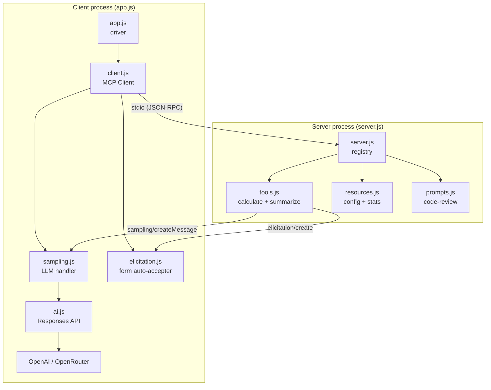
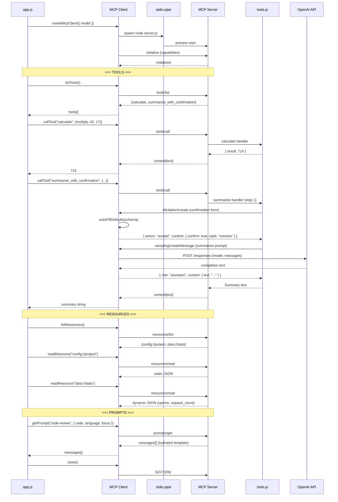
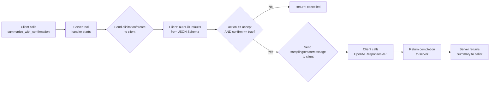
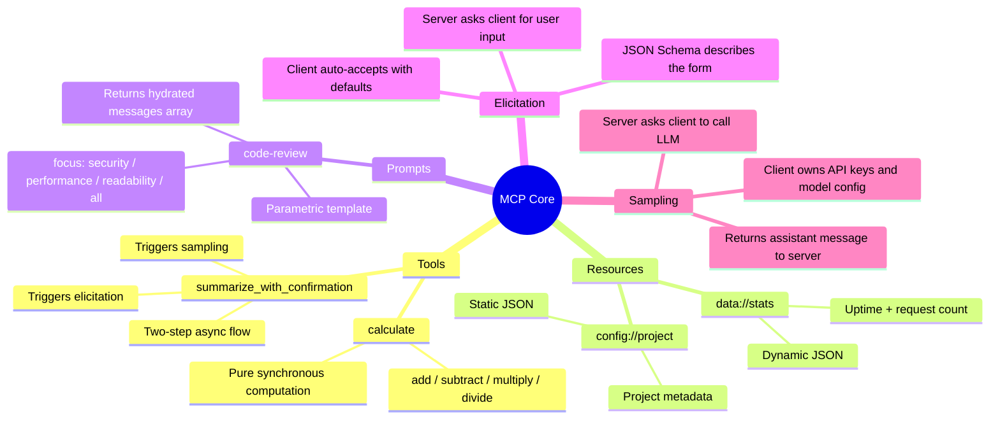

# 01_03_mcp_core Explanation

## Overview

This sample is a self-contained, runnable demonstration of the **Model Context Protocol (MCP)** in its core form. It spins up a local MCP server as a subprocess and connects to it over stdio, then exercises every major MCP capability: tools, resources, prompts, elicitation, and sampling. The codebase is deliberately minimal but complete — it is the canonical "hello world" for understanding what MCP is, how it moves data, and what makes it powerful.

---

## Purpose & Goals

**Problem it solves:**
MCP is a standardized protocol for connecting LLM-hosting applications ("clients") to capability providers ("servers"). The problem before MCP was that every application had to invent its own plugin system for giving models tools, data, and reusable instructions — and every server had to re-implement authentication, discovery, and invocation in an incompatible way. MCP standardizes all of that.

**What this sample demonstrates:**
- The full client-server lifecycle over stdio transport (spawn, connect, call, close)
- All five MCP primitive types: tools, resources, prompts, elicitation, and sampling
- How the protocol allows **reverse requests** — the server calling back into the client for LLM completions (sampling) and structured user input (elicitation)
- How to use Zod schemas to describe tool and prompt inputs in a type-safe way

**Who should use it:**
Developers who want to understand MCP from first principles before integrating it into a real host (like Claude Desktop, Cursor, or a custom agent). It is also a good template for building your own minimal MCP server.

---

## How It Works

### The transport layer

MCP does not require a network. This demo uses **stdio transport**: the client spawns the server as a Node.js child process with `node server.js`, and the two communicate by writing JSON-RPC 2.0 messages to `stdin`/`stdout`. This mirrors exactly how Claude Desktop and Cursor launch MCP servers in production.

### The three server primitives

| Primitive | Purpose | Discovery | Invocation |
|-----------|---------|-----------|------------|
| **Tool** | An action the LLM or client can trigger (side-effectful) | `listTools` | `callTool` |
| **Resource** | Read-only data the client can pull (no side effects) | `listResources` | `readResource` |
| **Prompt** | A reusable message template with typed parameters | `listPrompts` | `getPrompt` |

### The two reverse-request features

What makes MCP unusual is that the protocol is bidirectional. After the initial client→server connection, the server can send requests back to the client:

- **Elicitation**: The server sends a `elicitation/create` request with a JSON Schema describing a form. The client is responsible for showing that form to the user and returning the filled values. In this demo, the client auto-accepts by inferring schema defaults.
- **Sampling**: The server sends a `sampling/createMessage` request with a conversation and constraints. The client is responsible for calling an LLM and returning the completion. This means the server never needs its own API keys — it delegates to the client's AI configuration.

### Execution flow

When you run `npm start`:
1. `app.js` calls `createMcpClient()`, which spawns `server.js` as a subprocess and connects over stdio.
2. The client registers handlers for `sampling/createMessage` and `elicitation/create` before connecting, so it is ready to respond if the server calls back.
3. `app.js` then drives through three sections: Tools, Resources, and Prompts.
4. The `summarize_with_confirmation` tool call triggers both reverse-request features in sequence (elicitation first, then sampling).
5. The client closes the connection in a `finally` block, which sends SIGTERM to the subprocess.

---

## Code Walkthrough

### `app.js` — the driver script

Lines 1–13: Imports and model resolution. The model string is resolved via a shared `config.js` in the repo root, which reads from `.env` to pick the right provider (OpenAI or OpenRouter).

Lines 14–36 (Tools section): Creates the client, lists all tools, then calls `calculate` with `multiply(42, 17)` to show synchronous tool invocation. Then calls `summarize_with_confirmation`, which silently triggers elicitation and sampling under the hood.

Lines 38–47 (Resources section): Lists resources and reads both `config://project` (static JSON) and `data://stats` (dynamic JSON with uptime and request count).

Lines 49–64 (Prompts section): Lists prompts and calls `getPrompt` with arguments to hydrate the `code-review` template into a ready-to-send message array.

Line 65: The `finally` block calls `client.close()` unconditionally, ensuring the subprocess is always terminated even if an earlier step throws.

---

### `src/server.js` — the capability registry

Lines 21–39 (`createServer`): Instantiates `McpServer` with the three capability flags (`tools`, `resources`, `prompts`), then iterates over each module's export array and registers every entry. This pattern keeps the registry clean — adding a new tool is just appending to the array in `tools.js`.

Lines 42–54 (`main`): Connects the server to a `StdioServerTransport` and registers SIGINT/SIGTERM handlers for graceful shutdown. The transport reads from `process.stdin` and writes to `process.stdout`, which is the pipe the client opened when it spawned the subprocess.

---

### `src/client.js` — the host application

Lines 32–41: Creates a `Client` instance with two capability declarations: `sampling: {}` and `elicitation: { form: {} }`. These declarations tell the server which reverse-request features it is allowed to use.

Lines 44–45: Registers two request handlers *before* connecting. This is important — if the server immediately sends a sampling or elicitation request upon connection, the handlers must already be in place.

Lines 51–55: Builds a `StdioClientTransport` that launches `server.js` as a child process with `node`. `stderr: "inherit"` means any server-side `console.error` output goes to the same terminal, which aids debugging.

---

### `src/tools.js` — tool definitions

Lines 17–18: Two helpers (`textResult`, `errorResult`) produce the MCP content array format the protocol requires. Every tool response must be `{ content: [{ type, text }], isError? }`.

Lines 21–30: Zod schemas for validating the *server's own* responses when it sends elicitation and sampling requests. This is defensive coding — the server parses the client's reply to catch malformed responses early.

Lines 33–47 (`confirmationForm`): Constructs the `elicitation/create` payload. The `requestedSchema` is JSON Schema (not Zod) because it is sent over the wire to the client. It asks for a boolean `confirm` field and an enum `style` field with defaults.

Lines 50–56 (`samplingMessage`): Constructs the `sampling/createMessage` payload. The prompt is built from the user's original text and the style chosen in the elicitation step, creating a chain: user input → elicitation → sampling.

Lines 69–86 (`summarize_with_confirmation` handler): The two-step async flow. `extra.sendRequest()` is the MCP SDK method for issuing a reverse request and awaiting the client's reply. If the user declines (action is not `accept` or `confirm` is false), the function returns early without calling the LLM.

Lines 89–108 (`calculate` handler): A pure, synchronous computation wrapped in the async handler signature. Division by zero is handled gracefully by returning a string error in the result object rather than throwing.

---

### `src/resources.js` — resource definitions

Lines 9–10: Module-level state (`startTime`, `requestCount`) that persists across requests within a single server process. This is how the dynamic `data://stats` resource tracks how long the server has been alive and how many times it has been queried.

Lines 12–29 (static resource): The `config://project` handler always returns the same hardcoded object. Static resources are suitable for configuration, documentation, or anything that does not change at runtime.

Lines 31–49 (dynamic resource): The `data://stats` handler increments `requestCount` on every call and computes a live `uptime_seconds`. This demonstrates that resource handlers are just async functions — they can read databases, call APIs, or compute anything.

---

### `src/prompts.js` — prompt definitions

Lines 23–34 (`code-review` handler): The `focusMap` maps the `focus` enum to a specific instruction string. The handler interpolates `language` and `focus` into a Markdown code block. The output is a `messages` array — the same format that the Chat API accepts — so the client can pass it directly to a model without further transformation.

---

### `src/sampling.js` — the LLM bridge

Lines 27–29: Converts MCP message format (`{ role, content: { type, text } }`) to the flat string format the Responses API expects (`{ role, content: string }`). This normalization layer is necessary because MCP uses a richer content type system.

Lines 33–36: Returns the result in the MCP sampling response format (`{ role, content: { type, text }, model }`). The `model` field is echoed back so the server can log which model was used.

---

### `src/elicitation.js` — the form auto-accepter

Lines 17–21 (`inferDefault`): Priority order for defaults: explicit `default` field > boolean type (defaults to `true`) > first enum value. This heuristic covers the most common form field types.

Lines 25–30 (`autoFillDefaults`): Maps over schema properties, applies `inferDefault` to each, and filters out any fields that produced no default. The result is a plain object that satisfies the schema's `required` constraint.

Lines 38–55 (`createElicitationHandler`): The handler first rejects any non-`form` mode (the only mode defined in the spec at time of writing). It then checks for a custom `onElicitation` override — this is the extension point for real UI integration. If none is provided, it falls back to auto-fill.

---

### `src/ai.js` — the AI provider wrapper

Lines 18–26 (`extractText`): Handles two response shapes from the Responses API — a shorthand `output_text` string and the nested `output[].content[].text` path. This dual-parsing is required because different models and API versions may return either shape.

Lines 28–49 (`completion`): A thin `fetch`-based wrapper that posts to the configured endpoint with bearer auth and any extra headers (needed for OpenRouter's `HTTP-Referer` requirements). Throws on HTTP errors, JSON errors, or empty responses.

---

### `src/log.js` — structured console output

Lines 5–14: ANSI escape codes for terminal colors. Keeping them in a named object (`c.bold`, `c.cyan`, etc.) avoids magic strings throughout the codebase.

Lines 24–27 (`heading`): Section headers with a double-line border — used to visually separate the three demo phases in the terminal output.

Lines 41–53 (`parseToolResult`): Tries to JSON-parse the tool's text result, falling back to the raw string. This makes tool results easier to log as structured objects. Throws if `isError` is set.

Lines 55–79 (`clientLog`): A namespace of logging functions specifically for the client-side reverse-request events (spawning, sampling, elicitation). Keeping them separate from `log`/`heading` makes it easy to identify client-originated log lines visually (they use magenta and yellow).

---

## Agentic Specifics

### Reverse-request autonomy

The `summarize_with_confirmation` tool demonstrates **server-initiated control flow**. Once the client calls the tool, the server is in charge: it decides when to ask for confirmation (elicitation) and when to call the LLM (sampling). The client is a passive responder during this phase. This is an inversion of the usual request-response pattern and is the key insight that makes MCP more than just a simple RPC layer.

### State in tools

The `extra` parameter passed to every tool handler is the SDK's context object. Calling `extra.sendRequest()` lets the tool break out of its local execution and interact with the broader protocol session. This is the mechanism that enables multi-step, stateful tool flows.

### No persistent agent state

This demo is stateless from the LLM's perspective — it does not maintain a conversation history or memory. The sampling request sent by the server is a single-turn completion: one user message in, one assistant message out. Persistent agent state would require the client to manage a thread across multiple tool calls.

### Elicitation as a human-in-the-loop gate

The confirmation step before summarization is a deliberate design pattern: **the server can require human approval before performing an expensive or irreversible action**. In a real application, the `onElicitation` callback would render a UI dialog and wait for the user to click "Accept" or "Decline", giving the human control over the agent's next step.

---

## Diagrams

### System architecture

### Full execution sequence

### Reverse-request flow (elicitation + sampling)

### MCP capability map

---

## Key Takeaways

1. **MCP separates capability provision from LLM integration.** The server exposes tools, resources, and prompts without ever knowing which model or API key the client uses. This is the protocol's core value: a single server works with Claude Desktop, Cursor, a custom Python agent, or this demo without modification.

2. **The stdio transport makes local development trivial.** There is no daemon to run, no port to configure, and no authentication. The client spawns the server as a child process and communicates over pipes — the same mechanism the shell uses for `cat file | grep pattern`. This design also means the server's lifecycle is tied to the client; no orphaned processes.

3. **Elicitation and sampling invert the usual request-response model.** Normally the client calls the server. These two features let the server call back into the client during a tool execution. This enables server-side workflows that require either human approval (elicitation) or LLM intelligence (sampling) without the server needing its own UI or AI credentials.

4. **The three primitive types cover distinct use cases.** Tools are for actions with side effects (compute, write, call APIs). Resources are for read-only data access (config, database queries). Prompts are for reusable structured instructions that need to be parameterized at runtime. Using the wrong primitive for the job breaks the protocol's semantic model.

5. **The Zod schema pattern bridges TypeScript validation and MCP's JSON Schema wire format.** Tool and prompt inputs are defined with Zod, which the MCP SDK translates to JSON Schema for the `listTools` and `listPrompts` responses. This gives you type safety in handlers and a standard schema format on the wire without maintaining two separate schema definitions.

---

## Extensions & Variations

**Add real elicitation UI:**
Pass an `onElicitation` function to `createMcpClient`. That function receives the raw `params` object (including `requestedSchema` and `message`) and should return a promise resolving to `{ action, content }`. In a web app, this could render a modal dialog; in a CLI, it could use `inquirer` or `prompts`.

**Add a stateful tool:**
Resources already show module-level state (`requestCount`). Apply the same pattern to a tool: keep a list of items in memory and expose `add_item`, `list_items`, and `delete_item` tools. This shows how a server can act as a lightweight in-memory store.

**Connect to a real MCP host:**
Because `server.js` speaks standard stdio MCP, you can point Claude Desktop or Cursor at it by adding an entry to their MCP config files. The server will work without any changes — that is the protocol's promise.

**Add resource subscriptions:**
The MCP spec supports `resources/subscribe` for push notifications when a resource changes. Add a `subscriptions: {}` capability to the server and use `server.sendResourceUpdated(uri)` when the stats change, then handle `notifications/resources/updated` on the client side.

**Implement a multi-turn sampling flow:**
The current sampling request sends one user message. Extend `samplingMessage` to accept a full conversation history and pass it as the `messages` array. The server could maintain a short-term memory object and build up context across multiple tool calls.

**Add a network transport:**
Swap `StdioServerTransport` for `StreamableHTTPServerTransport` (also in the MCP SDK) to expose the same server over HTTP. The client would then use `StreamableHTTPClientTransport` with a URL instead of spawning a subprocess. This is the pattern for remote, multi-tenant MCP deployments.
