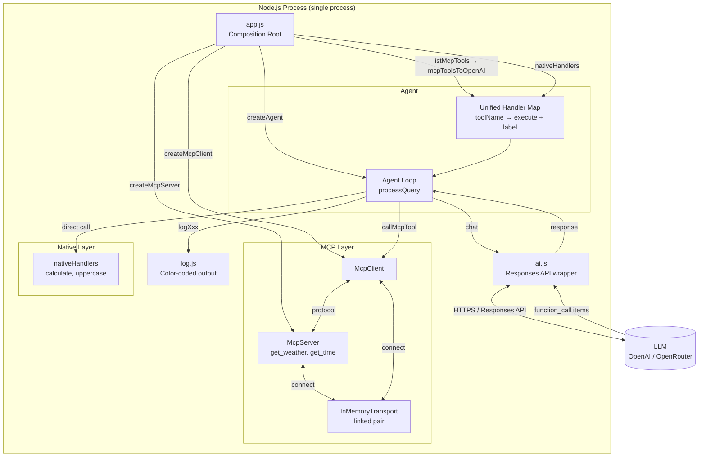
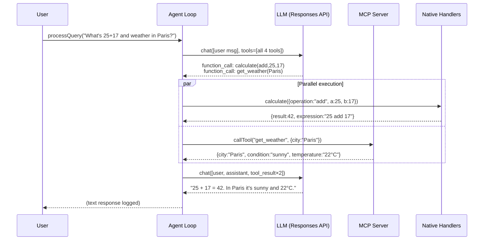
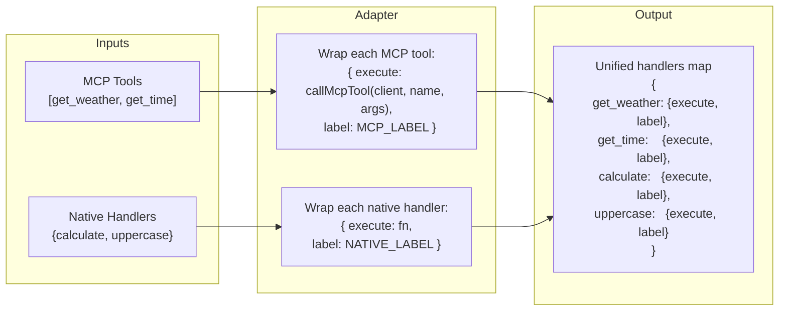
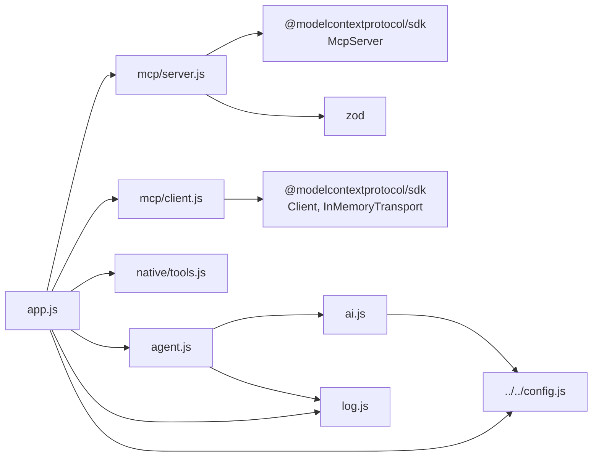

# 01_03_mcp_native Explanation

## Overview

This sample demonstrates how an AI agent can seamlessly combine two fundamentally different tool backends — MCP (Model Context Protocol) tools served over an in-process transport and native JavaScript functions — behind a single, unified interface. The model never knows which backend is executing a tool; it simply sees a flat list of capabilities. The design goal is showing that tool origin is an implementation detail, not a protocol concern.

## Purpose & Goals

**Problem it solves:** In real-world AI agents, tools come from multiple origins: external services exposed via MCP, in-process utility functions, third-party APIs, etc. Naively wiring each origin into the agent loop separately creates fragmentation and maintenance overhead. This sample shows the clean pattern for collapsing those origins into a single dispatch table.

**What it demonstrates:**
- Running an MCP server and client in the same Node.js process using `InMemoryTransport` (no subprocess, no stdio, zero overhead)
- Converting MCP tool schema format to OpenAI function-calling format so the LLM can invoke both uniformly
- Building a unified handler map that abstracts away whether a tool is "MCP-backed" or "native-backed"
- A bounded, parallel-capable agentic loop with a safety cap on tool rounds

**Who should use it:** Developers building agents that need to incorporate external MCP toolservers (possibly third-party) alongside their own business logic functions, without wanting two separate dispatching paths in their agent loop.

## How It Works

At startup `app.js` performs four steps in sequence:

1. Creates an in-memory MCP server and connects a client to it via a linked transport pair.
2. Fetches the server's tool list and converts the MCP schema to OpenAI function format.
3. Merges the converted MCP tool definitions with the statically-defined native tool definitions into one flat `tools` array for the LLM.
4. Builds a `handlers` map that associates every tool name with `{ execute, label }` — the same shape regardless of origin.

The agent loop then receives a user query and drives a multi-round conversation:
- Each round it sends the full conversation history plus the tool list to the LLM.
- If the LLM returns function call items, all calls are executed in parallel via `Promise.all`, and results are appended to the conversation.
- When the LLM returns a plain text message (no tool calls), the loop exits and the response is surfaced.

The `label` field on each handler (`MCP_LABEL` / `NATIVE_LABEL`) is only used for colorized console output; it is otherwise irrelevant to agent logic. This is an intentional separation: routing logic is inside the handler map, presentation logic lives in `log.js`.

## Code Walkthrough

### `app.js` — Composition Root (lines 1–61)

Lines 23–24: The MCP server is created and the client connects to it. Both happen synchronously within the same process — there is no network call, no port binding.

Lines 28–37: The handler map is constructed. `mcpTools` entries use `callMcpTool` as their `execute` function (a protocol call over the in-memory channel). `nativeHandlers` entries use the plain JS functions directly. After this point, the agent loop does not care which array an entry came from.

Line 39: Tool *definitions* (schema) are merged the same way and passed to the model. The model uses these definitions to decide which tool to call and what arguments to pass.

Lines 45–55: Five demo queries exercise all four tools, including one query (`"What's 25 + 17, and what's the weather in Paris?"`) that requires two tool calls in a single agent round, demonstrating parallel execution.

### `src/mcp/server.js` — In-Memory MCP Server (lines 1–58)

Uses the official `@modelcontextprotocol/sdk` `McpServer` class. Two tools are registered: `get_weather` (randomizes temperature and condition for demo purposes) and `get_time` (delegates to the platform's `toLocaleString` with a timezone parameter). Both return `content: [{ type: "text", text: JSON.stringify({...}) }]` — the standard MCP text-content envelope.

The `isError: true` flag on the timezone error path (line 53) is an MCP convention for signalling tool failures without throwing.

### `src/mcp/client.js` — MCP Client & Schema Bridge (lines 1–46)

Lines 13–24: `createMcpClient` links a client and server via `InMemoryTransport.createLinkedPair()`. This creates two transport objects that communicate through shared in-process queues — functionally equivalent to a real MCP connection but with no serialization overhead.

Lines 32–36: `callMcpTool` extracts the `text`-type content item from the MCP response and parses it back to a JS object. This normalizes MCP's content-envelope format to a plain object the rest of the agent code can use.

Lines 39–46: `mcpToolsToOpenAI` is the schema adapter. It maps MCP's `{ name, description, inputSchema }` to OpenAI's `{ type: "function", name, description, parameters, strict: true }`. This is the only place that "knows" about both formats.

### `src/native/tools.js` — Native Tool Definitions (lines 1–62)

`nativeTools` (lines 9–44) is a static array of OpenAI-format tool definitions. They are already in the format the LLM expects, so no conversion is needed.

`nativeHandlers` (lines 46–62) maps tool names to plain JS handler functions. The `calculate` handler uses an operation dispatch table (lines 48–54) and returns either the numeric result or a structured error object. The `uppercase` handler is trivially simple, included to show that native tools can be as lightweight as needed.

Both exports from this file are consumed directly in `app.js` — there is no abstraction layer between the raw JS function and the agent.

### `src/agent.js` — Agent Loop (lines 1–69)

`MAX_TOOL_ROUNDS = 10` (line 12) is a safety valve preventing infinite loops if the LLM repeatedly calls tools without converging.

`executeToolCall` (lines 14–32) is a single-responsibility function: parse arguments, look up handler, execute, log, and return the result in the `function_call_output` format the Responses API expects. Errors are caught and returned as structured JSON rather than thrown, so a single failing tool call does not abort the entire agent round.

`createAgent` (lines 41–69) returns an object with a single `processQuery` method. The conversation state is a local `let` variable scoped to each call — no global state, no side effects between queries.

Lines 59–63: `Promise.all` over `toolCalls.map(...)` means that when the LLM requests multiple tools in one response (as happens with the "Paris weather + math" query), all tools execute concurrently. For native tools this is instant; for MCP tools, calls over the in-memory transport are also essentially concurrent.

### `src/ai.js` — API Client (lines 1–57)

Wraps the OpenAI Responses API (`/v1/responses`). Conditionally adds `tools` and `tool_choice` only when tools are provided (line 31), keeping the request minimal for tool-free calls.

`extractResponseText` (lines 15–23) handles two possible response shapes: a top-level `output_text` shortcut and the nested `output[].content[].text` structure. This defensive parsing guards against minor API version differences.

`extractToolCalls` (line 53) filters `response.output` for `type === "function_call"` items. The agent loop uses this to decide whether to continue iterating or return the text response.

### `src/log.js` — Presentation Layer (lines 1–46)

Exports two label constants (`MCP_LABEL`, `NATIVE_LABEL`) and five log functions. ANSI escape codes add color to distinguish tool origins visually during development. All output goes to `console.log` — no logging framework, keeping the demo dependency-free.

The separation of logging from the agent loop is architecturally important: it means the agent code can be tested or reused without console noise, and the logging strategy can be swapped (e.g., to a structured logger) by changing only this file.

## Agentic Specifics

**Autonomy:** The agent is semi-autonomous within each query. It decides which tools to call and in what order; the developer only specifies which tools are available and what the system prompt says.

**Decision-making:** Tool selection is entirely delegated to the LLM. The developer influences this through the `instructions` system prompt, which tells the model to "use the appropriate tool for each task." The agent provides no hard-coded routing rules.

**State management:** Conversation state is ephemeral and local to each `processQuery` call. The `conversation` array grows with each tool round (user message + assistant output items + tool result items) and is discarded after the query resolves. There is no cross-query memory.

**Tool execution model:** All tools within a single round execute in parallel (`Promise.all`). The LLM controls granularity — it may request one tool or several in a single response.

**Safety bounds:** The `MAX_TOOL_ROUNDS = 10` cap prevents runaway loops. If the cap is hit, the method returns a sentinel string rather than throwing, so the caller can decide what to do.

**Tool transparency:** The model receives all four tools in every request. There is no selective hiding or capability gating in this sample.

## Diagrams

### System Architecture

### Agent Loop Flow

### Handler Map Construction

### Module Dependency Graph

## Key Takeaways

1. **Unified handler map is the key abstraction.** By normalizing MCP and native tools to `{ execute, label }` before handing them to the agent, the agent loop becomes agnostic to tool origin. Adding a new tool source (e.g., a REST API wrapper) only requires adding entries to the handler map — the agent loop is untouched.

2. **InMemoryTransport enables in-process MCP without overhead.** The official MCP SDK provides `InMemoryTransport.createLinkedPair()` specifically for testing and embedded use cases. This means you can co-locate a small MCP server inside your application process instead of spawning a subprocess — useful for tools that are tightly coupled to your app's state.

3. **Schema conversion is a narrow, explicit bridge.** `mcpToolsToOpenAI` in `client.js` is the only code that "speaks" both MCP schema format and OpenAI function format. Keeping this conversion in one small function makes it easy to audit, test, and update when either protocol changes.

4. **Parallel tool execution is free when the loop uses `Promise.all`.** The agent loop executes all tool calls in a round concurrently. For I/O-bound tools (real weather APIs, database calls), this can significantly reduce latency per agent turn at essentially zero additional complexity.

5. **Separation of concerns across files is deliberate.** `log.js` owns all presentation, `ai.js` owns all LLM communication, `agent.js` owns orchestration, and the `mcp/` and `native/` directories own their respective tool implementations. This structure makes each file independently testable and swappable — a production agent could replace `ai.js` with a different provider client without touching any other file.

## Extensions & Variations

**Add a real MCP server over stdio:** Replace `InMemoryTransport` with `StdioClientTransport` and spawn a child process. The rest of the agent code stays the same — only `createMcpClient` needs to change.

**Add cross-query memory:** Introduce a shared conversation store (e.g., a Map keyed by session ID) instead of the per-call `conversation` array. `createAgent` would accept a `getHistory`/`saveHistory` interface, keeping the loop clean.

**Tool filtering by query context:** Before calling `chat`, filter the `tools` array to a relevant subset based on keyword analysis of the query. This reduces token usage and steers the model away from irrelevant options — useful when the total tool count exceeds ~20.

**Error telemetry:** Replace `logToolError` with a structured emit to an observability system (OpenTelemetry, Datadog, etc.). The `logToolError` call site in `executeToolCall` is already the single chokepoint for all tool failures.

**Streaming responses:** Replace the `chat` function's `fetch` + `response.json()` pattern with a streaming fetch that processes `text/event-stream` chunks. The agent loop shape stays the same; only `ai.js` changes.

**Zod validation on native tool input:** Currently native handlers receive raw `JSON.parse`d arguments with no validation. Adding a Zod schema parse at the start of each native handler (mirroring what the MCP server does via its `inputSchema`) would give the same error-safety guarantees on both sides of the handler map.
