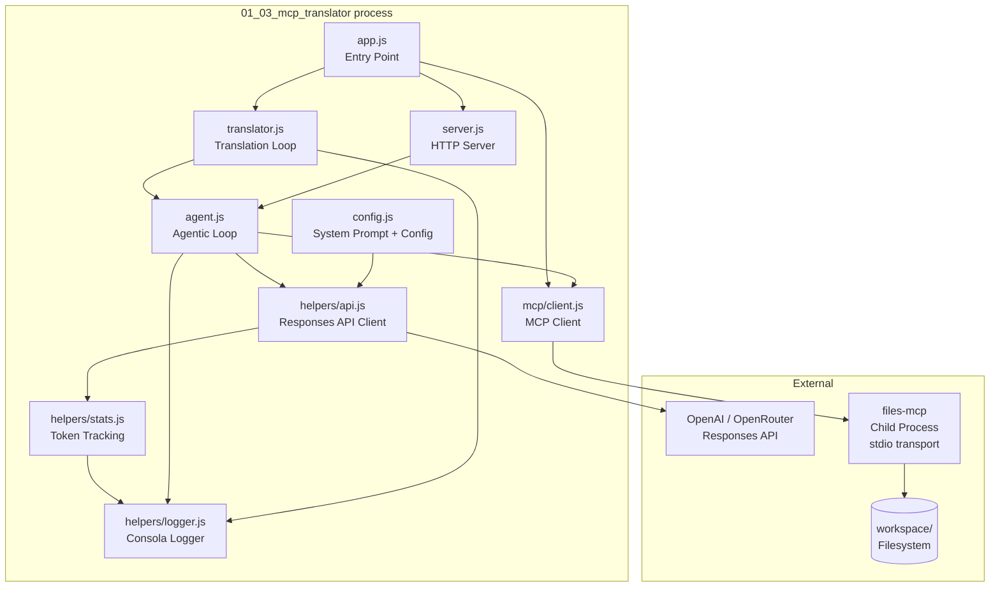
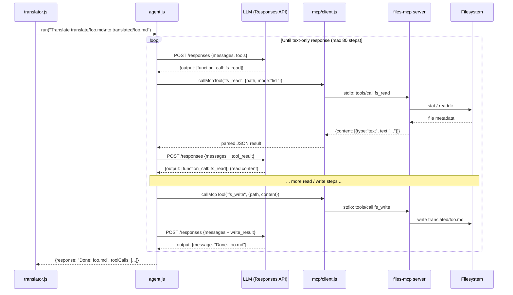
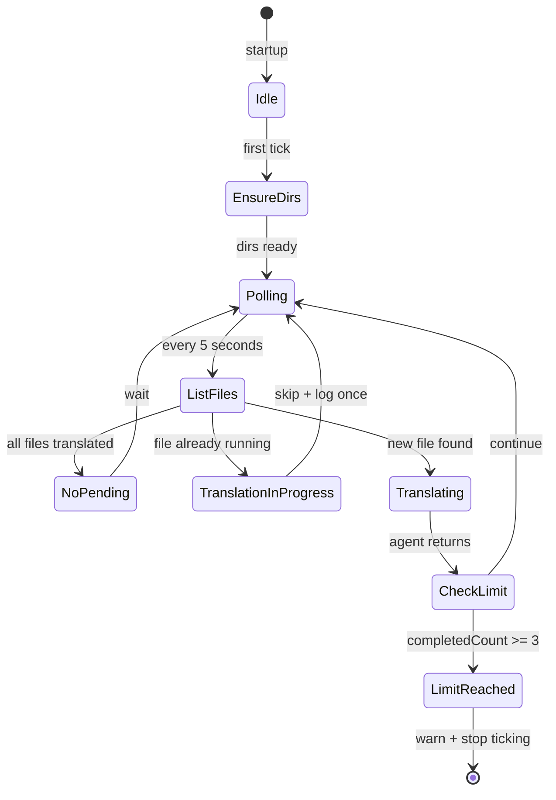
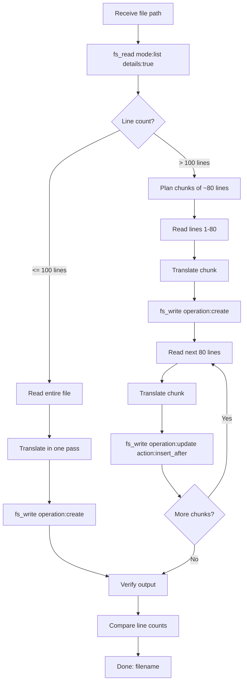

# 01_03_mcp_translator Explanation

## Overview

`01_03_mcp_translator` is a file-watching translation agent that uses the Model Context Protocol (MCP) to give an AI model direct access to the filesystem. It monitors a source directory (`workspace/translate/`) for new files, autonomously reads and translates them from Polish to English, and writes the results to a destination directory (`workspace/translated/`). A companion HTTP server exposes the same translation capability as an on-demand API.

## Purpose & Goals

**Problem it solves:** Manual translation of batches of documents is tedious and slow. This agent demonstrates how to automate the full read-translate-write cycle by combining an LLM with real filesystem tools exposed through a standard protocol.

**What it demonstrates:**

- How to connect to an MCP server over stdio and use its tools inside an agentic loop.
- How a single, well-crafted system prompt can encode a full workflow strategy (scan → plan → chunk → translate → verify) so the model self-directs through multi-step file operations.
- How to bridge a background polling loop with a synchronous HTTP API using the same underlying agent.
- Token usage and cache-hit-rate tracking across a multi-turn agentic session.

**Who should use this:** Developers learning how MCP integrates with LLM agents, or anyone building autonomous file-processing pipelines where the AI needs real I/O — not just string manipulation.

## How It Works

The agent has two parallel entry points that share the same core machinery:

1. **Translation loop** — A `setInterval`-based poller runs every 5 seconds. On each tick it lists the source directory, lists the destination directory, identifies files that exist in source but not in destination (pending files), and fires off a translation task for each one. Up to 3 files are translated per process lifetime (configurable via `MAX_TRANSLATIONS`).

2. **HTTP API** — Two endpoints (`POST /api/translate` and `POST /api/chat`) accept user-supplied text or arbitrary queries. Both route into the same `run()` agentic loop.

Both paths converge in `src/agent.js`, which drives a classic tool-use loop:

- Build a message list starting with the user query.
- Call the LLM (OpenAI Responses API) with the MCP tools converted to OpenAI function format.
- If the response contains tool calls, execute all of them concurrently against the MCP server, append results, and repeat.
- If the response contains only text (no tool calls), return it as the final answer.
- A hard cap of 80 steps prevents runaway loops.

The MCP `files` server (defined in `mcp.json`) runs as a child process over stdio and provides four tools: `fs_read`, `fs_search`, `fs_write`, and `fs_manage`. The agent uses `fs_read` to inspect and read source files, `fs_write` to create or append to destination files, and `fs_manage` to create directories. This means the LLM never sees raw Node.js `fs` calls — it sees a clean, capability-scoped tool interface, which is precisely the purpose of MCP.

## Code Walkthrough

### `app.js` (lines 1–46) — Entry Point and Lifecycle

This is the bootstrap. It:

1. Creates the MCP client (`createMcpClient()`), which reads `mcp.json`, spawns the `files-mcp` child process via stdio, and handshakes.
2. Fetches the tool list (`listMcpTools()`), which will later be converted to OpenAI function definitions.
3. Starts the file-watching loop (`runTranslationLoop()`).
4. Starts the HTTP server (`startHttpServer()`), passing a getter for the live MCP context so request handlers always see the current client state.
5. Registers `SIGINT`/`SIGTERM` handlers that gracefully close the MCP connection and HTTP server before exiting.

The design choice of passing `() => ({ mcpClient, mcpTools })` — a closure rather than the values themselves — means the HTTP server never holds a stale reference if the MCP client were ever replaced.

### `src/mcp/client.js` (lines 1–96) — MCP Integration Layer

Four exported functions form the entire MCP boundary:

- **`createMcpClient(serverName)`** (lines 26–58): Reads `mcp.json`, resolves the server config, creates an MCP `Client` from `@modelcontextprotocol/sdk`, and connects via `StdioClientTransport`. The environment passed to the child process is carefully assembled: only `PATH`, `HOME`, `NODE_ENV`, and the server-specific env vars (notably `FS_ROOT=./workspace`) are forwarded, avoiding accidental secret leakage.

- **`listMcpTools(client)`** (lines 64–67): Thin wrapper around `client.listTools()`.

- **`callMcpTool(client, name, args)`** (lines 72–84): Calls a tool and unwraps the response. MCP returns typed content blocks; this function extracts the `text` block and attempts JSON parsing so callers receive plain objects rather than protocol envelopes.

- **`mcpToolsToOpenAI(mcpTools)`** (lines 89–96): Converts MCP's tool schema format to the OpenAI function-calling format (`type: "function"`, `name`, `description`, `parameters`). This is the bridge that makes MCP tools callable through the standard LLM tool-use interface.

### `src/agent.js` (lines 1–60) — Agentic Loop

The heart of the system. `run(query, { mcpClient, mcpTools })` implements a bounded tool-use loop:

- **Line 30**: MCP tools are converted to OpenAI format once per invocation.
- **Line 31**: Messages start as a single user message containing the query.
- **Lines 36–57**: Each step calls `chat()`, extracts tool calls, and if present, executes them in parallel (`Promise.all` inside `runTools`) and appends results to the message history. The full `response.output` is pushed back to `messages`, not just the text — this preserves the conversation structure the Responses API expects.
- **Lines 43–47**: When no tool calls are present the loop exits cleanly and returns the final text along with a history of every tool call made during the run.
- **Line 59**: If 80 steps are exhausted without a text-only response, an error is thrown. This guards against infinite loops where the model keeps calling tools without ever concluding.

### `src/translator.js` (lines 1–123) — File-Watch Loop

This module manages the polling lifecycle and per-file state:

- **`inProgress` Set** (line 9): Prevents duplicate concurrent translations of the same file. If the agent for a given file is still running when the next poll tick fires, the file is silently skipped.
- **`loggedSkipped` Set** (line 10): A UX detail — suppresses the "waiting..." log message after the first occurrence so the terminal isn't flooded on subsequent ticks.
- **`completedCount`** (line 11) vs **`MAX_TRANSLATIONS = 3`** (line 7): Acts as a circuit breaker. After 3 successful translations the loop stalls and warns the user to restart. This limits accidental runaway API costs during development.
- **`listFiles()`** (lines 16–29): Uses `callMcpTool` with `fs_read` in `"list"` mode — the agent's own file tool is used by the orchestrator too, maintaining a single interface to the filesystem throughout.
- **`translateFile()`** (lines 35–68): Constructs a natural-language prompt (`Translate "translate/foo.md" to English and save to "translated/foo.md".`) and hands it to `run()`. The model then plans and executes all the filesystem operations autonomously.
- **`runTranslationLoop()`** (lines 94–123): Calls `ensureDirectories()` once on startup, then runs the first tick immediately (line 119) before setting the interval (line 122). This means the agent starts working without waiting for the first 5-second delay.

### `src/server.js` (lines 1–114) — HTTP API

A zero-dependency HTTP server built on Node's built-in `http` module:

- **`/api/translate`** (lines 62–70): Wraps the user's raw text in a prompt that instructs the model to translate inline (no file I/O), returning the result directly. This path does not use `fs_write` — the model translates in-context and returns a text response.
- **`/api/chat`** (lines 52–59): Passes the message straight to `run()` with no additional framing, allowing arbitrary filesystem operations via natural language.
- CORS headers (lines 38–41) are set on every response, enabling browser-side usage.
- The server startup banner (lines 100–110) prints a ready-to-use `curl` command, illustrating the intended developer experience.

### `src/config.js` (lines 1–41) — Agent Configuration

The system prompt (lines 6–28 of the `api` export) is the most consequential piece of configuration. It encodes a four-phase workflow:

1. **SCAN**: Always check file metadata first (using `fs_read` in `list` mode with `details:true`).
2. **PLAN**: Decide whether to translate in one pass (files ≤100 lines) or in ~80-line chunks.
3. **TRANSLATE**: For chunked files, use `fs_write` with `operation:"create"` for the first chunk and `operation:"update"` with `action:"insert_after"` for subsequent ones.
4. **VERIFY**: Re-read the output file and compare line counts with the source.

This strategy avoids common LLM translation failures: loading oversized files into a single context window, or silently skipping trailing sections. The final completion signal `"Done: <filename>"` gives the loop a reliable termination signal independent of file I/O.

### `src/helpers/` — Supporting Utilities

- **`api.js`**: Wraps `fetch` against `RESPONSES_API_ENDPOINT` (resolved from the shared root `config.js`). Handles both `output_text` (simple response) and structured `output[]` arrays (tool-use response). Also calls `recordUsage()` on every response.
- **`stats.js`**: Module-level accumulator for token counts. Calculates cache hit rate as `cachedTokens / inputTokens`. Called after each file completes via `logStats()` so the operator can see cost efficiency at a glance.
- **`logger.js`**: Thin wrapper around `consola`. Custom methods `tool()` and `toolResult()` truncate arguments to 200 characters to keep logs readable. `apiDone()` surfaces cache hit rate per API call.

## Agentic Specifics

**Autonomy level:** High. Given only a file path pair, the agent independently decides when to chunk, how to structure file writes, and when to verify. There is no orchestration code for "read lines 1–80, then lines 81–160" — that logic lives entirely in the system prompt.

**Decision-making:** The model chooses tool calls at each step. The only constraints enforced in code are the 80-step cap and the 3-translation circuit breaker. Everything else — reading strategy, chunking boundaries, verification — is reasoned by the LLM.

**State management:** State is held in three layers:
- **Per-run**: The `messages` array in `agent.js` accumulates the full conversation turn by turn.
- **Per-process**: `inProgress`, `loggedSkipped`, and `completedCount` in `translator.js` coordinate the polling loop across asynchronous file tasks.
- **Persistent**: The filesystem itself (via MCP) is the durable state store. The presence or absence of a file in `workspace/translated/` determines whether a translation task is queued.

**Tool usage pattern:** The agent uses filesystem tools instrumentally — not as a one-shot output mechanism, but as mid-loop I/O. It may call `fs_read` multiple times (once to check metadata, once per chunk), `fs_write` multiple times (once per chunk), and `fs_read` again at the end for verification. This multi-turn tool use within a single task is what distinguishes an agent from a simple LLM call.

## Diagrams

### System Architecture

### Agentic Loop Flow

### Polling Loop State Machine

### File Resolution Strategy (System Prompt Logic)

## Key Takeaways

1. **MCP decouples tool definitions from tool consumers.** The agent doesn't import or know about the filesystem directly. It receives a list of tool schemas at runtime and calls them by name. Swapping the `files` MCP server for a different one (e.g., a database or remote storage adapter) would require zero changes to the agent code.

2. **System prompts are executable workflows.** The four-phase SCAN→PLAN→TRANSLATE→VERIFY strategy in `config.js` is not enforced by any orchestration code — it lives entirely in natural language. The LLM follows it reliably because the prompt is explicit about sequencing and the rationale behind each step ("Never load the full file blindly").

3. **The filesystem is the coordination layer.** The poller detects "work to do" by comparing two directory listings. No database, queue, or message broker is needed. The agent's own MCP tools (`fs_read` in list mode) are reused by the orchestrator — there is a single consistent interface to the workspace throughout the codebase.

4. **Parallel tool execution is safe here because the tools are independent.** When the LLM returns multiple tool calls in one response, `runTools()` executes them with `Promise.all`. This works because the MCP tools in this domain (read this file, list that directory) do not depend on each other. Systems where tool calls have ordering constraints would need sequential execution instead.

5. **Safety boundaries come in pairs.** Two independent circuit breakers protect against runaway costs: the 80-step cap in `agent.js` catches infinite agentic loops, while the `MAX_TRANSLATIONS = 3` cap in `translator.js` limits total API spend per process run. Both are intentionally conservative for a learning/demo context.

## Extensions & Variations

**Support more languages:** The system prompt is Polish-specific. Generalize it by detecting the source language with a preflight LLM call or by accepting a `?lang=` query parameter on the `/api/translate` endpoint.

**Replace polling with a filesystem watcher:** Swap `setInterval` for Node's `fs.watch` or the `chokidar` library to react to new files in real time instead of on a 5-second cadence. The `inProgress` guard is already in place so concurrent processing would be safe.

**Add a progress API:** Expose a `GET /api/status` endpoint that returns the current `inProgress` set, `completedCount`, and the token stats from `stats.js`. This turns the agent into an observable service.

**Plug in a different MCP server:** Because the translation logic only depends on the MCP tool names (`fs_read`, `fs_write`, `fs_manage`), any MCP server that implements the same schema — e.g., an S3-backed file server, a SharePoint adapter, or a Git repository tool — could be dropped in via `mcp.json` without any code changes.

**Structured output for the HTTP endpoint:** The `/api/translate` endpoint currently returns the model's raw text. Add a Zod schema and a second LLM pass to return structured JSON (original, translation, detected language, tone) for richer downstream processing.

**Parallel file translation:** The current loop processes pending files sequentially (`await translateFile(...)`). Remove the `await` and let multiple files translate concurrently, bounded by a semaphore (e.g., `p-limit`) to control maximum simultaneous API calls.

**Persist stats across restarts:** Move `stats.js` from in-memory to a lightweight store (SQLite or a JSON file written via MCP's `fs_write`) to accumulate cost data over multiple sessions.
