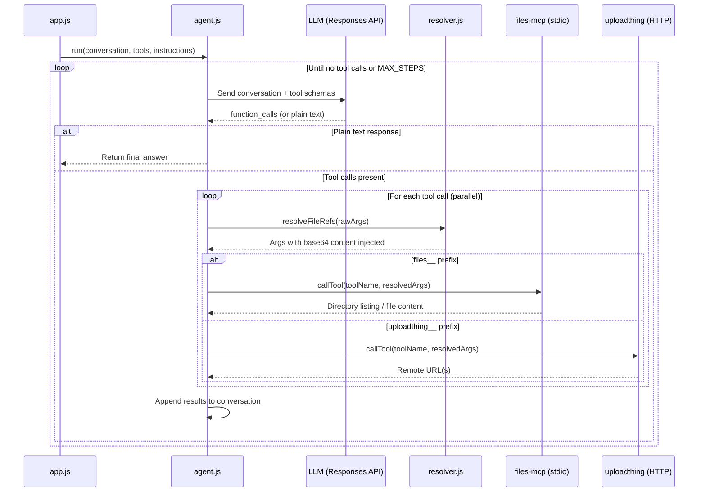
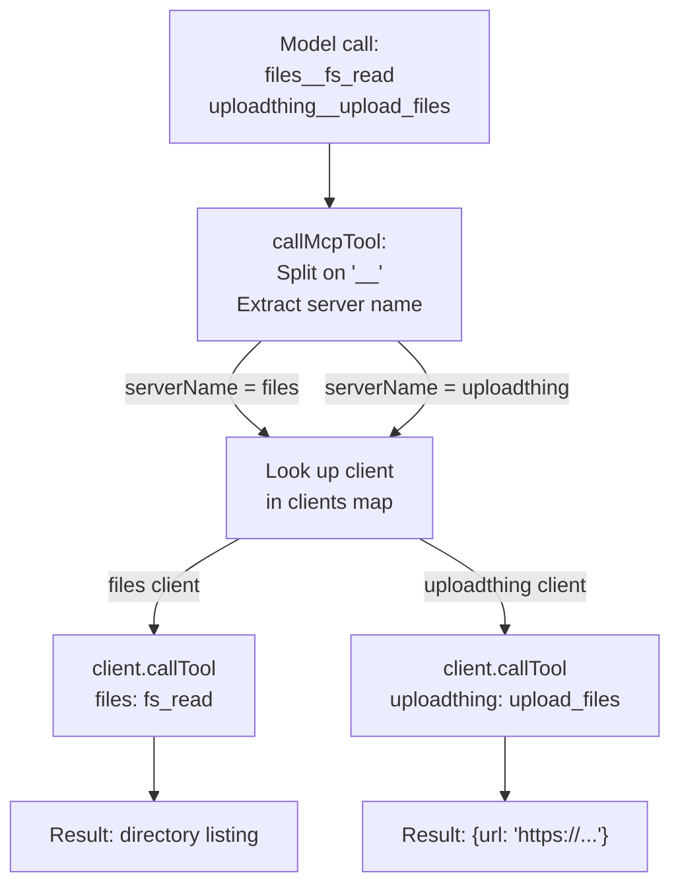
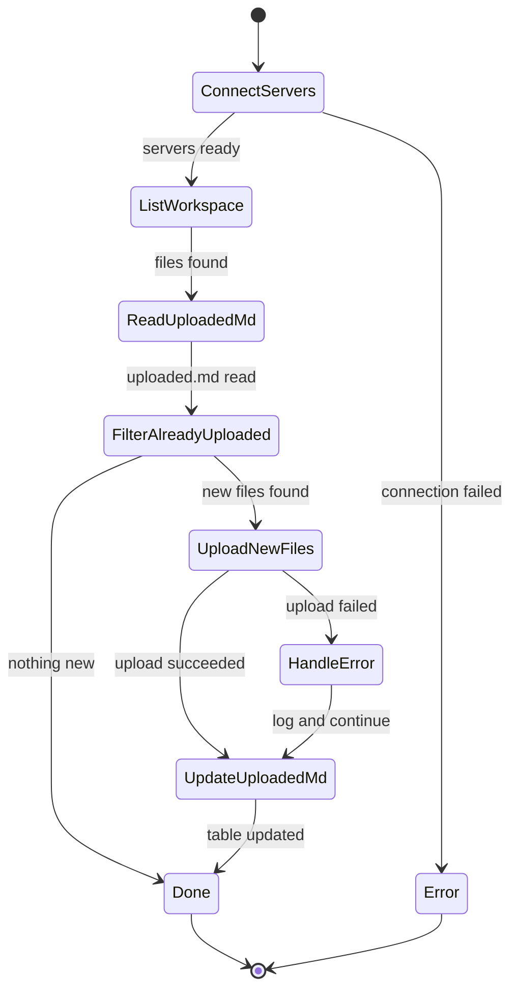

# 01_03_upload_mcp Explanation

## Overview

`01_03_upload_mcp` is an autonomous file-upload agent that bridges two MCP (Model Context Protocol) servers — one local (filesystem) and one remote (upload service) — using an LLM as the decision-making coordinator. The agent scans a `workspace/` directory, uploads any new files to a remote service, and maintains a persistent record of what has already been uploaded. It demonstrates how a single AI agent can orchestrate tools from heterogeneous sources (local process vs. remote HTTP endpoint) in a single unified loop.

---

## Purpose & Goals

**Problem it solves:** Manually uploading files and tracking their remote URLs is repetitive and error-prone. This agent automates the entire workflow: discovery, upload, deduplication, and bookkeeping.

**What it demonstrates:**
- Connecting to multiple MCP servers with different transport types (stdio and StreamableHTTP) simultaneously.
- Using prefixed tool names (`serverName__toolName`) to route LLM-requested tool calls to the correct backend.
- A `{{file:path}}` placeholder convention that lets the LLM reference binary/text files without ever reading or encoding them itself — the resolution happens in the host process just before the tool call is dispatched.
- A clean, reusable agentic loop (query → model → tool calls → results → repeat) with a configurable step ceiling.

**Who should use this:** Developers learning how to combine local and remote MCP servers in one agent session, or anyone wanting a practical pattern for LLM-driven file-upload automation.

---

## How It Works

### High-level flow

1. `app.js` starts, connects to both MCP servers, collects their tool schemas, then invokes the agent loop with a natural-language task.
2. The agent loop (`src/agent.js`) sends the conversation to the LLM (via `src/ai.js`).
3. The LLM returns either plain text (done) or one or more `function_call` items (needs more work).
4. For each tool call:
   - The raw JSON arguments are parsed.
   - Any `{{file:path}}` placeholders are resolved to base64 by `src/files/resolver.js`.
   - The (now-resolved) call is dispatched to the correct MCP server via `callMcpTool`.
5. Results are appended to the conversation and fed back to the LLM.
6. Steps 2–5 repeat until the model produces a plain-text answer or `MAX_STEPS` (50) is reached.

### Key mechanics

| Mechanism | Where | Why |
|-----------|-------|-----|
| Dual-transport MCP | `src/mcp/client.js` | Allows mixing local subprocess servers with remote HTTP servers |
| Tool name prefixing | `listAllMcpTools` | Prevents name collisions across servers; enables routing |
| `{{file:path}}` resolver | `src/files/resolver.js` | Keeps the model context small; file content is injected only when needed |
| Conversation accumulation | `src/agent.js` | Full turn history is passed on every LLM call, giving the model memory |
| `uploaded.md` as state | `workspace/uploaded.md` | Lightweight persistence — the agent reads it to detect already-uploaded files |

---

## Code Walkthrough

### `app.js` (lines 1–84) — Entry point and orchestrator

Lines 13–21 import the three top-level concerns: MCP client management, the agent runner, and logging/stats helpers.

Lines 24–42 define the task context: model choice (`gpt-5.4`), a `maxOutputTokens` ceiling (16 384), and most importantly the `instructions` string. The instructions teach the model two non-obvious patterns:
- Use `{{file:path}}` for the `base64` field — not self-read content.
- Treat `uploaded.md` as a deduplication registry and update it after each batch.

Lines 44–79 constitute `main()`:
- `createAllMcpClients()` reads `mcp.json` and connects to each server in order.
- `listAllMcpTools()` collects the advertised schemas, prefixed by server name.
- `run()` launches the agentic loop with a single seeding user message.
- `logStats()` prints token/cache usage after the run.
- The `finally` block guarantees client connections are closed regardless of success or failure.

### `src/agent.js` (lines 1–66) — The agentic loop

Lines 19–21 define the constants: `MAX_STEPS = 50` guards against infinite loops; `WORKSPACE_ROOT` pins file resolution to the local `workspace/` folder.

Lines 26–42 define `executeTool(call)`:
1. Parses raw JSON arguments from the model's `function_call`.
2. Calls `resolveFileRefs` — this is where `{{file:path}}` placeholders become real base64 strings.
3. Dispatches to the correct MCP server.
4. Returns a `function_call_output` message (success or a serialized error).

Lines 44–63 run the loop:
- Each iteration sends the full current conversation to `complete()`.
- If the response contains no `function_call` items, the text answer is extracted and returned — done.
- Otherwise, all tool calls in the response are executed in parallel (`Promise.all`), and their outputs are appended to `current` before the next iteration.

### `src/mcp/client.js` (lines 1–170) — Multi-server MCP client

Lines 26–41: `createStdioTransport` spawns a local process (`npx tsx ../mcp/files-mcp/src/index.ts`) with a controlled environment (only `PATH`, `HOME`, `NODE_ENV`, and server-specific vars are forwarded). `cwd` is set to `PROJECT_ROOT` so relative paths in the subprocess work correctly.

Lines 43–48: `createHttpTransport` validates the config then creates a `StreamableHTTPClientTransport` pointed at the remote URL. Validation happens before connection to give actionable error messages before any network call.

Lines 72–88: `createAllMcpClients` iterates `mcp.json` entries in order, connecting each. On failure, it closes already-opened clients before re-throwing — preventing connection leaks.

Lines 92–107: `listMcpTools` has a fallback path for servers that return non-standard `outputSchema` fields that fail Zod validation in the SDK. In that case it issues a raw `tools/list` request and bypasses the schema parser.

Lines 112–130: `listAllMcpTools` prefixes every tool name with `serverName__`. For example, `fs_read` from the `files` server becomes `files__fs_read`. This is the key routing convention used everywhere else.

Lines 133–150: `callMcpTool` reverses the prefix: it splits on `__`, looks up the client by server name, and calls the tool with the stripped original name.

Lines 152–159: `mcpToolsToOpenAI` converts MCP tool descriptors into the OpenAI function-call format expected by the Responses API (`type: "function"`, `name`, `description`, `parameters`).

### `src/mcp/config.js` (lines 1–79) — Configuration loading and validation

`ConfigurationError` (lines 20–25) is a named subclass of `Error`. `app.js` catches it separately to suppress the stack trace for user-facing configuration mistakes.

`validateHttpServerConfig` (lines 27–57) checks three conditions in order:
1. URL must be non-empty.
2. URL must not equal the placeholder string `https://URL_TO_YOUR_MCP_SERVER/mcp`.
3. URL must be a valid `http:` or `https:` URL.

`loadMcpConfig` (lines 73–77) reads `mcp.json` relative to the project root. Note: `config.js` exports `PROJECT_ROOT` so the agent loop can use it independently.

### `src/files/resolver.js` (lines 1–57) — `{{file:path}}` placeholder resolution

`FILE_REF_PATTERN` (line 14) is a global-flag regex that matches every `{{file:some/path}}` occurrence in a string.

`resolveInString` (lines 22–38) iterates all matches, reads each file as a `Buffer`, encodes it to base64, and replaces the placeholder in-place. Failures are logged as warnings and the placeholder is left unreplaced (the server will receive a literal `{{file:...}}` string, which will fail gracefully).

`resolveFileRefs` (lines 43–56) is the public entry point. It recursively walks the argument tree — handling strings, arrays, and objects — so placeholders nested at any depth are resolved. Primitive numbers and booleans are returned unchanged.

### `src/helpers/logger.js` (lines 1–105) — Structured terminal output

Uses raw ANSI escape codes instead of a third-party terminal-color library. Key methods:
- `box()` renders a bordered banner (used once at startup).
- `tool(name, args)` / `toolResult(name, success, detail)` produce compact summaries: for `fs_read` it shows the path and mode; for `upload_files` it shows filenames; for unknown tools it truncates the raw JSON to 80 chars.
- `api(action, historyLength)` and `apiDone(usage)` bracket each LLM call with step count and token consumption.

`summarizeArgs` and `summarizeResult` (lines 25–43) contain tool-specific display logic, making logs readable without drowning in base64.

### `src/helpers/stats.js` (lines 1–34) — Token accounting

A module-level `stats` object accumulates totals across all API calls. `recordUsage` is called inside `src/ai.js` after every successful response. `logStats` is called once at the end of `main()` and prints request count, total tokens, and prompt-cache hit rate.

### `src/files/log-details.js` (lines 1–35) — Upload/read preview logging

`logUploadDetails` decodes the base64 content of each file being uploaded and prints the first 80 characters — letting a developer confirm the right content is being sent without printing the full encoded string.

`logReadDetails` prints the first non-empty line of a file-read result, stripping the line-number prefix (`\d+|`) that the files-mcp server prepends.

### `mcp.json` — Server declarations

```json
{
  "mcpServers": {
    "files": {
      "transport": "stdio",
      "command": "npx",
      "args": ["tsx", "../mcp/files-mcp/src/index.ts"],
      "env": { "LOG_LEVEL": "info", "FS_ROOT": "./workspace" }
    },
    "uploadthing": {
      "transport": "http",
      "url": "http://localhost:3000/mcp"
    }
  }
}
```

`FS_ROOT` sandboxes the local file server to the `workspace/` directory, so the agent cannot accidentally traverse the broader filesystem. The `uploadthing` entry points to a deployed StreamableHTTP MCP server — learners must replace the URL before running.

---

## Agentic Specifics

### Autonomy level

The agent is fully autonomous once started. It decides which files need uploading, sequences the tool calls, handles partial failures, and writes back the results — all without human intervention between steps.

### Decision-making

The LLM governs the task strategy: it decides which files to process first, whether to batch uploads, and when the task is complete. The host code is entirely reactive: it executes whatever tool calls the model requests and feeds results back.

### State management

There are two forms of state:

1. **In-memory conversation history** (`current` array in `agent.js`): grows with every LLM turn and every tool result. This gives the model full context of everything that has happened in the session.
2. **Persistent file state** (`workspace/uploaded.md`): a Markdown table listing uploaded files and their remote URLs. The agent reads it at the start to determine what to skip, and writes to it at the end to record new uploads. This survives restarts.

### Tools available to the model

| Prefixed name | Origin | What it does |
|---------------|--------|--------------|
| `files__fs_read` | stdio / files-mcp | Read file contents or list a directory |
| `files__fs_write` | stdio / files-mcp | Write or append to a file |
| `files__fs_search` | stdio / files-mcp | Search for content inside files |
| `files__fs_manage` | stdio / files-mcp | Move, copy, or delete files |
| `uploadthing__upload_files` | HTTP / uploadthing | Upload base64-encoded files, returns URLs |

The actual tool schemas for the `uploadthing` server come from the remote deployment and may vary by setup.

### Loop termination

The loop ends when the model produces a response that contains zero `function_call` items (i.e., it has written its summary text). The hard limit of 50 steps prevents an infinite loop if the model gets stuck.

---

## Diagrams

### System architecture

```mermaid
graph TB
    subgraph Host["Host Process (Node.js)"]
        APP[app.js\nOrchestrator]
        AGENT[agent.js\nAgentic Loop]
        AI[ai.js\nResponses API Client]
        RESOLVER[resolver.js\n{{file:path}} resolver]
        MCPCLIENT[mcp/client.js\nMulti-server MCP Client]
    end

    subgraph LocalServer["Local MCP Server (stdio)"]
        FILES[files-mcp\nFilesystem Tools]
        WS[(workspace/\nFiles + uploaded.md)]
    end

    subgraph RemoteServer["Remote MCP Server (HTTP)"]
        UT[uploadthing\nUpload Service]
        CLOUD[(Cloud Storage\nCDN URLs)]
    end

    LLM[LLM\nOpenAI / OpenRouter]

    APP --> AGENT
    APP --> MCPCLIENT
    AGENT --> AI
    AGENT --> RESOLVER
    AGENT --> MCPCLIENT
    AI <--> LLM
    MCPCLIENT <-->|stdio| FILES
    MCPCLIENT <-->|StreamableHTTP| UT
    FILES --- WS
    UT --- CLOUD
```

### Agent loop sequence



### `{{file:path}}` placeholder resolution

```mermaid
flowchart LR
    A["LLM produces:\n{\"base64\": \"{{file:sample.txt}}\"}"]
    B[resolveFileRefs walks\nargument tree recursively]
    C[FILE_REF_PATTERN regex\nfinds all placeholders]
    D["readFile(workspace/sample.txt)\n→ Buffer → base64 string"]
    E["Resolved args:\n{\"base64\": \"VGhpcyBpcyBhIHNhbXBsZS4uLg==\"}"]
    F[callMcpTool dispatches\nto uploadthing server]

    A --> B --> C --> D --> E --> F
```

### Data flow through MCP routing



### State machine for the upload task



---

## Key Takeaways

1. **Prefixed tool namespacing is a simple but powerful routing pattern.** By prepending `serverName__` to every tool name, the system resolves the "which server does this call go to?" problem without any lookup tables or routing configuration — the name itself carries the routing information.

2. **`{{file:path}}` keeps the model context small and correct.** If the model had to read files itself (via `fs_read`) and then pass their contents to `upload_files`, those base64 strings would double-appear in the conversation, bloating context and increasing cost. The placeholder convention means file content enters the pipeline only at the moment it is needed, invisibly to the model.

3. **Transport heterogeneity (stdio vs. HTTP) is hidden behind a uniform `Client` interface.** The agent loop calls `callMcpTool(clients, name, args)` identically regardless of whether the target is a local subprocess or a remote service. This abstraction makes it straightforward to add more servers (e.g., a database MCP, a search MCP) without changing the agent logic.

4. **Persistent state in a human-readable file (`uploaded.md`) doubles as both deduplication state and output artifact.** The agent does not need a database or external state store — the markdown table is the record. This makes the state transparent, diffable, and manually editable.

5. **Graceful error handling at every boundary prevents partial failures from aborting the entire run.** `executeTool` catches tool errors and returns them as `function_call_output` messages (instead of throwing). The model receives the error description and can decide to skip, retry, or report — keeping control in the LLM rather than crashing the host process.

---

## Extensions & Variations

**Add more file types or MIME detection.** The current agent passes `type: "text/markdown"` etc. literally in the instructions. An extension could auto-detect MIME types via a library like `file-type` and inject them into the upload arguments programmatically before the resolver runs.

**Support multiple upload destinations.** The `mcp.json` pattern naturally supports adding a third server, e.g., an S3-compatible MCP or a Google Drive MCP. The agent would then have three prefixed tool namespaces and could be instructed to route different file types to different destinations.

**Scheduled or watched uploads.** Wrap the `main()` function in a filesystem watcher (e.g., `chokidar`) or a cron job. Each time a new file appears in `workspace/`, trigger a run. The `uploaded.md` deduplication ensures only genuinely new files are processed.

**Richer tracking state.** Replace the simple markdown table with a SQLite database (accessible via a SQLite MCP server) to store checksums, file sizes, upload durations, and retry counts. The agent instructions would then query the database instead of parsing a markdown table.

**Multi-step verification.** After uploading, add a verification step: the agent calls a `check_url` tool to confirm the remote URL returns a 200, and only writes to `uploaded.md` once the file is confirmed accessible. This adds resilience against partial uploads.

**Dry-run mode.** Inject a `--dry-run` flag into the instructions system prompt that tells the agent to list what it _would_ upload but skip the actual `upload_files` calls. Useful for previewing before committing uploads.
