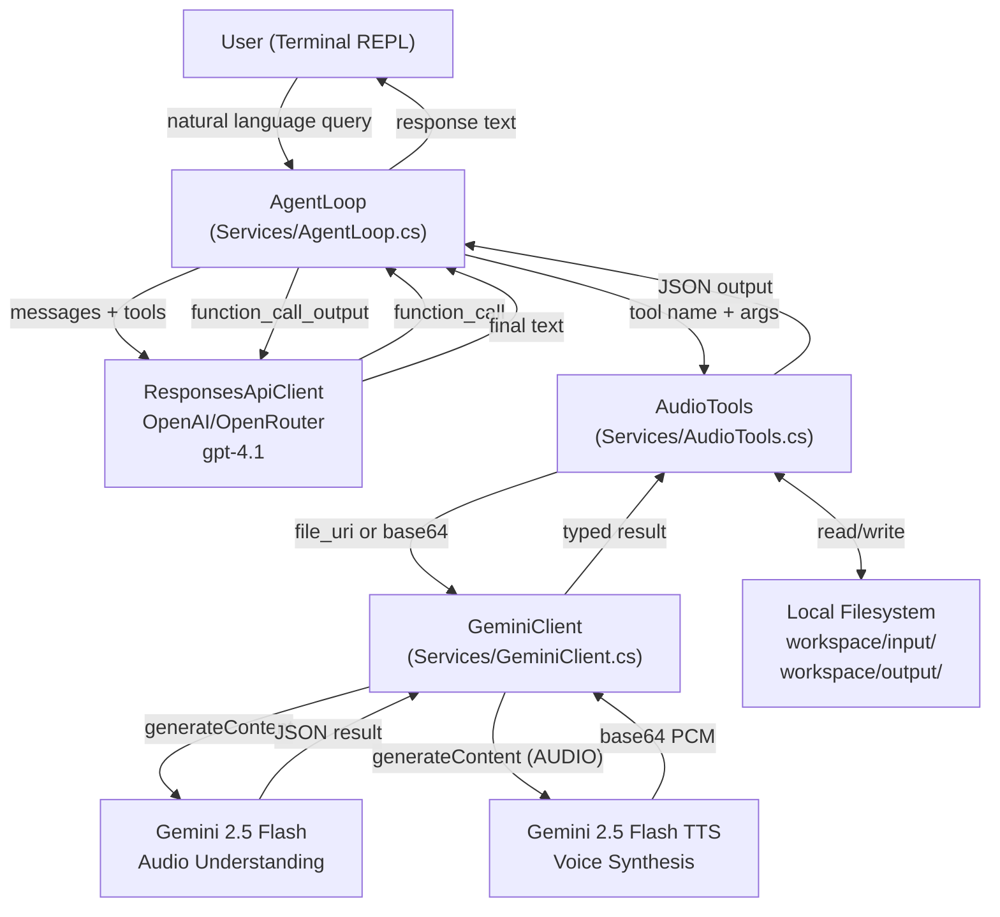
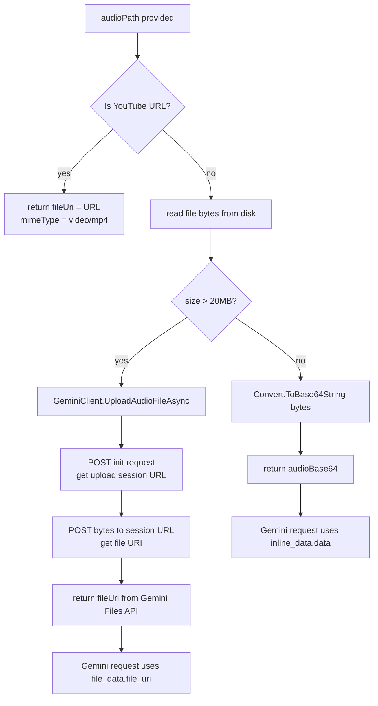
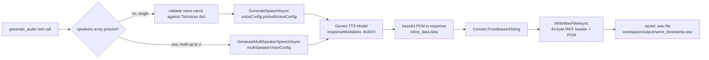
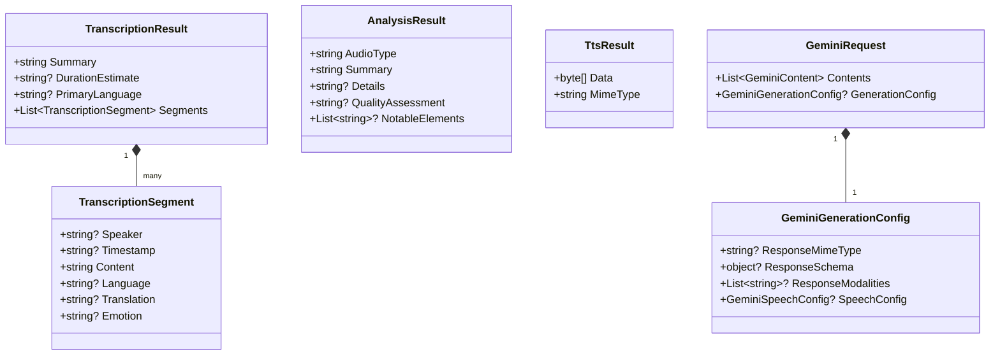

# 01_04_audio-csharp Explanation

## Overview

`01_04_audio-csharp` is a .NET 10 console application implementing an autonomous audio processing agent that uses a dual-API architecture: OpenAI's Responses API (or OpenRouter as a drop-in alternative) as the reasoning backbone, and Google's Gemini API for all actual audio intelligence. The agent runs as an interactive REPL, accepting natural language commands from the user and routing them autonomously through a multi-step tool-calling loop to transcribe speech, analyze audio content, or synthesize voice output.

## Purpose & Goals

**What problem does it solve?**
Working with audio programmatically typically requires integrating multiple specialized services and writing substantial glue code. This sample consolidates audio transcription, content analysis, and text-to-speech into a single, natural-language-driven interface — the user just describes what they want in plain English.

**What does it demonstrate?**
- How to build a tool-using agent loop (the "chat → tool call → result → repeat" cycle)
- How to use two different AI APIs in a single application with clearly separated responsibilities
- Multimodal AI integration: routing audio data as inline base64 (small files) or as a pre-uploaded URI (large files)
- Structured output extraction from LLMs using JSON schema constraints
- Proper WAV file construction from raw PCM bytes without external audio libraries
- The OpenAI Responses API format (distinct from the older Chat Completions format)

**Who should use this?**
Developers learning agentic patterns in C#, teams evaluating how to integrate audio AI capabilities into .NET applications, and anyone converting TypeScript AI agent examples to idiomatic C#.

## How It Works

The application has two parallel concerns that collaborate at runtime:

1. **The Orchestration Layer** (OpenAI/OpenRouter + GPT-4.1): Understands the user's intent, decides which tool to call and with what parameters, and synthesizes the final human-readable answer. It never directly touches audio data.

2. **The Execution Layer** (Google Gemini): Does the heavy lifting of actually understanding or generating audio. Gemini 2.5 Flash handles transcription, analysis, and custom queries; Gemini 2.5 Flash Preview TTS handles voice synthesis.

**Request lifecycle:**
1. User types a natural language message in the REPL.
2. The message is appended to conversation history and sent to GPT-4.1 (via `ResponsesApiClient`) with a system prompt and tool definitions.
3. GPT-4.1 responds with a `function_call` output item naming one of the four audio tools and providing JSON arguments.
4. `AgentLoop` executes the named tool via `AudioTools.ExecuteToolAsync`.
5. `AudioTools` loads the audio file (inline base64 or uploads via Gemini Files API if >20 MB), then calls the appropriate `GeminiClient` method.
6. The tool result (a JSON object) is appended back to the conversation and sent again to GPT-4.1.
7. If GPT-4.1 responds with a plain message instead of another function call, the loop ends and the text is printed to the user.
8. This cycle repeats up to 50 steps (`MaxSteps`).

**File size strategy:**
Files under 20 MB are read, base64-encoded, and sent inline in the Gemini request body. Files over 20 MB trigger a two-step resumable upload: first an HTTP `POST` to initialize the upload and obtain a session URL, then a second `POST` to the session URL with the raw bytes. The resulting `file_uri` is referenced in subsequent Gemini requests instead of inline data.

## Code Walkthrough

### `Program.cs` (lines 1–126) — Entry Point and REPL

The `Main` method sets up a `CancellationTokenSource` bound to `Console.CancelKeyPress` (Ctrl+C), enabling graceful shutdown without killing pending async operations.

`RunAsync` (line 49) is the wiring method: it loads configuration, instantiates all services, and starts the REPL. Notice that a single `HttpClient` instance is shared between both `GeminiClient` and `ResponsesApiClient` — appropriate here since they use different base URLs set per-request.

`RunReplAsync` (line 88) is a simple `while` loop. It reads a line, handles the built-in `exit` and `clear` meta-commands, then delegates each real query to `AgentLoop.RunAsync`. Conversation `history` (a `List<object>`) is threaded through calls to accumulate context. The `clear` command resets both history and the `UsageTracker`, giving the user a clean slate without restarting the process.

### `Configuration.cs` (lines 1–97) — Configuration and Provider Routing

Configuration is loaded using `Microsoft.Extensions.Configuration` from two sources in priority order: .NET User Secrets first, then environment variables. This means developers can store keys safely in user secrets during development without touching environment variables.

`ResolveProvider` (line 61) implements a fallback hierarchy: if `AI_PROVIDER` is explicitly set, it validates the matching key is present; otherwise it prefers OpenAI if the key exists, falling back to OpenRouter. The `GetResponsesEndpoint` and `ResolveModelForProvider` methods abstract away the provider differences — OpenRouter prepends `openai/` to GPT model names since it expects a `provider/model` slug format.

### `Services/AgentLoop.cs` (lines 1–169) — The Agent Brain

The system prompt (lines 15–90) is the most important configuration artifact. It defines the agent's identity ("autonomous audio processing agent"), enumerates the four tools with their intended use cases, describes input/output conventions, and gives explicit workflow guidance. This prompt is what teaches GPT-4.1 to reliably select the right tool rather than guessing.

`RunAsync` (line 92) implements the agentic loop. Each iteration:
- Calls `ResponsesApiClient.ChatAsync` to get the next action
- Calls `ExtractToolCalls` to check for function call items in the response output
- If no tool calls, extracts text and returns — the agent is done
- If tool calls exist, executes them all sequentially via `RunToolsAsync`, appends results, and loops

Tool errors are caught per-tool (line 158) and returned as `{"error": "..."}` JSON rather than throwing, so a single failing tool does not abort the entire agent turn.

`AgentResult` (line 169) is a simple record carrying the final text response and the full updated conversation history, enabling the REPL to maintain multi-turn context.

### `Services/AudioTools.cs` (lines 1–378) — Tool Definitions and Dispatch

`GetToolDefinitions` (line 29) builds the four OpenAI-compatible tool schemas as anonymous objects that are serialized to JSON. Notably, the `generate_audio` tool description is dynamically built at line 89, embedding all 30 available voice names directly in the description string — this approach makes the voice catalog self-documenting for the LLM without requiring a separate lookup tool.

`ExecuteToolAsync` (line 120) is the dispatch switch, mapping tool names to async handler methods.

`LoadAudioAsync` (line 304) is the shared audio loading strategy:
- YouTube URLs bypass local file loading entirely — Gemini accepts YouTube URLs natively as `fileUri`, so they are passed through as-is with a `video/mp4` MIME type
- Local files under 20 MB are returned as base64-encoded strings for inline embedding
- Local files over 20 MB are uploaded via `GeminiClient.UploadAudioFileAsync` and returned as a URI reference

`WriteWavFileAsync` (line 342) manually constructs a valid WAV file header. Gemini TTS returns raw 24 kHz, 16-bit, mono PCM data without a header. The method writes the 44-byte RIFF/WAVE/fmt/data header using `BitConverter.TryWriteBytes` into a pre-allocated byte array, then copies the PCM data after it. This approach avoids taking a dependency on an audio library for such a simple task.

### `Services/GeminiClient.cs` (lines 1–433) — Gemini API Integration

Two distinct Gemini models are used (lines 17–18):
- `gemini-2.5-flash` — for audio understanding (transcription, analysis, queries)
- `gemini-2.5-flash-preview-tts` — for audio generation (TTS)

`ProcessAudioAsync` (line 118) is the universal audio understanding method. It builds a `GeminiRequest` with a text prompt and an audio part (either `inline_data` or `file_data` depending on which parameter is non-null). When a `responseSchema` is provided, the request includes `response_mime_type: "application/json"` and the schema, instructing Gemini to return structured JSON conforming to the schema rather than free text.

`TranscribeAudioAsync` (line 183) and `AnalyzeAudioAsync` (line 201) both call `ProcessAudioAsync` with dynamically built prompts and schemas, then deserialize the structured JSON result into typed C# records (`TranscriptionResult`, `AnalysisResult`).

`BuildTranscriptionPrompt` (line 323) assembles the prompt by conditionally appending requirements based on the active options — timestamps, speaker diarization, emotion detection, translation. The corresponding `BuildTranscriptionSchema` (line 342) mirrors these conditions, only including `translation` and `emotion` fields in the schema when those features are requested. This keeps the returned JSON compact and avoids null fields cluttering the output.

`GenerateSpeechAsync` (line 217) and `GenerateMultiSpeakerSpeechAsync` (line 265) request `responseModalities: ["AUDIO"]` and configure a `speechConfig` in `generationConfig`. The multi-speaker variant uses `multiSpeakerVoiceConfig` with a list of `speakerVoiceConfigs` mapping speaker name labels to voices. Both methods decode the base64 audio from the response's `inline_data` field.

The two-step resumable upload in `UploadAudioFileAsync` (line 63) follows Google's resumable upload protocol: the first request sends metadata and receives an upload session URL in the `x-goog-upload-url` response header; the second request sends the raw bytes to that URL with `X-Goog-Upload-Command: upload, finalize`.

### `Services/ResponsesApiClient.cs` (lines 1–110) — OpenAI Responses API Client

This client targets OpenAI's newer Responses API (`/v1/responses`) rather than the Chat Completions API. The key structural difference is that `input` is a list of `object` items (not typed messages), and `output` is a list of typed items including `function_call`, `function_call_output`, and `message` types. `ExtractToolCalls` (line 76) filters `output` for `function_call` items; `ExtractText` (line 89) looks for an `output_text` top-level field first, then falls back to scanning `message` output items for `output_text` content parts.

### `Models/ApiModels.cs` and `Models/AudioModels.cs` — Strongly-Typed Contracts

`ApiModels.cs` defines the Responses API wire format using `JsonPropertyName` attributes for explicit snake_case mapping. The `ApiFunctionCall` and `ApiFunctionCallOutput` records have computed `Type` properties that return constant strings — a pattern that ensures the type discriminator is always serialized correctly without being settable.

`AudioModels.cs` defines the Gemini API request structure and the deserialization targets for structured Gemini responses. The separation between Gemini API models (request/response plumbing) and domain models (`TranscriptionResult`, `AnalysisResult`, `TtsResult`) keeps the two concerns decoupled.

### `Helpers/ConsoleLogger.cs` — Terminal UI

All console output goes through static `ConsoleLogger` methods that prepend timestamps and apply ANSI escape codes for color coding: cyan for headings and borders, green for success, red for errors, yellow for tool invocations, magenta for Gemini API calls. The distinct visual treatment for Gemini calls (`[HH:mm:ss] GEMINI ...`) versus OpenAI calls (`[HH:mm:ss] ◆ Step N ...`) makes it easy to visually trace which API is being called at each stage.

### `Helpers/UsageStats.cs` — Token Tracking

`UsageTracker` accumulates token counts across the session using simple `int` fields incremented with `+=`. It separately tracks OpenAI token usage (input/output tokens per request) and Gemini operation counts (uploads, process calls, TTS calls) since Gemini's usage is counted by operation type rather than tokens in this integration. The `Reset()` method supports the REPL's `clear` command.

## Agentic Specifics

**Autonomy level:** The agent operates with bounded autonomy. It autonomously decides which tool to invoke and how to construct arguments, but does not make irreversible decisions like deleting files. The user retains full control by framing requests.

**Decision-making:** GPT-4.1 makes all routing decisions based on the system prompt's workflow guidance. The prompt explicitly maps intent categories to tool names: transcription requests go to `transcribe_audio`, analysis to `analyze_audio`, custom questions to `query_audio`, and generation to `generate_audio`. The LLM also decides voice selection for TTS based on content mood.

**State management:** Conversation state is maintained as a `List<object>` in the REPL loop, passed into and returned from `AgentLoop.RunAsync`. This accumulates the full message history including tool call/result pairs, enabling the LLM to reason about prior steps within a session.

**Tools:**
| Tool | Purpose | Key Parameters |
|------|---------|---------------|
| `transcribe_audio` | Speech-to-text with metadata | path, timestamps, speakers, emotions, translate_to |
| `analyze_audio` | Content understanding | path, analysis_type (general/music/speech/sounds), custom_prompt |
| `query_audio` | Open-ended audio Q&A | path, question |
| `generate_audio` | Text-to-speech synthesis | text, voice, speakers[], output_name |

**Step limit:** The loop has a hard cap of 50 steps (`MaxSteps = 50`). This prevents runaway loops in case of API errors or unexpected model behavior that generates infinite tool calls.

## Diagrams

### Overall Architecture



### Agent Loop Execution Flow

```mermaid
sequenceDiagram
    participant User
    participant REPL as Program (REPL)
    participant Loop as AgentLoop
    participant GPT as ResponsesApiClient (GPT-4.1)
    participant Tools as AudioTools
    participant Gemini as GeminiClient

    User->>REPL: types query
    REPL->>Loop: RunAsync(query, history)
    Loop->>Loop: append {role:user, content:query}

    loop up to 50 steps
        Loop->>GPT: ChatAsync(messages, tools, systemPrompt)
        GPT-->>Loop: ResponsesResponse

        alt has function_call items
            Loop->>Loop: ExtractToolCalls(response)
            Loop->>Tools: ExecuteToolAsync(name, args)
            Tools->>Tools: LoadAudioAsync(path)

            alt file > 20MB
                Tools->>Gemini: UploadAudioFileAsync(bytes)
                Gemini-->>Tools: UploadedFile(fileUri)
            else file <= 20MB
                Tools->>Tools: base64 encode bytes
            end

            Tools->>Gemini: TranscribeAudio / AnalyzeAudio / ProcessAudio / GenerateSpeech
            Gemini-->>Tools: typed result
            Tools-->>Loop: JSON string
            Loop->>Loop: append function_call_output to messages
        else no tool calls (done)
            Loop->>Loop: ExtractText(response)
            Loop-->>REPL: AgentResult(text, history)
        end
    end

    REPL->>User: print Assistant: {text}
```

### Audio Loading Decision Tree



### TTS Voice Generation Path



### Data Model Hierarchy



## Key Takeaways

1. **Dual-API specialization is deliberate.** GPT-4.1 excels at instruction-following and tool selection but cannot natively process audio files. Gemini 2.5 Flash has native audio understanding. Rather than forcing one model to do everything, the design assigns each model its area of strength and uses a clean handoff at the tool boundary. This is a general pattern: use the Responses API model as the agent's "brain" and task-specific APIs as its "hands."

2. **JSON schema constraints turn free-form LLM output into reliable structured data.** Both `TranscribeAudioAsync` and `AnalyzeAudioAsync` pass a `responseSchema` to Gemini. Without this, Gemini would return a human-readable prose description. With it, the output is guaranteed to be deserializable JSON with typed fields. The schema itself is built conditionally — only requested features appear in it — keeping results compact.

3. **The 20 MB inline/upload split is a required API constraint, not a performance optimization.** Gemini's `generateContent` endpoint has a hard limit on inline data size. The code handles this transparently so callers do not need to know whether their file required upload. The abstraction is in `LoadAudioAsync`, which returns a unified `LoadedAudio` record regardless of which path was taken.

4. **The Responses API's `output` list is fundamentally different from Chat Completions.** In Chat Completions, tool calls live inside a message's `tool_calls` array. In the Responses API, `function_call` items are peers of `message` items in the top-level `output` list. Both `function_call` items and `function_call_output` items are appended directly to the flat conversation history, rather than being nested inside role-typed messages. The `ExtractToolCalls` method encapsulates this difference.

5. **WAV file construction without dependencies is straightforward.** The 44-byte RIFF/WAVE header is a well-defined binary format. Building it manually using `BitConverter.TryWriteBytes` and `Encoding.ASCII.GetBytes` avoids adding an audio library dependency for what is ultimately just prepending a fixed-layout header to raw PCM data. The constants (24000 Hz, 16-bit, mono) match what Gemini TTS always returns, making the implementation both correct and dependency-free.

## Extensions & Variations

**Add streaming TTS playback.** Currently, generated audio is written to disk before the user hears anything. Gemini TTS supports streaming responses; connecting the decoded PCM stream to a platform audio output (e.g., `NAudio` on Windows, `OpenTK.Audio.OpenAL` cross-platform) would give real-time audio feedback.

**Extend to more than 2 speakers.** The current multi-speaker TTS is capped at 2 by a guard in `GenerateAudioAsync`. If the Gemini API expands this limit, removing the guard and updating the system prompt is all that is required.

**Add a file discovery tool.** The agent currently requires the user to know and type exact file paths. Adding a `list_audio_files` tool that reads `workspace/input/` and returns available filenames would let the agent discover inputs autonomously and reference them without user-provided paths.

**Persistent conversation across sessions.** The conversation history is held in memory and lost when the process exits. Serializing `history` to a JSON file at the end of each session and reloading it on startup would provide persistent multi-session memory.

**Batch processing.** The current design processes one query at a time. Adding a `batch_transcribe` tool that iterates a directory and calls `TranscribeAudioAsync` for each file would enable bulk workflows without the user issuing one request per file.

**Replace the manual HTTP client with an official SDK.** The Google AI SDK for .NET (`Google.Ai.Generativelanguage`) and the OpenAI .NET SDK (`OpenAI`) are available and would reduce boilerplate in `GeminiClient` and `ResponsesApiClient`. The current raw HTTP approach is intentionally transparent, making the wire format visible for learning purposes.

**Add a `save_transcription` capability as a second tool call.** Currently, output saving is an optional side effect inside each tool. Separating it into its own tool (e.g., `save_output`) would give the LLM explicit control over when and how to persist results, enabling more nuanced workflows like "transcribe, summarize, then save the summary."
