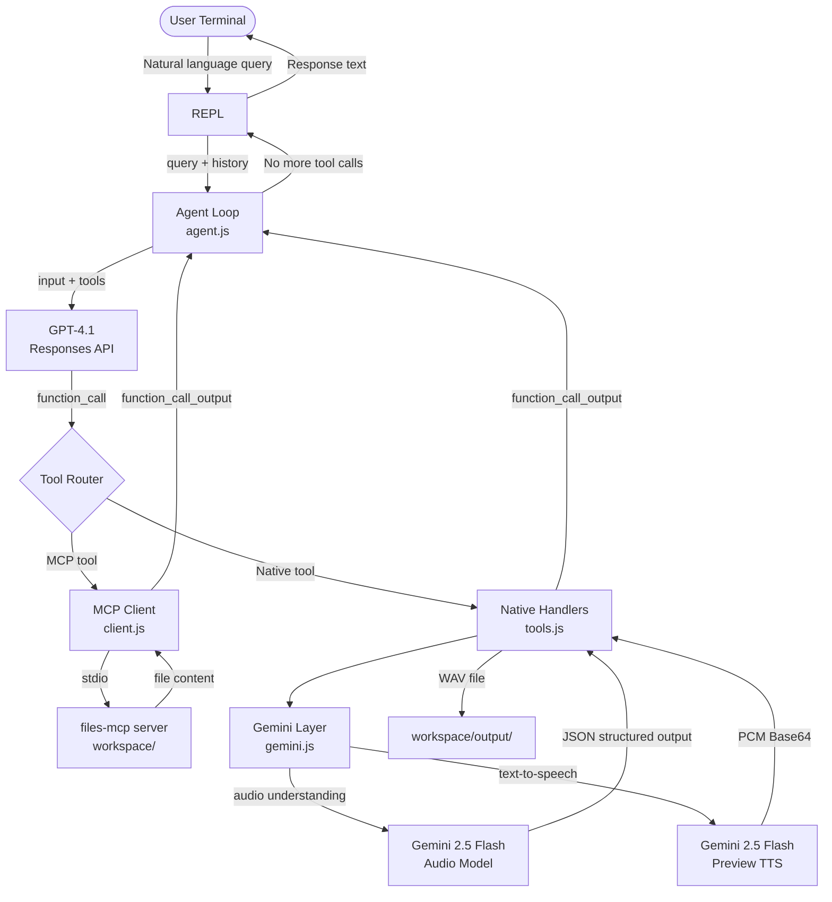
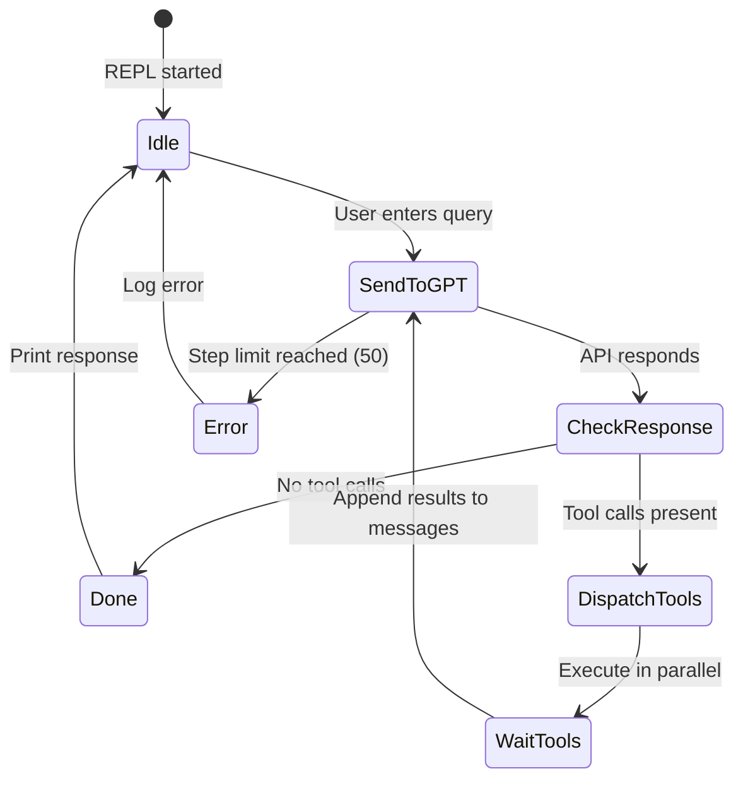
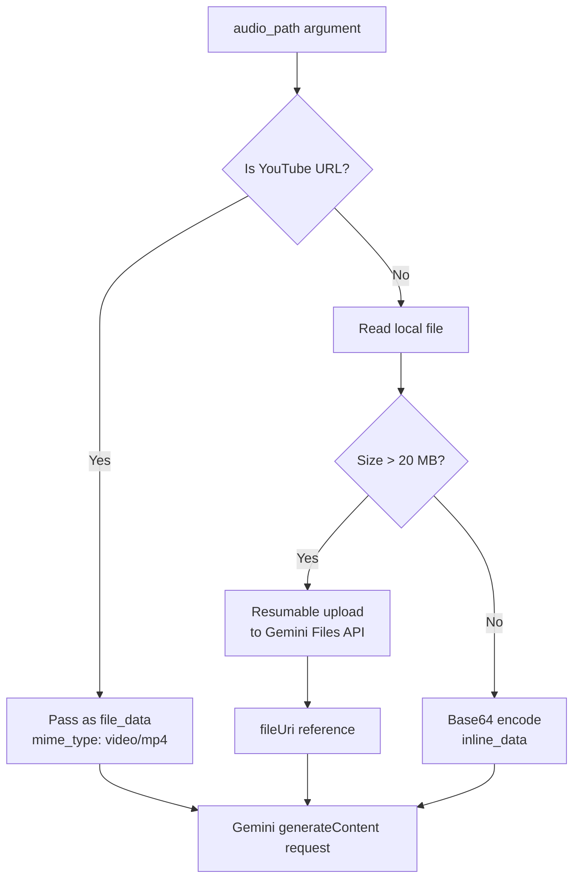
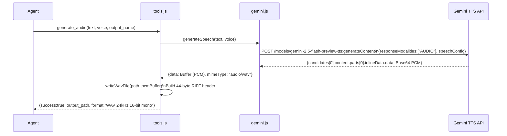
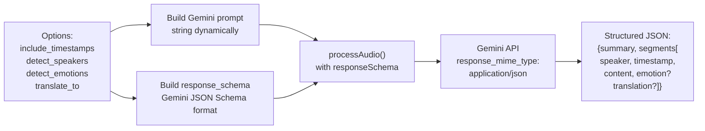

# 01_04_audio Explanation

## Overview

`01_04_audio` is an interactive, agentic audio processing system that combines a GPT-4.1 orchestrator (via the OpenAI Responses API) with Google Gemini's audio-native models to transcribe, analyze, and generate speech from a terminal REPL. The user types natural-language requests; the agent autonomously selects and chains tools until the task is complete. It illustrates how to bridge two entirely different AI providers inside a single agentic loop while using an MCP server for filesystem access.

---

## Purpose and Goals

**Problem it solves:** Working with audio files typically requires separate, purpose-built tools — one for transcription, another for TTS, another for analysis. This sample collapses all three into a single conversational interface backed by a capable AI model that decides which tool to call.

**What it demonstrates:**
- How to embed audio-understanding models (Gemini) as "native tools" inside an OpenAI Responses API agentic loop.
- The two strategies for feeding audio to a remote API: inline Base64 (small files) and the resumable upload protocol (large files).
- How to construct a valid WAV file header from raw PCM data returned by a TTS model.
- How to integrate an MCP (Model Context Protocol) server for filesystem operations, keeping file I/O out of the core agent code.
- Multi-provider architecture: GPT-4.1 handles reasoning and orchestration; Gemini handles perception and generation.

**Target audience:** Developers learning how to build multi-modal agentic systems, how to combine providers, or how to expose external AI APIs as tool functions inside an agent loop.

---

## How It Works

### High-level flow

```
User types query in REPL
    │
    ▼
Agent loop sends query + tool list to GPT-4.1 (Responses API)
    │
    ├─ GPT-4.1 calls MCP tool (file list/read/write)? → MCP server (filesystem)
    │
    └─ GPT-4.1 calls native audio tool?
           ├─ transcribe_audio  → Gemini 2.5 Flash (audio understanding)
           ├─ analyze_audio     → Gemini 2.5 Flash (audio understanding)
           ├─ query_audio       → Gemini 2.5 Flash (audio understanding)
           └─ generate_audio    → Gemini 2.5 Flash Preview TTS
                                       └─ PCM data → WAV file → workspace/output/
```

### Dual AI provider design

GPT-4.1 acts as the **reasoning layer**: it understands the user's intent, plans which tools to call, and synthesises a final response. Gemini acts as the **perception/generation layer**: it has native multimodal audio understanding and a high-quality TTS system. The two are coupled through native tool definitions — GPT-4.1 sees Gemini capabilities as ordinary JSON-schema function definitions.

### Audio input routing

Before sending audio to Gemini, the system chooses the appropriate delivery method:
- **YouTube URL** — passed directly as `file_data` with `mime_type: video/mp4`; Gemini fetches the stream itself.
- **Local file < 20 MB** — read into memory, Base64-encoded, sent as `inline_data`.
- **Local file > 20 MB** — uploaded via the Gemini Files API's two-step resumable upload protocol, then referenced by URI.

### Structured output from Gemini

For transcription and analysis, the code passes a Gemini `response_schema` (a JSON Schema in Gemini's typed format) together with `response_mime_type: "application/json"`. This forces Gemini to return machine-readable JSON rather than prose, making downstream handling deterministic.

### WAV encoding

Gemini TTS returns raw 24 kHz, 16-bit, mono PCM audio as Base64. The code manually constructs the 44-byte RIFF/WAV header before writing the file, because this audio has no container when it leaves the API.

### MCP filesystem server

File listing, reading, and writing is delegated to an MCP server (`../mcp/files-mcp`) launched as a child process over stdio. The agent translates that server's tool list into OpenAI function definitions and routes calls to it transparently. This means the agent never hard-codes file paths — it asks the MCP server what exists.

### Conversation memory

The REPL maintains a `history` array that grows with every turn. On each call to `run()`, the full history plus the new user message is sent to GPT-4.1, giving it multi-turn context. `clear` resets this array and the token counter.

---

## Code Walkthrough

### `app.js` — Startup and wiring (lines 1–46)

Imports all subsystems and runs `main()`:
1. Instantiates the MCP client and fetches its tool list.
2. Logs available native and MCP tools to the terminal.
3. Creates the readline interface for the REPL.
4. Registers SIGINT/SIGTERM shutdown handlers that print token stats and clean up.
5. Hands off to `runRepl()`.

### `src/config.js` — Configuration and system prompt (lines 1–101)

Two exports drive the entire agent:
- `api` — contains the model name, max tokens, and a detailed **system prompt** that defines the agent's identity, available resources, tool descriptions, and behaviour rules. The prompt is the main lever for tuning agent behaviour without touching code.
- `gemini` — holds API key, audio model name (`gemini-2.5-flash`), and TTS model name (`gemini-2.5-flash-preview-tts`).

`outputFolder` fixes the output path. The model is resolved through `resolveModelForProvider()` from the root `config.js`, so it works transparently whether the API key is OpenAI or OpenRouter.

### `src/api.js` — Responses API client (lines 1–69)

Thin HTTP wrapper around the OpenAI Responses API:
- `chat()` serialises a request body with `model`, `input` (the message array), optional tools, instructions, and token limits, then `POST`s to the endpoint.
- `extractToolCalls()` filters `response.output` for items where `type === "function_call"`.
- `extractText()` traverses the structured response output to find the final text, handling both the top-level `output_text` shortcut and the nested `content[].text` structure.

### `src/agent.js` — Agentic loop (lines 1–62)

The core reasoning engine:
- `run()` merges MCP and native tools into a single list, appends the user message to history, then enters a loop capped at `MAX_STEPS = 50`.
- Each iteration calls `chat()`, checks for tool calls in the response.
- If tool calls exist, they are dispatched in parallel via `Promise.all` through `runTools()`.
- `runTool()` checks `isNativeTool()` first; if true it calls `executeNativeTool()`, otherwise it delegates to `callMcpTool()`.
- Results are appended to the message array in `function_call_output` format and the loop continues.
- When GPT-4.1 returns a turn with no tool calls, the final text is extracted and the updated history is returned.

### `src/repl.js` — Interactive REPL (lines 1–39)

Simple readline loop:
- `exit` breaks the loop.
- `clear` resets `history` and token stats (allows starting a fresh conversation without restarting the process).
- Any other non-empty input is forwarded to `run()`, and the returned `conversationHistory` replaces the previous one, building up context.

### `src/mcp/client.js` — MCP integration (lines 1–95)

Reads `mcp.json` to find the server definition, spawns it as a child process over stdio using `StdioClientTransport`, and connects the SDK `Client`. Three helper functions:
- `listMcpTools()` — retrieves the server's tool manifest.
- `callMcpTool()` — calls a named tool and parses the text response as JSON when possible.
- `mcpToolsToOpenAI()` — converts MCP's `inputSchema` format into OpenAI's `{ type: "function", name, description, parameters }` shape. Note `strict: false` because MCP schemas may use features OpenAI strict mode forbids.

### `src/native/tools.js` — Tool definitions and handlers (lines 1–480)

Four native tools are defined in two parallel data structures:

**`nativeTools` array** — JSON schema definitions for GPT-4.1. Each tool has a `name`, `description` (including the voice list generated dynamically from `TTS_VOICES`), and a `parameters` object with `required` fields.

**`nativeHandlers` object** — The actual implementations, keyed by tool name:

- `transcribe_audio` — calls `loadAudio()` for delivery strategy selection, then `transcribeAudio()` from `gemini.js`. Optionally writes JSON to `workspace/output/` with a millisecond timestamp in the filename.
- `analyze_audio` — same pattern, calls `analyzeAudio()`. The `analysis_type` enum switches the Gemini prompt.
- `query_audio` — calls `processAudio()` directly with the user's raw question.
- `generate_audio` — branches on whether `speakers` is populated. If so, calls `generateMultiSpeakerSpeech()`; otherwise validates the voice name against `TTS_VOICES` and calls `generateSpeech()`. The returned PCM buffer is written as a WAV file via `writeWavFile()`.

`loadAudio()` (lines 110–131) is the routing function: YouTube URL → URI passthrough, small file → Base64 inline, large file → upload API.

`writeWavFile()` (lines 71–103) manually constructs the RIFF/WAVE header: 4-byte chunk IDs, little-endian 32-bit integers for sizes and sample rates, 16-bit integers for format and channel counts, followed by the raw PCM data.

### `src/native/gemini.js` — Gemini API layer (lines 1–511)

Direct REST client for Gemini, no official SDK:

- **`TTS_VOICES`** (lines 18–49) — a dictionary of 30 voice names mapped to style descriptors. This is the source of truth used in both the tool description and voice validation.
- **`uploadAudioFile()`** (lines 60–119) — two-phase resumable upload: first POST initialises the session and returns an `x-goog-upload-url`; second POST sends the actual bytes with `X-Goog-Upload-Command: upload, finalize`.
- **`processAudio()`** (lines 132–203) — the central Gemini request function. Constructs a `contents[parts]` payload with the text prompt and either `file_data` (for URI references) or `inline_data` (for Base64). Attaches `generation_config` with JSON schema when `responseSchema` is given.
- **`transcribeAudio()`** (lines 218–293) — builds the prompt dynamically based on flags (timestamps, speaker detection, emotion, translation), constructs a matching Gemini response schema, and delegates to `processAudio()`.
- **`analyzeAudio()`** (lines 306–385) — four built-in prompt templates (`general`, `music`, `speech`, `sounds`) with a common output schema; `customPrompt` overrides any of them.
- **`generateSpeech()`** (lines 399–446) — calls `TTS_ENDPOINT` with `responseModalities: ["AUDIO"]` and a `speechConfig.voiceConfig` block; decodes the Base64 PCM from the response.
- **`generateMultiSpeakerSpeech()`** (lines 456–511) — same structure but uses `multiSpeakerVoiceConfig.speakerVoiceConfigs` — an array of `{ speaker, voiceConfig }` objects — to assign distinct voices to labelled speakers in the text.

### `src/helpers/` — Supporting utilities

- **`logger.js`** — ANSI-coloured terminal logger. Different log levels have distinct icons and colours: cyan for start/boxes, yellow lightning bolt for tool calls, magenta badge for Gemini calls, green checkmarks for success, red X for errors.
- **`stats.js`** — in-memory counters for OpenAI token usage and Gemini call types (generations, edits, analyses). Printed on shutdown.
- **`shutdown.js`** — one-shot SIGINT/SIGTERM handler with a `shuttingDown` guard to prevent double-execution.

---

## Agentic Specifics

### Autonomy and decision-making

GPT-4.1 is fully autonomous within a single user turn. The system prompt establishes a clear decision tree: is the request about transcription, analysis, generation, or a custom question? The model picks the matching tool without further user input. For tasks that require knowing what files are available, the model will proactively call the MCP `list` tool before acting.

### State management

Conversation state is kept as a plain JavaScript array (`history`) in the REPL closure. Each message object follows the OpenAI Responses API format. Tool call outputs are inserted into the same array as `function_call_output` items alongside the model's `function_call` items, giving the model full replay of its own actions on the next turn.

### Tool routing

The agent maintains two disjoint tool namespaces — MCP tools and native tools — unified at call time by `isNativeTool()`. MCP tools are file-system focused (list, read, write, search). Native tools are model-capability focused (audio I/O). The orchestration layer (`agent.js`) does not need to know the implementation details of either.

### Loop termination

The loop terminates when GPT-4.1 produces a turn with zero `function_call` items. The safety cap of 50 steps prevents infinite loops from a misbehaving model or circular tool calls.

### Error handling

Every native tool handler wraps its body in `try/catch` and returns `{ success: false, error: message }` rather than throwing. This means the agent loop continues — GPT-4.1 sees the error as a tool result and can decide to retry, report the error to the user, or try an alternative approach.

---

## Diagrams

### System architecture



### Agentic loop state machine



### Audio input decision tree



### TTS data pipeline



### Transcription structured output flow



---

## Key Takeaways

1. **GPT-4.1 as orchestrator, Gemini as specialist.** The separation between reasoning (OpenAI) and audio perception/generation (Gemini) is clean and practical. Each provider does what it does best. The native tool abstraction is the bridge that makes this composable without coupling the two APIs directly.

2. **Structured output is essential for reliable tool results.** Rather than asking Gemini for a prose transcription and parsing it, the code passes a typed `response_schema`. This turns non-deterministic natural language into a predictable data structure the agent loop can consume reliably.

3. **Inline vs upload is a genuine API constraint, not just an optimisation.** The Gemini API has a hard 20 MB inline limit. The two-step resumable upload protocol is not optional for large files. The routing logic in `loadAudio()` makes this invisible to callers.

4. **WAV headers are not magic.** The RIFF/WAVE format is a simple binary structure: a fixed 44-byte header followed by raw PCM samples. When an API returns raw PCM, you must add this header yourself. Understanding the format (sample rate, bit depth, channel count) is necessary to produce a valid file.

5. **MCP server for filesystem keeps the agent code clean.** The agent never contains `fs.readdir` or `fs.readFile` calls. All workspace I/O flows through the MCP protocol, which means the tool boundary is well-defined and could be swapped out (e.g., for a remote storage MCP server) without touching agent logic.

---

## Extensions and Variations

**Add more audio models.** The Gemini layer in `gemini.js` can be extended to support Whisper (OpenAI) for transcription as a fallback, or ElevenLabs (already in `package.json` as a dependency) for higher-quality TTS voices with cloning capabilities.

**Persist conversation across sessions.** Replace the in-memory `history` array in `repl.js` with serialisation to a JSON file. On startup, check for an existing session file and reload it, giving the agent long-term memory about files already processed.

**Batch processing mode.** Add a non-interactive `--batch` flag to `app.js` that reads a list of audio files and a processing instruction from a JSON file, runs the agent loop for each, and writes structured results without human interaction.

**Add ElevenLabs TTS.** The `@elevenlabs/elevenlabs-js` package is already installed. A new `generate_audio_elevenlabs` native tool could use ElevenLabs' voice cloning or higher-fidelity synthesis as an alternative to Gemini TTS, letting the orchestrator choose based on quality requirements.

**Streaming TTS playback.** Instead of writing a file and returning a path, the TTS tool could stream audio directly to `stdout` (or a named pipe) and pipe it into a local audio player (`aplay`, `afplay`), enabling real-time voice output.

**Upload-and-reuse pattern.** For workflows where the same large audio file is processed multiple times (transcribe, then analyze, then query), upload it once to the Gemini Files API and store the returned `fileUri` in the conversation state. Pass the cached URI on subsequent calls to avoid re-uploading.

**Add speaker embedding / diarization refinement.** The transcription schema already has a `speaker` field, but Gemini assigns generic labels. A post-processing step could use fuzzy matching to consolidate names mentioned in the transcript content back into the speaker labels (e.g., "the speaker introduces himself as Alex" → rename Speaker 1 to Alex).
