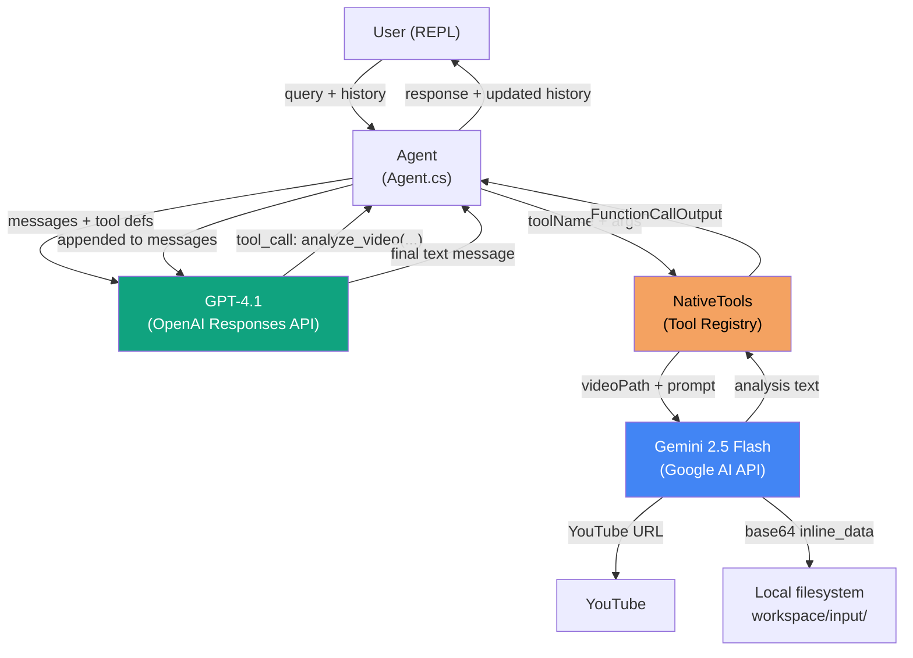
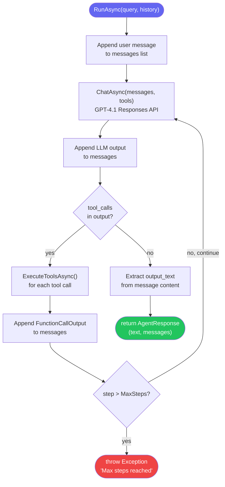
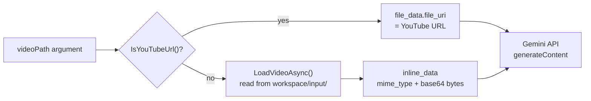
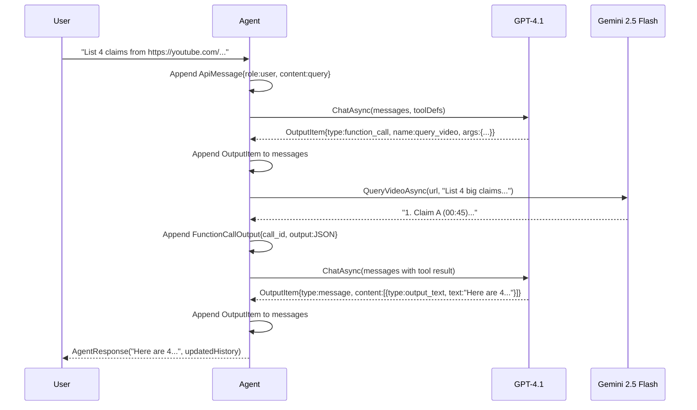

# 01_04_video-csharp Explanation

## Overview

`01_04_video-csharp` is a .NET 10 console application implementing a **dual-AI video processing agent**. It combines OpenAI GPT-4.1 (for reasoning and orchestration) with Google Gemini 2.5 Flash (for multimodal video understanding) to let a user ask natural-language questions about videos — both local files and YouTube URLs — through an interactive REPL interface.

The project is a direct C# port of the original `01_04_video` JavaScript/TypeScript example, demonstrating how the same agentic patterns transfer across languages and runtimes.

---

## Purpose & Goals

### Problem it solves
Video content is opaque to text-based LLMs. You cannot paste a video into ChatGPT. This agent bridges that gap by routing video-specific tasks to a model that natively understands video (Gemini), while keeping the conversational reasoning layer on a powerful general-purpose LLM (GPT-4.1).

### What it demonstrates
- **Multi-model coordination**: using the right model for each subtask rather than forcing one model to do everything
- **Tool-augmented agents**: how function-calling (the OpenAI Responses API) enables an LLM to invoke side-effectful operations
- **Agentic loops with step limits**: a bounded ReAct-style loop (Reason → Act → Observe) with a hard cap on iterations
- **Dual input modalities**: transparent handling of YouTube URLs (native Gemini support) vs. local video files (base64 inline upload)
- **Minimal dependency footprint**: only `Microsoft.Extensions.Configuration` is required; HTTP is handled with the built-in `HttpClient`

### Who should use it
Developers learning to build production-grade agentic systems in C#/.NET, or anyone wanting a reference implementation of a multi-model AI pipeline with tool use, conversation history management, and token tracking.

---

## How It Works

The system has two independent AI backends that cooperate through the agent loop:

1. **Orchestrator (OpenAI GPT-4.1)**: Receives the user's natural-language query along with the full conversation history. Decides *whether* and *how* to call video tools. Synthesizes tool outputs into a final answer.

2. **Video Processor (Google Gemini 2.5 Flash)**: A pure vision/audio model invoked only when the orchestrator calls a tool. It never "sees" the conversation — it only receives a video and a focused prompt.

### Execution flow

```
User query
    └─> Agent.RunAsync()
            └─> [Loop up to 50 steps]
                    ├─> ResponsesApiClient.ChatAsync()   <-- GPT-4.1 decides
                    │       └─> If tool_call in output:
                    │               └─> NativeTools.ExecuteAsync()
                    │                       └─> GeminiVideoService.*Async()  <-- Gemini processes video
                    │                               └─> result appended to messages
                    └─> If no tool_call: return final text response
```

### Conversation state

The entire conversation is stored as a flat `List<object>` passed in and out of `Agent.RunAsync()`. Each turn appends:
- The user's `ApiMessage`
- All `OutputItem` objects from the LLM response (including function call declarations)
- All `FunctionCallOutput` objects (the tool results)

This makes the history a complete replay log that can be inspected, saved, or resumed.

---

## Code Walkthrough

### `Program.cs` — Entry point and REPL (lines 1–96)

The entry point wires together the application and runs the interactive loop.

- **Lines 11–14**: Configuration is loaded from .NET User Secrets first, then environment variables. This is the correct precedence for local development — secrets stay off disk and out of source control.
- **Lines 16–29**: Mandatory key validation with early exit. Both an OpenAI/OpenRouter key and a Gemini key are required because the architecture genuinely needs both models.
- **Lines 31–42**: Dependency injection is done manually (no DI container): `Configuration` → `ResponsesApiClient` + `GeminiVideoService` → `Agent`. Each component receives only what it needs.
- **Lines 61–94**: The REPL loop maintains a `List<object> conversation` that accumulates the full message history across turns. The `clear` command resets both history and `StatsTracker`, simulating a fresh session.

### `Agent.cs` — Agentic loop (lines 1–108)

The heart of the system. This is a classic **ReAct loop** (Reason, Act, Observe).

- **Line 7**: `MaxSteps = 50` is the safety valve. Without it, a misbehaving LLM could loop forever, burning tokens and time.
- **Lines 19–20**: `NativeTools.Initialize(videoService)` injects the video service into the static tool registry before each `RunAsync` call. This is a lightweight alternative to proper DI for a single-service tool set.
- **Lines 26–64**: The loop sends messages to the LLM, then branches on the response:
  - **Tool call present** (lines 41–62): All tool calls are executed, their results appended to messages, and the loop continues — the LLM will now see the tool results and reason again.
  - **No tool call** (lines 45–56): The LLM has produced a final answer. The text is extracted from the `output_text` content part and returned.
- **Lines 67–105**: `ExecuteToolsAsync` iterates tool calls sequentially (not in parallel). Errors are caught per-tool and returned as `{ error: "..." }` JSON so the LLM can reason about failures rather than crashing.

### `GeminiVideoService.cs` — Gemini video backend (lines 1–200)

This class encapsulates all interaction with the Gemini API.

- **Lines 23–33**: `AnalyzeVideoAsync` maps an `analysisType` string to a carefully engineered system prompt. Each prompt variant (general, visual, audio, action) requests timestamps in `MM:SS` format — a concrete output constraint that makes results structurally consistent.
- **Lines 35–48**: `TranscribeVideoAsync` builds its prompt dynamically from boolean flags. Speaker detection and timestamps are opt-in rather than always-on, giving callers fine-grained control.
- **Lines 76–134**: `ProcessVideoAsync` is the single HTTP entry point to Gemini. The critical branch at line 85:
  - **YouTube URL** → passes `file_data.file_uri` directly. Gemini fetches the video itself; no bytes flow through the application.
  - **Local file** → reads the file from `workspace/input/`, base64-encodes it, and sends it as `inline_data`. For large videos this can be slow and memory-heavy.
- **Lines 111–134**: The Gemini request is a multipart `contents` array: first the video part, then a text prompt part. The API key is sent as an `x-goog-api-key` header (not `Authorization: Bearer`), which differs from OpenAI's convention.
- **Lines 136–145**: `LoadVideoAsync` resolves paths relative to `workspace/input/`. This is a deliberate sandbox — the agent cannot be instructed to read arbitrary files outside that directory.

### `NativeTools.cs` — Tool registry and dispatcher (lines 1–184)

Defines the tool interface that the orchestrator LLM "sees" and dispatches execution.

- **Lines 15–87**: `Definitions` is a list of `ToolDefinition` objects whose `Parameters` property uses anonymous C# objects to produce valid JSON Schema. The `@enum` syntax (line 29) uses the verbatim identifier prefix because `enum` is a C# keyword.
- **Lines 89–109**: `ExecuteAsync` is a dispatcher with a `switch` expression. Each branch delegates to a typed private method that extracts and validates its specific arguments.
- **Lines 111–161**: Each `Execute*Async` method returns an anonymous object (not a string). The caller in `Agent.cs` serializes it to JSON and wraps it in `FunctionCallOutput`. This round-trip means the LLM receives structured JSON, not a raw string, which aids reasoning.
- **Lines 164–183**: Helper methods (`GetRequiredString`, `GetString`, `GetBool`) handle the mismatch between JSON deserialization (`Dictionary<string, object?>`) and typed C# — a common friction point when working with dynamic JSON payloads.

### `ResponsesApiClient.cs` — OpenAI Responses API client (lines 1–148)

Wraps the OpenAI `/v1/responses` endpoint (not the older `/v1/chat/completions`).

- **Lines 21–32**: The request body uses `input` (not `messages`) and `max_output_tokens` — these are Responses API conventions, distinct from the Chat Completions API. Tools are included only when the list is non-empty (line 27).
- **Lines 51–57**: Every successful response feeds `StatsTracker.Record()`, accumulating input/output token counts across the session.
- **Lines 65–148**: The data models use explicit `[JsonPropertyName]` attributes rather than relying on naming policy, because the Responses API output shape has mixed conventions (`call_id`, `output_text`, `function_call`).

### `Configuration.cs` — Typed configuration (lines 1–30)

A sealed record-like class that translates raw string settings into typed API parameters.

- **Lines 13–25**: `ApiKey` and `ApiEndpoint` are computed properties using switch expressions that select the correct value based on `AiProvider`. This makes provider switching a one-variable change (`AI_PROVIDER=openrouter`) with no code changes.
- **Lines 27–29**: Model names and token limits are hardcoded constants. In production you would surface these as configurable settings.

### `ConsoleLogger.cs` — Terminal UI (lines 1–43)

A static utility class for styled terminal output using ANSI escape codes.

- The `Gemini` method (lines 29–33) prints a distinct magenta badge, making Gemini calls visually distinguishable from agent steps — useful when debugging multi-step interactions.
- The `Box` method (lines 36–42) draws a dynamic-width border, adapting to the title length up to a minimum of 40 characters.

### `UsageStats.cs` — Token tracking (lines 1–39)

A global singleton (`StatsTracker`) accumulates request counts and token usage. The `Reset()` method is called when the user types `clear`, keeping stats aligned with the active conversation context.

---

## Agentic Specifics

### Autonomy level
This is a **supervised reactive agent**. The user provides a goal; the agent autonomously decides which tools to invoke and in what order. The user sees only the final answer, not the intermediate tool calls (though `ConsoleLogger` prints them to the terminal).

### Decision-making
The orchestrator (GPT-4.1) decides:
1. Whether the user's query requires video analysis
2. Which of the four tools best matches the intent (`analyze_video`, `transcribe_video`, `extract_video`, `query_video`)
3. What arguments to pass (e.g., `analysis_type="audio"` vs `"visual"`)
4. Whether tool output is sufficient to answer, or whether additional tool calls are needed
5. How to synthesize one or more tool results into a coherent final answer

### State management
State lives entirely in the `List<object> conversation` list in `Program.cs`. The agent itself is stateless — `Agent.RunAsync` takes the history as input and returns it as output. This makes the agent trivially restartable and testable with any snapshot of the conversation.

### Tool execution model
Tools are executed **sequentially** in the order the LLM specifies them. There is no parallel execution of tool calls within a single step. This simplifies error handling and maintains causal order in the conversation history.

### Error handling strategy
Tool errors are **soft-absorbed**: they become JSON `{ "error": "..." }` messages in the conversation. The LLM can then reason about the error (e.g., "the file was not found, please check the path") rather than the application crashing. Only truly unrecoverable exceptions (network failures, auth errors) bubble up to the REPL's try/catch.

---

## Diagrams

### System architecture



### Agentic loop (ReAct pattern)



### Video input routing



### Data model: message flow through the conversation list



---

## Key Takeaways

1. **Separation of concerns by model capability**: The architecture cleanly separates *language reasoning* (GPT-4.1) from *video understanding* (Gemini). Each model is used where it excels, rather than forcing one model to handle both domains. This is a generalizable pattern: identify what each model does best, then wire them together through an agent.

2. **The Responses API vs Chat Completions API**: The code uses OpenAI's newer `/v1/responses` endpoint (note `input` instead of `messages`, and `output` instead of `choices`). This API is stateful-compatible and designed for agentic use cases. The `OutputItem` model reflects its richer output type system (`function_call`, `message`, `function_call_output`).

3. **Conversation history as the source of truth**: There is no separate state object. The entire agent state is the conversation list. Resetting it (`clear` command) is equivalent to starting a new session. This design makes the agent easy to serialize, debug, and test — any list snapshot is a reproducible starting point.

4. **Soft error handling keeps the agent alive**: Tool failures are reported back to the LLM as structured error JSON rather than crashing the application. This allows the model to self-correct (retry with different arguments, ask the user for clarification) instead of requiring human intervention for every error.

5. **YouTube URL passthrough eliminates download overhead**: For YouTube videos, no bytes flow through the application — the URL is passed directly to Gemini which fetches the video itself. This makes it trivial to analyze even long videos (hours) that would be impractical to download and base64-encode inline.

---

## Extensions & Variations

### Add parallel tool execution
`ExecuteToolsAsync` currently runs tools sequentially. For multi-tool calls in a single step, replace the `foreach` with `Task.WhenAll` to run them concurrently. This requires thread-safe logging but can significantly reduce wall-clock time for multi-video queries.

### Persist conversation history
Replace the in-memory `List<object>` with a JSON file or SQLite backing store. Since the list is already serializable (it contains only records with `[JsonPropertyName]` attributes), this is a minimal change that enables resumable sessions.

### Add a `save_report` tool
Expose a native tool that writes the LLM's analysis to `workspace/output/{filename}.md`. The agent can then autonomously save structured reports when it judges the content worth preserving — no user intervention required.

### Stream responses
The current implementation collects the full response before processing. Switch to `HttpCompletionOption.ResponseHeadersRead` and stream the JSON to display partial responses token-by-token in the REPL, dramatically improving perceived latency for long analyses.

### Support multiple video inputs in one query
Currently each tool call processes one video. Add a `video_paths: string[]` parameter variant to `analyze_video` that runs `Task.WhenAll` across multiple Gemini calls, then returns a merged analysis. This enables cross-video comparison queries.

### Replace static `NativeTools` with a plugin pattern
The static `_videoService` field in `NativeTools.cs` is a simple solution but prevents multiple agents from running with different video services. Refactor to a `IToolRegistry` interface with an `IVideoService` dependency injected via constructor, enabling proper unit testing and multi-tenant scenarios.

### Add OpenRouter model fallback
`Configuration.cs` already supports the `openrouter` provider. Extend it to specify an alternative model (e.g., `claude-opus-4`) via `OPENROUTER_MODEL` environment variable, enabling cost/capability tradeoffs without code changes.
