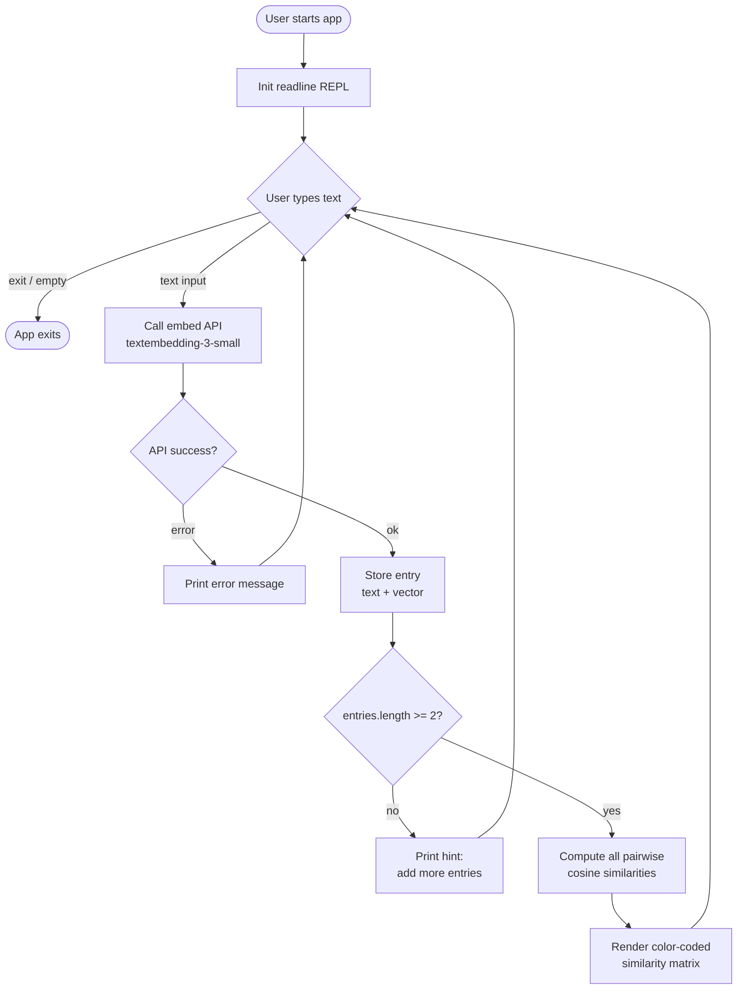
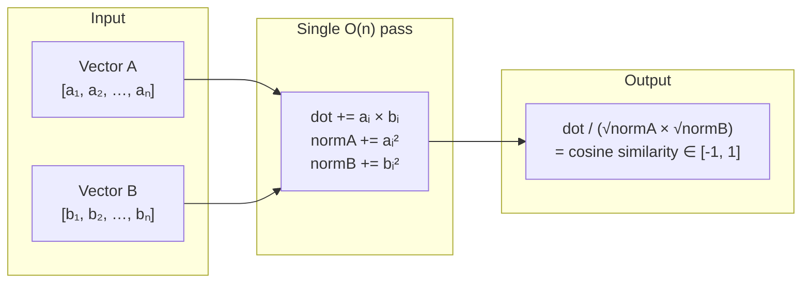
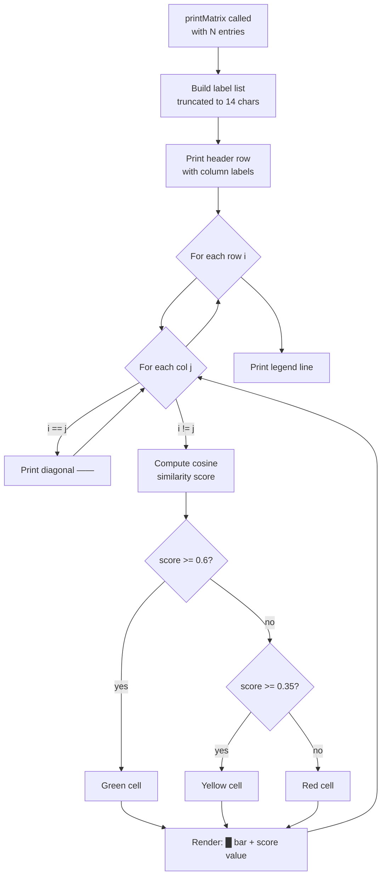

# 02_02_embedding Explanation

## Overview

This sample is an interactive command-line tool that converts natural-language text into vector embeddings using the OpenAI `text-embedding-3-small` model, then computes and displays a live, color-coded pairwise cosine-similarity matrix in the terminal. Each time the user types a new phrase, the matrix is recalculated and re-printed, making semantic relationships between all entered texts immediately visible. The tool supports both the OpenAI and OpenRouter APIs through a shared provider-abstraction layer.

---

## Purpose & Goals

**Problem solved:** Understanding how embedding models "think" about text similarity is abstract and hard to develop intuition for. This demo makes that intuition concrete and interactive — you can type a few sentences and immediately see a quantitative measure of how semantically close they are to each other.

**What it demonstrates:**
- How to call an embedding API and interpret its response (a vector of floating-point numbers).
- How to compute cosine similarity between two high-dimensional vectors from scratch (no library needed).
- How to present multi-dimensional similarity data in a human-readable matrix layout, complete with terminal colors and Unicode block characters as a visual bar.
- How to build a live REPL loop around an async API without polling or complex state management.

**Who should use this:**
- Developers learning about semantic search, RAG (Retrieval-Augmented Generation), or recommendation systems who want to build intuition about embedding spaces.
- Engineers experimenting with choosing the right embedding model or threshold values for downstream classification tasks.

---

## How It Works

### High-level flow

1. The user starts the app, which opens an interactive readline prompt.
2. For each text entered, the app calls the embeddings API endpoint and receives a dense numeric vector (e.g., 1,536 dimensions for `text-embedding-3-small`).
3. The vector is stored alongside the original text string.
4. Whenever two or more entries exist, all pairwise cosine-similarity scores are computed in memory (no external math library) and rendered as a symmetric matrix.
5. The matrix is color-coded by similarity thresholds (green / yellow / red) and rows include a block-character bar proportional to the score.
6. The loop continues until the user types `exit` or submits an empty line.

### Key components

| Component | File | Role |
|---|---|---|
| REPL loop | `app.js` (lines 115-151) | Drives the interactive session |
| `embed()` | `app.js` (lines 30-45) | Single-responsibility API call; returns a raw float array |
| `cosineSimilarity()` | `app.js` (lines 49-61) | Pure math function; computes the dot product and norms manually |
| `printMatrix()` | `app.js` (lines 79-111) | Renders the full pairwise matrix to stdout with ANSI coloring |
| `preview()` | `app.js` (lines 65-69) | Compact one-line embedding summary for immediate feedback |
| Shared config | `../config.js` | Provider selection, API key resolution, endpoint routing |

### Why cosine similarity?

Cosine similarity measures the angle between two vectors, ignoring their magnitude. This is the right metric for embeddings because embedding models encode semantic meaning in the direction of a vector, not its length. Two texts can have very different vector magnitudes and still point in the same semantic "direction." A score near 1.0 means nearly identical meaning; near 0 means unrelated; negative values (rare with embeddings) mean contrast or opposition.

### Color thresholds

| Score range | Color | Interpretation |
|---|---|---|
| >= 0.60 | Green | Semantically similar — likely same topic or close paraphrase |
| >= 0.35 | Yellow | Related — share some concepts or domain |
| < 0.35 | Red | Distant — different topics or domains |

These thresholds are chosen empirically for `text-embedding-3-small` and make a good starting point for real-world classification tasks.

---

## Code Walkthrough

### Lines 1-10: Module header and model resolution

```js
import { AI_API_KEY, EMBEDDINGS_API_ENDPOINT, EXTRA_API_HEADERS, resolveModelForProvider } from "../config.js";
const MODEL = resolveModelForProvider("text-embedding-3-small");
```

`resolveModelForProvider` is called at module load time. When the active provider is OpenRouter, it prepends `openai/` to the model name (producing `openai/text-embedding-3-small`), because OpenRouter uses namespaced model IDs. When using OpenAI directly, the model name passes through unchanged. This one call is all the provider-specific branching the app ever needs to do.

### Lines 14-26: Terminal color helpers

```js
const c = { reset, dim, bold, green, yellow, red, cyan, bg };
const colorFor = (score) =>
  score >= 0.6 ? c.green : score >= 0.35 ? c.yellow : c.red;
```

All ANSI escape sequences are collected into a single object `c` so the rest of the code never embeds raw escape strings inline. `colorFor` encodes the similarity threshold decision in one place, making it trivial to tune.

### Lines 30-45: `embed()` — the API call

```js
const embed = async (text) => {
  const response = await fetch(EMBEDDINGS_API_ENDPOINT, {
    method: "POST",
    headers: { "Content-Type": "application/json", Authorization: `Bearer ${AI_API_KEY}`, ...EXTRA_API_HEADERS },
    body: JSON.stringify({ model: MODEL, input: text }),
  });
  const data = await response.json();
  if (data.error) throw new Error(data.error.message ?? JSON.stringify(data.error));
  return data.data[0].embedding;
};
```

This is intentionally minimal — one function, one responsibility. It uses the native `fetch` API (available in Node.js 18+), sends the standard OpenAI-compatible request body, and extracts `data.data[0].embedding` — a plain JavaScript array of numbers. Error propagation is explicit: if the API returns an error object, the function throws with a human-readable message that the REPL loop will catch and print.

### Lines 49-61: `cosineSimilarity()` — pure math, no dependencies

```js
const cosineSimilarity = (a, b) => {
  let dot = 0, normA = 0, normB = 0;
  for (let i = 0; i < a.length; i++) {
    dot += a[i] * b[i];
    normA += a[i] * a[i];
    normB += b[i] * b[i];
  }
  return dot / (Math.sqrt(normA) * Math.sqrt(normB));
};
```

A single O(n) pass computes all three needed values (dot product and both squared norms) simultaneously. The formula is the standard cosine similarity: `(A · B) / (|A| × |B|)`. Embedding vectors from `text-embedding-3-small` are already L2-normalized by the API (all norms are 1.0), which means the denominator is always 1 and this function reduces to a simple dot product in practice — but the full formula is kept for correctness regardless of model.

### Lines 65-77: Display helpers

`preview()` (lines 65-69) shows the first four and last two elements of a vector with the total dimension count, giving the user immediate confirmation that an embedding was received without flooding the terminal with 1,536 numbers.

`truncate()` and `pad()` (lines 73-77) manage fixed-width column alignment in the matrix grid. `LABEL_WIDTH = 14` caps column headers to 14 characters, with a trailing ellipsis for longer inputs.

### Lines 79-111: `printMatrix()` — the visualization core

The function receives the full `entries` array (each entry has `.text` and `.embedding`).

1. **Header row** (lines 84-88): Column labels are right-aligned using `padStart`. The diagonal label (`——`) is printed with `dim` styling.
2. **Matrix rows** (lines 91-104): For each row `i`, every column `j` is either a self-comparison (`——`) or a scored cell. Each cell renders a Unicode block-bar `"█".repeat(Math.round(score * 8))` plus the numeric score, all color-coded by `colorFor`. The bar provides an at-a-glance visual weight without requiring the user to parse numbers.
3. **Legend** (lines 108-110): A one-line key re-explains the color scheme at the bottom of every matrix print.

The matrix is re-printed in full on every new entry rather than updated in place. This is intentional: it avoids complex terminal cursor management while keeping the output readable even when scrolled.

### Lines 115-153: `main()` — the REPL

```js
const entries = [];
while (true) {
  const input = await rl.question("Text: ").catch(() => "exit");
  if (input.toLowerCase() === "exit" || !input.trim()) break;
  const embedding = await embed(input);
  entries.push({ text: input, embedding });
  if (entries.length === 1) { /* hint to add more */ continue; }
  printMatrix(entries);
}
```

State is held in a plain array `entries`. Each iteration is a fully sequential async operation: prompt → embed → store → display. There is no concurrency, no event bus, and no framework. The `.catch(() => "exit")` on `rl.question` handles Ctrl+D (EOF) gracefully by treating it as an exit command.

---

## Agentic Specifics

This sample is **not an agent** — it has no LLM reasoning loop, no tool use, and no autonomous decision-making. It is a pure data-transformation pipeline driven entirely by user input. However, it illustrates concepts that are foundational to agentic systems:

- **Embedding generation** is the basis of semantic memory and vector-database retrieval used in RAG agents.
- **Cosine similarity** is how an agent's memory retrieval step ranks candidate documents or past conversation turns.
- **Threshold-based classification** (the color bands) mirrors how agents decide whether a retrieved chunk is "relevant enough" to include in a prompt.

---

## Diagrams

### Application flow



### Cosine similarity computation



### Matrix rendering logic



### Provider routing (from config.js)

```mermaid
flowchart TD
    A[App starts] --> B{OPENAI_API_KEY set?}
    B -- yes --> C[Provider = openai]
    B -- no --> D{OPENROUTER_API_KEY set?}
    D -- yes --> E[Provider = openrouter]
    D -- no --> F([Error: no API key\nprocess.exit])
    C --> G["endpoint: api.openai.com/v1/embeddings\nmodel: text-embedding-3-small"]
    E --> H["endpoint: openrouter.ai/api/v1/embeddings\nmodel: openai/text-embedding-3-small"]
    G & H --> I[embed() makes the POST request]
```

---

## Key Takeaways

1. **Embeddings encode meaning as geometry.** The same API call that produces a 1,536-dimensional float array lets you measure semantic distance between any two pieces of text using nothing but arithmetic. Cosine similarity is the bridge between the model's internal representation and human-interpretable scores.

2. **A symmetric pairwise matrix is the clearest way to explore an embedding space interactively.** Rather than comparing each new item only to the most recent one, a full N×N matrix surfaces all cluster relationships at once — you can immediately spot when multiple inputs group together even if none of them are adjacent in the session history.

3. **Threshold values are domain-dependent and should be tuned empirically.** The 0.60 / 0.35 cutoffs used here are reasonable defaults for `text-embedding-3-small` on general English text, but real applications (legal documents, code, multilingual content) will need different thresholds. This tool is an ideal sandbox for developing that intuition before hard-coding thresholds in production.

4. **Provider abstraction at the config layer keeps application code clean.** The `resolveModelForProvider` and `EMBEDDINGS_API_ENDPOINT` exports from `config.js` mean `app.js` never branches on which provider is active — it only makes one generic `fetch` call. This pattern scales cleanly to many samples sharing the same provider infrastructure.

5. **Raw cosine similarity requires no dependencies.** The O(n) loop in `cosineSimilarity` is all you need. Adding a math library like `ml-matrix` or `numeric` would be overkill for this use case and would obscure the underlying algorithm from learners.

---

## Extensions & Variations

**Persist entries between sessions.** Save `entries` to a JSON file on each new addition and reload it at startup. This lets you build a growing personal vocabulary of embedding examples over time.

**Add a nearest-neighbour query mode.** Instead of (or in addition to) the matrix, print the top-K most similar existing entries for each new input, sorted by score. This mirrors how vector databases work in production RAG systems.

**Switch to a different embedding model.** Swap `text-embedding-3-small` for `text-embedding-3-large` (3,072 dimensions) or `text-embedding-ada-002` to compare how model size and architecture affect clustering quality on the same input set.

**Batch embedding for efficiency.** The OpenAI embeddings endpoint accepts an array for `input`, so multiple texts can be embedded in a single API round-trip. Refactor `embed()` to accept `string[]` and send them together, then recompute the matrix from the new batch.

**Cluster visualization.** After collecting many entries, apply a dimensionality-reduction technique (e.g., PCA or UMAP in a Python notebook) to project the 1,536-dimensional vectors into 2D and plot them as a scatter chart. The clusters visible in the similarity matrix will appear as spatial groupings.

**Threshold calibration tool.** Add a mode where the user labels pairs of entries as "similar" or "different", then compute the optimal threshold that best separates the two classes — turning this demo into a minimal evaluation harness for embedding-based classifiers.
