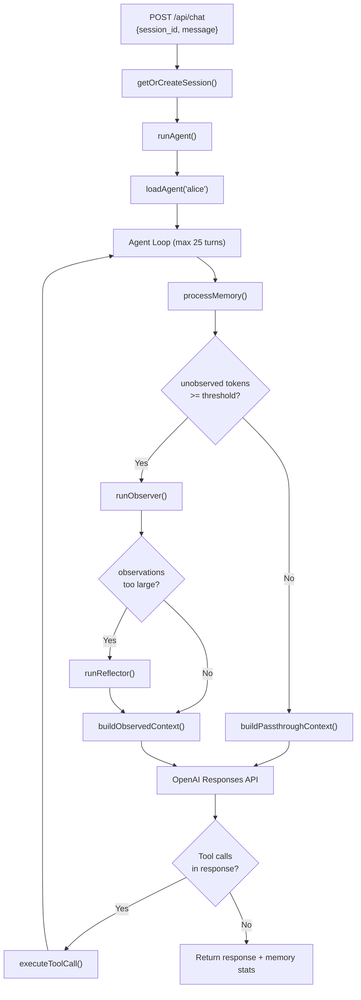
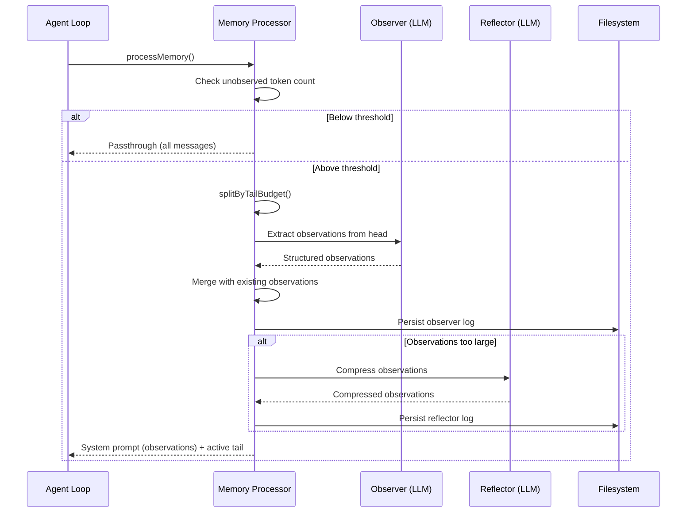
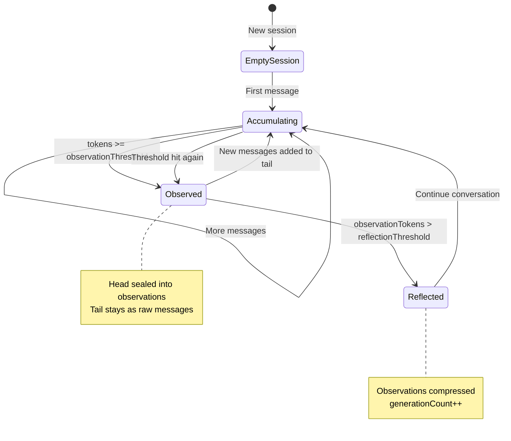
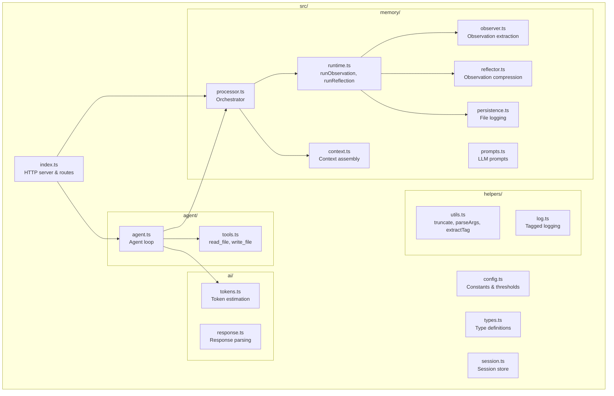

# 02_05_agent — Context Engineering with Observational Memory

## Overview

This sample implements a **conversational AI agent with an observational memory system** that automatically compresses conversation history into structured observations as the conversation grows. It demonstrates the **Observer/Reflector pattern** — a two-stage memory pipeline that keeps the agent's context window bounded while preserving long-term continuity.

## Purpose & Goals

**Problem:** LLM agents have a finite context window. In long conversations, raw message history eventually exceeds token limits, causing earlier context to be lost or truncated blindly.

**Solution:** This agent uses a principled memory system that:

- **Observes** older messages and extracts structured, information-dense observations
- **Reflects** on accumulated observations and compresses them when they grow too large
- Maintains a bounded context window: compressed history (observations) + recent raw messages

**Target audience:** Intermediate-to-advanced developers interested in context engineering for agentic systems.

## How It Works

The system has three layers: an **HTTP server**, an **agent loop with tool use**, and a **memory pipeline**.

### Component Breakdown

| Component | File | Role |
|---|---|---|
| HTTP Server | `src/index.ts` | Hono-based API with session management |
| Agent Loop | `src/agent/agent.ts` | Multi-turn agent with tool calling |
| Tools | `src/agent/tools.ts` | File read/write within a sandboxed workspace |
| Memory Processor | `src/memory/processor.ts` | Orchestrates observer/reflector cycle |
| Observer | `src/memory/observer.ts` | Extracts structured observations from messages |
| Reflector | `src/memory/reflector.ts` | Compresses observations when they exceed budget |
| Context Builder | `src/memory/context.ts` | Splits messages into sealed head + active tail |
| Token Estimation | `src/ai/tokens.ts` | Chars/4 heuristic with API calibration |
| Persistence | `src/memory/persistence.ts` | Writes memory logs to markdown files |
| Prompts | `src/memory/prompts.ts` | System prompts for observer and reflector |

### Context Window Layout

```
┌──────────────────────────────────────────────────────────────┐
│  System Prompt                                               │
│  ┌─────────────────────────────────────────────────────────┐ │
│  │ Agent instructions + Observation Appendix                │ │
│  │ (compressed history of ALL past conversations)           │ │
│  └─────────────────────────────────────────────────────────┘ │
├──────────────────────────────────────────────────────────────┤
│  Messages                                                    │
│  ┌─────────────────────────────────────────────────────────┐ │
│  │ Active tail: recent raw messages (unobserved)            │ │
│  └─────────────────────────────────────────────────────────┘ │
└──────────────────────────────────────────────────────────────┘
```

Older messages are "sealed" — replaced by observations in the system prompt. Only recent "active" messages are passed as-is. Sealed messages are **not deleted** from `session.messages`; they remain in the array but are excluded from what gets sent to the LLM. The `lastObservedIndex` pointer controls this cutoff — the context builder only sends `messages.slice(lastObservedIndex)` to the API.

## Agentic Specifics

### Autonomy Level

**Semi-autonomous with tool use.** The agent runs a multi-turn loop (up to 25 turns per request) where it can call tools and continue processing. It decides independently when to use tools based on user requests, but the memory pipeline operates transparently — the agent itself is unaware of the observer/reflector mechanics.

### Decision Making

**Memory pipeline decisions** are deterministic and threshold-based:

1. **Should the observer run?** `pendingTokens >= observationThresholdTokens` (default: 400)
2. **Should the reflector run?** `observationTokens > reflectionThresholdTokens` AND sufficient growth since last reflection
3. **Observer runs at most once per HTTP request** — enforced by `_observerRanThisRequest` flag

### Tool Usage

Two tools available (defined in `src/agent/tools.ts`):

- **`read_file`** — reads a file from the sandboxed workspace directory
- **`write_file`** — writes a file, auto-creates directories

Both enforce **path safety** via `isPathSafe()` — resolving the path and verifying it doesn't escape the workspace root using `relative()` checks.

### State Management

Each session maintains a `MemoryState` (`src/types.ts:37-47`):

```
activeObservations: string    // The running compressed memory text
lastObservedIndex: number     // Index into messages[] — everything below is "sealed"
observationTokenCount: number // Token estimate of current observations
generationCount: number       // How many times reflector has run
observerLogSeq / reflectorLogSeq  // Sequence counters for persisted logs
calibration: CalibrationState // Cumulative estimated vs actual token ratios
```

## Code Walkthrough

### 1. Server & Session Setup (`src/index.ts`)

The server exposes four endpoints:

- **`POST /api/chat`** — Main entry point. Creates/retrieves a session, runs the agent, returns response with memory stats.
- **`GET /api/sessions`** — Lists all active sessions.
- **`GET /api/sessions/:id/memory`** — Returns raw memory state for inspection.
- **`POST /api/sessions/:id/flush`** — Force-compresses all remaining unobserved messages.

Sessions are stored in-memory via a `Map<string, Session>` in `src/session.ts`. Each session holds its message history and memory state.

### 2. Agent Loop (`src/agent/agent.ts:62-115`)

```typescript
for (let turn = 0; turn < AGENT_MAX_TURNS; turn += 1) {
  const context = await processMemory(openai, session, ...)  // Step A
  const response = await openai.responses.create(...)         // Step B
  const pendingCalls = applyResponseOutput(session, ...)      // Step C

  if (pendingCalls.length === 0) return result                 // Step D

  for (const call of pendingCalls) {
    await executeToolCall(session, call)                       // Step E
  }
}
```

On each turn:

- **A:** Memory processor builds the context (observations in system prompt + active messages)
- **B:** Call the OpenAI Responses API with the processed context
- **C:** Append response text/function calls to session history
- **D:** If no tool calls, we're done — return the response
- **E:** Execute any tool calls, append results, loop back

### 3. Memory Processor (`src/memory/processor.ts:35-83`)

This is the core orchestration logic. The flow:

1. **Check threshold:** Calculate tokens of unobserved messages. If below threshold, pass through everything.
2. **Run observer:** The observer does **not** run on all unobserved messages. First, `splitByTailBudget()` walks messages backward from the end, reserving the most recent messages as a raw "tail" (30% of the threshold, minimum 120 tokens). Only the older "head" portion is fed to the observer for compression. This preserves conversational nuance in recent messages — the most relevant context for the current turn. If the head is empty (all messages fit in the tail budget), the fallback observes everything.
3. **Check reflector:** If observations exceed the reflection threshold AND have grown enough since last reflection, compress them.
4. **Build context:** Return system prompt with observation appendix + active tail.

**What happens to sealed messages?** They are **not removed** from `session.messages`. The array keeps growing. Instead, `lastObservedIndex` is advanced past the sealed messages, and the context builder uses `messages.slice(lastObservedIndex)` to only send unobserved messages to the LLM. The sealed messages' content lives on in the compressed observations within the system prompt.

The key guard: `memory._observerRanThisRequest` prevents the observer from running multiple times within a single user request's agent loop.

### 4. Observer (`src/memory/observer.ts`)

The observer is a separate LLM call with a specialized system prompt. It:

- **Serializes** messages into a text format with role labels (`src/memory/observer.ts:17-37`)
- **Truncates** long content to `OBSERVER_MAX_SECTION_CHARS` (6000) and tool payloads to `OBSERVER_MAX_TOOL_PAYLOAD_CHARS` (3000)
- **Calls** the LLM with previous observations + new messages
- **Parses** XML-tagged output: `<observations>`, `<current-task>`, `<suggested-response>`

The observer prompt enforces structured output with priority markers:

- `🔴 high` — explicit user facts, preferences, decisions
- `🟡 medium` — active work, tool outcomes, blockers
- `🟢 low` — tentative details, assistant elaborations

Each observation is tagged with its source: `[user]`, `[assistant]`, or `[tool:name]`.

### 5. Reflector (`src/memory/reflector.ts`)

The reflector uses a **progressive compression strategy** with 3 levels (`src/memory/prompts.ts:75-79`):

| Level | Guidance |
|---|---|
| 0 | *(none)* — basic reorganization |
| 1 | "Condense older observations more aggressively" |
| 2 | "Heavily condense. Remove redundancy, keep only durable facts" |

It tries each level sequentially, stopping as soon as the result fits within `reflectionTargetTokens` (default: 200). If no level fits, it keeps the best (lowest token count) result.

Critical rules: `[user]` observations are never dropped unless contradicted by newer `[user]` observations. Contradictions are resolved by preferring newer data.

### 6. Context Builder (`src/memory/context.ts`)

**`splitByTailBudget`** (line 6-29): This is the function that decides which messages get observed vs. kept raw. It walks messages **backward from the end**, accumulating tokens until hitting the tail budget (30% of threshold, minimum 120 tokens). Everything before that split point is the **head** (fed to observer); everything after is the **tail** (kept as raw messages). It also avoids splitting inside a function call output chain by walking backward past consecutive `function_call_output` items — you'd never want to seal a tool call but leave its output in the tail.

Example with a threshold of 400 tokens and tail budget of 120:
```
Messages: [m0, m1, m2, m3, m4, m5, m6, m7, m8, m9]
                                               ←─── 120 tokens ───→
                          ┌──────────────────────────────────────────┐
Split:        HEAD → [m0..m5]  |  TAIL → [m6..m9]
               ↑ observed        ↑ kept as raw messages
```

**`buildObservedContext`** (line 48-62): Assembles the final context sent to the LLM:

- System prompt = agent prompt + observation appendix (all accumulated observations)
- Messages = only the unobserved tail (or a continuation hint if all messages were sealed)

Critically, sealed messages (indices 0 through `lastObservedIndex - 1`) are **never deleted** from `session.messages`. They're simply skipped via `messages.slice(lastObservedIndex)` when building the context.

### 7. Token Estimation (`src/ai/tokens.ts`)

Two estimation modes:

- **Raw (`estimateTokensRaw`)**: Simple `chars / 4` — deterministic, used for threshold checks
- **Calibrated (`estimateTokens`)**: Adjusts based on cumulative ratio of `actual / estimated` tokens from API responses — used for display/budgeting. Calibration activates only after 500+ actual tokens accumulated.

Safety margin: `tokens * 1.2` applied via `withSafetyMargin`.

### 8. Persistence (`src/memory/persistence.ts`)

Memory logs are persisted as YAML-frontmatter markdown files in `workspace/memory/`:

- `observer-001.md`, `observer-002.md`, etc.
- `reflector-001.md`, `reflector-002.md`, etc.

Each file includes metadata (session ID, sequence number, generation, token count, sealed range) and the raw observation/reflection content.

### 9. Agent Template (`workspace/agents/alice.agent.md`)

Agent configuration is loaded from markdown files with YAML frontmatter:

```yaml
---
name: alice
model: gpt-5.4-mini
tools:
  - read_file
  - write_file
---
You are Alice, a helpful AI assistant with persistent memory.
```

This template pattern makes it easy to swap agents by changing the file.

## Diagrams

### Request Processing Flow



### Observer/Reflector Memory Pipeline



### Session State Over Time



### File Structure



## Key Takeaways

1. **Two-stage memory compression** — The Observer extracts facts from raw conversation, then the Reflector compresses accumulated observations. This separation of concerns (extraction vs. compression) produces higher-quality memory than a single-pass approach.

2. **Threshold-driven, not time-driven** — Memory operations trigger based on token counts, not message counts or time intervals. This makes the system adaptive to different conversation densities.

3. **Structural observation format** — Observations carry source tags (`[user]`, `[assistant]`, `[tool:name]`) and priority markers (🔴🟡🟢). This metadata enables the reflector to make intelligent decisions about what to keep vs. discard.

4. **Token estimation with calibration** — The `chars/4` heuristic provides stable threshold checks while the calibration ratio improves budget accuracy over time. The raw estimate is used for decisions; the calibrated estimate is used for reporting.

5. **Sandboxed tool execution** — Path traversal protection via `relative()` checking ensures the file tools can't escape the workspace directory, even with `../` sequences.

## Extensions & Variations

- **Vector-based recall:** Add embedding search over observations for relevance-based retrieval instead of always including all observations
- **Multi-session memory:** Share observations across sessions by persisting to a database instead of in-memory maps
- **Adaptive thresholds:** Dynamically adjust observation/reflection thresholds based on the model's actual context window size
- **User-driven memory management:** Allow users to explicitly add, remove, or prioritize observations
- **Streaming responses:** The current implementation waits for full responses — streaming would improve perceived latency
