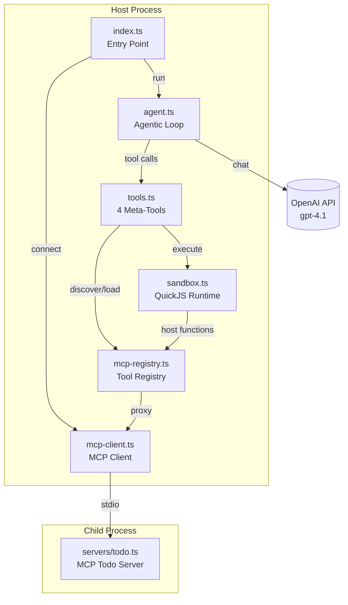
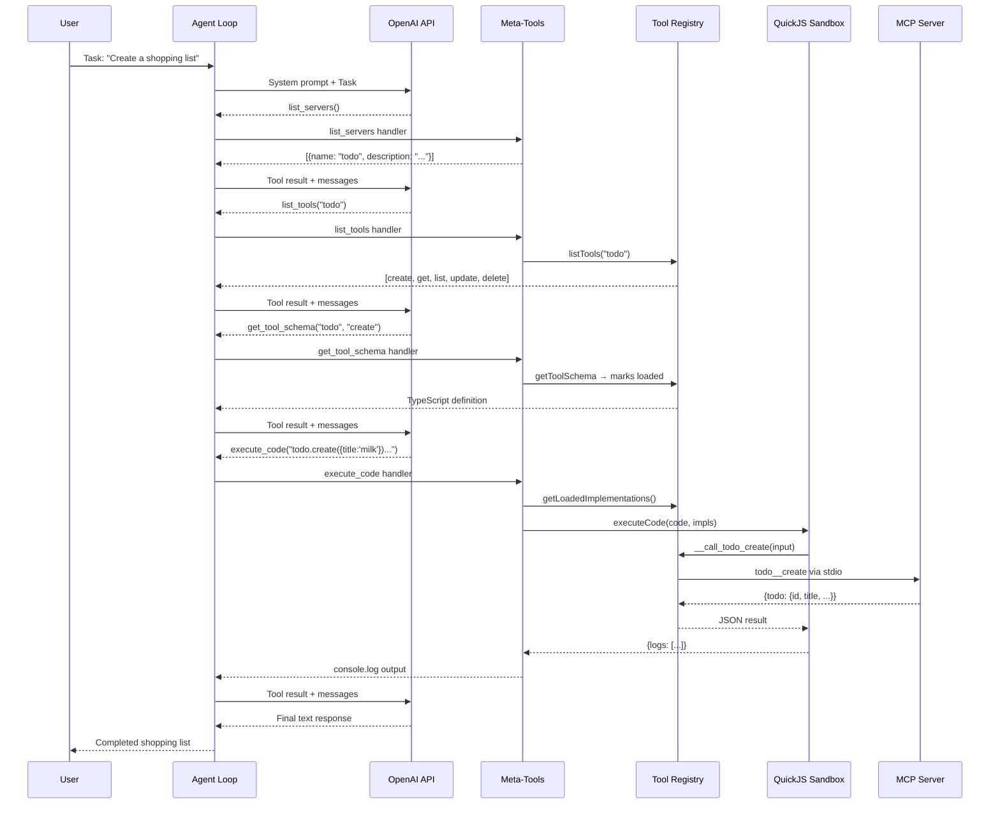
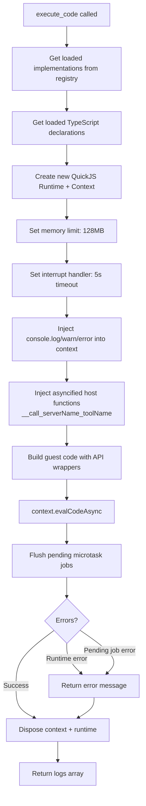
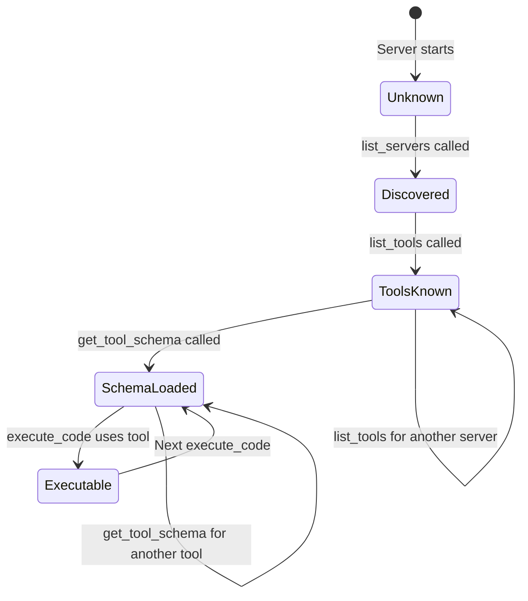

# MCP Sandbox Agent Explanation

## Overview

The **MCP Sandbox Agent** is an agentic system where an LLM discovers available MCP (Model Context Protocol) tools at runtime, loads their type definitions, then writes and executes JavaScript code in an isolated QuickJS sandbox to accomplish tasks. Instead of calling tools directly, the LLM generates code that calls those tools — a **code-as-tool** pattern that gives the agent composability, looping, and data processing capabilities beyond simple tool-call chaining.

## Purpose & Goals

**Problem solved:** Traditional tool-calling agents invoke one tool at a time, requiring a full LLM round-trip per action. This is slow and makes multi-step operations (e.g., "create 3 items, then list all") tedious.

**What it demonstrates:**

- **Dynamic tool discovery** — the agent doesn't know which tools exist until it asks
- **Code-as-tool execution** — the LLM writes JavaScript, not just function calls
- **QuickJS sandboxing** — untrusted code runs in an isolated WebAssembly runtime with memory limits and timeouts
- **MCP server integration** — tools live behind MCP servers, connected via stdio transport

**Target audience:** Intermediate to advanced developers interested in agentic architectures, MCP integration, and sandboxed code execution.

## How It Works

### Architecture

The system has five layers:

1. **MCP Server** (`servers/todo.ts`) — an external process providing CRUD tools over stdio
2. **MCP Client** (`src/mcp-client.ts`) — connects to MCP servers and proxies tool calls
3. **Tool Registry** (`src/mcp-registry.ts`) — maintains metadata, TypeScript schemas, and session-loaded tool state
4. **QuickJS Sandbox** (`src/sandbox.ts`) — an isolated WebAssembly JavaScript runtime with asyncified host functions
5. **Agent Loop** (`src/agent.ts`) — drives the LLM through an agentic loop with 4 meta-tools

### Flow

The agent follows a strict discovery-before-use workflow:

1. **Connect** to MCP server(s) at startup
2. **LLM calls `list_servers`** — discovers what's available
3. **LLM calls `list_tools`** — sees tool names and descriptions for a server
4. **LLM calls `get_tool_schema`** — loads TypeScript definitions for tools it needs (this "arms" them in the sandbox)
5. **LLM calls `execute_code`** — writes JavaScript that calls the loaded tools directly
6. **Repeat** steps 4-5 as needed

The critical insight: the LLM never calls `todo.create()` directly as a tool. Instead, it writes `todo.create({title: "Buy milk"})` as a line of JavaScript that the sandbox executes.

## Code Walkthrough

### Entry Point — `src/index.ts`

Lines 5-33 handle startup:

- **Line 12**: Connects to the MCP todo server via stdio — `bun servers/todo.ts` is spawned as a child process
- **Line 16**: Resets any previously loaded tool schemas from prior runs
- **Lines 19-20**: Accepts a task from CLI args, or falls back to a default shopping list demo
- **Line 25**: Delegates to `runAgent('sandbox', task)` — the agent name maps to `workspace/agents/sandbox.agent.md`
- **Line 33**: Gracefully disconnects all MCP servers in a `finally` block

### Agent Loop — `src/agent.ts`

The core agentic loop:

- **Lines 21-31** (`loadAgent`): Reads agent templates from markdown files with YAML frontmatter. The `sandbox.agent.md` file defines the model (`gpt-4.1`), available meta-tools, and system prompt.
- **Lines 33-125** (`runAgent`): The agentic loop itself.
  - **Line 39**: Depth guard prevents infinite recursion (`MAX_DEPTH = 3`)
  - **Lines 51-53**: Resolves which tools this agent has access to by matching template tool names against the global tool registry
  - **Lines 64-67**: Seeds the conversation with system prompt and user task
  - **Lines 69-117**: The loop — up to `MAX_TURNS = 15`:
    - Calls the LLM with messages and tool definitions
    - If no tool calls, returns the text response
    - For each tool call, parses arguments, executes the handler, and appends the result
  - **Lines 106-109**: Unknown tools return an error string rather than crashing

### The Four Meta-Tools — `src/tools.ts`

The agent has exactly four tools — none of which are the actual MCP tools:

| Tool | Purpose |
|------|---------|
| `list_servers` | Returns all connected MCP server names and descriptions |
| `list_tools` | Shows tool names/descriptions for a given server |
| `get_tool_schema` | Loads a TypeScript type definition and marks the tool as "armed" for sandbox use |
| `execute_code` | Runs JavaScript in the QuickJS sandbox with access to all loaded tools |

**Lines 110-151** (`execute_code` handler): This is where the magic happens. It gathers all loaded tool implementations from the registry and passes them to `executeCode()` in the sandbox.

### Tool Registry — `src/mcp-registry.ts`

This is the bridge between MCP servers and the sandbox:

- **Lines 32-44**: Static registry of server metadata (name, description, tool list)
- **Lines 47-109**: Full tool definitions including **TypeScript signatures** that the LLM sees and **implementation functions** that proxy to MCP
- **Lines 112-151**: Session state management — `getToolSchema` (line 136) both returns the type definition AND marks the tool as loaded. Only loaded tools are available in the sandbox.
- **Lines 156-171** (`getLoadedImplementations`): Groups loaded tools by server name for sandbox injection
- **Lines 176-216** (`getLoadedTypeScript`): Generates `declare const todo: { create(...): Promise<...>; ... }` declarations so the LLM knows exactly what API is available in the sandbox

### QuickJS Sandbox — `src/sandbox.ts`

The most technically interesting module. It executes untrusted JavaScript in a WebAssembly-based QuickJS runtime:

- **Lines 14-17**: Default limits — 5 second timeout, 128MB memory cap
- **Lines 21-26**: Lazy singleton for the QuickJS WASM module (avoids re-loading on each execution)
- **Lines 28-129** (`executeCode`): The main execution function:
  - **Line 37**: Creates a new QuickJS runtime and context for each execution (no state leaks)
  - **Lines 39-42**: Enforces memory limit and timeout via interrupt handler
  - **Lines 47-82**: Injects a `console` object into the sandbox — `log`, `info`, `warn`, and `error` all capture output to a `logs` array
  - **Lines 85-98**: The key mechanism — for each loaded tool, creates a **host function** (`__call_serverName_toolName`) that the sandbox code can call. Uses `newAsyncifiedFunction` (Asyncify) so the synchronous-looking guest code can actually perform async MCP calls
  - **Lines 101-103**: Wraps the user's code with API wrapper objects via `buildGuestCode`, then evaluates it
  - **Lines 106-111**: Flushes pending microtask jobs (Promise resolution) after evaluation
  - **Lines 113-124**: Error handling — distinguishes between runtime errors and pending job errors

- **Lines 131-151** (`buildGuestCode`): Generates wrapper code so the guest code sees a clean API:
  ```javascript
  (function() {
    const todo = {
      create(input) { const json = __call_todo_create(input); return JSON.parse(json); },
      list(input) { const json = __call_todo_list(input); return JSON.parse(json); },
    }
    // user's code here
  })();
  ```
  The wrappers are **synchronous** from the guest's perspective — Asyncify handles the async suspension internally.

### MCP Client — `src/mcp-client.ts`

Thin wrapper around the MCP SDK:

- **Lines 6-15** (`connectServer`): Spawns a child process and establishes an MCP client connection over stdio
- **Lines 17-36** (`callMCPTool`): Calls a tool on a connected server using the naming convention `serverName__toolName`
- **Lines 38-43** (`disconnectAll`): Graceful shutdown

### MCP Todo Server — `servers/todo.ts`

A standard MCP server using `@modelcontextprotocol/sdk`:

- In-memory `Map<string, Todo>` for storage (no persistence)
- Exposes five CRUD tools: `create`, `get`, `list`, `update`, `delete`
- Communicates over stdio transport
- Uses Zod schemas from `src/schemas.ts` for input validation

### Agent Template — `workspace/agents/sandbox.agent.md`

A markdown file with YAML frontmatter that defines the agent:

```yaml
name: sandbox
model: openai:gpt-4.1
tools:
  - list_servers
  - list_tools
  - get_tool_schema
  - execute_code
```

The body is the system prompt that instructs the LLM on the discovery workflow, rules (sync-only calls, no async/await, use console.log), and the code-as-tool pattern.

## Agentic Specifics

### Autonomy Level

**Semi-autonomous.** The agent runs independently within the agentic loop (up to 15 turns), making its own decisions about which tools to discover and what code to write. However:

- It follows a prescribed workflow (discover → load → execute)
- It cannot access tools it hasn't explicitly loaded via `get_tool_schema`
- The sandbox enforces hard limits on time and memory

### Decision Making

The LLM decides:

- Which servers to explore
- Which tool schemas to load (only what's needed)
- What code to write and how to compose tool calls
- Whether to batch operations in a single `execute_code` call

The system constrains:

- Maximum recursion depth (3 levels)
- Maximum turns per agent run (15)
- Sandbox timeout (5 seconds)
- Sandbox memory (128MB)

### Tool Usage

The agent uses a **two-tier tool system**:

1. **Meta-tools** (direct LLM tool calls): `list_servers`, `list_tools`, `get_tool_schema`, `execute_code`
2. **Sandbox tools** (code-level calls inside `execute_code`): e.g., `todo.create()`, `todo.list()`

The LLM never directly calls sandbox tools — it writes code that calls them. This is the key architectural difference from standard tool-calling agents.

### State Management

- **MCP server state persists** between `execute_code` calls (todos created in one call exist in the next)
- **Sandbox state does NOT persist** — each `execute_code` gets a fresh QuickJS runtime
- **Tool loading state persists** — once a schema is loaded, it stays armed for the entire session
- **Conversation history** grows as the loop progresses, maintaining context across turns

## Diagrams

### High-Level Architecture



### Agent Turn Flow



### Sandbox Execution Detail



### Tool Loading State Machine



## Key Takeaways

1. **Code-as-tool is more powerful than direct tool calling.** Instead of one tool call per LLM round-trip, the agent writes code that performs multiple operations in a single `execute_code` call. Creating 3 todos takes one turn instead of three.

2. **Asyncify makes async look sync.** QuickJS's Asyncify feature allows host functions to be truly async (making MCP calls over stdio) while guest code sees them as synchronous. The comment at `sandbox.ts:142-144` explains why wrappers must be synchronous.

3. **Sandbox isolation is real.** Each `execute_code` gets a fresh QuickJS runtime — no filesystem, no network, no access to the host process. Memory and time are hard-capped.

4. **Lazy tool loading saves context.** The agent only loads schemas for tools it needs, reducing the TypeScript declarations injected into the sandbox and the information the LLM must reason about.

5. **The registry acts as a capability gate.** Tools can't be used in the sandbox until their schema is explicitly loaded via `get_tool_schema`. This gives the LLM a deliberate discovery step before use.

## Extensions & Variations

- **Add more MCP servers** — define new entries in the registry (`mcp-registry.ts`) and their server processes. The agent auto-discovers them via `list_servers`.
- **Persistent sandbox state** — currently each `execute_code` starts fresh. A global store (key-value map) could be injected to allow cross-execution state.
- **Streaming output** — instead of collecting all `console.log` output until the end, stream logs back as they happen using a callback mechanism.
- **Multi-agent delegation** — the `depth` parameter in `runAgent` already supports recursive agent calls. A "delegate" tool could let the sandbox agent spawn sub-agents.
- **Production hardening** — add result size limits, input validation for `execute_code`, and rate limiting on MCP calls to prevent abuse.
