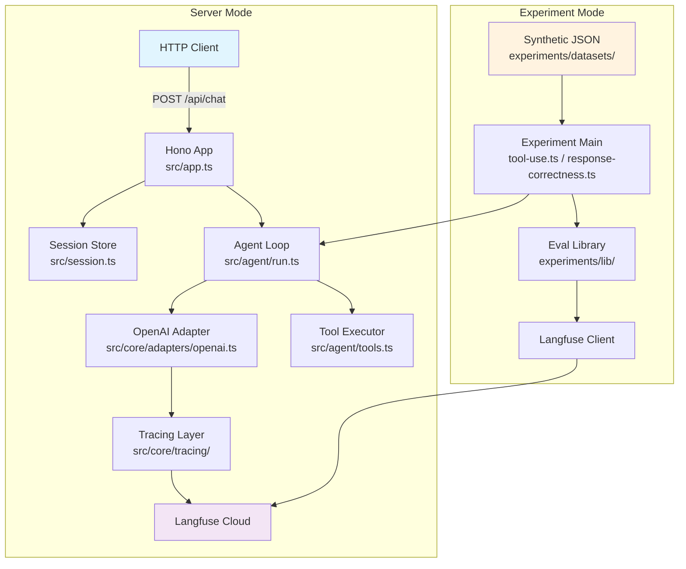
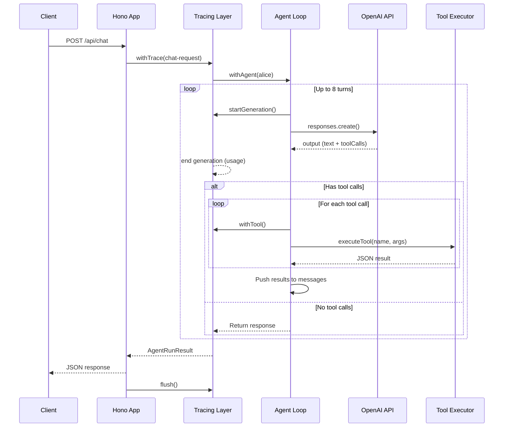
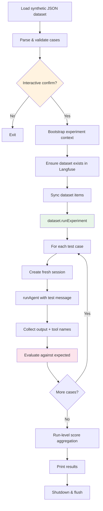
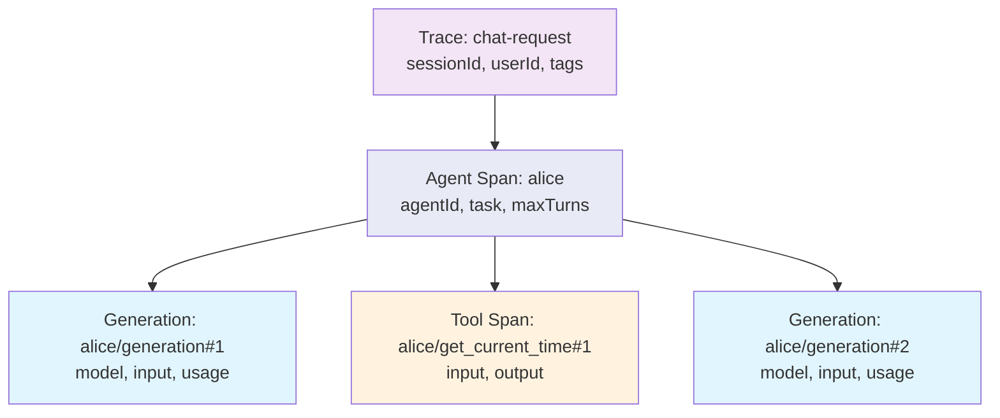
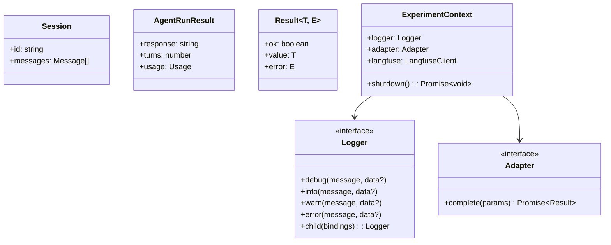

# 03_01_evals Explanation

## Overview

This sample is an **agent server with Langfuse tracing and a programmatic evaluation suite**. It demonstrates how to build a multi-turn AI agent (Alice) with tool-calling capabilities, instrument every request with observability traces, and then systematically evaluate the agent's behavior across two dimensions: tool-use correctness and response factual accuracy. It builds on the `03_01_observability` sample by layering an `experiments/` directory on top.

## Purpose & Goals

**Problem being solved:** How do you know your agent is making the right decisions — calling the right tools, producing correct answers, and avoiding hallucinations? Manual testing doesn't scale. This sample shows how to answer that question with automated, repeatable evaluation experiments.

**Key capabilities demonstrated:**

- Multi-turn agent loop with tool calling (Responses API)
- Langfuse observability with structured span hierarchies
- Synthetic dataset creation and upsertion into Langfuse
- Two evaluation experiments: tool-use and response-correctness
- Per-item scoring and run-level aggregated scores
- Interactive confirmation before running costly LLM calls

**Target audience:** Intermediate developers who have built agents and now want to evaluate them systematically.

## How It Works

The system has three layers that stack on top of each other:

### Layer 1: The Agent Server

An HTTP server (Hono) exposes three endpoints. The core endpoint (`POST /api/chat`) receives a user message, manages session state (in-memory map), and runs a multi-turn agent loop that calls the LLM and executes tools until the model produces a final text response.

### Layer 2: Observability

Every request is wrapped in a Langfuse trace with a structured span hierarchy. The tracing uses `AsyncLocalStorage` to propagate context (agent name, turn number, tool index) across async boundaries without explicit parameter passing. Prompt versions are synced to Langfuse for version tracking.

### Layer 3: Evaluation Experiments

Two standalone scripts that:
1. Load synthetic test cases from JSON files
2. Bootstrap their own adapter and Langfuse client
3. Upsert dataset items into Langfuse
4. Run `dataset.runExperiment(...)` which executes each test case against the agent
5. Score results with custom evaluators
6. Output per-item and aggregated scores

### Architecture Diagram

## Code Walkthrough

### Entry Point — `src/index.ts`

Lines 12-30: The server bootstraps in sequence — create logger, init tracing, sync prompts, build adapter resolver, create Hono app, then start listening. The `serve()` call from `@hono/node-server` binds Hono's `fetch` handler to a Node HTTP server. Shutdown handlers on `SIGINT`/`SIGTERM` ensure tracing is flushed before exit.

### HTTP Application — `src/app.ts`

Lines 35-98: The `POST /api/chat` handler is the heart of the server. It:
- Validates the request body (lines 37-43)
- Resolves the OpenAI adapter (lines 45-48)
- Gets or creates a session (line 50)
- Wraps the entire agent execution in a Langfuse trace via `withTrace()` (lines 53-73)
- Returns the agent's response, turn count, and usage stats (lines 75-81)
- Flushes tracing data in the `finally` block (line 96-97)

### Agent Loop — `src/agent/run.ts`

Lines 19-62: The `agentLoop` function implements the core agent pattern:

1. **Loop up to MAX_TURNS (8)** — prevents infinite loops
2. **Call the LLM** with the full conversation history and tool definitions
3. **Check for tool calls** — if none, return the text response immediately
4. **Execute each tool call** — wrapped in `withTool()` for tracing
5. **Push tool results** back into the message history as `function_call_output`
6. **Repeat** — the next iteration gives the model the tool results so it can produce a final answer

Lines 64-76: `runAgent()` pushes the user message into the session, looks up the prompt reference, and wraps the loop in `withAgent()` for tracing.

### Tool Definitions — `src/agent/tools.ts`

Lines 3-33: Two tools are defined using OpenAI's function tool schema:
- `get_current_time` — returns UTC time as ISO string, no parameters
- `sum_numbers` — takes a `numbers` array, validates each value is finite, returns count and sum

Lines 39-49: The `parseArgs` helper safely parses JSON arguments with error handling — a defensive pattern since LLM-generated arguments can be malformed.

Lines 51-78: `executeTool` dispatches by name and returns JSON-stringified results. Unknown tools return an error object rather than throwing.

### Session Management — `src/session.ts`

A simple `Map<string, Session>` for in-memory session storage. The `getSession()` function creates a session on first access. Each session holds the full message history that accumulates across turns within a conversation.

### Tracing System — `src/core/tracing/`

This is a well-structured observability layer:

**`context.ts`** (lines 17-88): Uses `AsyncLocalStorage` to maintain per-request context — `agentName`, `agentId`, `turnNumber`, `toolIndex`, and `promptRef`. This allows the tracing functions to know "where" they are in the hierarchy without explicit parameters. The `advanceTurn()` and `nextToolIndex()` counters produce names like `alice/generation#2` and `alice/get_current_time#1`.

**`tracer.ts`** (lines 90-266): Provides wrapper functions for each observability level:
- `withTrace()` — top-level request span
- `withAgent()` — agent execution span
- `startGeneration()` — LLM call span (manual start/end for streaming support)
- `withTool()` — tool execution span
- `recordTraceError()` — attaches error metadata to the active trace

**`adapter.ts`** (lines 63-91): The `withGenerationTracing()` higher-order adapter wraps any `Adapter` to automatically create generation spans for every `complete()` call, recording input, output, and usage.

**`init.ts`** (lines 30-105): Initializes OpenTelemetry with the `LangfuseSpanProcessor`. Gracefully degrades when credentials are missing — the entire tracing layer becomes a no-op.

**`prompts.ts`** (lines 86-149): Syncs the agent's system prompt to Langfuse for version tracking. Uses content hashing to avoid redundant pushes — only uploads when the prompt text has changed.

### Evaluation Framework — `experiments/`

#### Shared Library — `experiments/lib/`

**`context.ts`** (lines 23-65): `bootstrap()` sets up everything an experiment needs — logger, tracing, adapter, and Langfuse client. Returns an `ExperimentContext` with a `shutdown()` that flushes all resources.

**`dataset.ts`** (lines 28-70): Two functions for dataset management:
- `ensureDataset()` — creates a dataset in Langfuse if it doesn't already exist
- `syncDatasetItems()` — upserts test case items one by one

**`helpers.ts`** (lines 11-79): Utility functions:
- `confirmExperiment()` — interactive terminal prompt that warns about costs before running
- `toCaseInput()` — safely extracts `{id, message}` from dataset item input
- `extractToolNames()` — pulls tool names from session message history
- `createAvgScoreEvaluator()` — produces a run-level evaluator that averages per-item scores

#### Tool-Use Evaluation — `experiments/tool-use.ts`

**Dataset** (6 test cases): Covers tool selection scenarios — single tool, multi-tool, no-tool, and edge cases (negative decimals).

**Scoring** (lines 114-136): The `toolUseEvaluator` produces 5 scores per item:
- `tool_use_overall` — average of the other 4 scores
- `tool_use_decision_accuracy` — did the agent correctly decide to use or not use tools?
- `tool_use_required_tools_accuracy` — were all required tools called?
- `tool_use_forbidden_tools_accuracy` — were no forbidden tools called?
- `tool_use_call_count_accuracy` — was the call count within expected bounds?

#### Response Correctness — `experiments/response-correctness.ts`

**Dataset** (8 test cases): Covers exact number matching, ISO timestamp presence, and topic relevance.

**Scoring** (lines 154-192): The `correctnessEvaluator` handles three expectation types:
- `exact_number` — extracts all numbers from the response and checks if the expected value appears
- `contains_iso_timestamp` — regex match for ISO 8601 format
- `relevance` — keyword matching (with special handling for greeting patterns)

Each item produces two scores: `response_correctness` and `has_response`.

### Result Type — `src/core/result.ts`

A simple discriminated union `Result<T, E>` used throughout the codebase for explicit error handling without exceptions in the happy path.

## Agentic Specifics

### Autonomy Level

**Semi-autonomous.** The agent operates independently within a bounded loop (max 8 turns), deciding when to call tools and when to respond directly. No human-in-the-loop — the agent's decisions are final within a single request.

### Decision Making

- **Tool selection**: The LLM decides which tools to call based on the user message and tool descriptions. No hard-coded routing.
- **Loop termination**: The agent stops when the LLM produces a response with no tool calls, or when it exceeds `MAX_TURNS` (which throws an error).
- **Tool execution**: All tool calls are executed deterministically — there is no retry or fallback logic.

### Tool Usage

Two tools available:
| Tool | Purpose | Input |
|------|---------|-------|
| `get_current_time` | Returns current UTC time | None |
| `sum_numbers` | Sums a list of numbers | `numbers: number[]` |

The LLM selects tools autonomously. Results are fed back into the conversation for the next turn.

### State Management

- **Session state**: In-memory `Map` keyed by session ID. Each session holds the full message array. No persistence — lost on server restart.
- **Tracing context**: Propagated via `AsyncLocalStorage`, scoped to a single request. Contains agent name, turn number, and tool index counters.
- **Prompt sync state**: Persisted to `.langfuse-prompt-state.json` with content hashes to avoid redundant uploads.

## Diagrams

### Request Flow

### Evaluation Experiment Flow

### Tracing Span Hierarchy

### Class Diagram — Core Types

## Key Takeaways

1. **Evaluation as code**: Test cases live in JSON files, evaluators are TypeScript functions, and results are tracked in Langfuse. This makes evaluation repeatable, versionable, and part of the development workflow.

2. **Layered observability**: The tracing system uses `AsyncLocalStorage` for implicit context propagation, making instrumentation non-intrusive. The `withTrace` / `withAgent` / `withTool` / `startGeneration` hierarchy mirrors the logical structure of an agent request.

3. **Graceful degradation**: When Langfuse credentials are missing, every tracing function becomes a no-op. The server runs identically with or without observability configured.

4. **Two complementary eval dimensions**: Tool-use evaluation checks *decision-making* (did the agent call the right tools?), while response-correctness evaluation checks *output quality* (is the answer factually correct?). Together they cover both process and outcome.

5. **Interactive cost awareness**: The `confirmExperiment()` function warns about token costs before running evaluations — a practical guardrail against accidental spend.

## Extensions & Variations

- **Add LLM-as-judge**: Replace the regex/keyword-based correctness evaluator with an LLM call that scores relevance and quality on a rubric.
- **Persistent sessions**: Swap the in-memory `Map` for Redis or a database to survive server restarts.
- **Streaming support**: The `startGeneration()` function already returns a `recordFirstToken()` callback — add streaming to the adapter to track time-to-first-token.
- **CI integration**: Remove `confirmExperiment()` and run evaluations as part of a CI pipeline to catch regressions automatically.
- **More evaluation dimensions**: Add hallucination detection, latency benchmarks, or cost-per-query metrics as additional experiments.
