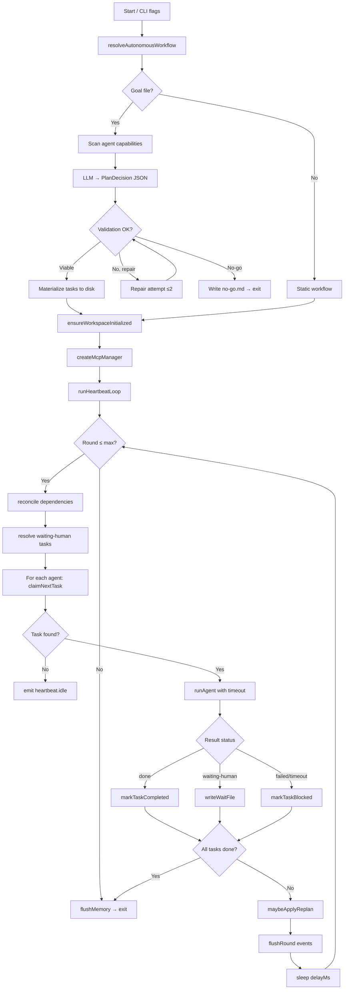
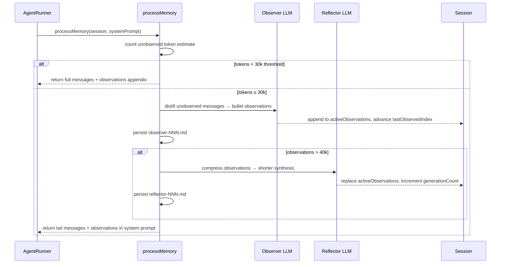
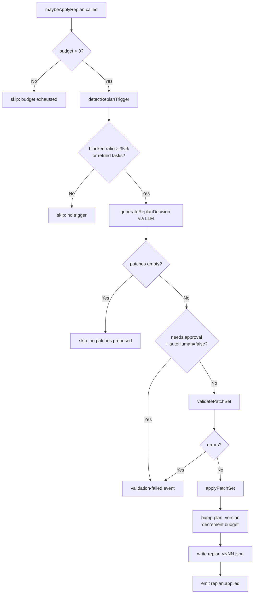

# 03_02_events Explanation

## Overview

`03_02_events` is a fully autonomous multi-agent system that reads a goal contract, generates and validates a task plan using an LLM, then executes that plan via a heartbeat loop that dispatches specialist agents (researcher, writer, editor, designer, planner). It features a structured event log, observer/reflector memory compaction for long-running sessions, a replanning system for recovery from failures, and human-in-the-loop pauses persisted as wait files.

---

## Purpose & Goals

**Problem solved:** Running complex, multi-step research and writing projects autonomously — e.g., producing a comparative analysis report — with minimal human intervention, full observability, and graceful recovery from partial failures.

**Key capabilities demonstrated:**
- Goal-driven autonomous planning (LLM as a "planning compiler")
- Dependency-aware task scheduling across specialist agents
- Structured event logging (JSONL + per-round markdown)
- Two-tier memory compaction (Observer → Reflector) for long conversation threads
- Dynamic replanning when blocked tasks exceed a threshold
- Human-in-the-loop with auto-answer fallback

**Target audience:** Advanced; assumes familiarity with multi-agent systems, LLM APIs, and async TypeScript.

---

## How It Works

### Phase 1 — Autonomous Workflow Resolution (`src/autonomy/`)

Before any agents run, the system decides *what* to do:

1. **Goal contract** (`workspace/goal.md`) is parsed into a structured `GoalContract` with fields: `objective`, `must_have`, `forbidden`, `step_budget_rounds`, `replan_budget`, `max_total_tasks`.
2. **Capability map** is built by scanning `workspace/agents/*.agent.md` — each agent file has YAML frontmatter listing its `capabilities` and `tools`.
3. **LLM planner call** (`plan-generate.ts`) sends the goal + capability map to the LLM and receives a JSON `PlanDecision` (either `viable` with a full task list, or `no-go` with reasons).
4. **Validation + repair** — `plan-validate.ts` checks constraints (dependency graph validity, capability coverage, `must_have` coverage). If invalid, up to 2 automatic repair attempts are made by sending the errors back to the LLM.
5. **Materialization** — approved tasks are written as markdown files with YAML frontmatter into `workspace/project/tasks/`. A `plan-state.json` tracks the replan budget.

Resolution returns one of three modes: `static` (no goal file → use built-in workflow), `autonomous` (plan generated), or `no-go` (plan infeasible → write `no-go.md` and exit).

### Phase 2 — Heartbeat Loop (`src/features/heartbeat/index.ts`)

The core execution engine runs `N` rounds (configurable, default 8). Each round:

1. Emits `heartbeat.started`
2. Reconciles dependency states — tasks whose dependencies are now `done` are unblocked
3. Resolves any `waiting-human` tasks (auto-answer or prompt stdin)
4. For each agent in `agentOrder`:
   - Atomically claims the next claimable task for that agent via `claimNextTask`
   - Builds a task prompt with the task's frontmatter + body + execution rules
   - Runs the agent session with a timeout (`Promise.race`)
   - Emits `tool.call` events for every tool invocation the agent makes
   - Emits `memory.observed` / `memory.reflected` if the session's memory was compacted
   - On `waiting-human` result: writes a wait file, marks task `waiting-human`
   - On `failed` / timeout: marks task `blocked`
   - On success: marks task `done`, collects output stats
5. If no tasks were claimed → emits `heartbeat.idle`
6. Checks if all tasks are done → emits `project.completed`
7. Emits `heartbeat.finished` with round metrics (tokens, words, timing)
8. Flushes the round's events to `events/round-NNN.md`
9. Optionally triggers replanning if blocked ratio ≥ 35%

### Phase 3 — Memory Compaction (`src/memory/`)

Each agent has a persistent `Session` with a rolling message history. As conversations grow, the memory processor activates a two-tier pipeline:

- **Observer** (`observer.ts`) — triggers at `observationThresholdTokens` (default 30k). Reads unseen messages, calls the LLM to distill them into bullet-point observations, appends to `activeObservations`. Persists `observer-NNN.md`.
- **Reflector** (`reflector.ts`) — triggers when `activeObservations` exceeds `reflectionThresholdTokens` (40k). Condenses all observations into a shorter synthesis targeting `reflectionTargetTokens` (20k). Advances `generationCount`. Persists `reflector-NNN.md`.

When the processor returns a `ProcessedContext`, it injects the observations into the system prompt as an `<observations>` block, and trims the message list to only the un-observed tail. The agent sees a compact history without needing to re-read all prior turns.

### Phase 4 — Replanning (`src/autonomy/replan.ts`)

`maybeApplyReplan` is called each round when an `autonomyContext` is present:

1. Checks `remaining_replan_budget` — if 0, skips.
2. `detectReplanTrigger` — fires if blocked ratio ≥ 35% or any blocked task has ≥ 2 attempts.
3. Calls `generateReplanDecision` — sends goal + current task snapshot to LLM, receives a patch set.
4. Patch operations: `add_task`, `split_task`, `reassign_owner`, `change_dependencies`, `de_scope_task`, `cancel_open_task`.
5. Validates the patch set, applies it, bumps `plan_version`, decrements budget.
6. Writes a `replan-vNNN.json` snapshot and emits `replan.applied`.

---

## Code Walkthrough

### `src/index.ts` — Entry Point (lines 1–80)
Parses CLI flags (`--rounds`, `--delay-ms`, `--auto-human`, `--workflow`, `--goal`), creates an `AbortController` for graceful SIGINT/SIGTERM shutdown, then:
- Calls `resolveAutonomousWorkflow` → gets the workflow and optional `autonomyContext`
- Calls `ensureWorkspaceInitialized` (bootstrap)
- Creates MCP manager (external tool servers via `.mcp.json`)
- Passes everything into `runHeartbeatLoop`

### `demo.ts` — Demo Runner (lines 1–233)
Wraps `main()` with: Polish-language API cost warning prompt (lines 203–213), workspace reset (`rm -rf tasks/ notes/ report/ system/`), colorized progress logging, and a `printSummary` that shows task statuses and a 14-line preview of the final deliverable.

### `src/autonomy/runtime.ts` — Plan Resolution (lines 24–210)
`resolveAutonomousWorkflow` is the orchestrator for the pre-execution phase. Key logic:
- Lines 46–88: Detects workspace/goal mismatch (tasks from a different goal) → returns `no-go` immediately
- Lines 116–131: Repair loop (max 2 attempts)
- Lines 133–163: `isClearlyNoGo` — final feasibility check before treating as no-go

### `src/autonomy/plan-generate.ts` — LLM Planner (lines 268–295)
`buildPlanPrompt` constructs the prompt with goal fields, capability map, output contract schema, and quality constraints. For analytical goals (reports, comparisons), it injects additional rules (lines 213–226) requiring evidence → draft → editorial → assembly phase structure and comparison matrices.

### `src/features/heartbeat/index.ts` — Heartbeat Loop (lines 306–612)
`runHeartbeatLoop` is the heart of the system:
- Lines 333–608: Main `for` loop over rounds
- Lines 394–561: Inner `for` loop over agents — task claim, run, outcome routing
- Lines 425–445: `onToolCall` callback — emits `tool.call` event for every LLM tool invocation
- Lines 471–489: Memory snapshot diff — detects if observer/reflector ran during this agent turn
- Lines 563–609: Round summary metrics and flush

### `src/core/events.ts` — Event Store (lines 15–68)
`EventStore` maintains an in-memory buffer per round (`#roundEvents`). `emit()` both appends to `events.jsonl` (real-time) and pushes to the buffer. `flushRound()` writes a formatted `round-NNN.md` file with a markdown bullet list.

### `src/memory/processor.ts` — Memory Pipeline (lines 173–287)
`processMemory` (called before each LLM turn) decides whether to:
1. Skip (pending tokens < threshold) → return full messages + optional observation appendix
2. Run observation pass only (pending tokens ≥ 30k)
3. Run observation + reflection (observation tokens ≥ 40k)

`flushMemory` (called at shutdown) forces a final observation pass to persist any remaining unseen messages.

---

## Agentic Specifics

### Autonomy Level
**Semi-autonomous with plan approval.** The system generates its own task plan but applies it only after validation. Replanning is automatic but bounded by a budget. Human input is bypassed by default (`autoHuman=true`) with canned responses.

### Decision Making

| Decision | Who decides |
|---|---|
| What tasks to create | LLM planner (plan-generate.ts) |
| Which agent handles each task | Plan assignment (owner field) |
| Task execution approach | Individual specialist agents |
| When to replan | Rule-based trigger (blocked ratio ≥ 35%) |
| Replan patches | LLM planner (replan context) |
| Human answers (auto mode) | Heuristic: tone → style phrase; yes/no → safer option |

### Tool Usage
Each agent template (`workspace/agents/*.agent.md`) declares its available tools. The agent runner resolves these at runtime. Common tools: `files__fs_read`, `files__fs_write`, `web__search`, `web__scrape`, `request_human`. Tool calls are intercepted by `onToolCall` and emitted as `tool.call` events.

### State Management
- **Task state** — persisted as YAML frontmatter in markdown files (`workspace/project/tasks/`)
- **Session state** — in-memory `Session` objects (messages + memory) per agent
- **Memory state** — `activeObservations` string in session, persisted as observer/reflector logs
- **Plan state** — `plan-state.json` with `remaining_replan_budget`, `plan_version`
- **Wait state** — `workspace/project/system/waits/<waitId>.md` for human-in-the-loop pauses

---

## Diagrams

### Overall System Flow



### Observer/Reflector Memory Pipeline



### Event Types Lifecycle

```mermaid
stateDiagram-v2
    [*] --> plan.approved: viable plan materialized
    plan.approved --> heartbeat.started: round 1 begins
    heartbeat.started --> task.claimed: agent claims task
    task.claimed --> tool.call: agent uses tool
    tool.call --> tool.call: more tools
    tool.call --> task.completed: agent succeeds
    tool.call --> task.waiting-human: agent calls request_human
    tool.call --> task.blocked: timeout / failure
    task.waiting-human --> human.input-provided: answer resolved
    human.input-provided --> task.claimed: task reopened
    task.blocked --> replan.applied: blocked ratio ≥ 35%
    task.completed --> project.completed: all tasks done
    task.completed --> heartbeat.finished: round ends
    task.blocked --> heartbeat.finished
    task.waiting-human --> heartbeat.finished
    heartbeat.finished --> heartbeat.started: next round
    project.completed --> [*]
    heartbeat.idle --> heartbeat.finished: no claimable tasks
```

### Replan Decision Flow



---

## Key Takeaways

1. **LLM as planning compiler** — the planner is called at startup with a structured goal contract and produces a validated dependency graph of tasks, not just a list. The output contract schema (embedded in the prompt) enforces machine-parseable JSON.

2. **Observer/Reflector is Mastra-inspired two-tier memory** — rather than naively truncating context, the system distills history into observations (observer) and further compresses observations into a synthesis (reflector). This keeps long-running agent sessions viable across many rounds without losing critical facts.

3. **Event log is the audit trail** — every state transition (task claimed/completed/blocked, tool call, memory event, human input) is appended to `events.jsonl` in real time and formatted into per-round markdown. This makes post-mortem analysis straightforward.

4. **Replanning is rule-triggered and LLM-executed** — the trigger is deterministic (blocked ratio threshold), but the patch content is generated by the LLM. Patches are validated before application, and a budget cap prevents infinite replan loops.

5. **Human-in-the-loop is first-class** — `request_human` is a regular tool; `waiting-human` is a standard task status. Wait state is persisted across restarts. `autoHuman=true` provides heuristic auto-answers for demos.

---

## Extensions & Variations

- **Add a new specialist agent** — create a `workspace/agents/<name>.agent.md` with frontmatter `name`, `model`, `tools`, `capabilities`. Add the name to the workflow's `agentOrder`. The capability map and planner will pick it up automatically.

- **Swap to a different LLM** — set `OPENAI_MODEL` or `OPENROUTER_API_KEY`. Agent templates can override the model per-agent via the `model` field in their frontmatter.

- **Plug in real MCP servers** — add entries to `.mcp.json`. The `createMcpManager` will connect at startup and expose the server's tools to agents that declare them in their tool list.

- **Production hardening** — add persistent session storage (currently in-memory) so sessions survive restarts; consider replacing the file-based task store with a real database for concurrent multi-process deployments; add circuit-breaker logic around LLM calls.

- **Tune memory thresholds** — adjust `observationThresholdTokens` / `reflectionThresholdTokens` in `DEFAULT_MEMORY_CONFIG` to trade off compaction frequency vs. LLM cost.
