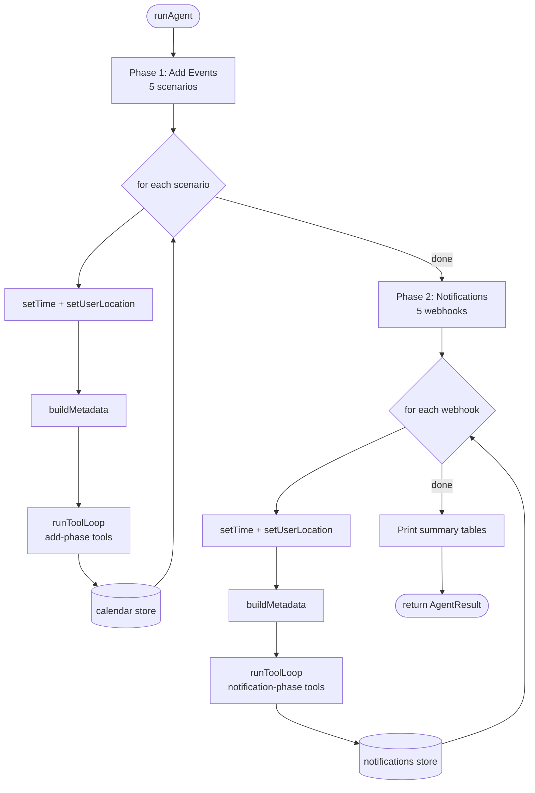
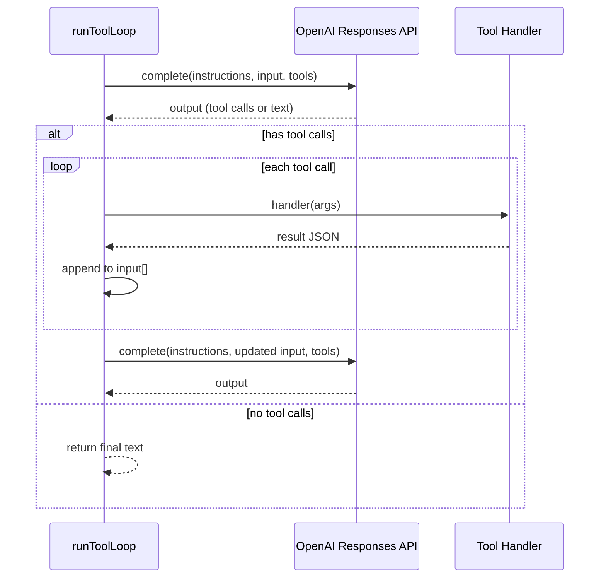
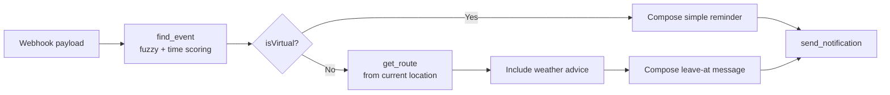
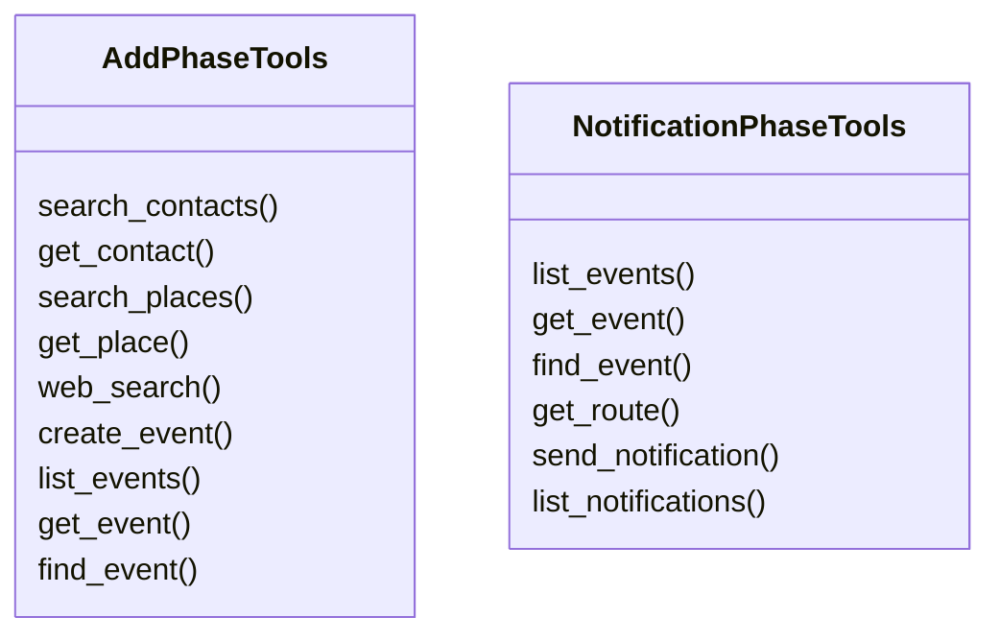

# 03_03_calendar Explanation

## Overview

`03_03_calendar` is a two-phase agentic calendar assistant that first processes natural-language scheduling requests to create calendar events, then handles incoming webhook payloads to dispatch contextual "leave now" travel notifications. It demonstrates how a single LLM-powered tool loop can serve fundamentally different goals when given different system prompts and different tool sets.

## Purpose & Goals

**Problem solved:** Manual scheduling and pre-departure reminders require context that varies per moment — current location, weather, travel time. This sample shows how an agent with the right tools can assemble that context on its own and act on it.

**Key capabilities demonstrated:**
- Phase-scoped tool access: the agent only sees tools relevant to its current goal
- Context injection via a `<metadata>` block (time, location, weather) prepended to every user message
- Fuzzy event lookup using a scoring algorithm combining title similarity and temporal proximity
- Conditional logic in the notification phase: virtual events skip routing; physical events compute travel time and incorporate weather advice

**Target audience:** Intermediate — assumes familiarity with LLM tool-calling and async TypeScript.

## Architecture

The system is split into three layers:

| Layer | Responsibility |
|---|---|
| `core/completion.ts` | Thin OpenAI Responses API wrapper |
| `agent.ts` | Tool loop orchestration, phase sequencing |
| `tools/*.ts` + `data/*.ts` | Tool definitions + simulated data stores |

Environment state (current time, current location) is held in a mutable singleton in `data/environment.ts` and mutated between steps to simulate the user moving through the day.

## How It Works

### Phase 1 — Add Events

The agent receives five scheduling scenarios from `data/scenarios.ts`. Before each step, `setTime()` and `setUserLocation()` advance the simulated clock and position. A `<metadata>` XML block is prepended to the user message, giving the model the current time, location, and weather.

The agent is permitted four tools in this phase:

| Tool | Purpose |
|---|---|
| `search_contacts` / `get_contact` | Resolve person names to emails |
| `search_places` / `get_place` | Resolve venue names to place IDs |
| `web_search` | Find venues when user says "find a good place" |
| `create_event`, `list_events`, `get_event`, `find_event` | Calendar CRUD |

For each request the model runs through the tool loop (`runToolLoop`), calling tools until no further tool calls are returned, at which point it emits a one-sentence confirmation.

### Phase 2 — Notification Webhooks

Five webhooks from `data/scenarios.ts` are processed. Each payload carries `{ type, eventTitle, startsAt, minutesUntilStart }`. The agent uses a dedicated prompt with stricter behavior rules:

1. Locate the event with `find_event` (fuzzy title + time proximity scoring).
2. Branch on `isVirtual`:
   - **Virtual** → skip routing, send a simple reminder.
   - **Physical** → call `get_route(currentLocationId, eventLocationId)`, incorporate weather, compose a "leave at X" message.
3. Call `send_notification` exactly once.

### Tool Loop (`runToolLoop`)

```
while turns < maxTurns:
    response = complete(model, instructions, input, tools)
    if no tool calls → return text
    for each tool call:
        parse args
        execute handler
        append function_call_output to input   ← builds conversation context
```

The input array grows with each turn, so the model always has the full tool-call history within the session.

## Code Walkthrough

### `agent.ts:43–125` — `runToolLoop`

The core agentic loop. It builds up an `InputItem[]` array as a rolling conversation: each tool call and its output are appended as new items before the next model invocation. The loop terminates on the first turn that returns zero tool calls, signalling the model is done. `maxTurns` (default 12) acts as a safety budget.

### `agent.ts:127–229` — `runAgent`

Orchestrates both phases sequentially. Between each step it calls `setTime()` and `setUserLocation()` to advance simulated state (lines 138–139, 170–171). After both phases it prints summary tables of created events and sent notifications.

### `tools/calendar.ts:200–231` — `find_event` handler

The notification phase uses `find_event` to locate the matching event given only the title from the webhook. The scoring combines:
- Exact/partial title match (+100/+40)
- Per-token match (+10 each)
- Time proximity within 15/60/180/720 minutes (+40/30/20/10)

This means a vague title plus an accurate `starts_at` can still resolve to the correct event.

### `tools/calendar.ts:82–132` — `create_event` handler

Validates `start < end`, resolves `location_id` against the places fixture, converts a flat email array into `CalendarGuest[]` (matching against the contacts fixture for display names), then persists via `addEvent()`.

### `data/environment.ts:35–62` — `buildMetadata`

Assembles the `<metadata>` XML block. It calls `getWeatherAt(date, hour)` using the simulated clock to inject a weather description, temperature, wind, and precipitation when available.

### `prompt.ts` — System prompts

The `buildAddPhasePrompt` function returns a system prompt that enforces "one event per request" and lists the preferred tool ordering (contacts → places → optional web search → create). The `buildNotificationPhasePrompt` codifies the virtual/physical branch and mandates exactly one `send_notification` call.

## Agentic Specifics

### Autonomy Level

Both phases are **fully autonomous** within a session — the model decides which tools to call, in what order, and when to stop. There is no human-in-the-loop confirmation step.

### Decision Making

**Add phase inputs:** natural language request + current time/location/weather in `<metadata>`.
**Notification phase inputs:** webhook payload + current time/location/weather.

The model decides:
- Whether to look up contacts or places before creating an event
- Whether to use `web_search` to discover venues
- Which travel mode to recommend based on route data and weather conditions

### Tool Usage

Phase 1 tools (contacts, places, web search, calendar CRUD) are strictly separated from Phase 2 tools (calendar read, map, notifications). This prevents the notification agent from accidentally creating new events, and prevents the scheduling agent from prematurely firing notifications.

### State Management

State is in-process and ephemeral:
- `data/calendar.ts` — accumulated `CalendarEvent[]` array, grows across Phase 1
- `data/notifications.ts` — accumulated `NotificationRecord[]` array, grows across Phase 2
- `data/environment.ts` — mutable `EnvironmentState` singleton, mutated between steps

Each tool-loop session maintains its own `InputItem[]` that acts as short-term memory for that step only. There is no persistent store between runs.

## Diagrams

### Overall Execution Flow



### Tool Loop (Single Step)



### Notification Phase Decision



### Tool Scope Per Phase



## Key Takeaways

1. **Phase-scoped tools prevent accidents.** Giving the agent only the tools it needs per phase is a simple and effective way to enforce policy without complex guardrails — the model cannot fire a notification during scheduling because `send_notification` simply doesn't exist in Phase 1.

2. **Context injection via `<metadata>` is more reliable than tool calls.** Time, location, and weather are injected directly into the message rather than exposed as tools. This reduces token overhead and ensures the model always has fresh context at the start of each turn.

3. **Fuzzy event lookup requires explicit scoring.** The `find_event` scoring algorithm (title similarity + time proximity) solves the real-world problem where webhook payloads may not carry an event ID — the model can recover the event from a partial title alone.

4. **Mutable shared state simulates a real environment.** Advancing the clock and location between steps lets a single run exercise multiple contextual scenarios without external infrastructure.

5. **`maxTurns` as a budget, not a goal.** The loop exits early when the model stops calling tools; `maxTurns` is a ceiling, not an expected iteration count. This keeps latency predictable while allowing simple tasks to finish in one or two turns.

## Extensions & Variations

- **Persistent storage:** Replace the in-memory arrays with a database (SQLite, Postgres) to allow state to survive across runs and support multi-user scenarios.
- **Real weather/routing APIs:** Swap `data/weather.ts` and `data/routes.ts` fixtures for live API calls to OpenWeatherMap and Google Maps Directions.
- **Streaming output:** Pipe the final model response through the streaming Responses API to show confirmation text as it's generated.
- **Conflict detection:** Extend `list_events` with an overlap check and have the agent automatically suggest alternative times when a collision is detected.
- **Notification channel selection:** Teach the agent to choose between `push`, `sms`, and `email` based on event urgency and user preferences stored in the contacts fixture.
