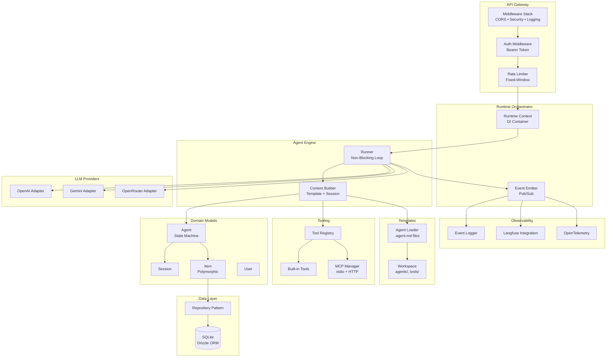
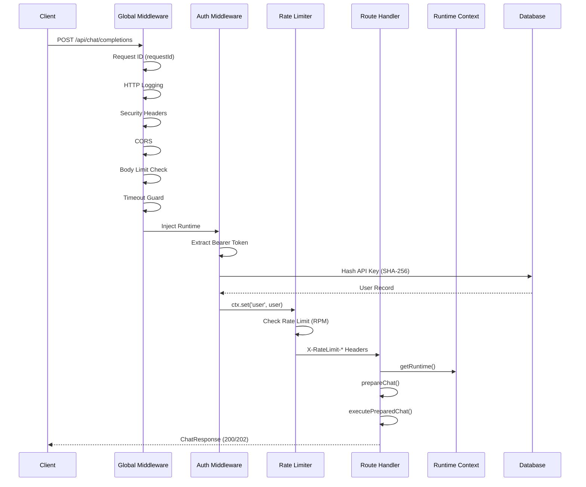
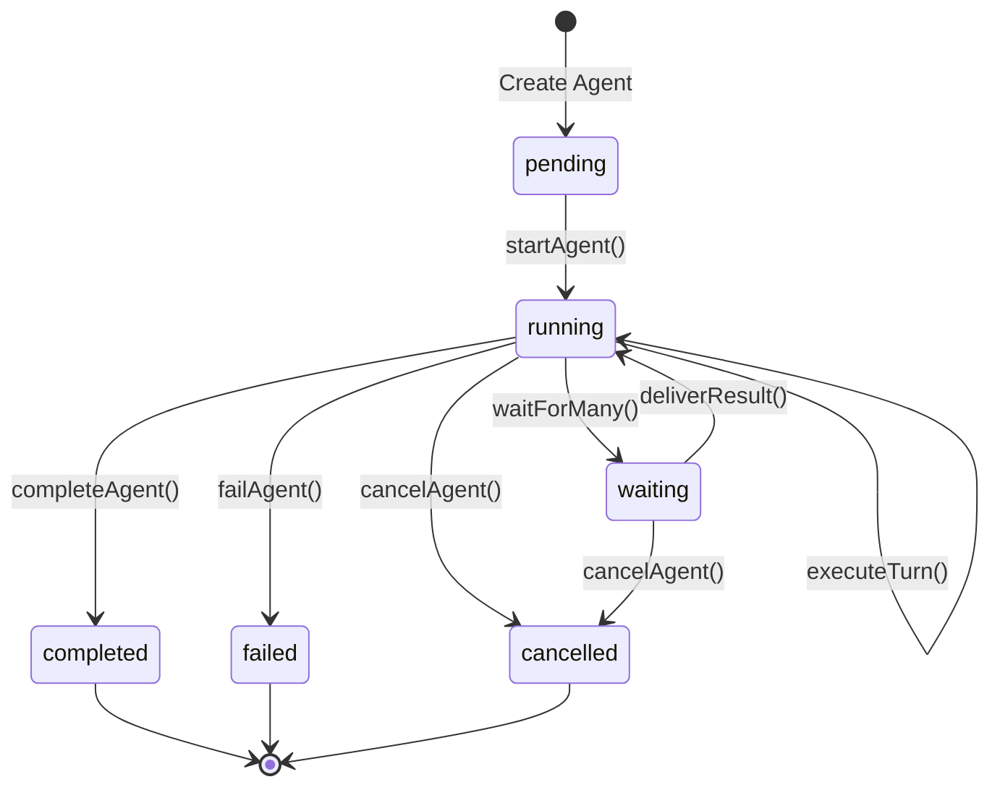
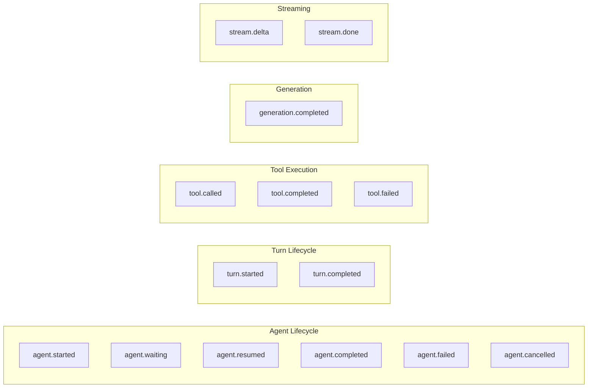
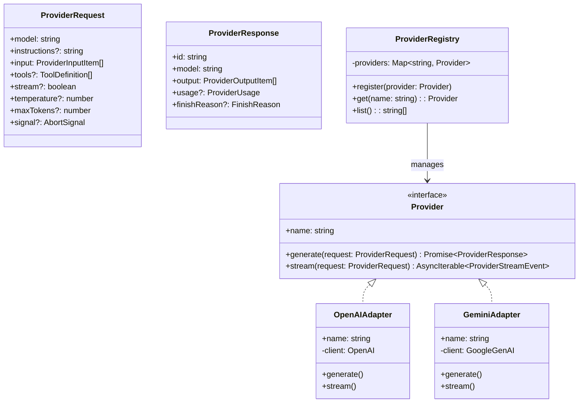
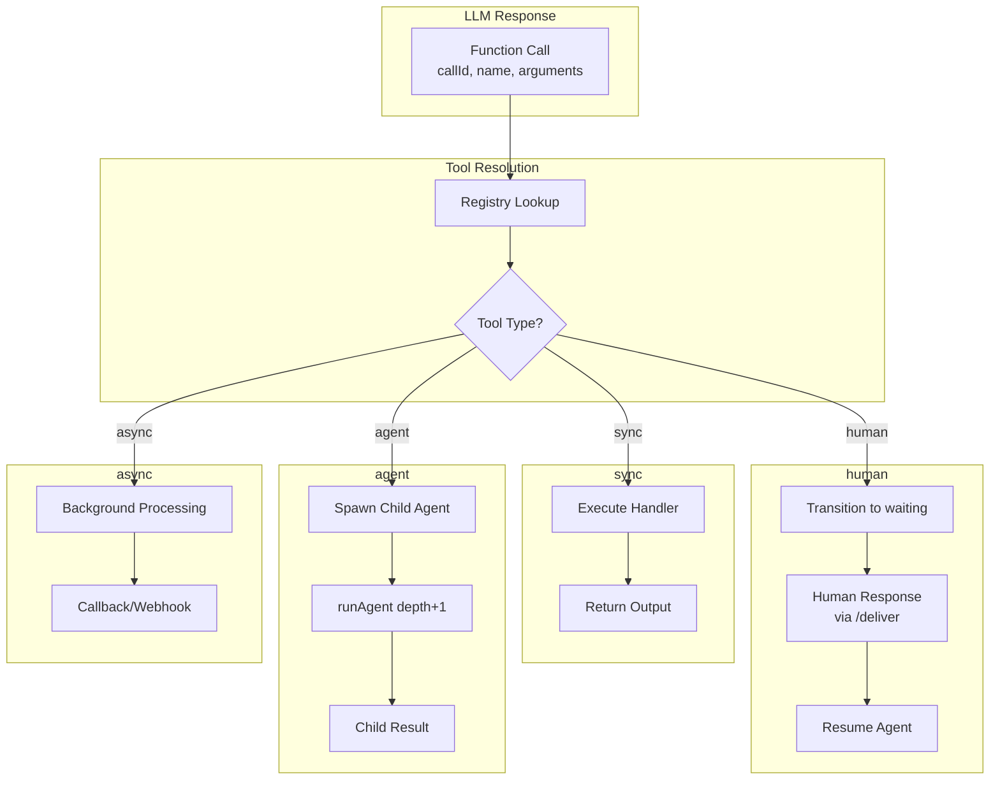
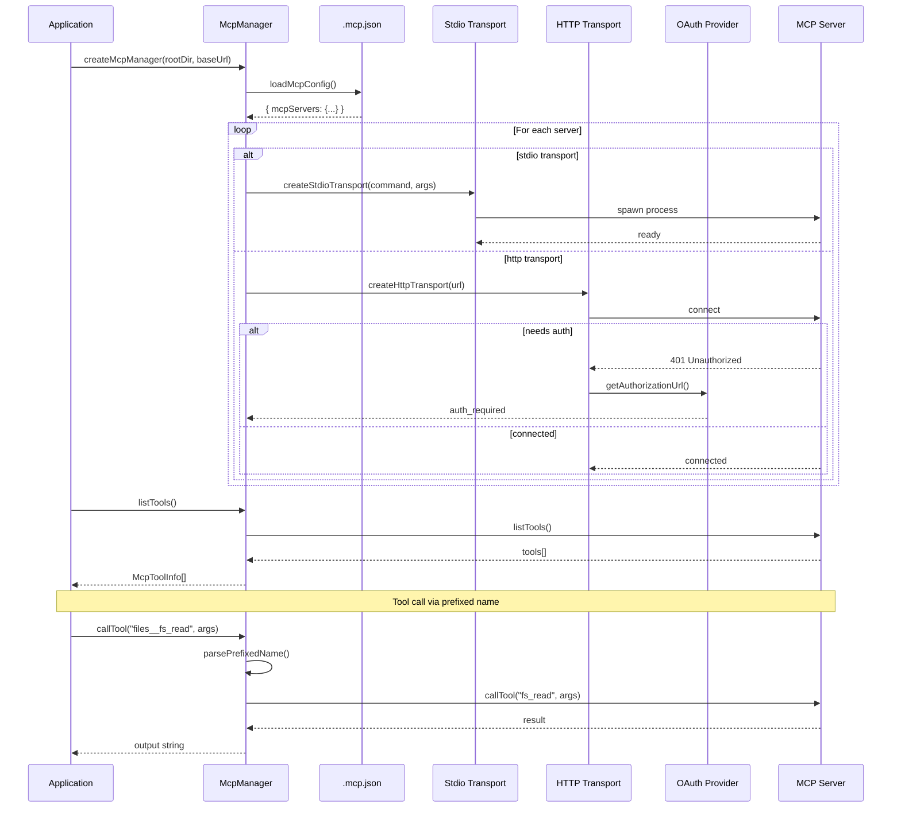
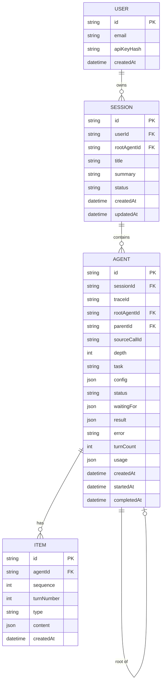
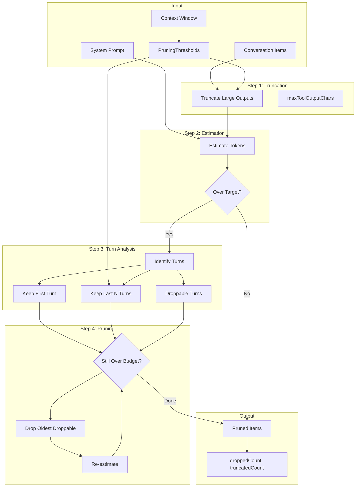
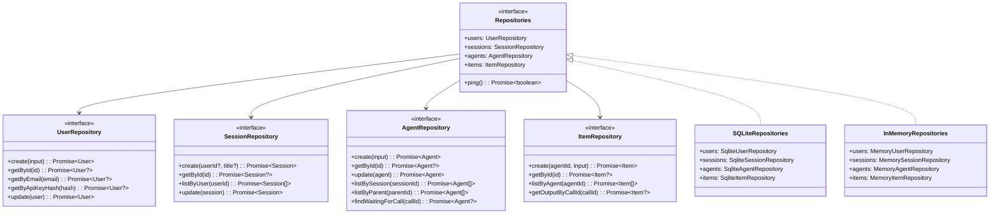

# 01_05_agent Architecture Document

> **Source Material**: S01E05 — Zarządzanie jawnymi oraz niejawnymi limitami modeli
> **Section**: "Przygotowanie produkcyjnego środowiska" (lines 212-286)
> **Reference Diagrams**: 6 architecture diagrams from the lesson

---

## 1. Executive Overview

The `01_05_agent` codebase is a production-ready TypeScript agent runtime implementing an AI agent system with the following characteristics:

### Key Design Principles

| Principle | Implementation |
|-----------|----------------|
| **No Frameworks** | Zero dependencies on LangChain, CrewAI, or similar AI frameworks |
| **Event-Driven** | All lifecycle transitions emit typed events for observability |
| **Provider Abstraction** | Unified interface for OpenAI, Gemini, and OpenRouter |
| **Non-Blocking Execution** | Agents can pause (`waiting`) and resume from external input |
| **Hierarchical Agents** | Support for parent-child agent delegation |

### Technology Stack

- **Runtime**: Node.js with TypeScript
- **Web Framework**: Hono (lightweight, edge-compatible)
- **Database**: SQLite with Drizzle ORM
- **AI Providers**: OpenAI SDK, Google Gemini SDK
- **MCP**: @modelcontextprotocol/sdk for tool integration
- **Observability**: Langfuse, OpenTelemetry, structured logging (pino)

---

## 2. System Architecture Diagram



### File References

| Component | File | Lines |
|-----------|------|-------|
| Entry Point | `src/index.ts` | 8-60 |
| App Configuration | `src/lib/app.ts` | 26-96 |
| Runtime Initialization | `src/lib/runtime.ts` | 37-100 |
| Runner (Agent Loop) | `src/runtime/runner.ts` | 1-1078 |

---

## 3. API Layer

### Request Flow Sequence



### Endpoints

| Method | Path | Auth | Description | Handler File |
|--------|------|------|-------------|--------------|
| POST | /api/chat/completions | Yes | Create chat completion (streaming or sync) | `src/routes/chat.ts:22-76` |
| POST | /api/chat/agents/:id/deliver | Yes | Deliver result to waiting agent | `src/routes/chat.ts:79-111` |
| GET | /api/chat/agents/:id | Yes | Get agent status | `src/routes/chat.ts:114-140` |
| GET | /health | No | Health check (runtime + DB) | `src/lib/app.ts:82-93` |

### Middleware Stack

```typescript
// src/lib/app.ts:26-73
app.use(requestId())
app.use(httpLogging)
app.use(secureHeaders())
app.use(cors({ origin, methods, headers }))
app.use('/api/*', bodyLimit({ maxSize }))
app.use('/api/*', timeout(config.timeoutMs))
app.use('/api/*', injectRuntime)
app.use('/api/*', bearerAuth)      // src/middleware/auth.ts:24-55
app.use('/api/*', rateLimiter)     // src/middleware/rate-limit.ts:31-60
```

---

## 4. Context Assembly Flow

```mermaid
flowchart TB
    subgraph "Request Input"
        REQ[Chat Request<br/>{agent, message, sessionId?}]
    end

    subgraph "Agent Template"
        MD[.agent.md File]
        FM[Frontmatter<br/>name, model, tools]
        SYS[System Prompt<br/>markdown body]
    end

    subgraph "Tool Resolution"
        TREG[Tool Registry]
        MCP[MCP Manager]
        RESOLVED[ToolDefinition[]]
    end

    subgraph "Session State"
        SNEW[New Session]
        SEXIST[Existing Session]
        ITEMS[Conversation Items<br/>from DB]
    end

    subgraph "Merging"
        MERGE[Context Builder]
        FINAL[AgentConfig<br/>model + systemPrompt + tools]
    end

    REQ --> MD
    MD --> FM
    MD --> SYS
    FM --> TREG
    FM --> MCP
    TREG --> RESOLVED
    MCP --> RESOLVED
    RESOLVED --> MERGE

    REQ --> SNEW
    REQ --> SEXIST
    SEXIST --> ITEMS
    SNEW --> MERGE
    ITEMS --> MERGE

    SYS --> MERGE
    FM --> MERGE
    MERGE --> FINAL
```

### Tool Resolution

**Supported Tool Formats:**

| Format | Example | Resolution |
|--------|---------|------------|
| Built-in | `calculator` | Tool Registry lookup |
| Native | `web_search` | Direct mapping to `type: 'web_search'` |
| MCP Tool | `files__fs_read` | MCP Manager (server__toolName pattern) |

**File References:**

| Function | File | Lines |
|----------|------|-------|
| resolveToolDefinitions | `src/workspace/loader.ts` | 52-95 |
| resolveAgent | `src/workspace/loader.ts` | 114-131 |
| loadAgentTemplate | `src/workspace/loader.ts` | 28-42 |

---

## 5. Agent Loop & Events

### State Machine



### Event Types



### Event Definitions Table

| Event | Emitted When | File:Line |
|-------|--------------|-----------|
| `agent.started` | Agent begins execution | `runner.ts:751-759` |
| `turn.started` | New turn begins | `runner.ts:776-780` |
| `tool.called` | Tool invocation starts | `runner.ts:262,341,364` |
| `tool.completed` | Tool returns success | `runner.ts:275,377-378` |
| `tool.failed` | Tool throws error | `runner.ts:287,380` |
| `turn.completed` | Turn finishes | `runner.ts:804-809` |
| `agent.waiting` | Agent pauses for external input | `runner.ts:818-823` |
| `agent.resumed` | Agent continues after delivery | `runner.ts:906-911` |
| `agent.completed` | Agent finishes successfully | `runner.ts:839-845` |
| `agent.failed` | Agent encounters error | `runner.ts:788-793` |
| `agent.cancelled` | Agent cancelled (abort) | `runner.ts:772,852-854` |

### Event Types (TypeScript)

```typescript
// src/events/types.ts:26-55
export type AgentEvent =
  | { type: 'agent.started'; ctx: EventContext; model: string; task: string; agentName?: string }
  | { type: 'agent.waiting'; ctx: EventContext; waitingFor: WaitingFor[] }
  | { type: 'agent.resumed'; ctx: EventContext; deliveredCallId: CallId; remaining: number }
  | { type: 'agent.completed'; ctx: EventContext; durationMs: number; usage?: TokenUsage }
  | { type: 'agent.failed'; ctx: EventContext; error: string }
  | { type: 'agent.cancelled'; ctx: EventContext }
  | { type: 'turn.started'; ctx: EventContext; turnCount: number }
  | { type: 'turn.completed'; ctx: EventContext; turnCount: number; usage?: TokenUsage }
  | { type: 'tool.called'; ctx: EventContext; callId: CallId; name: string; arguments: Record<string, unknown> }
  | { type: 'tool.completed'; ctx: EventContext; callId: CallId; name: string; output: string; durationMs: number }
  | { type: 'tool.failed'; ctx: EventContext; callId: CallId; name: string; error: string }
  // ... more events
```

---

## 6. Provider Abstraction Layer

### Class Diagram



### Unified Types

```typescript
// src/providers/types.ts

// Lines 6-15: Request
interface ProviderRequest {
  model: string
  instructions?: string
  input: ProviderInputItem[]
  tools?: ToolDefinition[]
  stream?: boolean
  temperature?: number
  maxTokens?: number
  signal?: AbortSignal
}

// Lines 17-22: Input Items
type ProviderInputItem =
  | { type: 'message'; role: 'user' | 'assistant' | 'system'; content: Content }
  | { type: 'function_call'; callId: string; name: string; arguments: Record<string, unknown> }
  | { type: 'function_result'; callId: string; name: string; output: string }
  | { type: 'reasoning'; text: string; signature?: string }

// Lines 23-29: Response
interface ProviderResponse {
  id: string
  model: string
  output: ProviderOutputItem[]
  usage?: ProviderUsage
  finishReason?: 'stop' | 'tool_calls' | 'length' | 'content_filter' | 'error'
}

// Lines 40-43: Output Items
type ProviderOutputItem =
  | { type: 'text'; text: string }
  | { type: 'function_call'; callId: string; name: string; arguments: Record<string, unknown> }
  | { type: 'reasoning'; text: string; signature?: string }

// Lines 46-58: Stream Events
type ProviderStreamEvent =
  | { type: 'text_delta'; delta: string }
  | { type: 'text_done'; text: string }
  | { type: 'function_call_delta'; callId: string; name: string; argumentsDelta: string }
  | { type: 'function_call_done'; callId: string; name: string; arguments: Record<string, unknown> }
  | { type: 'reasoning_delta'; delta: string }
  | { type: 'reasoning_done'; text: string }
  | { type: 'done'; response: ProviderResponse }
  | { type: 'error'; error: string; code?: string }

// Lines 60-64: Provider Interface
interface Provider {
  name: string
  generate(request: ProviderRequest): Promise<ProviderResponse>
  stream(request: ProviderRequest): AsyncIterable<ProviderStreamEvent>
}
```

### File References

| Component | File |
|-----------|------|
| Provider Interface | `src/providers/types.ts:60-64` |
| OpenAI Adapter | `src/providers/openai/adapter.ts` |
| Gemini Adapter | `src/providers/gemini/adapter.ts` |
| Registry | `src/providers/registry.ts:8-39` |

---

## 7. Tool System

### Execution Flow



### Tool Types

```typescript
// src/tools/types.ts:6-29

type ToolType = 'sync' | 'async' | 'agent' | 'human'

interface Tool {
  type: ToolType
  definition: FunctionTool
  handler: ToolHandler
}

type ToolHandler = (
  args: Record<string, unknown>,
  signal?: AbortSignal
) => Promise<ToolResult>

type ToolResult =
  | { ok: true; output: string }
  | { ok: false; error: string }
```

### Built-in Tools

| Tool | Type | Description | File |
|------|------|-------------|------|
| `calculator` | sync | Basic math operations | `src/tools/definitions/calculator.ts:27-58` |
| `delegate` | agent | Spawn child agent for subtask | `src/tools/definitions/delegate.ts:19-51` |
| `ask_user` | human | Pause for human input | `src/tools/definitions/ask-user.ts:15-44` |
| `send_message` | sync | Send message to parent/user | `src/tools/definitions/send-message.ts` |

---

## 8. MCP Integration

### Connection Sequence



### Configuration Types

```typescript
// src/mcp/types.ts

interface McpStdioServer {
  transport?: 'stdio'
  command: string
  args?: string[]
  env?: Record<string, string>
  cwd?: string
}

interface McpHttpServer {
  transport: 'http'
  url: string
  headers?: Record<string, string>
}

type McpServerConfig = McpStdioServer | McpHttpServer

interface McpConfig {
  mcpServers: Record<string, McpServerConfig>
}
```

### File References

| Function | File | Lines |
|----------|------|-------|
| loadMcpConfig | `src/mcp/client.ts` | 22-31 |
| createStdioTransport | `src/mcp/client.ts` | 37-50 |
| createHttpTransport | `src/mcp/client.ts` | 52-70 |
| createMcpManager | `src/mcp/client.ts` | 118-268 |
| OAuth Provider | `src/mcp/oauth.ts` | 92-156 |

---

## 9. Domain Models

### Entity Relationship Diagram



### Agent Status States

| Status | Description | Transitions |
|--------|-------------|-------------|
| `pending` | Agent created, not started | → `running` |
| `running` | Actively executing turns | → `waiting`, `completed`, `failed`, `cancelled` |
| `waiting` | Paused for external input | → `running` (resume), `cancelled` |
| `completed` | Successfully finished | (terminal) |
| `failed` | Error during execution | (terminal) |
| `cancelled` | Aborted via signal | (terminal) |

### Entity Definitions

```typescript
// src/domain/agent.ts:26-52
interface Agent {
  id: AgentId
  sessionId: SessionId
  traceId?: TraceId
  rootAgentId: AgentId
  parentId?: AgentId
  sourceCallId?: CallId
  depth: number
  task: string
  config: AgentConfig
  status: AgentStatus
  waitingFor: WaitingFor[]
  result?: unknown
  error?: string
  turnCount: number
  usage?: TokenUsage
  createdAt: Date
  startedAt?: Date
  completedAt?: Date
}

// src/domain/session.ts:6-15
interface Session {
  id: SessionId
  userId?: UserId
  rootAgentId?: AgentId
  title?: string
  summary?: string
  status: SessionStatus
  createdAt: Date
  updatedAt?: Date
}

// src/domain/item.ts:40-44
type Item =
  | MessageItem
  | FunctionCallItem
  | FunctionCallOutputItem
  | ReasoningItem
```

---

## 10. Context Management

### Pruning Strategy Flowchart



### Pruning Algorithm

```typescript
// src/utils/pruning.ts:100-159

function pruneConversation(
  items: Item[],
  systemPrompt: string | undefined,
  contextWindow: number,
  config: PruningThresholds,
): PruningResult {
  const targetTokens = Math.floor(contextWindow * config.targetUtilization)

  // Step 1: Truncate large outputs
  const { items: truncated, truncatedCount } = truncateLargeOutputs(items, config.maxToolOutputChars)

  // Step 2: Estimate tokens
  let estimate = estimateConversationTokens(truncated, systemPrompt)
  if (estimate <= targetTokens) {
    return { items: truncated, estimatedTokens: estimate, droppedCount: 0, truncatedCount, droppedItems: [] }
  }

  // Step 3: Identify turns
  const turns = identifyTurns(truncated)
  if (turns.length <= config.minRecentTurns) {
    return { items: truncated, estimatedTokens: estimate, droppedCount: 0, truncatedCount, droppedItems: [] }
  }

  // Step 4: Keep first turn + last N turns, drop oldest droppable
  const keepFirst = turns[0]
  const keepRecent = turns.slice(-config.minRecentTurns)
  const droppable = turns.slice(1, -config.minRecentTurns)

  // Drop oldest turns until under budget
  // ... iteration logic
}
```

### Configuration

```typescript
// src/config/models.ts:5-24

interface PruningThresholds {
  threshold: number           // Trigger at 85% context usage
  targetUtilization: number   // Aim for 50% after pruning
  minRecentTurns: number      // Always keep 3-5 recent turns
  maxToolOutputChars: number  // Truncate tool outputs > 10000 chars
  enableSummarization: boolean // Optional: summarize dropped content
}

const DEFAULT_PRUNING: PruningThresholds = {
  threshold: 0.85,
  targetUtilization: 0.50,
  minRecentTurns: 3,
  maxToolOutputChars: 10_000,
  enableSummarization: true,
}
```

---

## 11. Observability Layer

### Event Subscription Flow

```mermaid
flowchart LR
    subgraph "Event Sources"
        RUNNER[Runner]
        TOOLS[Tool Execution]
        PROVIDER[Provider Stream]
    end

    subgraph "Event Emitter"
        EMIT[events.emit]
        ONANY[onAny subscriber]
        ONTYPE[on(type) subscriber]
    end

    subgraph "Subscribers"
        LOG[event-logger.ts]
        LANG[langfuse-subscriber.ts]
        OTEL[tracing.ts]
        CUSTOM[Custom Handlers]
    end

    RUNNER --> EMIT
    TOOLS --> EMIT
    PROVIDER --> EMIT

    EMIT --> ONANY
    EMIT --> ONTYPE

    ONANY --> LOG
    ONANY --> LANG
    ONTYPE --> OTEL
    ONTYPE --> CUSTOM
```

### Log Sources

| Source | Type | Content |
|--------|------|---------|
| HTTP Layer | Request/Response | Method, path, status, timing, requestId |
| Agent Engine | Lifecycle Events | started, completed, failed, waiting, resumed |
| Tools/MCP | Execution Events | called, completed, failed with duration |
| Provider | Generation Events | model, tokens, streaming deltas |

### File References

| Component | File | Purpose |
|-----------|------|---------|
| Structured Logging | `src/lib/logger.ts` | pino-based JSON logging |
| Event Logger | `src/lib/event-logger.ts` | Subscribes to all events, logs structured |
| Langfuse Integration | `src/lib/langfuse-subscriber.ts` | Traces, spans, generations |
| OpenTelemetry | `src/lib/tracing.ts` | OTLP export |

---

## 12. Repository Pattern

### Interface Diagram



### Implementation Files

| Repository | Interface | SQLite Implementation |
|------------|-----------|----------------------|
| Users | `src/repositories/types.ts:22-28` | `src/repositories/sqlite/user.ts` |
| Sessions | `src/repositories/types.ts:30-35` | `src/repositories/sqlite/session.ts` |
| Agents | `src/repositories/types.ts:37-44` | `src/repositories/sqlite/agent.ts` |
| Items | `src/repositories/types.ts:58-63` | `src/repositories/sqlite/item.ts` |

---

## 13. Visual Reference from Lesson

### Original Architecture Diagrams

The following diagrams from the lesson provide visual context:

| Diagram | URL | Description |
|---------|-----|-------------|
| System Overview | `https://cloud.overment.com/2026-02-05/ai_devs_4_agent_architecture-5d06a8b6-0.png` | Full system architecture |
| API Configuration | `https://cloud.overment.com/2026-02-05/ai_devs_4_agent_endpoints-fc327318-6.png` | API structure and configuration |
| Context Assembly | `https://cloud.overment.com/2026-02-06/ai_devs_4_assembly-756a88f3-8.png` | Context building flow |
| Agent Loop | `https://cloud.overment.com/2026-02-05/ai_devs_4_agent_loop-08b445ed-f.png` | Event-driven loop |
| Provider Translation | `https://cloud.overment.com/2026-02-05/ai_devs_4_agent_translation-c1b82d83-a.png` | Unified provider interface |
| Observability | `https://cloud.overment.com/2026-02-05/ai_devs_4_agent_observability-495ca647-2.png` | Monitoring and logging |

---

## 14. Key Implementation Patterns

### Non-Blocking Execution

The agent can pause execution (`waiting`) and resume when external input arrives:

```
POST /api/chat/completions → 202 Accepted (waiting)
POST /api/chat/agents/:id/deliver → 200 OK (completed/resumed)
```

### Hierarchical Agents

```typescript
// Parent agent delegates to child
delegate({ agent: "researcher", task: "Find documentation" })

// Runner spawns child with:
// - depth: parent.depth + 1
// - parentId: parent.id
// - rootAgentId: inherited from root
```

### Event-Driven Observability

All lifecycle changes emit events that can be subscribed to:

```typescript
runtime.events.onAny((event) => {
  console.log(event.type, event.ctx.traceId)
})

runtime.events.on('tool.completed', (event) => {
  // Track tool performance
})
```

---

## 15. .NET Porting Considerations

### Direct Mappings

| TypeScript | .NET Equivalent |
|------------|-----------------|
| `Provider` interface | `IChatClient` (Microsoft.Extensions.AI) |
| `ToolRegistry` | `AIFunctionFactory` + custom registry |
| `EventEmitter` | `IObservable<T>` / `EventPattern` |
| `Repository<T>` | Same pattern (interface + EF Core impl) |
| `AbortSignal` | `CancellationToken` |
| `AsyncIterable<T>` | `IAsyncEnumerable<T>` |

### Extension Points

| Area | Microsoft Framework | Extension Needed |
|------|---------------------|------------------|
| Agent orchestration | Microsoft Agent Framework | Non-blocking execution |
| Tool invocation | `FunctionInvokingChatClient` | MCP, human tools |
| Streaming | `IAsyncEnumerable<StreamingUpdate>` | Unified event format |
| Rate limiting | Polly / Aspire | Custom per-user limits |
| Persistence | EF Core / SQLite | Same schema |

---

*Document generated from source analysis of 01_05_agent codebase and lesson S01E05.*
