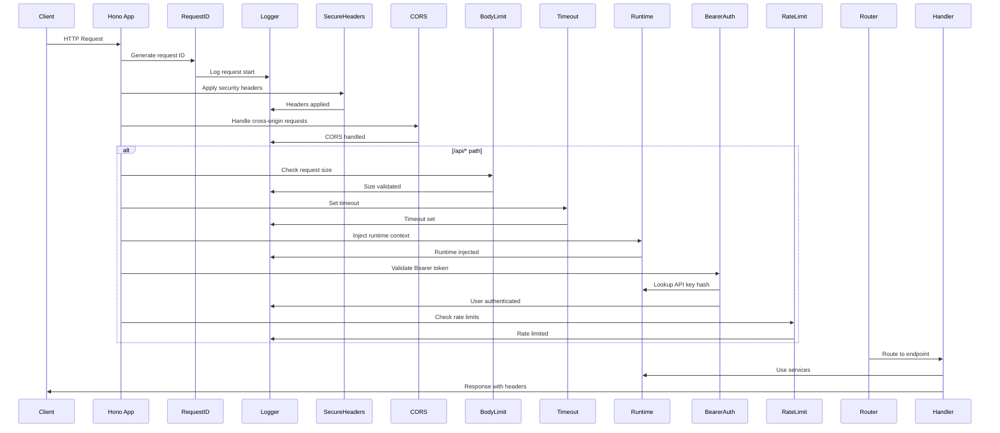

# API Layer Architecture

## Overview

The API layer is built using Hono, a lightweight web framework that provides excellent TypeScript support and middleware capabilities. The architecture follows a middleware-first approach with a well-structured pipeline that ensures security, authentication, rate limiting, and efficient request processing.

### Key Architecture Patterns

1. **Middleware Chain**: Requests flow through a sequence of middleware layers before reaching handlers
2. **Environment Variables**: Type-safe context injection via Hono's Environment interface
3. **Error Handling**: Centralized error handling with consistent API response format
4. **Streaming Support**: Server-Sent Events for real-time chat responses
5. **Modular Routing**: Organized route structure with nested routing

### Environment Context

```typescript
export type AppEnv = {
  Variables: {
    requestId: string          // Unique request identifier for tracing
    runtime: RuntimeContext    // Application services and repositories
  }
}
```

## Request Flow

### Mermaid Sequence Diagram



## Middleware Stack

### Order and Purpose

| Order | Middleware | Applied To | Purpose | File Reference |
|-------|------------|------------|---------|---------------|
| 1 | `requestId()` | All requests | Generate unique request ID for tracing | `src/lib/app.ts:28` |
| 2 | Request Logging | All requests | Structured HTTP request/response logging | `src/lib/app.ts:31-42` |
| 3 | `secureHeaders()` | All requests | Security headers (CSP, XSS protection) | `src/lib/app.ts:44` |
| 4 | CORS | All requests | Cross-origin request handling | `src/lib/app.ts:46-53` |
| 5 | `bodyLimit` | `/api/*` | Prevent large payload attacks | `src/lib/app.ts:55-58` |
| 6 | `timeout` | `/api/*` | Request timeout protection | `src/lib/app.ts:60` |
| 7 | `injectRuntime` | `/api/*` & `/mcp/*` | Inject application services | `src/lib/app.ts:63-68` |
| 8 | `bearerAuth` | `/api/*` | Bearer token authentication | `src/lib/app.ts:72` |
| 9 | `rateLimiter` | `/api/*` | Rate limiting by user | `src/lib/app.ts:73` |

### Authentication Middleware (`src/middleware/auth.ts`)

- **Purpose**: Validates Bearer tokens against hashed API keys in database
- **Security Features**:
  - SHA-256 hashing of API keys for storage
  - Secure lookup against user repository
  - Type-safe context injection

Key functions:
- `hashApiKey()` (lines 11-17): SHA-256 hashing implementation
- `bearerAuth()` (lines 24-55): Main authentication middleware

### Rate Limiting Middleware (`src/middleware/rate-limit.ts`)

- **Pattern**: Fixed-window rate limiter
- **Key**: User ID from authenticated context
- **Window**: 1-minute intervals
- **Headers**: Returns rate limit headers for client awareness
- **Memory Management**: Automatic cleanup of expired windows

Key features:
- Configurable limit via `config.rateLimitRpm`
- Headers: `X-RateLimit-Limit`, `X-RateLimit-Remaining`, `X-RateLimit-Reset`
- 429 response with `Retry-After` header on limit exceeded

## Endpoints

### Chat API (`/api/chat`)

| Method | Path | Auth | Handler |
|--------|------|------|---------|
| POST | `/api/chat/completions` | Required | `src/routes/chat.ts:22-76` |
| POST | `/api/chat/agents/:agentId/deliver` | Required | `src/routes/chat.ts:79-111` |
| GET | `/api/chat/agents/:agentId` | Required | `src/routes/chat.ts:114-140` |

### MCP API (`/mcp`) - Public Routes

| Method | Path | Auth | Handler |
|--------|------|------|---------|
| GET | `/mcp/servers` | None | `src/routes/mcp.ts:17-29` |
| GET | `/mcp/:server/auth` | None | `src/routes/mcp.ts:35-66` |
| GET | `/mcp/:server/callback` | None | `src/routes/mcp.ts:72-119` |

### System API

| Method | Path | Auth | Handler |
|--------|------|------|---------|
| GET | `/health` | None | `src/lib/app.ts:82-93` |

## Request/Response Schemas

### Chat Completion Request (`src/routes/chat.schema.ts:23-35`)

```typescript
export const chatRequestSchema = z.object({
  agent: z.string().optional(),              // Predefined agent template
  model: z.string().optional(),               // Override agent model
  instructions: z.string().optional(),        // Custom instructions
  input: z.union([z.string(), array(inputItemSchema)]),
  tools: array(toolSchema).optional(),
  stream: z.boolean().default(false),         // Streaming response
  temperature: number.min(0).max(2).optional(),
  maxTokens: number.positive().optional(),
  sessionId: z.string().optional(),
})
```

### Chat Response (`src/routes/chat.response.ts:3-11`)

```typescript
export interface ChatResponse {
  id: string
  sessionId: string
  status: 'completed' | 'waiting' | 'failed'
  model: string
  output: OutputItem[]
  waitingFor?: WaitingFor[]
  usage?: { inputTokens: number; outputTokens: number; totalTokens: number }
}
```

## Error Handling

### Error Response Format (`src/errors/index.ts:10-13`)

```typescript
export interface ApiResponse<T = unknown> {
  data: T | null
  error: { message: string; details?: unknown } | null
}
```

### Error Factories (`src/errors/index.ts:16-40`)

| Factory Function | HTTP Status | Purpose |
|-----------------|-------------|---------|
| `err.validation()` | 400 | Invalid request data |
| `err.unauthorized()` | 401 | Missing/invalid auth |
| `err.forbidden()` | 403 | Insufficient permissions |
| `err.notFound()` | 404 | Resource not found |
| `err.rateLimited()` | 429 | Rate limit exceeded |
| `err.timeout()` | 408 | Request timeout |
| `err.payloadTooLarge()` | 413 | Body too large |
| `err.internal()` | 500 | Server error |

## Service Layer

### Chat Service (`src/routes/chat.service.ts`)

| Function | Lines | Purpose |
|----------|-------|---------|
| `prepareChat()` | 41-43 | Setup chat turn and validate |
| `executePreparedChat()` | 45-73 | Execute agent with prepared state |
| `streamPreparedChat()` | 110-121 | Stream execution results |
| `deliverResult()` | 84-108 | Deliver tool results to waiting agents |

### Service Patterns

1. **Preparation Phase**: Setup agent and validate request
2. **Execution Phase**: Run agent with max turns limit
3. **Response Filtering**: Only show items since last response
4. **Streaming**: Real-time SSE stream for long-running operations
5. **Status Handling**: Differentiate between completed and waiting responses

## .NET Mapping Section

### ASP.NET Core Minimal API Equivalent

```csharp
// Program.cs equivalent
var builder = WebApplication.CreateBuilder(args);
var app = builder.Build();

// Middleware pipeline
app.Use(async (context, next) => {
    var start = DateTime.UtcNow;
    await next();
    var elapsed = DateTime.UtcNow - start;
    // Logging
});

app.UseHsts(); // secureHeaders()
app.UseCors(); // CORS middleware

// API routes with auth
app.MapGroup("/api")
   .RequireAuthorization() // bearerAuth equivalent
   .UseRateLimiting() // rateLimiter equivalent
   .MapChatEndpoints(); // Chat endpoints
```

### Middleware Implementation

```csharp
// Request ID middleware
app.UseMiddleware<RequestIdMiddleware>();

// Authentication middleware
app.UseMiddleware<BearerTokenMiddleware>();

// Rate limiting middleware
app.UseMiddleware<RateLimitMiddleware>();
```

### Endpoint Definitions

```csharp
app.MapPost("/api/chat/completions", async (
    [FromBody] ChatRequest request,
    IUserRepository userRepository,
    IAgentService agentService,
    CancellationToken cancellationToken) => {

    var user = await userRepository.AuthenticateAsync(request.ApiKey);
    var result = await agentService.CreateChatAsync(request, user);

    return result.Stream
        ? Results.Stream(StreamChat(result, cancellationToken), "text/event-stream")
        : Results.Ok(result);
})
.WithName("CreateChat")
.WithOpenApi();
```

### Pattern Mapping Table

| Hono Pattern | ASP.NET Core Equivalent |
|--------------|------------------------|
| `createMiddleware<Env>` | `app.UseMiddleware<T>()` |
| `c.set('key', value)` | `HttpContext.Items[key]` |
| `c.get('key')` | `HttpContext.Items[key]` |
| `zValidator` | Model validation with Data Annotations |
| `streamSSE` | `Results.Stream` with text/event-stream |
| `Hono<Env>` | Custom middleware with HttpContext extension |
