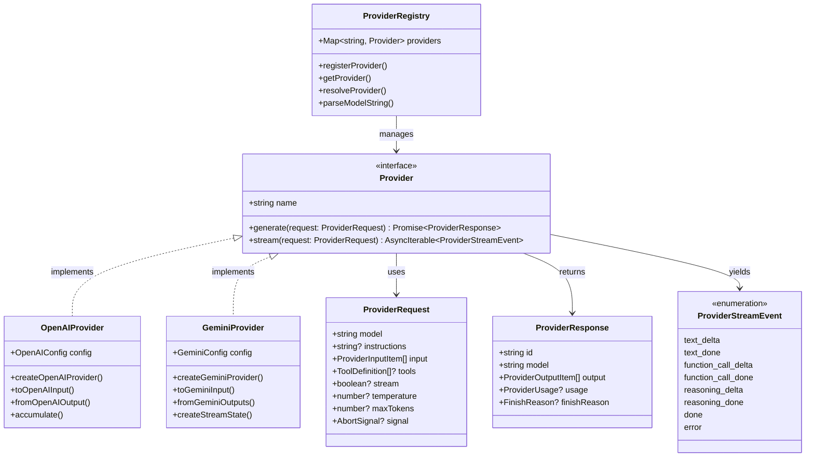

# Provider Abstraction Layer

## Overview

The Provider abstraction layer provides a unified interface for interacting with different LLM providers (OpenAI, Gemini, OpenRouter) through a common `Provider` interface. This abstraction allows the application to work with multiple providers using the same API, while each adapter handles provider-specific implementation details.

### Key Design Principles

- **Unified Interface**: All providers implement the same `Provider` interface
- **Model String Convention**: Models are specified as `provider:model` (e.g., `openai:gpt-5.4`)
- **Registry Pattern**: Providers are registered and resolved through a central registry
- **Streaming Support**: Both providers support streaming with normalized stream events
- **Cross-Provider Compatibility**: Special handling for features like reasoning and web search

## Architecture Diagram



## Type Definitions

### Core Types

| Type Name | Purpose | Lines |
|-----------|---------|-------|
| `Provider` | Core interface that all providers must implement | `types.ts:60-64` |
| `ProviderRequest` | Request structure for provider calls | `types.ts:6-15` |
| `ProviderResponse` | Response wrapper with output and metadata | `types.ts:23-29` |
| `ProviderInputItem` | Union of input item types | `types.ts:17-21` |
| `ProviderOutputItem` | Union of output item types | `types.ts:40-43` |
| `ProviderStreamEvent` | Streaming events with normalized types | `types.ts:46-58` |
| `ProviderUsage` | Token usage statistics | `types.ts:31-36` |
| `FinishReason` | Completion status indicators | `types.ts:38` |

### Input/Output Types

```typescript
// ProviderInputItem (types.ts:17-21)
type ProviderInputItem =
  | { type: 'message'; role: 'user' | 'assistant' | 'system'; content: Content }
  | { type: 'function_call'; callId: string; name: string; arguments: Record<string, unknown> }
  | { type: 'function_result'; callId: string; name: string; output: string }
  | { type: 'reasoning'; text: string; signature?: string }

// ProviderOutputItem (types.ts:40-43)
type ProviderOutputItem =
  | { type: 'text'; text: string }
  | { type: 'function_call'; callId: string; name: string; arguments: Record<string, unknown> }
  | { type: 'reasoning'; text: string; signature?: string; provider?: string }
```

## Streaming Events

| Event Type | When Emitted | Description |
|------------|--------------|-------------|
| `text_delta` | During streaming text generation | Incremental text chunks |
| `text_done` | When text generation completes | Final text value |
| `function_call_delta` | During function argument streaming | Incremental arguments |
| `function_call_done` | When function call completes | Final function call |
| `reasoning_delta` | During reasoning/thinking content | Incremental reasoning steps |
| `reasoning_done` | When reasoning content completes | Final reasoning text |
| `done` | When streaming completes | Final response with all output |
| `error` | On error conditions | Error information with optional code |

## Provider Features Comparison

| Feature | OpenAI Provider | Gemini Provider |
|---------|----------------|-----------------|
| **Streaming** | ✅ Full support | ✅ Full support |
| **Function Calling** | ✅ With streaming args | ✅ Complete calls only |
| **Vision Support** | ✅ Images via `input_image` | ✅ Via content types |
| **Web Search** | ✅ Via `web_search_preview` tool | ✅ Via `google_search` tool |
| **Reasoning/Thinking** | ✅ o-series models | ✅ 2.0 models |
| **Model Transform** | ✅ Via `transformModel` config | ❌ Not supported |
| **Custom Base URL** | ✅ Via `baseUrl` config | ❌ Not supported |
| **Default Headers** | ✅ Via `defaultHeaders` config | ❌ Not supported |

## Provider Registry

The registry manages provider registration and resolution:

```typescript
// registry.ts (lines 6-18)
const providers = new Map<string, Provider>()

export function registerProvider(provider: Provider): void {
  providers.set(provider.name, provider)
}

export function getProvider(name: string): Provider | undefined {
  return providers.get(name)
}

export function resolveProvider(modelString: string) {
  // Parse "openai:gpt-5.4" -> { providerName: "openai", model: "gpt-5.4" }
  const parsed = parseModelString(modelString)
  return { provider: providers.get(parsed.providerName), model: parsed.model }
}
```

### Model String Parsing

```typescript
// Format: "provider:model" or just "model" (defaults to default provider)
function parseModelString(modelString: string): { providerName: string; model: string } {
  const colonIndex = modelString.indexOf(':')
  if (colonIndex === -1) {
    return { providerName: config.defaultProvider, model: modelString }
  }
  return {
    providerName: modelString.slice(0, colonIndex),
    model: modelString.slice(colonIndex + 1)
  }
}
```

## .NET Mapping Section

### Interface Mapping

| TypeScript | .NET Equivalent |
|------------|-----------------|
| `Provider` | `IChatClient` |
| `generate()` | `CompleteAsync()` |
| `stream()` | `CompleteStreamingAsync()` |
| `ProviderRequest` | `ChatMessage[]` + `ChatOptions` |
| `ProviderResponse` | `ChatResponse` |
| `ProviderStreamEvent` | `StreamingChatCompletionUpdate` |
| `AbortSignal` | `CancellationToken` |

### Provider Registration

```typescript
// TypeScript
registerProvider(createOpenAIProvider({
  apiKey: process.env.OPENAI_API_KEY,
  name: 'openai'
}))

// .NET Equivalent
services.AddOpenAIClient(options => {
    options.ApiKey = configuration["OpenAI:ApiKey"];
})
    .AsIChatClient();

// Or with ChatClientBuilder for middleware pipeline
services.AddChatClient(client =>
    new ChatClientBuilder(client)
        .UseLogging()
        .UseRetry()
        .Build())
    .AsIChatClient();
```

### Delegating Handlers Pattern

The TypeScript provider system can be enhanced with .NET's delegating handlers:

```csharp
// Custom delegating handler for cross-cutting concerns
public class LoggingChatClient : DelegatingChatClient
{
    public LoggingChatClient(IChatClient innerClient) : base(innerClient) { }

    public override async Task<ChatResponse> CompleteAsync(
        IList<ChatMessage> messages,
        ChatOptions? options = null,
        CancellationToken cancellationToken = default)
    {
        // Pre-processing (logging, metrics, etc.)
        var startTime = DateTime.UtcNow;

        try
        {
            var response = await base.CompleteAsync(messages, options, cancellationToken);

            // Post-processing
            var duration = DateTime.UtcNow - startTime;
            // Log response...

            return response;
        }
        catch (Exception ex)
        {
            // Error handling
            throw;
        }
    }
}
```

### Key Benefits of Microsoft.Extensions.AI

1. **Unified Interface**: Same `IChatClient` for all providers
2. **Middleware Pipeline**: Composable via `DelegatingChatClient`
3. **Built-in Features**: Logging, telemetry, retry via builders
4. **Streaming**: `IAsyncEnumerable<StreamingUpdate>` pattern
5. **Function Calling**: `AIFunction` and function invocation support
