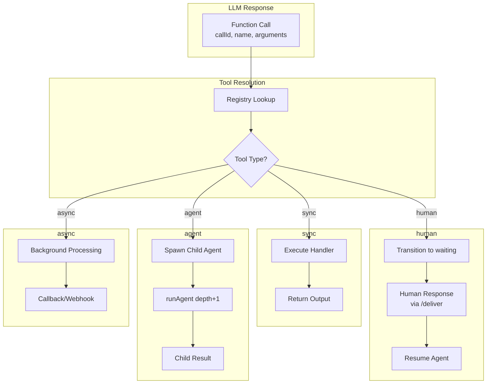

# Tool System Architecture

## Overview

The Tool system provides a unified abstraction for defining, registering, and executing tools that agents can invoke during conversations. The system supports multiple tool types with different execution behaviors, enabling both synchronous operations and complex multi-agent workflows.

### Key Design Principles

- **Unified Interface**: All tools share a common `Tool` interface
- **Type-Based Execution**: Different tool types trigger different execution patterns
- **Registry Pattern**: Centralized tool registration and lookup
- **Abort Support**: All tool handlers receive an optional `AbortSignal`
- **Consistent Results**: Tools return standardized `ToolResult` objects

## Tool Execution Flow



## Tool Types

### Type Definitions

```typescript
// src/tools/types.ts:6-29

type ToolType = 'sync' | 'async' | 'agent' | 'human'

interface Tool {
  type: ToolType
  definition: FunctionTool
  handler: ToolHandler
}

type ToolHandler = (
  args: Record<string, unknown>,
  signal?: AbortSignal
) => Promise<ToolResult>

type ToolResult =
  | { ok: true; output: string }
  | { ok: false; error: string }
```

### Tool Types Comparison

| Type | Blocking | Description | Use Case |
|------|----------|-------------|----------|
| `sync` | Yes | Immediate execution | Calculations, data transformations |
| `async` | No | Background processing | Long-running operations, webhooks |
| `agent` | Yes | Child agent delegation | Complex subtasks, specialized work |
| `human` | No | Requires human input | Confirmations, clarifications |

## Built-in Tools

| Tool | Type | Description | File |
|------|------|-------------|------|
| `calculator` | sync | Basic math operations (add, subtract, multiply, divide) | `definitions/calculator.ts:27-58` |
| `delegate` | agent | Spawn child agent for subtask | `definitions/delegate.ts:19-51` |
| `ask_user` | human | Pause for human input | `definitions/ask-user.ts:15-44` |
| `send_message` | sync | Send message to parent/user | `definitions/send-message.ts:19-51` |

### Calculator Tool (sync)

```typescript
// definitions/calculator.ts:27-58
export const calculatorTool: Tool = {
  type: 'sync',
  definition: {
    type: 'function',
    name: 'calculator',
    description: 'Perform basic math operations: add, subtract, multiply, divide',
    parameters: {
      type: 'object',
      properties: {
        operation: { type: 'string', enum: ['add', 'subtract', 'multiply', 'divide'] },
        a: { type: 'number' },
        b: { type: 'number' },
      },
      required: ['operation', 'a', 'b'],
    },
  },
  handler: async (args) => {
    const { operation, a, b } = args as CalculatorArgs
    const result = calculate({ operation, a, b })
    return { ok: true, output: String(result) }
  },
}
```

### Delegate Tool (agent)

```typescript
// definitions/delegate.ts:19-51
export const delegateTool: Tool = {
  type: 'agent',
  definition: {
    type: 'function',
    name: 'delegate',
    description: 'Delegate a task to another agent and wait for the result.',
    parameters: {
      type: 'object',
      properties: {
        agent: { type: 'string', description: 'Name of the agent template' },
        task: { type: 'string', description: 'What the child agent should accomplish' },
      },
      required: ['agent', 'task'],
    },
  },
  handler: async (args) => {
    // Validation only — real execution handled by runner
    const { agent, task } = args as DelegateArgs
    if (!agent || !task) {
      return { ok: false, error: 'Both "agent" and "task" are required' }
    }
    return { ok: true, output: JSON.stringify({ agent, task }) }
  },
}
```

### Ask User Tool (human)

```typescript
// definitions/ask-user.ts:15-44
export const askUserTool: Tool = {
  type: 'human',
  definition: {
    type: 'function',
    name: 'ask_user',
    description: 'Ask the user a question and wait for their response.',
    parameters: {
      type: 'object',
      properties: {
        question: { type: 'string', description: 'The question to ask' },
      },
      required: ['question'],
    },
  },
  handler: async (args) => {
    // Validation only — the runner defers this to waitingFor
    const { question } = args as AskUserArgs
    if (!question) {
      return { ok: false, error: '"question" is required' }
    }
    return { ok: true, output: question }
  },
}
```

## Tool Registry

### Interface

```typescript
// src/tools/types.ts:24-29
interface ToolRegistry {
  register(tool: Tool): void
  get(name: string): Tool | undefined
  list(): FunctionTool[]
  execute(name: string, args: Record<string, unknown>, signal?: AbortSignal): Promise<ToolResult>
}
```

### Implementation

```typescript
// src/tools/registry.ts
export function createToolRegistry(): ToolRegistry {
  const tools = new Map<string, Tool>()

  return {
    register(tool: Tool): void {
      tools.set(tool.definition.name, tool)
    },

    get(name: string): Tool | undefined {
      return tools.get(name)
    },

    list(): FunctionTool[] {
      return Array.from(tools.values()).map(t => t.definition)
    },

    async execute(name: string, args: Record<string, unknown>, signal?: AbortSignal): Promise<ToolResult> {
      const tool = tools.get(name)
      if (!tool) {
        return { ok: false, error: `Tool not found: ${name}` }
      }
      return tool.handler(args, signal)
    },
  }
}
```

## .NET Mapping Section

### AIFunctionFactory Mapping

| TypeScript | .NET Equivalent |
|------------|-----------------|
| `Tool` interface | `AIFunction` class |
| `ToolHandler` | `Func<JsonElement, Task<string>>` |
| `ToolRegistry` | Custom registry + `AIFunctionFactory` |
| `ToolResult` | `string` result or exception |

### Tool Definition Pattern

```csharp
// C# equivalent using Microsoft.Extensions.AI
public class CalculatorTool : AIFunction
{
    public override string Name => "calculator";
    public override string Description => "Perform basic math operations";

    public override JsonElement Parameters => JsonDocument.Parse("""
    {
        "type": "object",
        "properties": {
            "operation": { "type": "string", "enum": ["add", "subtract", "multiply", "divide"] },
            "a": { "type": "number" },
            "b": { "type": "number" }
        },
        "required": ["operation", "a", "b"]
    }
    """).RootElement;

    public override async Task<string> InvokeAsync(JsonElement arguments, CancellationToken cancellationToken = default)
    {
        var operation = arguments.GetProperty("operation").GetString();
        var a = arguments.GetProperty("a").GetDouble();
        var b = arguments.GetProperty("b").GetDouble();

        var result = operation switch
        {
            "add" => a + b,
            "subtract" => a - b,
            "multiply" => a * b,
            "divide" => a / b,
            _ => throw new ArgumentException($"Unknown operation: {operation}")
        };

        return result.ToString();
    }
}
```

### Tool Registry Pattern

```csharp
// Custom registry implementation
public interface IToolRegistry
{
    void Register(AIFunction tool);
    AIFunction? Get(string name);
    IReadOnlyList<AIFunction> List();
    Task<string> ExecuteAsync(string name, JsonElement args, CancellationToken cancellationToken = default);
}

public class ToolRegistry : IToolRegistry
{
    private readonly Dictionary<string, AIFunction> _tools = new();

    public void Register(AIFunction tool) => _tools[tool.Name] = tool;
    public AIFunction? Get(string name) => _tools.TryGetValue(name, out var tool) ? tool : null;
    public IReadOnlyList<AIFunction> List() => _tools.Values.ToList();

    public async Task<string> ExecuteAsync(string name, JsonElement args, CancellationToken ct = default)
    {
        var tool = Get(name) ?? throw new KeyNotFoundException($"Tool not found: {name}");
        return await tool.InvokeAsync(args, ct);
    }
}
```

### FunctionInvokingChatClient Integration

```csharp
// Using Microsoft.Extensions.AI function invocation
services.AddChatClient(builder => builder
    .UseFunctionInvoking()
    .UseOpenAI());

// Register tools
var registry = new ToolRegistry();
registry.Register(new CalculatorTool());
registry.Register(new DelegateTool());
registry.Register(new AskUserTool());
```
