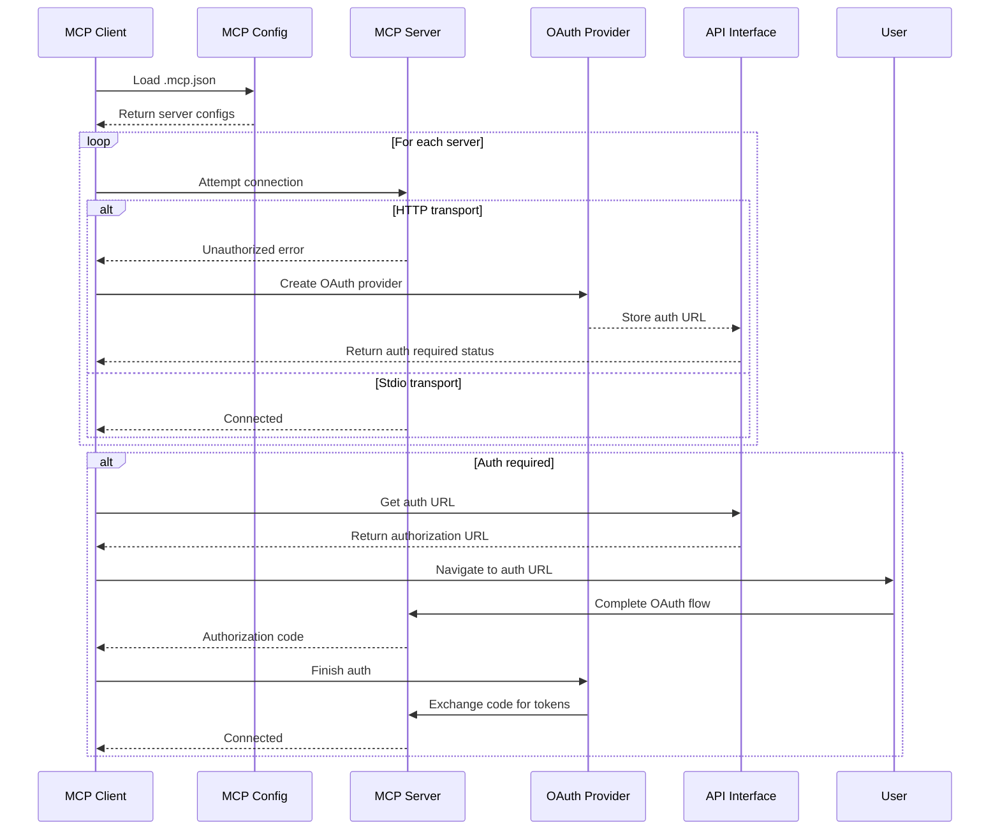

# MCP Integration

## Overview

The MCP (Model Context Protocol) integration provides a unified interface for connecting to and managing multiple MCP servers. It supports two transport types:

1. **Stdio Transport**: Communicates with MCP servers via standard input/output (ideal for local servers)
2. **HTTP Transport**: Connects to HTTP-based MCP servers with OAuth 2.0 authentication

The integration handles:
- Multiple simultaneous server connections
- Tool discovery and name prefixing to prevent conflicts
- OAuth flow for HTTP servers
- Connection state management
- Timeout handling and error management

## MCP Connection Flow



## Configuration Types

### McpConfig

| Field | Type | Description |
|-------|------|-------------|
| `mcpServers` | `Record<string, McpServerConfig>` | Object mapping server names to configurations |

### McpStdioServer (`src/mcp/types.ts:5-11`)

| Field | Type | Description |
|-------|------|-------------|
| `transport?` | `'stdio'` | Optional transport type (defaults to stdio) |
| `command` | `string` | Command to execute |
| `args?` | `string[]` | Command arguments |
| `env?` | `Record<string, string>` | Environment variables |
| `cwd?` | `string` | Working directory |

### McpHttpServer (`src/mcp/types.ts:13-17`)

| Field | Type | Description |
|-------|------|-------------|
| `transport` | `'http'` | Transport type (required) |
| `url` | `string` | Server URL |
| `headers?` | `Record<string, string>` | Additional HTTP headers |

### McpToolInfo (`src/mcp/types.ts:34-40`)

| Field | Type | Description |
|-------|------|-------------|
| `server` | `string` | Server name |
| `originalName` | `string` | Original tool name |
| `prefixedName` | `string` | Prefixed tool name (server__tool) |
| `description?` | `string` | Tool description |
| `inputSchema` | `Record<string, unknown>` | Tool input schema |

## Transport Comparison

| Feature | Stdio Transport | HTTP Transport |
|---------|----------------|----------------|
| **Configuration** | Command + args with env vars | URL + optional headers |
| **Authentication** | None | OAuth 2.0 with PKCE |
| **Performance** | Faster (local process) | Slower (network) |
| **Connection State** | Managed per process | Persistent with token refresh |
| **Error Handling** | Process exit codes | HTTP status codes |
| **Use Case** | Local development servers | Remote/cloud servers |

## McpManager Interface

### `servers()`
**Returns**: Array of server names (both connected and auth required)
**Purpose**: Lists all configured and accessible servers

### `serverStatus(name: string)`
**Returns**: `'connected' | 'auth_required' | 'disconnected'`
**Purpose**: Checks connection status of a specific server

### `listTools()`
**Returns**: Promise resolving to array of all available tools across servers
**Purpose**: Discovers all tools from all connected servers

### `listServerTools(serverName: string)`
**Returns**: Promise resolving to tools from specific server
**Purpose**: Lists tools from a single server

### `callTool(prefixedName: string, args: Record<string, unknown>, signal?: AbortSignal)`
**Returns**: Promise resolving to tool result as string
**Purpose**: Executes a tool with given arguments
- **Timeout**: 30 seconds default
- **Abort Signal**: Optional for request cancellation

### `parseName(prefixedName: string)`
**Returns**: `{ server: string; tool: string } | undefined`
**Purpose**: Parses prefixed tool name back to components

### `finishAuth(serverName: string, authorizationCode: string)`
**Returns**: Promise<void>
**Purpose**: Completes OAuth flow for HTTP servers

### `close()`
**Returns**: Promise<void>
**Purpose**: Cleans up all connections and resources

## Tool Discovery and Name Prefixing

The system uses a double underscore (`__`) separator to prefix tool names:

```typescript
// At client.ts:16
const SEPARATOR = '__'

// At client.ts:93-101
function mapTools(serverName: string, tools: Array<...>): McpToolInfo[] {
  return tools.map(t => ({
    server: serverName,
    originalName: t.name,
    prefixedName: `${serverName}${SEPARATOR}${t.name}`,
    description: t.description,
    inputSchema: (t.inputSchema ?? {}) as Record<string, unknown>,
  }))
}
```

### Benefits:
- **Name Conflicts**: Prevents tool name collisions between servers
- **Identifiability**: Quickly identifies which server provides a tool
- **Consistency**: Uniform naming across all tools

### Usage:
```typescript
// Prefixed name format: server__tool
const result = await mcpManager.callTool('filesystem__readFile', { path: '/test.txt' })

// Parse server and tool names
const parsed = mcpManager.parseName('filesystem__readFile')
// { server: 'filesystem', tool: 'readFile' }
```

## OAuth Flow for HTTP Servers

### Step 1: Initial Connection
```typescript
// At client.ts:52-70
function createHttpTransport(...) {
  const callbackUrl = `${baseUrl}/mcp/${serverName}/callback`
  const authProvider = createOAuthProvider(serverName, rootDir, callbackUrl)

  return new StreamableHTTPClientTransport(
    new URL(serverConfig.url),
    { authProvider },
  )
}
```

### Step 2: Authorization Error Handling
```typescript
// At client.ts:142-151
try {
  await client.connect(transport)
  return { name, client, needsAuth: false }
} catch (err) {
  const isAuthError = (err as Error).message?.includes('Unauthorized')
    || (err as Error).constructor?.name === 'UnauthorizedError'
  if (isAuthError && serverConfig.transport === 'http') {
    return { name, client, needsAuth: true }
  }
  throw err
}
```

### Step 3: Authorization URL Creation
```typescript
// At oauth.ts:140-144
async redirectToAuthorization(authorizationUrl: URL) {
  // Store the URL for the API to surface
  pendingAuths.set(serverName, authorizationUrl)
  log.info({ server: serverName, url: authorizationUrl.toString() }, 'OAuth authorization required')
}
```

### Step 4: Token Exchange
```typescript
// At client.ts:176-193
async function finishAuth(serverName: string, authorizationCode: string): Promise<void> {
  const transport = transports.get(serverName)
  await transport.finishAuth(authorizationCode)

  // Reconnect with fresh client
  const client = new Client({ name: 'agent-mcp-client', version: '1.0.0' }, { capabilities: {} })
  await client.connect(transport)
  clients.set(serverName, client)
  authRequired.delete(serverName)
}
```

## .NET Mapping Section

The TypeScript MCP integration would require significant custom implementation in .NET:

### Key Differences in .NET:

1. **Transport Layer**
   - Use `System.Diagnostics.Process` for stdio communication
   - Use `HttpClient` or `WebSocket` for HTTP transport

2. **OAuth Implementation**
   - .NET has built-in OAuth support via `Microsoft.Identity.Client`
   - Token storage via `Microsoft.Extensions.Configuration`
   - PKCE support would need custom implementation

3. **Configuration Management**
   - Use `appsettings.json` instead of `.mcp.json`
   - Configuration binding via `Microsoft.Extensions.Options`

### Suggested .NET Architecture:

```csharp
public interface IMcpManager
{
    Task<IEnumerable<string>> GetServersAsync();
    Task<ServerStatus> GetServerStatusAsync(string serverName);
    Task<IEnumerable<ToolInfo>> ListToolsAsync();
    Task<string> CallToolAsync(string prefixedName, IDictionary<string, object> args, CancellationToken cancellationToken = default);
}

public class StdioTransport
{
    private readonly Process _process;

    public StdioTransport(string command, string[] args, IDictionary<string, string> env)
    {
        _process = new Process();
        _process.StartInfo.FileName = command;
        _process.StartInfo.Arguments = string.Join(" ", args);
        _process.StartInfo.UseShellExecute = false;
        _process.StartInfo.RedirectStandardInput = true;
        _process.StartInfo.RedirectStandardOutput = true;
        _process.StartInfo.RedirectStandardError = true;

        foreach (var envVar in env)
        {
            _process.StartInfo.Environment[envVar.Key] = envVar.Value;
        }
    }
}

public class OAuthProvider : OAuthClientProvider
{
    private readonly IMcpOAuthStorage _storage;

    public override async Task<OAuthTokens> GetTokensAsync()
    {
        return await _storage.GetTokensAsync(ServerName);
    }

    public override async Task SaveTokensAsync(OAuthTokens tokens)
    {
        await _storage.SaveTokensAsync(ServerName, tokens);
    }
}
```

The integration would be significantly more complex in .NET due to:
- Lack of built-in MCP SDK for .NET
- Different async patterns
- Configuration management differences
- OAuth implementation complexity
