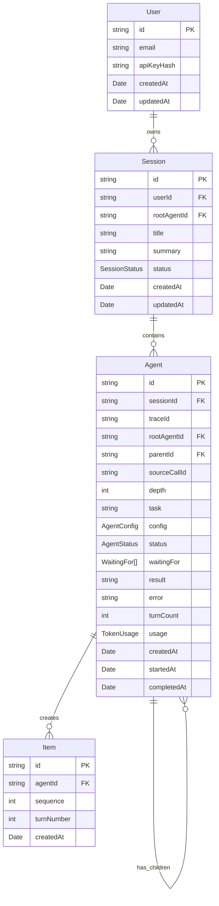
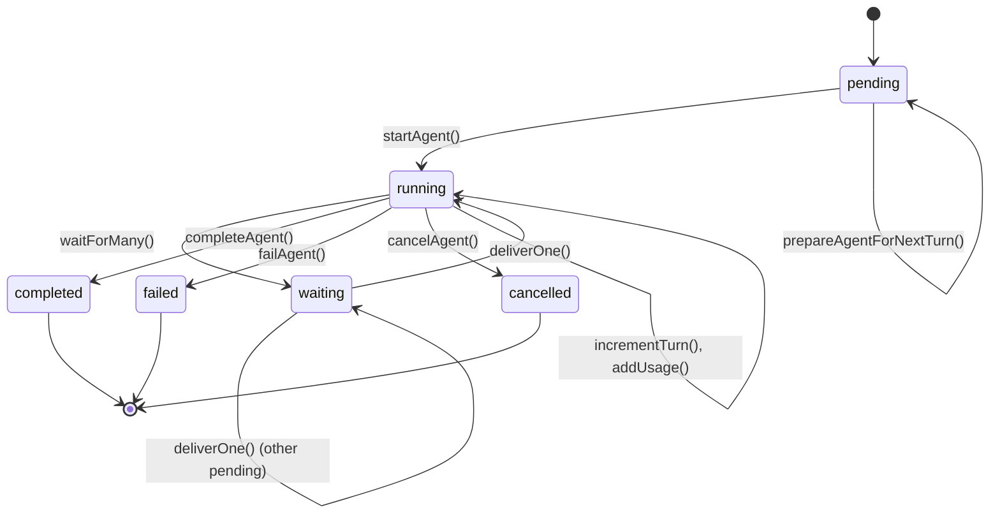

# Domain Models

## Overview

The domain model implements a hierarchical agent system where Users create Sessions, which contain Agents that execute tasks through a structured conversation flow. The design emphasizes:

- **Hierarchical agent execution** with parent-child relationships and tracing
- **Polymorphic conversation items** to capture different types of interactions
- **Stateful agent lifecycle** with clear transitions and status management
- **Multi-tenancy** through User-Session associations
- **Usage tracking** for API token consumption monitoring

## Entity Relationship Diagram



## Agent State Machine



## Entity Definitions

### User Entity (`src/domain/user.ts:6-12`)

| Field | Type | Description |
|-------|------|-------------|
| id | UserId (string) | Primary key |
| email | string | User's email address |
| apiKeyHash | string | Hash of API key for authentication |
| createdAt | Date | When user was created |
| updatedAt | Date | When user was last updated |

### Session Entity (`src/domain/session.ts:6-15`)

| Field | Type | Description |
|-------|------|-------------|
| id | SessionId (string) | Primary key |
| userId | UserId (string) | Foreign key to User |
| rootAgentId | AgentId (string) | Root agent of conversation |
| title | string | Session title |
| summary | string | Session summary |
| status | SessionStatus | 'active' or 'archived' |
| createdAt | Date | When session was created |
| updatedAt | Date | When session was last updated |

### Agent Entity (`src/domain/agent.ts:26-52`)

| Field | Type | Description |
|-------|------|-------------|
| id | AgentId (string) | Primary key |
| sessionId | SessionId (string) | Foreign key to Session |
| traceId | TraceId (string) | Execution trace identifier |
| rootAgentId | AgentId (string) | Root agent of hierarchy |
| parentId | AgentId (string) | Parent agent in hierarchy |
| sourceCallId | CallId (string) | Call that created this agent |
| depth | number | Hierarchy depth level |
| task | string | Agent's assigned task |
| config | AgentConfig | AI model configuration |
| status | AgentStatus | Current execution state |
| waitingFor | WaitingFor[] | Pending tool/agent/human calls |
| result | unknown | Final execution result |
| error | string | Error message if failed |
| turnCount | number | Number of turns executed |
| usage | TokenUsage | API token usage |
| createdAt | Date | When agent was created |
| startedAt | Date | When execution started |
| completedAt | Date | When execution completed |

### Agent Configuration (`src/domain/agent.ts:6-11`)

| Field | Type | Description |
|-------|------|-------------|
| model | string | AI model to use |
| temperature | number | Response randomness (0-1) |
| maxTokens | number | Maximum response length |
| tools | ToolDefinition[] | Available tools |

## Item Types (Polymorphic)

### Base Properties

| Field | Type | Description |
|-------|------|-------------|
| id | ItemId (string) | Primary key |
| agentId | AgentId (string) | Foreign key to Agent |
| sequence | number | Ordering within agent's items |
| turnNumber | number | Turn that created this item |
| createdAt | Date | When item was created |

### MessageItem (`src/domain/item.ts:14-18`)

| Field | Type | Description |
|-------|------|-------------|
| type | 'message' | Discriminator |
| role | MessageRole | 'user', 'assistant', or 'system' |
| content | Content | Message content |

### FunctionCallItem (`src/domain/item.ts:20-25`)

| Field | Type | Description |
|-------|------|-------------|
| type | 'function_call' | Discriminator |
| callId | CallId | Function call identifier |
| name | string | Function name |
| arguments | Record<string, unknown> | Function arguments |

### FunctionCallOutputItem (`src/domain/item.ts:27-32`)

| Field | Type | Description |
|-------|------|-------------|
| type | 'function_call_output' | Discriminator |
| callId | CallId | Matching function call |
| output | string | Function result |
| isError | boolean | Whether call failed |

### ReasoningItem (`src/domain/item.ts:34-38`)

| Field | Type | Description |
|-------|------|-------------|
| type | 'reasoning' | Discriminator |
| summary | string | Reasoning summary |
| signature | string | Reasoning signature |

## Agent State Transitions

| From State | To State | Trigger | Function |
|------------|----------|---------|----------|
| pending | running | Start agent execution | `startAgent()` (line 86) |
| running | waiting | Wait for tool/agent/human | `waitForMany()` (line 128) |
| waiting | running | Deliver tool result | `deliverOne()` (line 138) |
| running | completed | Task successful | `completeAgent()` (line 161) |
| running | failed | Task failed | `failAgent()` (line 171) |
| running | cancelled | Cancelled | `cancelAgent()` (line 175) |
| any | pending | Prepare next turn | `prepareAgentForNextTurn()` (line 101) |

## .NET Mapping Section

### C# Record Equivalents

```csharp
// User.cs
public record User(
    UserId Id,
    string Email,
    string ApiKeyHash,
    DateTime CreatedAt,
    DateTime? UpdatedAt
);

// Session.cs
public record Session(
    SessionId Id,
    UserId? UserId,
    AgentId? RootAgentId,
    string? Title,
    string? Summary,
    SessionStatus Status,
    DateTime CreatedAt,
    DateTime? UpdatedAt
);

// Agent.cs
public record Agent(
    AgentId Id,
    SessionId SessionId,
    TraceId? TraceId,
    AgentId RootAgentId,
    AgentId? ParentId,
    CallId? SourceCallId,
    int Depth,
    string Task,
    AgentConfig Config,
    AgentStatus Status,
    List<WaitingFor> WaitingFor,
    object? Result,
    string? Error,
    int TurnCount,
    TokenUsage? Usage,
    DateTime CreatedAt,
    DateTime? StartedAt,
    DateTime? CompletedAt
);

// Polymorphic Item using inheritance
[JsonDerivedType(typeof(MessageItem), "message")]
[JsonDerivedType(typeof(FunctionCallItem), "function_call")]
[JsonDerivedType(typeof(FunctionCallOutputItem), "function_call_output")]
[JsonDerivedType(typeof(ReasoningItem), "reasoning")]
public abstract record Item(
    ItemId Id,
    AgentId AgentId,
    int Sequence,
    int? TurnNumber,
    DateTime CreatedAt
);

public record MessageItem(
    MessageRole Role,
    Content Content
) : Item(Id, AgentId, Sequence, TurnNumber, CreatedAt);
```

### Entity Framework Configuration

```csharp
// AgentConfiguration.cs
builder.HasKey(a => a.Id);
builder.HasOne<Session>().WithMany().HasForeignKey(a => a.SessionId);
builder.HasOne<Agent>().WithMany().HasForeignKey(a => a.RootAgentId);
builder.HasOne<Agent>().WithMany(a => a.Children).HasForeignKey(a => a.ParentId);
builder.HasMany<Item>().WithOne().HasForeignKey(i => i.AgentId);

// ItemConfiguration.cs (polymorphic)
builder.HasKey(i => i.Id);
builder.HasDiscriminator<string>("Type")
    .HasValue<MessageItem>("message")
    .HasValue<FunctionCallItem>("function_call")
    .HasValue<FunctionCallOutputItem>("function_call_output")
    .HasValue<ReasoningItem>("reasoning");
```

### Enum Definitions

```csharp
public enum SessionStatus { Active, Archived }
public enum AgentStatus { Pending, Running, Waiting, Completed, Failed, Cancelled }
public enum ItemType { Message, FunctionCall, FunctionCallOutput, Reasoning }
public enum MessageRole { User, Assistant, System }
public enum WaitType { Tool, Agent, Human }
```
