# Context Management

## Overview

The Context Management system implements a sophisticated pruning strategy that maintains conversation coherence while respecting model token limits. It addresses challenges with large context windows (100K-1M+ tokens) by intelligently truncating outputs, dropping old turns, and optionally summarizing dropped content.

### Key Design Principles

- **Context Integrity**: Always preserves setup context and recent turns
- **Output Truncation**: Intelligently truncates large tool outputs
- **Optional Summarization**: LLM-based compression of dropped content
- **Model-Specific Tuning**: Optimized thresholds per model provider
- **Conservative Estimates**: 3.5 chars/token for safety margin

## Pruning Strategy Flowchart

```mermaid
flowchart TB
    subgraph Input
        ITEMS[Conversation Items]
        PROMPT[System Prompt]
        WINDOW[Context Window]
        CONFIG[PruningThresholds]
    end

    subgraph "Step 1: Truncation"
        TRUNC[Truncate Large Outputs]
        MAX[maxToolOutputChars]
        TRUNC_ITEMS[Truncated Items]
    end

    subgraph "Step 2: Estimation"
        EST[Estimate Tokens]
        CHECK{Over Target?}
    end

    subgraph "Step 3: Turn Analysis"
        IDENTIFY[Identify Turns]
        KEEP1[Keep First Turn]
        KEEPN[Keep Last N Turns]
        DROP[Droppable Turns]
    end

    subgraph "Step 4: Pruning Loop"
        LOOP{Still Over Budget?}
        DROP_OLD[Drop Oldest Droppable]
        RECHECK[Re-estimate]
    end

    subgraph Output
        RESULT[Pruned Items]
        STATS[droppedCount, truncatedCount]
    end

    ITEMS --> TRUNC
    PROMPT --> EST
    TRUNC --> TRUNC_ITEMS
    WINDOW --> CONFIG
    CONFIG --> TRUNC
    CONFIG --> KEEPN

    TRUNC_ITEMS --> EST
    EST --> CHECK
    CHECK -->|No| RESULT
    CHECK -->|Yes| IDENTIFY
    IDENTIFY --> KEEP1
    IDENTIFY --> KEEPN
    IDENTIFY --> DROP

    KEEP1 --> LOOP
    KEEPN --> LOOP
    DROP --> LOOP

    LOOP --> DROP_OLD
    DROP_OLD --> RECHECK
    RECHECK --> LOOP
    LOOP -->|Done| RESULT
    RESULT --> STATS
```



## Pruning Thresholds

### Configuration Structure (`src/config/models.ts:5-16`)

| Field | Type | Default | Description |
|-------|------|---------|-------------|
| threshold | number | 0.85 | Trigger pruning at 85% context usage |
| targetUtilization | number | 0.50 | Target 50% utilization after pruning |
| minRecentTurns | number | 3 | Keep 3 most recent turns verbatim |
| maxToolOutputChars | number | 10,000 | Max chars per tool output before truncation |
| enableSummarization | boolean | true | Enable LLM summarization of dropped content |

### Model-Specific Configurations (`src/config/models.ts:34-79`)

| Model | Context Window | Max Output | Threshold | Target | Min Recent Turns |
|-------|---------------|------------|-----------|--------|------------------|
| gpt-5.4 | 400,000 | 128,000 | 0.85 | 0.5 | 5 |
| gpt-5.2 | 400,000 | 128,000 | 0.85 | 0.5 | 5 |
| gemini-3-pro-preview | 1,048,576 | 65,536 | 0.90 | 0.6 | 10 |
| gemini-3-flash-preview | 1,048,576 | 65,536 | 0.90 | 0.6 | 10 |

## Pruning Algorithm

### Step 1: Truncate Large Outputs (`src/utils/pruning.ts:25-44`)

```typescript
function truncateToolOutput(output: string, maxChars: number): string {
  if (output.length <= maxChars) return output
  const half = Math.floor(maxChars / 2)
  const dropped = output.length - maxChars
  return `${output.slice(0, half)}\n\n[... ${dropped} characters truncated ...]\n\n${output.slice(-half)}`
}
```

### Step 2: Identify Turns (`src/utils/pruning.ts:60-86`)

```typescript
interface Turn {
  startIndex: number
  endIndex: number
  items: Item[]
}

function identifyTurns(items: Item[]): Turn[] {
  const turns: Turn[] = []
  let currentStart = 0

  for (let i = 0; i < items.length; i++) {
    const item = items[i]
    // A turn starts with a user message
    if (isMessage(item) && item.role === 'user' && i > 0) {
      turns.push({
        startIndex: currentStart,
        endIndex: i - 1,
        items: items.slice(currentStart, i),
      })
      currentStart = i
    }
  }

  // Last turn
  if (currentStart < items.length) {
    turns.push({
      startIndex: currentStart,
      endIndex: items.length - 1,
      items: items.slice(currentStart),
    })
  }

  return turns
}
```

### Step 3: Core Pruning Logic (`src/utils/pruning.ts:100-159`)

```typescript
function pruneConversation(
  items: Item[],
  systemPrompt: string | undefined,
  contextWindow: number,
  config: PruningThresholds,
): PruningResult {
  const targetTokens = Math.floor(contextWindow * config.targetUtilization)

  // Step 1: Truncate large outputs
  const { items: truncated, truncatedCount } = truncateLargeOutputs(items, config.maxToolOutputChars)

  let estimate = estimateConversationTokens(truncated, systemPrompt)
  if (estimate <= targetTokens) {
    return { items: truncated, estimatedTokens: estimate, droppedCount: 0, truncatedCount, droppedItems: [] }
  }

  // Step 2: Identify turns
  const turns = identifyTurns(truncated)
  if (turns.length <= config.minRecentTurns) {
    return { items: truncated, estimatedTokens: estimate, droppedCount: 0, truncatedCount, droppedItems: [] }
  }

  // Step 3: Keep first turn + recent N turns, drop oldest droppable
  const keepFirst = turns[0]
  const keepRecent = turns.slice(-config.minRecentTurns)
  const droppable = turns.slice(1, -config.minRecentTurns)

  // Step 4: Drop oldest turns until under budget
  const droppedItems: Item[] = []
  let droppedCount = 0
  const surviving = [...droppable]

  while (surviving.length > 0) {
    const dropped = surviving.shift()!
    droppedItems.push(...dropped.items)
    droppedCount += dropped.items.length

    const remainingItems = [
      ...keepFirst.items,
      ...surviving.flatMap(t => t.items),
      ...keepRecent.flatMap(t => t.items),
    ]

    estimate = estimateConversationTokens(remainingItems, systemPrompt)
    if (estimate <= targetTokens) {
      return { items: remainingItems, estimatedTokens: estimate, droppedCount, truncatedCount, droppedItems }
    }
  }

  // Final result with minimum items
  const finalItems = [...keepFirst.items, ...keepRecent.flatMap(t => t.items)]
  estimate = estimateConversationTokens(finalItems, systemPrompt)

  return { items: finalItems, estimatedTokens: estimate, droppedCount, truncatedCount, droppedItems }
}
```

## Token Estimation

### Algorithm (`src/utils/tokens.ts`)

The system uses a conservative estimation approach:

```typescript
// Conservative ratio: 3.5 chars per token (actual varies by language/content)
const CHARS_PER_TOKEN = 3.5

// Overhead per item for structure/metadata
const ITEM_OVERHEAD = 20

function estimateTokens(text: string): number {
  return Math.ceil(text.length / CHARS_PER_TOKEN)
}

function estimateConversationTokens(items: Item[], systemPrompt?: string): number {
  let total = systemPrompt ? estimateTokens(systemPrompt) : 0

  for (const item of items) {
    total += ITEM_OVERHEAD

    switch (item.type) {
      case 'message':
        total += estimateTokens(stringifyContent(item.content))
        break
      case 'function_call':
        total += estimateTokens(item.name + JSON.stringify(item.arguments))
        break
      case 'function_call_output':
        total += estimateTokens(item.output)
        break
      case 'reasoning':
        total += estimateTokens(item.text)
        break
    }
  }

  return total
}
```

## Summarization

### Purpose

When `enableSummarization` is true, dropped items are summarized into a condensed format that preserves essential context:

- **Goal**: What was the user trying to accomplish?
- **Progress**: What steps were completed?
- **Decisions**: What choices were made?
- **Critical Context**: Important details for continuing the conversation

### Implementation (`src/utils/summarization.ts:72-99`)

```typescript
async function generateSummary(
  items: Item[],
  existingSummary?: string,
): Promise<string> {
  const prompt = existingSummary
    ? `Update the following summary with new information:\n\n${existingSummary}\n\nNew content:\n${formatItems(items)}`
    : `Summarize the following conversation context:\n\n${formatItems(items)}`

  // Preserves all technical details (paths, names, values, errors)
  // Structured format for LLM consumption
}
```

## .NET Mapping Section

### Interface Mapping

| TypeScript | .NET Equivalent |
|------------|-----------------|
| `PruningThresholds` | `PruningOptions` class |
| `pruneConversation()` | `IContextPruner.PruneAsync()` |
| `estimateConversationTokens()` | `ITokenizer.CountTokens()` |
| `generateSummary()` | `IChatClient.CompleteAsync()` with summarization prompt |

### Implementation Pattern

```csharp
public interface IContextPruner
{
    Task<PruningResult> PruneAsync(
        IReadOnlyList<Item> items,
        string? systemPrompt,
        int contextWindow,
        PruningOptions options,
        CancellationToken cancellationToken = default);
}

public class ContextPruner : IContextPruner
{
    private readonly ITokenizer _tokenizer;
    private readonly IChatClient? _summarizer;

    public async Task<PruningResult> PruneAsync(
        IReadOnlyList<Item> items,
        string? systemPrompt,
        int contextWindow,
        PruningOptions options,
        CancellationToken cancellationToken = default)
    {
        var targetTokens = (int)(contextWindow * options.TargetUtilization);

        // Step 1: Truncate large outputs
        var (truncated, truncatedCount) = TruncateLargeOutputs(items, options.MaxToolOutputChars);

        // Step 2: Estimate tokens
        var estimate = _tokenizer.CountTokens(truncated, systemPrompt);
        if (estimate <= targetTokens)
        {
            return new PruningResult(truncated, estimate, 0, truncatedCount, Array.Empty<Item>());
        }

        // Step 3: Identify turns
        var turns = IdentifyTurns(truncated);
        // ... rest of algorithm
    }
}
```

### Tokenizer Integration

```csharp
// Using Microsoft.Extensions.AI tokenization
public interface ITokenizer
{
    int CountTokens(string text);
    int CountTokens(IReadOnlyList<Item> items, string? systemPrompt = null);
}

// Implementation using TikToken or similar
public class TikTokenizer : ITokenizer
{
    private const double CharsPerToken = 3.5;
    private const int ItemOverhead = 20;

    public int CountTokens(string text)
    {
        return (int)Math.Ceiling(text.Length / CharsPerToken);
    }

    public int CountTokens(IReadOnlyList<Item> items, string? systemPrompt = null)
    {
        var total = systemPrompt != null ? CountTokens(systemPrompt) : 0;
        foreach (var item in items)
        {
            total += ItemOverhead + CountTokens(ItemToString(item));
        }
        return total;
    }
}
```

### Benefits of .NET Implementation

1. **Accurate Token Counting**: Use `Microsoft.ML.Tokenizers` for precise counts
2. **Streaming Support**: `IAsyncEnumerable<Item>` for large conversations
3. **Dependency Injection**: `IContextPruner` as scoped service
4. **Configuration**: `IOptions<PruningOptions>` pattern
5. **Logging**: `ILogger<T>` integration for diagnostics
