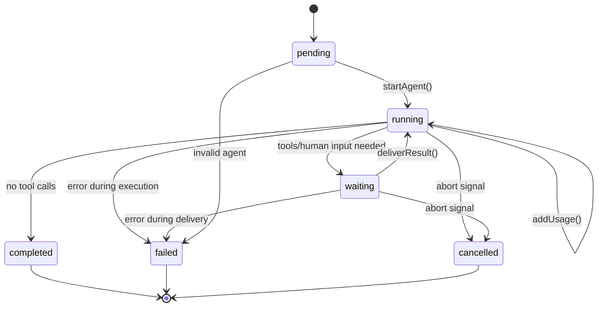
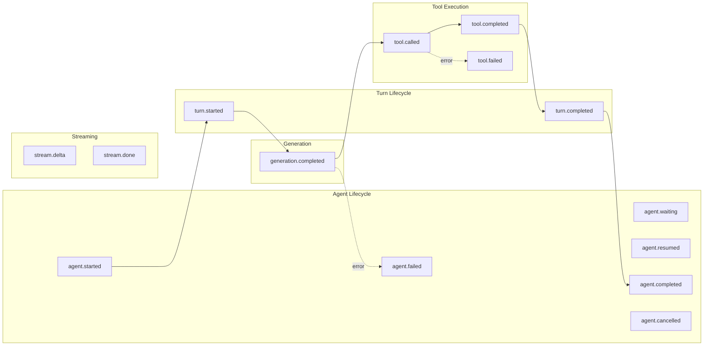
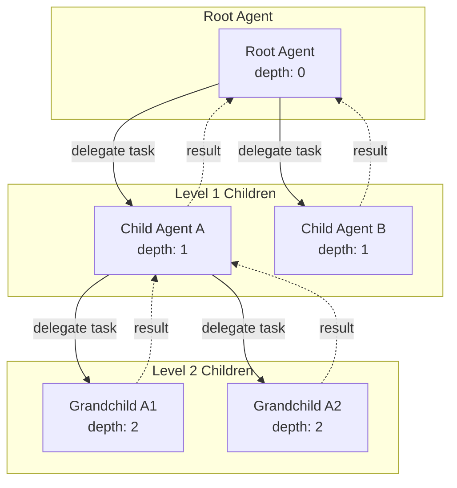

# Runner and Events

## Overview

The Runner and Events system implements a non-blocking agent execution architecture with comprehensive state management and event-driven communication. The system supports:

- **Hierarchical execution**: Parent-child agent relationships with depth tracking
- **Non-blocking operation**: Agents can pause (waiting) and resume from external input
- **Event-driven observability**: All lifecycle transitions emit typed events
- **Abort support**: Full cancellation via AbortSignal pattern

## Agent State Machine



## Event Types

### Mermaid Event Flow Diagram



### Event Types Table

| Event | When Emitted | File:Line |
|-------|--------------|-----------|
| `agent.started` | Agent begins execution | `runner.ts:751-759` |
| `turn.started` | New turn begins | `runner.ts:776-780` |
| `tool.called` | Tool invocation starts | `runner.ts:262,341,364` |
| `tool.completed` | Tool returns success | `runner.ts:275,377-378` |
| `tool.failed` | Tool throws error | `runner.ts:287,380` |
| `turn.completed` | Turn finishes | `runner.ts:804-809` |
| `agent.waiting` | Agent pauses for external input | `runner.ts:818-823` |
| `agent.resumed` | Agent continues after delivery | `runner.ts:906-911` |
| `agent.completed` | Agent finishes successfully | `runner.ts:839-845` |
| `agent.failed` | Agent encounters error | `runner.ts:788-793` |
| `agent.cancelled` | Agent is aborted | `runner.ts:772,852-854` |
| `generation.completed` | LLM call completes | `runner.ts:646-660` |

## EventContext Structure

```typescript
// src/events/types.ts:14-23
interface EventContext {
  traceId: TraceId          // Correlation ID for entire execution tree
  timestamp: number         // Event timestamp
  sessionId: SessionId      // Session identifier
  agentId: AgentId          // Current agent ID
  rootAgentId: AgentId      // Top-level agent in hierarchy
  parentAgentId?: AgentId   // Parent agent (if child agent)
  depth: number            // Agent depth in hierarchy
  batchId?: BatchId        // For parallel operations
}
```

This enables:
- **Hierarchical tracing**: Track parent-child relationships
- **Cross-agent correlation**: Link events across agent boundaries
- **Causal relationships**: Understand event causation
- **Debugging support**: Full context for troubleshooting

## Key Runner Functions

### runAgent (`src/runtime/runner.ts:726-858`)

Primary entry point that manages agent lifecycle:

```typescript
async function runAgent(
  agentId: AgentId,
  runtime: RuntimeContext,
  options?: RunOptions
): Promise<RunResult> {
  // 1. Load agent and session data
  // 2. Handle state transitions from pending to running
  // 3. Execute turn loop with maxTurns limit
  // 4. Support AbortSignal for cancellation
  // 5. Emit events for all state changes
}
```

### executeTurn (`src/runtime/runner.ts:617-659`)

Executes individual turns:

```typescript
async function executeTurn(
  agent: Agent,
  runtime: RuntimeContext,
  exec: ExecutionContext,
  session: Session,
  signal?: AbortSignal
): Promise<TurnResult> {
  // 1. Prepare turn input (load items, prune context)
  // 2. Call provider with instructions and conversation
  // 3. Handle provider response and tool calls
  // 4. Return continuation, waiting, or completion status
}
```

### handleTurnResponse (`src/runtime/runner.ts:226-402`)

Processes tool calls and determines next state:

```typescript
async function handleTurnResponse(
  agent: Agent,
  output: ProviderOutputItem[],
  runtime: RuntimeContext,
  exec: ExecutionContext,
  signal?: AbortSignal
): Promise<TurnResult> {
  // 1. Classify tools by type (sync, async, agent, human)
  // 2. Execute sync tools immediately
  // 3. Defer async/human tools with waiting state
  // 4. Handle agent delegation with recursive execution
  // 5. Return updated agent state
}
```

### deliverResult (`src/runtime/runner.ts:868-949`)

Handles external result delivery:

```typescript
async function deliverResult(
  agentId: AgentId,
  callId: CallId,
  result: ToolResult,
  runtime: RuntimeContext,
  execution?: ExecutionContext
): Promise<RunResult> {
  // 1. Validate agent is in waiting state
  // 2. Store results as function_call_output items
  // 3. Update agent waiting list
  // 4. Resume execution when all waiting fulfilled
  // 5. Auto-propagate results to parent agents
}
```

## Hierarchical Execution

### Depth Management

- **Maximum Depth**: 5 agents (`runner.ts:26`)
- **Parent-Child Relationships**: Automatic propagation of trace context
- **Result Propagation**: Automatic upward delivery of child agent results
- **Source Call Tracking**: Links child execution to parent tool call

### Agent Hierarchy Diagram



## AbortSignal Pattern

The system consistently implements cancellation throughout:

```typescript
// At operation start
if (signal?.aborted) {
  agent = cancelAgent(agent)
  await runtime.repositories.agents.update(agent)
  runtime.events.emit({ type: 'agent.cancelled', ctx: makeCtx(exec, agent) })
  return { ok: false, status: 'cancelled' }
}

// Distinguishing abort from other errors
try {
  // ... operation
} catch (err) {
  if (isAbortError(err)) {
    // Clean cancellation
    return { ok: false, status: 'cancelled' }
  }
  throw err // Re-throw other errors
}
```

## .NET Mapping Section

### Interface Mapping

| TypeScript | .NET Equivalent |
|------------|-----------------|
| `runAgent()` | `IAgentRunner.RunAsync()` |
| `executeTurn()` | `IAgentRunner.ExecuteTurnAsync()` |
| `deliverResult()` | `IAgentRunner.DeliverResultAsync()` |
| `AbortSignal` | `CancellationToken` |
| `EventEmitter` | `IObservable<T>` or `EventPattern` |
| `RuntimeContext` | `IServiceProvider` (DI container) |

### Runner Implementation

```csharp
public interface IAgentRunner
{
    Task<RunResult> RunAsync(AgentId agentId, RunOptions? options = null, CancellationToken cancellationToken = default);
    Task<RunResult> DeliverResultAsync(AgentId agentId, CallId callId, ToolResult result, CancellationToken cancellationToken = default);
}

public class AgentRunner : IAgentRunner
{
    private const int MaxAgentDepth = 5;

    public async Task<RunResult> RunAsync(
        AgentId agentId,
        RunOptions? options = null,
        CancellationToken cancellationToken = default)
    {
        var agent = await _repositories.Agents.GetByIdAsync(agentId);
        if (agent == null)
            return RunResult.Failed($"Agent not found: {agentId}");

        // State transitions
        if (agent.Status == AgentStatus.Pending)
        {
            agent = agent.Start();
            await _repositories.Agents.UpdateAsync(agent);
            _events.Emit(new AgentStartedEvent(agent));
        }

        try
        {
            while (agent.Status == AgentStatus.Running && agent.TurnCount < options?.MaxTurns)
            {
                cancellationToken.ThrowIfCancellationRequested();

                var turnResult = await ExecuteTurnAsync(agent, cancellationToken);

                if (turnResult.IsWaiting)
                {
                    agent = agent.WaitFor(turnResult.WaitingFor);
                    await _repositories.Agents.UpdateAsync(agent);
                    return RunResult.Waiting(agent, turnResult.WaitingFor);
                }

                if (!turnResult.Continue)
                    break;
            }

            return RunResult.Completed(agent);
        }
        catch (OperationCanceledException)
        {
            agent = agent.Cancel();
            await _repositories.Agents.UpdateAsync(agent);
            return RunResult.Cancelled();
        }
    }
}
```

### Event Pattern

```csharp
// Using IObservable<T> for events
public interface IAgentEventEmitter
{
    IObservable<AgentEvent> Events { get; }
    void Emit(AgentEvent @event);
}

// Or using MediatR pattern
public record AgentStartedEvent(AgentId AgentId, string Model, string Task) : INotification;

public class AgentStartedEventHandler : INotificationHandler<AgentStartedEvent>
{
    public async Task Handle(AgentStartedEvent notification, CancellationToken cancellationToken)
    {
        // Handle event
    }
}
```

### Key Benefits of .NET Implementation

1. **Task-based Async**: Native `async/await`, `ValueTask`, `CancellationToken`
2. **Dependency Injection**: Full DI container pattern with scoped services
3. **Observable Pattern**: `IObservable<T>` for event streaming
4. **MediatR Integration**: Decoupled event handling
5. **ActivitySource**: Built-in distributed tracing support
