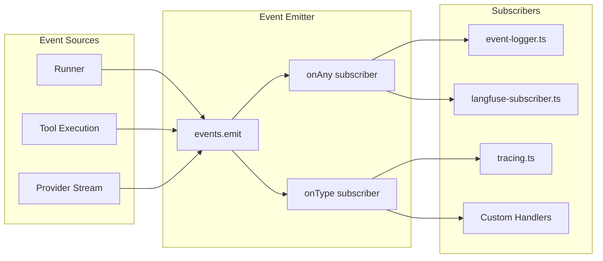
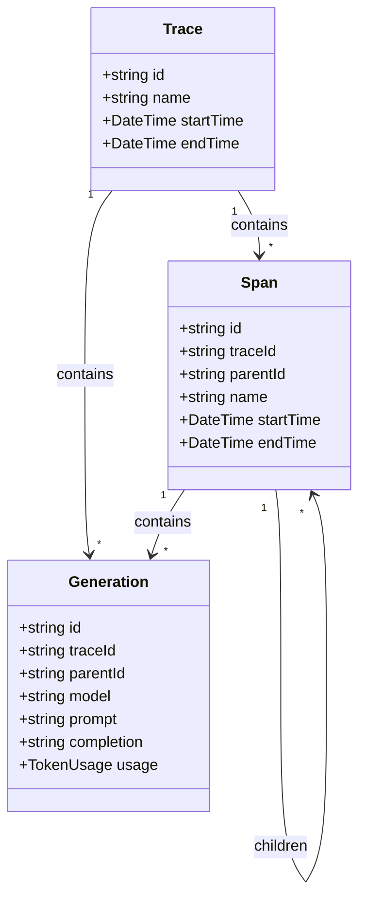
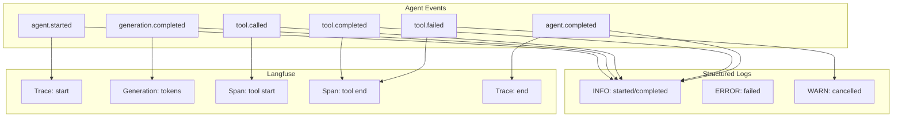

# Observability Layer

## Overview

The observability layer implements a multi-layered approach that combines:

1. **Structured Logging** (pino-based with environment-specific targets)
2. **Event-Driven Logging** (human-readable lifecycle logs)
3. **Langfuse Integration** (advanced observability via OpenTelemetry)
4. **Event Subscription Pattern** (publisher-subscriber architecture)

## Event Subscription Model



## Logger Configuration

### Environment-Aware Logging (`src/lib/logger.ts`)

| Environment | Output Format | Destinations |
|-------------|---------------|--------------|
| development | Pretty (pino-pretty) | stdout + file |
| production | JSON | stdout |

### Configuration

```typescript
// Development: dual output (pretty console + JSON file)
const targets = pino.transport({
  targets: [
    { target: 'pino-pretty', options: { colorize: true }, level: 'trace' },
    { target: 'pino/file', options: { destination: '.data/agent.log' }, level: 'trace' },
  ],
})

// Production: JSON only
const logger = pino({ level: config.logLevel })
```

### Security Redaction

```typescript
const redact = {
  paths: ['apiKey', 'apiKeyHash', '*.apiKey', '*.apiKeyHash', 'req.headers.authorization'],
  censor: '[REDACTED]',
}
```

### Child Logger Pattern

```typescript
const log = logger.child({ name: 'runner' })
const httpLog = logger.child({ name: 'http' })
const mcpLog = logger.child({ name: 'mcp' })
```

## Event-Driven Logging

### Lifecycle Coverage (`src/lib/event-logger.ts`)

| Event Type | Log Level | Format |
|------------|-----------|--------|
| `agent.started` | info | `started — {agentName} ({model})` |
| `agent.completed` | info | `completed — {duration}s, {tokens}` |
| `agent.failed` | error | `failed — {error}` |
| `agent.cancelled` | warn | `cancelled` |
| `agent.waiting` | info | `waiting for {n} tool(s)` |
| `agent.resumed` | info | `resumed — {n} remaining` |
| `turn.started` | info | `turn {n}` |
| `turn.completed` | info | `turn {n} done — {tokens}` |
| `generation.completed` | info | `generation {model} — {duration}s, {tokens}` |
| `tool.called` | info | `{name} called` |
| `tool.completed` | info | `{name} ok — {duration}s` |
| `tool.failed` | warn | `{name} failed — {error}` |

### Token Usage Formatting

```typescript
function fmtTokens(u?: TokenUsage): string {
  if (!u) return ''
  const cached = u.cachedTokens ? ` (${u.cachedTokens} cached)` : ''
  return `${u.inputTokens} in, ${u.outputTokens} out${cached}`
}
```

### Output Truncation

```typescript
const truncate = (s: string, max = 120) => s.length > max ? s.slice(0, max) + '…' : s
```

## Langfuse Integration

### Observation Types



### Event to Langfuse Mapping

| Agent Event | Langfuse Observation | Details |
|-------------|---------------------|---------|
| `agent.started` | Trace start | name, model, userId |
| `generation.completed` | Generation | model, input, output, tokens |
| `tool.called` | Span start | name, arguments |
| `tool.completed/failed` | Span end | output/error |
| `agent.completed` | Trace end | result, total usage |

### Stateful Management

```typescript
// Track agent observations
const agentObservations = new Map<AgentId, { traceId: string; trace: Trace }>()

// Track parent-child relationships
const parentAgents = new Map<AgentId, AgentId>()

// Track span contexts for generations
const spanContexts = new Map<AgentId, Span>()
```

## OpenTelemetry Setup

### Conditional Initialization (`src/lib/tracing.ts`)

```typescript
export function initTracing(): void {
  if (!config.langfusePublicKey || !config.langfuseSecretKey) {
    return // No-op when keys absent
  }

  const provider = new NodeTracerProvider({
    resource: new Resource({
      [ATTR_SERVICE_NAME]: 'agent-runtime',
      [ATTR_SERVICE_VERSION]: '1.0.0',
    }),
  })

  // Langfuse span processor
  provider.addSpanProcessor(
    new LangfuseSpanProcessor({
      publicKey: config.langfusePublicKey,
      secretKey: config.langfuseSecretKey,
      baseUrl: config.langfuseBaseUrl,
    })
  )

  provider.register()
}
```

### Observation Factory Functions

| Function | Purpose | Returns |
|----------|---------|---------|
| `createTrace()` | New trace for agent | Trace object |
| `createSpan()` | Span within trace | Span object |
| `createGeneration()` | LLM call observation | Generation object |
| `finalizeObservation()` | Complete with output | void |

## Event-to-Observability Mapping



## .NET Mapping Section

### OpenTelemetryChatClient

```csharp
// Register OpenTelemetry with Langfuse exporter
services.AddOpenTelemetry()
    .WithTracing(builder => builder
        .AddSource("AgentRuntime")
        .AddLangfuseExporter(options => {
            options.PublicKey = configuration["Langfuse:PublicKey"];
            options.SecretKey = configuration["Langfuse:SecretKey"];
        }));

// Use OpenTelemetryChatClient decorator
services.AddChatClient(builder => builder
    .UseOpenTelemetry()
    .UseLogging()
    .UseOpenAI());
```

### Structured Logging (Serilog)

```csharp
// Serilog configuration
Log.Logger = new LoggerConfiguration()
    .Enrich.FromLogContext()
    .Enrich.WithProperty("Application", "AgentRuntime")
    .WriteTo.Console(
        outputTemplate: "[{Timestamp:HH:mm:ss} {Level:u3}] {Message:lj}{NewLine}{Exception}",
        restrictedToMinimumLevel: LogEventLevel.Information)
    .WriteTo.File(
        path: ".data/agent-.log",
        rollingInterval: RollingInterval.Day,
        outputTemplate: "{Timestamp:yyyy-MM-dd HH:mm:ss.fff zzz} [{Level:u3}] {Message:lj}{NewLine}{Exception}")
    .CreateLogger();

// Usage with context
var logger = Log.ForContext<AgentRunner>();
logger.Information("Agent {AgentId} started with model {Model}", agentId, model);
```

### ActivitySource for Distributed Tracing

```csharp
public class AgentActivitySource
{
    private static readonly ActivitySource Source = new("AgentRuntime");

    public static Activity? StartAgentRun(AgentId agentId, string model)
    {
        return Source.StartActivity("agent.run", ActivityKind.Internal)?
            .SetTag("agent.id", agentId)
            .SetTag("agent.model", model);
    }

    public static Activity? StartGeneration(string model, int inputTokens)
    {
        return Source.StartActivity("generation", ActivityKind.Internal)?
            .SetTag("generation.model", model)
            .SetTag("generation.input_tokens", inputTokens);
    }
}
```

### Event Pattern with MediatR

```csharp
// Event definitions
public record AgentStartedEvent(AgentId AgentId, string Model, string Task) : INotification;
public record GenerationCompletedEvent(AgentId AgentId, string Model, TokenUsage Usage, TimeSpan Duration) : INotification;

// Event handlers
public class LoggingEventHandler :
    INotificationHandler<AgentStartedEvent>,
    INotificationHandler<GenerationCompletedEvent>
{
    private readonly ILogger<LoggingEventHandler> _logger;

    public Task Handle(AgentStartedEvent notification, CancellationToken cancellationToken)
    {
        _logger.LogInformation("Agent {AgentId} started with model {Model}", notification.AgentId, notification.Model);
        return Task.CompletedTask;
    }

    public Task Handle(GenerationCompletedEvent notification, CancellationToken cancellationToken)
    {
        _logger.LogInformation(
            "Generation {Model} completed — {Duration}s, {InputTokens} in, {OutputTokens} out",
            notification.Model,
            notification.Duration.TotalSeconds,
            notification.Usage.InputTokens,
            notification.Usage.OutputTokens);
        return Task.CompletedTask;
    }
}
```

### Key Benefits of .NET Implementation

1. **OpenTelemetryChatClient**: Built-in telemetry for chat clients
2. **ILogger**: Structured logging with context scopes
3. **ActivitySource**: Native distributed tracing support
4. **MediatR**: Decoupled event handling
5. **Serilog**: Rich formatting and multiple sinks
