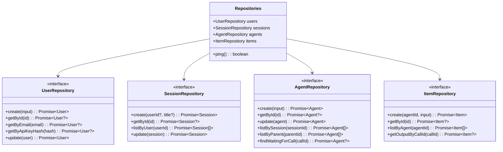

# Repository Pattern

## Overview

The repository pattern provides data access abstraction with two interchangeable storage backends: in-memory (for testing/development) and SQLite (for production). This separation allows business logic to remain independent of storage implementation.

### Key Design Principles

- **Interface Abstraction**: All repositories implement common interfaces
- **Dual Implementation**: In-memory and SQLite variants
- **Type Safety**: Full TypeScript type checking
- **Consistent Error Handling**: Standardized error responses

## Class Diagram



## Interface Definitions

### Repository Interfaces (`src/repositories/types.ts`)

| Repository | Methods | Lines |
|------------|---------|-------|
| **UserRepository** | `create`, `getById`, `getByEmail`, `getByApiKeyHash`, `update` | 22-28 |
| **SessionRepository** | `create`, `getById`, `listByUser`, `update` | 30-35 |
| **AgentRepository** | `create`, `getById`, `update`, `listBySession`, `listByParent`, `findWaitingForCall` | 37-44 |
| **ItemRepository** | `create`, `getById`, `listByAgent`, `getOutputByCallId` | 58-63 |
| **Repositories** | Container + `ping()` | 65-72 |

### Complete Interface Definitions

```typescript
// src/repositories/types.ts:22-72

interface UserRepository {
  create(input: CreateUserInput): Promise<User>
  getById(id: UserId): Promise<User | undefined>
  getByEmail(email: string): Promise<User | undefined>
  getByApiKeyHash(apiKeyHash: string): Promise<User | undefined>
  update(user: User): Promise<User>
}

interface SessionRepository {
  create(userId?: UserId, title?: string): Promise<Session>
  getById(id: SessionId): Promise<Session | undefined>
  listByUser(userId: UserId): Promise<Session[]>
  update(session: Session): Promise<Session>
}

interface AgentRepository {
  create(input: CreateAgentInput): Promise<Agent>
  getById(id: AgentId): Promise<Agent | undefined>
  update(agent: Agent): Promise<Agent>
  listBySession(sessionId: SessionId): Promise<Agent[]>
  listByParent(parentId: AgentId): Promise<Agent[]>
  findWaitingForCall(callId: CallId): Promise<Agent | undefined>
}

interface ItemRepository {
  create(agentId: AgentId, input: CreateItemInput): Promise<Item>
  getById(id: ItemId): Promise<Item | undefined>
  listByAgent(agentId: AgentId): Promise<Item[]>
  getOutputByCallId(callId: CallId): Promise<Item | undefined>
}

interface Repositories {
  users: UserRepository
  sessions: SessionRepository
  agents: AgentRepository
  items: ItemRepository
  ping(): Promise<boolean>
}
```

## In-Memory Implementation

### Features (`src/repositories/memory.ts`)

- Uses JavaScript `Map` objects for storage
- All data lost on application restart
- Perfect for unit tests and development
- Implements sequence management for items per agent
- Provides in-memory JSON filtering for complex queries

### Implementation Patterns

```typescript
// Map-based storage
const users = new Map<UserId, User>()
const sessions = new Map<SessionId, Session>()
const agents = new Map<AgentId, Agent>()
const items = new Map<ItemId, Item>()

// Sequence tracking for items
const sequences = new Map<AgentId, number>()

// Example: Item creation with auto-sequence
async create(agentId: AgentId, input: CreateItemInput): Promise<Item> {
  const sequence = (sequences.get(agentId) ?? 0) + 1
  sequences.set(agentId, sequence)

  const item = createItem(generateId(), agentId, sequence, input)
  items.set(item.id, item)
  return item
}
```

### Performance Characteristics

| Operation | Time Complexity | Notes |
|-----------|----------------|-------|
| Create | O(1) | Map.set() |
| GetById | O(1) | Map.get() |
| Update | O(1) | Map.set() |
| ListBySession | O(n) | Full iteration |
| ListByAgent | O(n) | Full iteration |

## SQLite Implementation

### Schema Definition (`src/repositories/sqlite/schema.ts`)

```typescript
// Users table
export const users = sqliteTable('users', {
  id: text('id').primaryKey(),
  email: text('email').notNull().unique(),
  apiKeyHash: text('api_key_hash').notNull().unique(),
  createdAt: integer('created_at', { mode: 'timestamp' }).notNull(),
  updatedAt: integer('updated_at', { mode: 'timestamp' }),
})

// Sessions table
export const sessions = sqliteTable('sessions', {
  id: text('id').primaryKey(),
  userId: text('user_id').references(() => users.id),
  rootAgentId: text('root_agent_id').references(() => agents.id),
  title: text('title'),
  summary: text('summary'),
  status: text('status', { enum: ['active', 'archived'] }).notNull(),
  createdAt: integer('created_at', { mode: 'timestamp' }).notNull(),
  updatedAt: integer('updated_at', { mode: 'timestamp' }),
})

// Agents table
export const agents = sqliteTable('agents', {
  id: text('id').primaryKey(),
  sessionId: text('session_id').notNull().references(() => sessions.id),
  traceId: text('trace_id'),
  rootAgentId: text('root_agent_id').references(() => agents.id),
  parentId: text('parent_id').references(() => agents.id),
  sourceCallId: text('source_call_id'),
  depth: integer('depth').notNull().default(0),
  task: text('task').notNull(),
  config: text('config', { mode: 'json' }).notNull().$type<AgentConfig>(),
  status: text('status').notNull().$type<AgentStatus>(),
  waitingFor: text('waiting_for', { mode: 'json' }).$type<WaitingFor[]>(),
  result: text('result', { mode: 'json' }),
  error: text('error'),
  turnCount: integer('turn_count').notNull().default(0),
  usage: text('usage', { mode: 'json' }).$type<TokenUsage>(),
  createdAt: integer('created_at', { mode: 'timestamp' }).notNull(),
  startedAt: integer('started_at', { mode: 'timestamp' }),
  completedAt: integer('completed_at', { mode: 'timestamp' }),
})

// Items table (polymorphic)
export const items = sqliteTable('items', {
  id: text('id').primaryKey(),
  agentId: text('agent_id').notNull().references(() => agents.id),
  sequence: integer('sequence').notNull(),
  turnNumber: integer('turn_number'),
  type: text('type').notNull(),
  // JSON field for type-specific data
  data: text('data', { mode: 'json' }).notNull(),
  createdAt: integer('created_at', { mode: 'timestamp' }).notNull(),
})
```

### Factory Function

```typescript
// src/repositories/sqlite/index.ts:362-389
export async function createSQLiteRepositories(config: {
  url: string
  authToken?: string
}): Promise<Repositories> {
  const db = drizzle(config.url, {
    logger: false,
    // SQLite pragmas for optimization
    pragmas: {
      journal_mode: 'WAL',
      synchronous: 'NORMAL',
      foreign_keys: 'ON',
      busy_timeout: '5000',
    },
  })

  // Run migrations
  await migrate(db, { migrationsFolder: './drizzle' })

  return {
    users: new SqliteUserRepository(db),
    sessions: new SqliteSessionRepository(db),
    agents: new SqliteAgentRepository(db),
    items: new SqliteItemRepository(db),
    async ping() {
      try {
        await db.select({ id: users.id }).from(users).limit(1)
        return true
      } catch {
        return false
      }
    },
  }
}
```

### Mapper Functions

```typescript
// Database row to domain object
function toUser(row: SqliteUser): User {
  return {
    id: row.id,
    email: row.email,
    apiKeyHash: row.apiKeyHash,
    createdAt: row.createdAt,
    updatedAt: row.updatedAt ?? undefined,
  }
}

// Domain object to database insert
function fromUserInput(user: User) {
  return {
    id: user.id,
    email: user.email,
    apiKeyHash: user.apiKeyHash,
    createdAt: user.createdAt,
    updatedAt: user.updatedAt ?? null,
  }
}
```

## .NET Mapping Section

### Generic Repository Pattern

```csharp
// Generic repository interface
public interface IRepository<T> where T : class
{
    Task<T> CreateAsync(T entity, CancellationToken cancellationToken = default);
    Task<T?> GetByIdAsync(Guid id, CancellationToken cancellationToken = default);
    Task<T> UpdateAsync(T entity, CancellationToken cancellationToken = default);
    Task DeleteAsync(T entity, CancellationToken cancellationToken = default);
}

// Generic repository implementation
public class Repository<T> : IRepository<T> where T : class
{
    protected readonly DbSet<T> _dbSet;
    protected readonly DbContext _context;

    public Repository(DbContext context)
    {
        _context = context;
        _dbSet = context.Set<T>();
    }

    public async Task<T> CreateAsync(T entity, CancellationToken cancellationToken = default)
    {
        await _dbSet.AddAsync(entity, cancellationToken);
        await _context.SaveChangesAsync(cancellationToken);
        return entity;
    }

    public async Task<T?> GetByIdAsync(Guid id, CancellationToken cancellationToken = default)
    {
        return await _dbSet.FindAsync(new object[] { id }, cancellationToken);
    }

    public async Task<T> UpdateAsync(T entity, CancellationToken cancellationToken = default)
    {
        _dbSet.Update(entity);
        await _context.SaveChangesAsync(cancellationToken);
        return entity;
    }
}
```

### User-Specific Repository

```csharp
public interface IUserRepository : IRepository<User>
{
    Task<User?> GetByEmailAsync(string email, CancellationToken cancellationToken = default);
    Task<User?> GetByApiKeyHashAsync(string apiKeyHash, CancellationToken cancellationToken = default);
}

public class UserRepository : Repository<User>, IUserRepository
{
    public UserRepository(AppDbContext context) : base(context) { }

    public async Task<User?> GetByEmailAsync(string email, CancellationToken cancellationToken = default)
    {
        return await _dbSet.FirstOrDefaultAsync(u => u.Email == email, cancellationToken);
    }

    public async Task<User?> GetByApiKeyHashAsync(string apiKeyHash, CancellationToken cancellationToken = default)
    {
        return await _dbSet.FirstOrDefaultAsync(u => u.ApiKeyHash == apiKeyHash, cancellationToken);
    }
}
```

### In-Memory Database for Testing

```csharp
// Test setup using Entity Framework In-Memory provider
var options = new DbContextOptionsBuilder<AppDbContext>()
    .UseInMemoryDatabase("TestDatabase")
    .Options;

var context = new AppDbContext(options);
var userRepository = new UserRepository(context);
```

### Mapping Table

| TypeScript | C# Equivalent | Notes |
|------------|---------------|-------|
| `UserRepository` | `IUserRepository` | Specific user operations |
| `SessionRepository` | `ISessionRepository` | Session management |
| `AgentRepository` | `IAgentRepository` | Hierarchical agent structure |
| `ItemRepository` | `IItemRepository` | Polymorphic conversation items |
| `createMemoryRepositories()` | In-memory provider | Development/testing |
| `createSQLiteRepositories()` | DbContext with SQLite | Production |
| Domain objects | Entity classes with `DbSet<T>` | ORM integration |

### Dependency Injection

```csharp
// Program.cs
services.AddDbContext<AppDbContext>(options =>
    options.UseSqlite(configuration.GetConnectionString("DefaultConnection")));

services.AddScoped<IUserRepository, UserRepository>();
services.AddScoped<ISessionRepository, SessionRepository>();
services.AddScoped<IAgentRepository, AgentRepository>();
services.AddScoped<IItemRepository, ItemRepository>();
```
