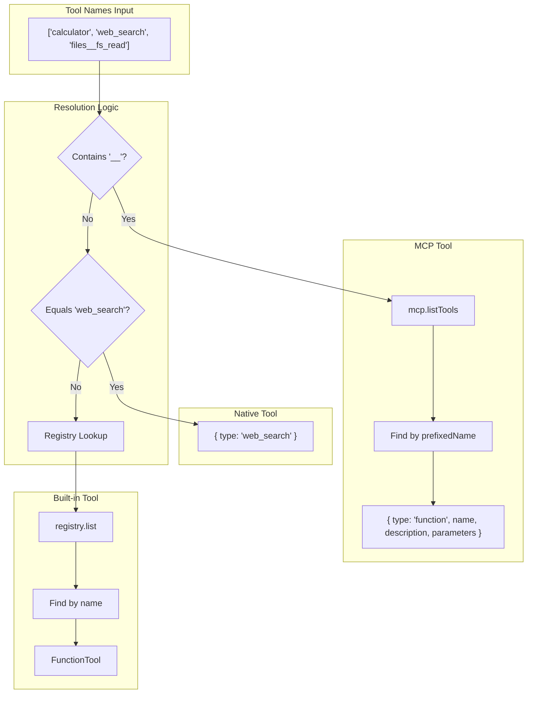

# Workspace & Agent Templates

## Overview

The Workspace system manages agent templates stored as `.agent.md` files with YAML frontmatter. This system is responsible for loading agent configurations, resolving tool definitions from multiple sources (built-in, native, MCP), and assembling the final agent context for execution.

### Key Design Principles

- **File-Based Configuration**: Agents defined as markdown files with YAML frontmatter
- **Hot-Reloadable**: Templates read from disk on every request (no caching)
- **Multi-Source Tools**: Unified resolution from built-in registry, native features, and MCP servers
- **Convention Over Configuration**: Sensible defaults for model selection and tool setup

## Context Assembly Flow

```mermaid
flowchart TB
    subgraph "Request Input"
        REQ[Chat Request<br/>{agent, message, sessionId?}]
    end

    subgraph "Template Discovery"
        FS[Filesystem Lookup<br/>workspace/agents/{name}.agent.md]
        PARSE[Parse Markdown<br/>gray-matter]
    end

    subgraph "Template Structure"
        FM[Frontmatter<br/>name, model?, tools[]]
        SYS[System Prompt<br/>markdown body]
    end

    subgraph "Tool Resolution"
        TREG[Tool Registry<br/>built-in tools]
        NATIVE[Native Tools<br/>web_search]
        MCP[MCP Manager<br/>server__toolName]
        RESOLVED[ToolDefinition[]]
    end

    subgraph "Final Assembly"
        MERGE[templateToLoadedAgent]
        FINAL[LoadedAgent<br/>name + config]
    end

    REQ --> FS
    FS --> PARSE
    PARSE --> FM
    PARSE --> SYS

    FM --> TREG
    FM --> NATIVE
    FM --> MCP
    TREG --> RESOLVED
    NATIVE --> RESOLVED
    MCP --> RESOLVED

    SYS --> MERGE
    FM --> MERGE
    RESOLVED --> MERGE
    MERGE --> FINAL
```

## Type Definitions

### Core Interfaces

```typescript
// src/workspace/loader.ts:9-23

export interface AgentTemplate {
  name: string
  model?: string
  tools: string[]
  systemPrompt: string
}

export interface LoadedAgent {
  name: string
  config: {
    model: string
    systemPrompt: string
    tools: ToolDefinition[]
  }
}
```

### Template vs Loaded Agent

| Property | AgentTemplate | LoadedAgent |
|----------|---------------|-------------|
| `name` | From frontmatter or filename | Same as template |
| `model` | Optional override | Resolved to default if missing |
| `tools` | String array (names) | Resolved `ToolDefinition[]` |
| `systemPrompt` | Raw markdown body | Trimmed string |

## Agent Template File Format

### File Naming Convention

```
workspace/agents/{name}.agent.md
```

- Files must end with `.agent.md` extension
- If `name` not in frontmatter, derived from filename
- Example: `alice.agent.md` → name: `alice`

### YAML Frontmatter Schema

```yaml
---
name: string       # Optional: agent name (defaults to filename)
model?: string     # Optional: model override (e.g., "gpt-4o", "gemini-2.0-flash")
tools: string[]    # List of tool names to enable
---
```

### System Prompt

The markdown body after the frontmatter becomes the system prompt:

```markdown
---
name: alice
tools:
  - calculator
  - delegate
---

You are Alice, a helpful AI assistant...

## Guidelines
1. Always verify calculations
2. Delegate web research to bob
```

### Example Templates

#### Alice (Multi-Tool Agent)

```yaml
# workspace/agents/alice.agent.md
---
name: alice
tools:
  - calculator        # Built-in tool
  - delegate          # Built-in tool (agent type)
  - ask_user          # Built-in tool (human type)
  - send_message      # Built-in tool (sync type)
  - files__fs_read    # MCP tool (files server)
  - files__fs_write   # MCP tool (files server)
  - files__fs_search  # MCP tool (files server)
---

You are Alice, a helpful AI assistant...

## Capabilities
- Perform calculations using the calculator tool
- Read and write files in the workspace
- Delegate web research tasks to the "bob" agent
```

#### Bob (Specialist Agent)

```yaml
# workspace/agents/bob.agent.md
---
name: bob
tools:
  - web_search        # Native tool
---

You are Bob, a web research specialist...

## Guidelines
1. Break research into specific search queries
2. Cross-reference multiple sources
3. Note recency and reliability of sources
```

## Tool Resolution System

### Resolution Flow



### Supported Tool Formats

| Format | Example | Resolution Path | File Line |
|--------|---------|-----------------|-----------|
| Built-in | `calculator` | Tool Registry lookup | `loader.ts:87-91` |
| Native | `web_search` | Direct `type: 'web_search'` mapping | `loader.ts:68-71` |
| MCP Tool | `files__fs_read` | MCP Manager (server__toolName pattern) | `loader.ts:74-84` |

### MCP Separator Convention

```typescript
// src/workspace/loader.ts:26
const MCP_SEPARATOR = '__'

// Pattern: {serverName}__{toolName}
// Example: files__fs_read
//   - server: "files"
//   - tool: "fs_read"
```

### Resolution Implementation

```typescript
// src/workspace/loader.ts:52-95
export async function resolveToolDefinitions(
  toolNames: string[],
  registry: ToolRegistry,
  mcp: McpManager,
): Promise<ToolDefinition[]> {
  const registeredTools = registry.list()
  const definitions: ToolDefinition[] = []

  // Pre-fetch MCP tools if any MCP names present
  const mcpToolNames = toolNames.filter(name => name.includes(MCP_SEPARATOR))
  const mcpToolsCache = mcpToolNames.length > 0
    ? await mcp.listTools()
    : []

  for (const name of toolNames) {
    // Native web search
    if (name === 'web_search') {
      definitions.push({ type: 'web_search' })
      continue
    }

    // MCP tool (server__toolName)
    if (name.includes(MCP_SEPARATOR)) {
      const mcpTool = mcpToolsCache.find(t => t.prefixedName === name)
      if (mcpTool) {
        definitions.push({
          type: 'function',
          name: mcpTool.prefixedName,
          description: mcpTool.description ?? '',
          parameters: mcpTool.inputSchema,
        })
      }
      continue
    }

    // Built-in tool from registry
    const tool = registeredTools.find((t: FunctionTool) => t.name === name)
    if (tool) {
      definitions.push(tool)
    }
  }

  return definitions
}
```

## Core Functions

### loadAgentTemplate

Parses an `.agent.md` file and extracts frontmatter + body.

```typescript
// src/workspace/loader.ts:28-42
export async function loadAgentTemplate(filePath: string): Promise<AgentTemplate> {
  const content = await readFile(filePath, 'utf-8')
  const { data, content: systemPrompt } = matter(content)

  const name = data.name ?? basename(filePath, AGENT_EXTENSION)
  const model = typeof data.model === 'string' ? data.model : undefined
  const tools = Array.isArray(data.tools) ? data.tools : []

  return {
    name,
    model,
    tools,
    systemPrompt: systemPrompt.trim(),
  }
}
```

### resolveAgent

Full resolution pipeline: load template → resolve tools → return LoadedAgent.

```typescript
// src/workspace/loader.ts:114-131
export async function resolveAgent(
  name: string,
  workspacePath: string,
  registry: ToolRegistry,
  mcp: McpManager,
): Promise<LoadedAgent | undefined> {
  const filePath = join(workspacePath, 'agents', `${name}${AGENT_EXTENSION}`)

  try {
    await access(filePath)
  } catch {
    return undefined
  }

  const template = await loadAgentTemplate(filePath)
  const tools = await resolveToolDefinitions(template.tools, registry, mcp)
  return templateToLoadedAgent(template, tools)
}
```

### listAgentNames

Discovers all available agent templates in workspace.

```typescript
// src/workspace/loader.ts:136-147
export async function listAgentNames(workspacePath: string): Promise<string[]> {
  const agentsDir = join(workspacePath, 'agents')

  try {
    const files = await readdir(agentsDir)
    return files
      .filter(f => f.endsWith(AGENT_EXTENSION))
      .map(f => basename(f, AGENT_EXTENSION))
  } catch {
    return []
  }
}
```

## Runtime Integration

### getAgent Function

```typescript
// src/lib/runtime.ts:126-129
export async function getAgent(name: string): Promise<LoadedAgent | undefined> {
  if (!runtime) return undefined
  return resolveAgent(name, config.workspacePath, runtime.tools, runtime.mcp)
}
```

### Usage in Request Handler

```typescript
// Typical flow in chat handler
const agent = await getAgent(request.agent)
if (!agent) {
  return c.json({ error: `Agent not found: ${request.agent}` }, 404)
}

// agent.config contains:
// - model: resolved model string
// - systemPrompt: trimmed markdown
// - tools: resolved ToolDefinition[]
```

## File References

| Function | File | Lines |
|----------|------|-------|
| `AgentTemplate` interface | `src/workspace/loader.ts` | 9-14 |
| `LoadedAgent` interface | `src/workspace/loader.ts` | 16-23 |
| `loadAgentTemplate` | `src/workspace/loader.ts` | 28-42 |
| `resolveToolDefinitions` | `src/workspace/loader.ts` | 52-95 |
| `templateToLoadedAgent` | `src/workspace/loader.ts` | 97-109 |
| `resolveAgent` | `src/workspace/loader.ts` | 114-131 |
| `listAgentNames` | `src/workspace/loader.ts` | 136-147 |
| `getAgent` (runtime) | `src/lib/runtime.ts` | 126-129 |

## Workspace Directory Structure

```
01_05_agent/
├── workspace/
│   ├── agents/
│   │   ├── alice.agent.md     # Multi-tool agent
│   │   └── bob.agent.md       # Specialist agent
│   ├── tools/                  # Custom tool definitions (if any)
│   └── .mcp.json              # MCP server configuration
```

---

## .NET Mapping Section

### Template Model Classes

```csharp
// C# equivalent structures
public class AgentTemplate
{
    public string Name { get; set; }
    public string? Model { get; set; }
    public List<string> Tools { get; set; } = new();
    public string SystemPrompt { get; set; } = string.Empty;
}

public class LoadedAgent
{
    public string Name { get; set; }
    public AgentConfig Config { get; set; }
}

public class AgentConfig
{
    public string Model { get; set; }
    public string SystemPrompt { get; set; }
    public List<ToolDefinition> Tools { get; set; } = new();
}
```

### Template Loader Pattern

```csharp
// Using YamlDotNet for frontmatter parsing
public interface IAgentTemplateLoader
{
    Task<AgentTemplate?> LoadAsync(string filePath);
    Task<LoadedAgent?> ResolveAsync(string name, IToolRegistry registry, IMcpManager mcp);
    Task<IReadOnlyList<string>> ListAgentNamesAsync();
}

public class AgentTemplateLoader : IAgentTemplateLoader
{
    private const string AgentExtension = ".agent.md";
    private const string McpSeparator = "__";
    private readonly string _workspacePath;

    public async Task<AgentTemplate?> LoadAsync(string filePath)
    {
        if (!File.Exists(filePath))
            return null;

        var content = await File.ReadAllTextAsync(filePath);

        // Parse YAML frontmatter (between --- markers)
        var template = ParseFrontmatter(content);

        // Body after frontmatter is system prompt
        template.SystemPrompt = ExtractBody(content).Trim();

        if (string.IsNullOrEmpty(template.Name))
        {
            template.Name = Path.GetFileNameWithoutExtension(
                Path.GetFileNameWithoutExtension(filePath));
        }

        return template;
    }

    public async Task<LoadedAgent?> ResolveAsync(
        string name,
        IToolRegistry registry,
        IMcpManager mcp)
    {
        var filePath = Path.Combine(_workspacePath, "agents", $"{name}{AgentExtension}");
        var template = await LoadAsync(filePath);

        if (template == null)
            return null;

        var tools = await ResolveToolDefinitionsAsync(template.Tools, registry, mcp);

        return new LoadedAgent
        {
            Name = template.Name,
            Config = new AgentConfig
            {
                Model = template.Model ?? _defaultModel,
                SystemPrompt = template.SystemPrompt,
                Tools = tools
            }
        };
    }

    private async Task<List<ToolDefinition>> ResolveToolDefinitionsAsync(
        List<string> toolNames,
        IToolRegistry registry,
        IMcpManager mcp)
    {
        var definitions = new List<ToolDefinition>();
        var registeredTools = registry.List();

        // Pre-fetch MCP tools if needed
        var mcpToolNames = toolNames.Where(n => n.Contains(McpSeparator)).ToList();
        var mcpToolsCache = mcpToolNames.Count > 0
            ? await mcp.ListToolsAsync()
            : Array.Empty<McpToolInfo>();

        foreach (var name in toolNames)
        {
            // Native web search
            if (name == "web_search")
            {
                definitions.Add(new ToolDefinition { Type = "web_search" });
                continue;
            }

            // MCP tool
            if (name.Contains(McpSeparator))
            {
                var mcpTool = mcpToolsCache.FirstOrDefault(t => t.PrefixedName == name);
                if (mcpTool != null)
                {
                    definitions.Add(new ToolDefinition
                    {
                        Type = "function",
                        Name = mcpTool.PrefixedName,
                        Description = mcpTool.Description ?? string.Empty,
                        Parameters = mcpTool.InputSchema
                    });
                }
                continue;
            }

            // Built-in tool
            var tool = registeredTools.FirstOrDefault(t => t.Name == name);
            if (tool != null)
            {
                definitions.Add(tool);
            }
        }

        return definitions;
    }
}
```

### Configuration Integration

```csharp
// Program.cs or Startup.cs
services.AddSingleton<IAgentTemplateLoader>(sp =>
    new AgentTemplateLoader(
        workspacePath: configuration["Workspace:Path"] ?? "workspace",
        defaultModel: configuration["AI:DefaultModel"] ?? "gpt-4o"
    ));

// Usage in minimal API
app.MapPost("/api/chat/completions", async (
    ChatRequest request,
    IAgentTemplateLoader loader,
    IToolRegistry registry,
    IMcpManager mcp) =>
{
    var agent = await loader.ResolveAsync(request.Agent, registry, mcp);
    if (agent == null)
        return Results.NotFound(new { error = $"Agent not found: {request.Agent}" });

    // Proceed with agent.Config
});
```

### Alternative: File Provider Pattern

```csharp
// Using Microsoft.Extensions.FileProviders for workspace abstraction
public class WorkspaceAgentProvider
{
    private readonly IFileProvider _fileProvider;

    public WorkspaceAgentProvider(IFileProvider fileProvider)
    {
        _fileProvider = fileProvider;
    }

    public IAsyncEnumerable<string> GetAgentNamesAsync()
    {
        var agentsDir = _fileProvider.GetDirectoryContents("agents");
        return agentsDir
            .Where(f => f.Name.EndsWith(".agent.md"))
            .ToAsyncEnumerable()
            .Select(f => Path.GetFileNameWithoutExtension(
                Path.GetFileNameWithoutExtension(f.Name)));
    }
}
```
